# Slurm QOS 限制優先級與凍結 Account 技術指南

## 概述

本文件深入分析 Slurm 資源管理系統中 QOS（Quality of Service）的分配機制與限制優先級規則。重點說明如何正確地「凍結」Account，使其下的所有使用者無法提交或執行作業。

**適用情境：**

- 需要暫時停用某個 Account 的所有作業權限
- 理解 QOS 與 Association 限制之間的交互關係
- 透過 REST API 自動化管理 Account 狀態

---

## 第一章：QOS 分配機制

### 1.1 核心概念

Slurm 的 QOS 系統允許管理員為不同層級（User、Account、Partition）配置服務品質參數。每個層級可以關聯**多個 QOS**，但每個作業執行時只會套用**一個 QOS**。

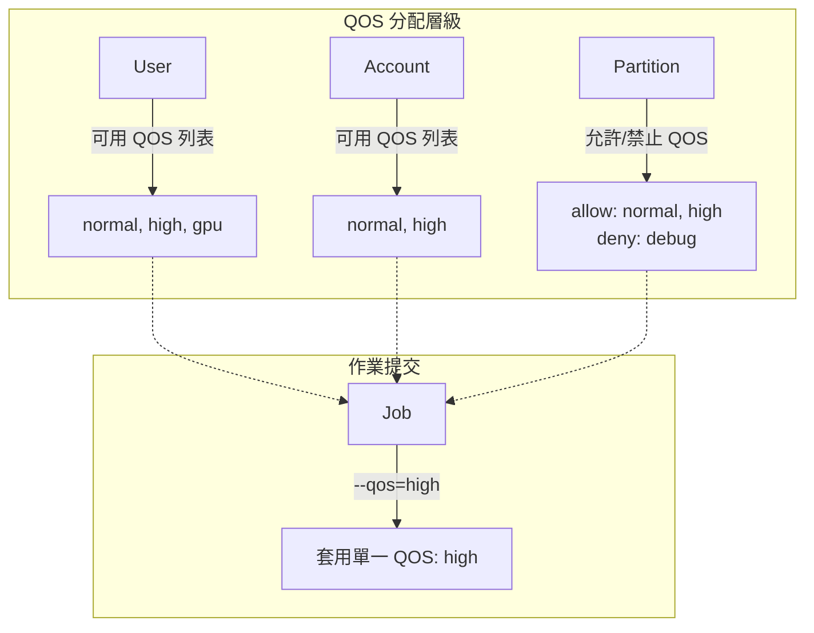

### 1.2 資料結構定義

#### User 層級

```c
// slurm/slurmdb.h
typedef struct slurmdb_user_rec {
    uint32_t def_qos_id;    // 使用者預設 QOS ID
    // ...
} slurmdb_user_rec_t;
```

#### Association 層級（User-Account 關聯）

```c
// slurm/slurmdb.h
typedef struct slurmdb_assoc_rec {
    uint32_t def_qos_id;    // 預設 QOS ID
    list_t *qos_list;       // 允許的 QOS 列表（多個）
    // ...
} slurmdb_assoc_rec_t;
```

#### Partition 層級

```c
// slurm/slurm.h
typedef struct partition_info {
    char *qos_char;     // Partition 本身的 QOS（單一）
    char *allow_qos;    // 允許的 QOS 列表（逗號分隔）
    char *deny_qos;     // 禁止的 QOS 列表（逗號分隔）
    // ...
} partition_info_t;
```

### 1.3 QOS 列表運作方式

系統使用**位元串（bitstring）**高效管理 QOS 訪問權限：

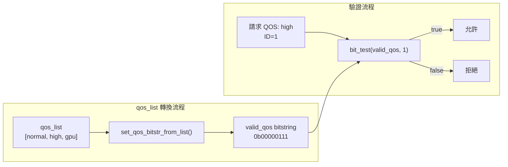

### 1.4 設定範例

```bash
# 為 user 設定單一 QOS
$ sacctmgr modify user john set qos=normal

# 為 user 新增多個 QOS
$ sacctmgr modify user john set qos+=high,gpu

# 查看 association 的 QOS 配置
$ sacctmgr show assoc format=cluster,user,account,qos,defaultqos
   Cluster       User    Account                  QOS DefaultQOS
---------- ---------- ---------- -------------------- ----------
  mycluster      john    physics    gpu,high,normal     normal
```

### 1.5 Partition 與 QOS 的關係

Partition **不需要**設定 QOS，QOS 對 Partition 而言是完全可選的。若未設定，預設值為 `NULL`。

#### Partition 的 QOS 相關參數

在 `slurm.conf` 中可為 Partition 設定以下三個 QOS 相關參數：

| 參數 | 說明 | 範例 |
|-----|------|------|
| `QOS=` | 指定 Partition 層級的 QOS | `QOS=gpu_runnable` |
| `AllowQOS=` | 允許使用此 Partition 的 QOS 清單（逗號分隔） | `AllowQOS=normal,high,gpu` |
| `DenyQOS=` | 禁止使用此 Partition 的 QOS 清單（逗號分隔） | `DenyQOS=debug,test` |

#### slurm.conf 設定範例

```bash
# 基本 Partition 設定（無 QOS）
PartitionName=batch Nodes=node[001-100] Default=YES

# 設定 Partition 層級 QOS
PartitionName=gpu Nodes=gpu[01-08] QOS=gpu_runnable

# 設定允許的 QOS 清單
PartitionName=priority Nodes=node[001-050] AllowQOS=high,urgent

# 設定禁止的 QOS 清單
PartitionName=production Nodes=node[051-100] DenyQOS=debug,test
```

#### QOS 優先順序邏輯

當 Job 提交時，系統依以下邏輯決定使用哪個 QOS：

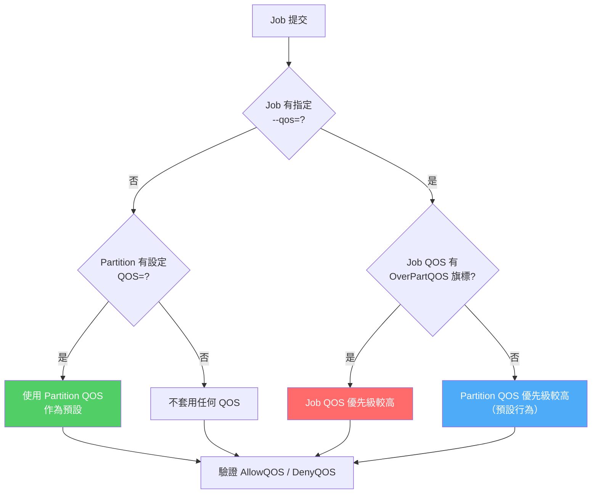

#### 原始碼佐證

**QOS 優先順序決定邏輯**（`src/slurmctld/acct_policy.c:5257-5291`）：

```c
extern void acct_policy_set_qos_order(job_record_t *job_ptr,
                      slurmdb_qos_rec_t **qos_ptr_1,
                      slurmdb_qos_rec_t **qos_ptr_2) {
    if (job_ptr->qos_ptr) {
        if (job_ptr->part_ptr && job_ptr->part_ptr->qos_ptr) {
            // 檢查 Job QOS 是否有 OverPartQOS 旗標
            if (job_ptr->qos_ptr->flags & QOS_FLAG_OVER_PART_QOS) {
                // Job QOS 優先級較高
                *qos_ptr_1 = job_ptr->qos_ptr;
                *qos_ptr_2 = job_ptr->part_ptr->qos_ptr;
            } else {
                // Partition QOS 優先級較高（預設）
                *qos_ptr_1 = job_ptr->part_ptr->qos_ptr;
                *qos_ptr_2 = job_ptr->qos_ptr;
            }
        } else
            *qos_ptr_1 = job_ptr->qos_ptr;
    }
}
```

**Partition 結構定義**（`src/common/part_record.h:108-111`）：

```c
char *qos_char;              /* requested QOS from slurm.conf */
slurmdb_qos_rec_t *qos_ptr;  /* pointer to the quality of service record */
```

#### AllowQOS / DenyQOS 驗證邏輯

當 Job 指定或使用某個 QOS 時，系統會檢查該 QOS 是否被 Partition 允許：

- 若設定了 `AllowQOS`：只有清單中的 QOS 才能在該 Partition 提交 Job
- 若設定了 `DenyQOS`：清單中的 QOS 將被拒絕
- 設定的 QOS 名稱必須在 `sacctmgr` 中已存在，否則 `slurmctld` 啟動時會報錯

> **參考來源**：`src/slurmctld/partition_mgr.c:2155-2230`

#### 重點整理

| 情境 | 行為 |
|-----|------|
| Partition 未設 QOS，Job 未指定 QOS | 不套用任何 Partition/Job QOS 限制 |
| Partition 設了 QOS，Job 未指定 QOS | 使用 Partition QOS 作為 Job 的預設 QOS |
| 兩者都有，Job QOS 無 `OverPartQOS` | Partition QOS 優先級較高（先檢查） |
| 兩者都有，Job QOS 有 `OverPartQOS` | Job QOS 優先級較高（先檢查） |

---

## 第二章：限制優先級規則

### 2.1 官方優先級層級

Slurm 的限制優先級順序（從高到低）：

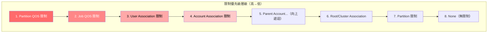

**核心規則**：當限制在多個層級都有定義時，**第一個定義的限制會被使用**。

> **注意事項**：
>
> - **Partition QOS 與 Job QOS 的順序可互換**：若 QOS 設定了 `OverPartQOS` 旗標，則 Job QOS 的優先級會高於 Partition QOS。
> - **`Grp*` 限制的例外規則**：`Grp*` 類型的限制（如 `GrpTRES`）不完全遵循上述優先級順序。Account 層級的更嚴格 `Grp*` 限制會優先於 User 層級的較寬鬆限制，因為群組限制的本質要求最高層級的限制不可被超越。
> - **Partition 層級的上界限制**：`Max[Time|Wall]`、`[Min|Max]Nodes` 這三類限制即使在 QOS 或 Association 有設定，仍不可超過 Partition 層級的限制（除非 QOS 設定了 `PartitionTimeLimit` 或 `Partition[Max|Min]Nodes` 旗標）。
>
> 參考來源：`doc/html/resource_limits.shtml` 第 33-46 行

### 2.2 互斥檢查機制

這是理解限制優先級的**關鍵概念**。Slurm 使用「互斥檢查」邏輯：

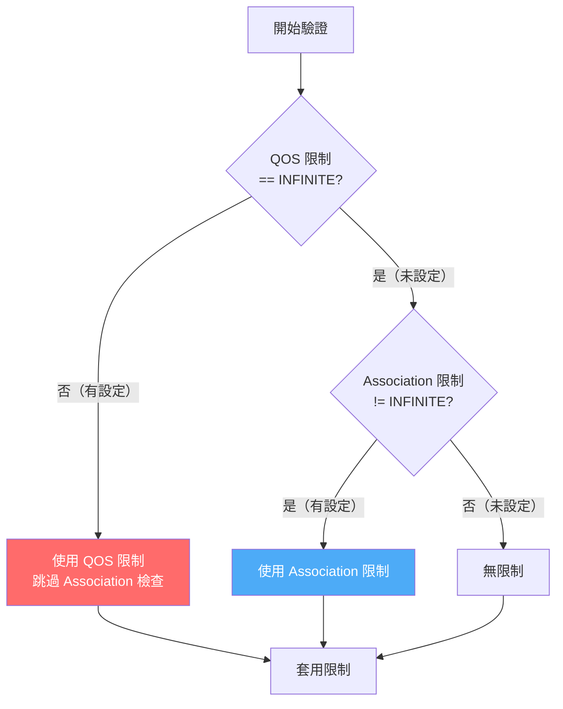

#### 原始碼驗證

```c
// src/slurmctld/acct_policy.c 第3870-3881行（簡化版）
if ((qos_rec.grp_jobs == INFINITE) &&      // 只有 QOS 未設定時
    (assoc_ptr->grp_jobs != INFINITE) &&   // 且 Association 有設定
    (assoc_ptr->usage->used_jobs >= assoc_ptr->grp_jobs)) {
    xfree(job_ptr->state_desc);                   // 清除舊狀態描述
    job_ptr->state_reason = WAIT_ASSOC_GRP_JOB;   // 才檢查 Association
    debug2("%pJ being held, assoc %u is at or exceeds "
           "group max jobs limit %u with %u for account %s",
           job_ptr, assoc_ptr->id, assoc_ptr->grp_jobs,
           assoc_ptr->usage->used_jobs, assoc_ptr->acct);
    rc = false;
    goto end_it;
}
```

> **Note**：實際程式碼包含 `xfree()` 釋放舊狀態描述，以及 `debug2()` 日誌輸出（可用於故障排除時追蹤限制觸發原因）。

### 2.3 各限制類型的優先級行為

| 限制類型 | QOS 欄位 | Association 欄位 | 優先級規則 |
|---------|---------|-----------------|-----------|
| **GrpJobs** | `grp_jobs` | `grp_jobs` | QOS 覆蓋 Association |
| **GrpSubmitJobs** | `grp_submit_jobs` | `grp_submit_jobs` | QOS 覆蓋 Association |
| **MaxJobs** | `max_jobs_pa`, `max_jobs_pu` | `max_jobs` | QOS 覆蓋 Association |
| **MaxSubmitJobs** | `max_submit_jobs_pa`, `max_submit_jobs_pu` | `max_submit_jobs` | QOS 覆蓋 Association |
| **GrpTRES** | `grp_tres` | `grp_tres` | QOS 覆蓋 Association |

#### 重要：覆蓋僅限「同欄位類型」

上表中每一列都是**獨立的互斥檢查**。QOS 的某個欄位只會覆蓋 Association 中**相同類型**的欄位，**跨欄位不會覆蓋**。例如：

- QOS `GrpJobs=500` **會**覆蓋 Association `GrpJobs=0`（同為 `grp_jobs` 欄位）
- QOS `MaxJobsPU=1` **不會**覆蓋 Association `GrpJobs=0`（不同欄位，各自獨立檢查）

> **常見混淆：`sacctmgr` 指令與實際欄位的對應**
>
> 在 QOS 與 Association 中，相同的 `sacctmgr` 參數名稱可能對應到**不同的內部欄位**：
>
> | `sacctmgr` 參數 | QOS 實際欄位 | Association 實際欄位 |
> |-----------------|-------------|---------------------|
> | `MaxJobs=` | `max_jobs_pu`（Per User） | `max_jobs` |
> | `MaxSubmitJobs=` | `max_submit_jobs_pu`（Per User） | `max_submit_jobs` |
> | `GrpJobs=` | `grp_jobs` | `grp_jobs` |
> | `GrpSubmitJobs=` | `grp_submit_jobs` | `grp_submit_jobs` |
>
> 特別注意：`sacctmgr add qos MaxJobs=1` 設定的是 QOS 的 `MaxJobsPU`，而非 `GrpJobs`。若 Association 設定的是 `GrpJobs=0`，QOS 的 `MaxJobsPU` 不會覆蓋它，因為它們屬於不同的限制類型。

#### GrpTRES 覆蓋行為的原始碼佐證

GrpTRES 與 GrpJobs 遵循相同的互斥覆蓋邏輯。`_validate_tres_limits_for_assoc()` 在檢查 Association 的 GrpTRES 前，會先確認 QOS 是否已設定該 TRES 限制：

```c
// src/slurmctld/acct_policy.c 第1286-1293行
// 函數：_validate_tres_limits_for_assoc()
for (i = 0; i < g_tres_count; i++) {
    (*tres_pos) = i;
    if ((admin_set_limit_tres_array[i] == ADMIN_SET_LIMIT)
        || (qos_tres_array[i] != INFINITE64)   // ← QOS 的 GrpTRES 有設定 → 跳過 Association 檢查
        || (assoc_tres_array[i] == INFINITE64)
        || (!job_tres_array[i] && !update_call))
        continue;
    // ... 只有 QOS 未設定時才檢查 Association 的 GrpTRES
}
```

呼叫時傳入的參數（`acct_policy.c:3328-3333`）：
- `assoc_tres_array` = `assoc_ptr->grp_tres_ctld`（Association 的 GrpTRES）
- `qos_tres_array` = `qos_rec.grp_tres_ctld`（QOS 的 GrpTRES）

> **勘誤說明**：本文件先前版本誤將 `_validate_tres_limits_for_qos()` 內部的 `MIN(grp_tres_array[i], max_tres_array[i])` 解讀為「QOS GrpTRES 與 Association GrpTRES 取最小值」。實際上該 `MIN()` 是在比較同一個 QOS 內部的 `GrpTRES` 和 `MaxTRESPerUser` 兩個欄位，用於計算 QOS 自身的最嚴格上限，與 QOS vs Association 的覆蓋邏輯無關。

### 2.4 實際案例分析

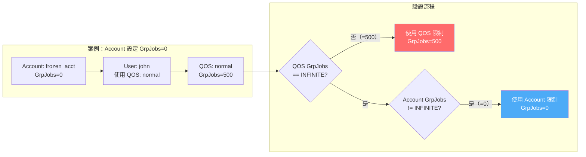

**結果**：因為 QOS 設定了 `GrpJobs=500`，Account 的 `GrpJobs=0` 被**完全忽略**，使用者仍可提交作業。

#### 反例：跨欄位類型不會覆蓋

以下案例展示當 QOS 與 Association 設定的是**不同欄位類型**時，覆蓋不會發生：

**環境設定：**

```bash
# QOS 設定 MaxJobs（實際欄位：MaxJobsPU）和 MaxSubmitJobs（MaxSubmitPU）
$ sacctmgr -i add qos qos_test MaxJobs=1 MaxSubmitJobs=1

# 確認 QOS 欄位 —— GrpJobs 和 GrpSubmit 為空（INFINITE）
$ sacctmgr show qos qos_test format=name,grpjobs,grpsubmit,maxjobspu,maxsubmitpu -p
Name|GrpJobs|GrpSubmit|MaxJobsPU|MaxSubmitPU|
qos_test||||1|1|

# Association 設定 GrpJobs=0 和 GrpSubmitJobs=0
$ sacctmgr modify account my_acct set GrpJobs=0 GrpSubmitJobs=0

# 確認 Association 欄位
$ sacctmgr show assoc account=my_acct format=account,grpjobs,grpsubmit,maxjobs,qos -p
Account|GrpJobs|GrpSubmit|MaxJobs|QOS|
my_acct|0|0||qos_test|
```

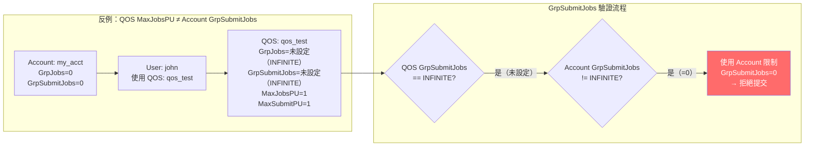

**結果**：

```
$ srun -p a30-set --gres=gpu:1 nvidia-smi -L
srun: error: AssocGrpSubmitJobsLimit
srun: error: Unable to allocate resources: Job violates accounting/QOS policy
```

QOS 的 `MaxJobsPU=1` 和 `MaxSubmitPU=1` **無法覆蓋** Account 的 `GrpSubmitJobs=0`，因為它們屬於不同的限制類型。系統檢查 `GrpSubmitJobs` 時，發現 QOS 的 `grp_submit_jobs == INFINITE`（未設定），便直接採用 Association 的 `GrpSubmitJobs=0`，導致作業被拒絕。

> **原始碼佐證**（`src/slurmctld/acct_policy.c:3355-3368`）：
>
> ```c
> if ((qos_rec.grp_submit_jobs == INFINITE) &&       // QOS 的 GrpSubmitJobs 未設定
>     (assoc_ptr->grp_submit_jobs != INFINITE) &&    // Association 的 GrpSubmitJobs 有設定
>     ((assoc_ptr->usage->used_submit_jobs + job_cnt)
>      > assoc_ptr->grp_submit_jobs)) {              // 超過限制
>         *reason = WAIT_ASSOC_GRP_SUB_JOB;          // → AssocGrpSubmitJobsLimit
> }
> ```

#### 兩個案例對比

| 情境 | QOS 欄位 | Account 欄位 | 同類型？ | 結果 |
|------|----------|-------------|---------|------|
| 案例一 | `GrpJobs=500` | `GrpJobs=0` | 是 | QOS 覆蓋，**可提交** |
| 反例 | `MaxJobsPU=1`（`GrpSubmitJobs` 未設定） | `GrpSubmitJobs=0` | 否 | 不覆蓋，**被拒絕** |

---

## 第三章：凍結 Account 的最佳實踐

### 3.1 問題分析

直接設定 Association 限制（如 `GrpJobs=0`）**無法可靠凍結 Account**，原因：


### 3.2 可靠的凍結方案

#### Association 層級結構說明

Slurm 的 Association 資料庫中，每個 Account 會有**兩種層級**的 Association：

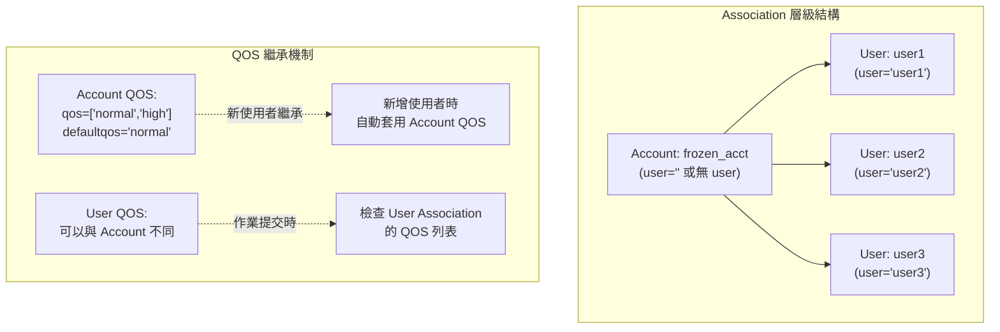

**關鍵概念**：

1. **Account 層級 Association**（`user=""` 或 `user` 欄位為空）：
   - 定義該 Account 的預設 QOS 設定
   - **只影響新增使用者時的預設值**
   - **不影響現有使用者的 QOS**

2. **User 層級 Association**（`user="username"`）：
   - 定義特定使用者在該 Account 下的 QOS 設定
   - **作業提交時檢查的是 User Association，而非 Account Association**
   - 可以與 Account 層級的 QOS 設定不同

#### 為什麼必須修改所有 Association？

當使用者提交作業時，Slurm 會檢查**該使用者的 User Association**（而非 Account Association）來決定可用的 QOS 列表。因此：

- ✅ 修改 Account Association：只影響未來新增的使用者
- ❌ 未修改 User Association：現有使用者仍可使用原有的 QOS
- ✅ 修改 Account + 所有 User Association：完整凍結 Account

#### 方案：建立專用 Freeze QOS 並強制所有 Association 使用

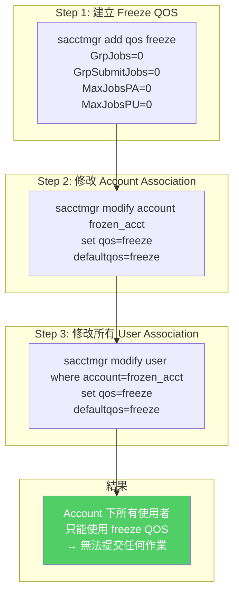

#### 完整指令範例

```bash
# Step 1: 建立凍結 QOS（所有限制設為 0）
$ sacctmgr add qos freeze \
    GrpJobs=0 \
    GrpSubmitJobs=0 \
    MaxJobsPA=0 \
    MaxJobsPU=0 \
    MaxSubmitJobsPA=0 \
    MaxSubmitJobsPU=0

# Step 2: 修改 Account 層級的 Association
$ sacctmgr modify account frozen_acct set qos=freeze defaultqos=freeze

# Step 3: 修改所有 User 層級的 Association（關鍵步驟！）
# 方法 A：逐一修改每個使用者
$ sacctmgr modify user user1 account=frozen_acct set qos=freeze defaultqos=freeze
$ sacctmgr modify user user2 account=frozen_acct set qos=freeze defaultqos=freeze

# 方法 B：使用 where 條件批次修改（推薦）
$ sacctmgr modify user where account=frozen_acct set qos=freeze defaultqos=freeze

# Step 4: 驗證設定（確認 Account 與所有 User Association 都已更新）
$ sacctmgr show assoc account=frozen_acct \
    format=account,user,qos,defaultqos,grpjobs

# Step 5: 測試提交（應被拒絕）
$ sbatch --account=frozen_acct test.sh
# 預期輸出：sbatch: error: QOS job limit reached
```

**注意事項**：

- **必須同時修改 Account 層級與所有 User 層級的 Association**
- 若只修改 Account 層級，現有使用者仍可使用其原有的 QOS 提交作業
- 使用 `where account=frozen_acct` 可一次修改該 Account 下所有使用者的 Association

### 3.3 解凍 Account

```bash
# Step 1: 恢復 Account 層級的 QOS
$ sacctmgr modify account frozen_acct \
    set qos=normal,high,low defaultqos=normal

# Step 2: 恢復所有 User 層級的 QOS（關鍵步驟！）
$ sacctmgr modify user where account=frozen_acct \
    set qos=normal,high,low defaultqos=normal

# Step 3: 驗證設定
$ sacctmgr show assoc account=frozen_acct \
    format=account,user,qos,defaultqos
```

### 3.4 方案比較

| 方案 | 設定方式 | 會被 QOS 覆蓋？ | 可靠度 |
|-----|---------|---------------|-------|
| Association `GrpJobs=0` | 直接設定 | 是 | 不可靠 |
| Association `MaxJobs=0` | 直接設定 | 是 | 不可靠 |
| 強制使用 Freeze QOS | 控制可用 QOS | 否 | **可靠** |

---

## 第四章：REST API 操作範例

### 4.1 API 架構概覽

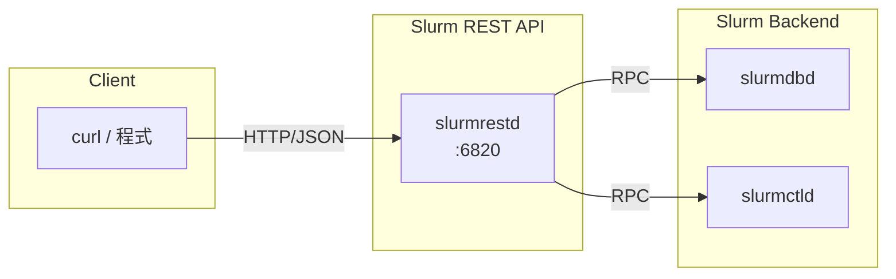

### 4.2 認證設定

```bash
# 產生 JWT Token
export SLURM_JWT=$(scontrol token)

# 或使用指定使用者
export SLURM_JWT=$(scontrol token username=admin lifespan=3600)
```

### 4.3 建立 Freeze QOS

#### REST API 欄位映射關係

根據原始碼 `src/plugins/data_parser/v0.0.44/parsers.c:8072-8095`，REST API JSON 欄位與 `slurmdb_qos_rec_t` 結構的映射如下：

| sacctmgr 參數 | C 結構欄位 | REST API JSON 路徑 | 說明 |
|--------------|-----------|-------------------|------|
| `GrpJobs=0` | `grp_jobs` | `limits/max/active_jobs/count` | 最大運行作業數 |
| `GrpSubmitJobs=0` | `grp_submit_jobs` | `limits/max/jobs/count` | 最大提交+運行作業數 |
| `MaxJobsPA=0` | `max_jobs_pa` | `limits/max/jobs/active_jobs/per/account` | 每個 Account 最大運行作業數 |
| `MaxJobsPU=0` | `max_jobs_pu` | `limits/max/jobs/active_jobs/per/user` | 每個 User 最大運行作業數 |
| `MaxSubmitJobsPA=0` | `max_submit_jobs_pa` | `limits/max/jobs/per/account` | 每個 Account 最大提交作業數 |
| `MaxSubmitJobsPU=0` | `max_submit_jobs_pu` | `limits/max/jobs/per/user` | 每個 User 最大提交作業數 |

#### REST API 請求範例

```bash
curl -X POST http://localhost:6820/slurmdb/v0.0.44/qos/ \
  -H "Content-Type: application/json" \
  -H "X-SLURM-USER-NAME: root" \
  -H "X-SLURM-USER-TOKEN: $SLURM_JWT" \
  -d '{
    "qos": [
      {
        "name": "freeze",
        "description": "Frozen QOS - no jobs allowed",
        "limits": {
          "max": {
            "active_jobs": {
              "count": 0
            },
            "jobs": {
              "count": 0,
              "active_jobs": {
                "per": {
                  "account": 0,
                  "user": 0
                }
              },
              "per": {
                "account": 0,
                "user": 0
              }
            }
          }
        }
      }
    ]
  }'
```

**等效的 sacctmgr 指令**：

```bash
sacctmgr add qos freeze \
    GrpJobs=0 \
    GrpSubmitJobs=0 \
    MaxJobsPA=0 \
    MaxJobsPU=0 \
    MaxSubmitJobsPA=0 \
    MaxSubmitJobsPU=0
```

### 4.4 修改 Account 的 QOS 設定

#### 重要：必須修改所有 Association（Account 層級與 User 層級）

Slurm 的 Association 分為兩種層級：

1. **Account 層級 Association**（`user=""` 或 `user` 欄位為空）：定義 Account 本身的預設 QOS 與可用 QOS 列表
2. **User 層級 Association**（`user="username"`）：定義特定使用者在該 Account 下的 QOS 設定

**關鍵問題**：即使修改了 Account 層級的 Association，**現有的 User 層級 Association 仍會保留原有的 QOS 設定**。這表示：

- 若只修改 Account 層級的 `qos=["freeze"]`，但 User Association 仍有 `qos=["normal", "high"]`
- 使用者仍可使用 `normal` 和 `high` QOS 提交作業
- **凍結機制失效**

#### 方案一：修改 Account 層級 Association（僅影響新建使用者）

此方法**只會影響在修改後新增的使用者**，對現有使用者無效：

```bash
curl -X POST http://localhost:6820/slurmdb/v0.0.44/associations/ \
  -H "Content-Type: application/json" \
  -H "X-SLURM-USER-NAME: root" \
  -H "X-SLURM-USER-TOKEN: $SLURM_JWT" \
  -d '{
    "associations": [
      {
        "account": "frozen_acct",
        "cluster": "mycluster",
        "user": "",
        "default": {
          "qos": "freeze"
        },
        "qos": ["freeze"]
      }
    ]
  }'
```

#### 方案二：修改所有 User Association（完整凍結）

要徹底凍結 Account，**必須修改該 Account 下所有使用者的 Association**：

**步驟 1：查詢該 Account 下的所有使用者**

```bash
curl -X GET "http://localhost:6820/slurmdb/v0.0.44/associations/?account=frozen_acct" \
  -H "Accept: application/json" \
  -H "X-SLURM-USER-NAME: root" \
  -H "X-SLURM-USER-TOKEN: $SLURM_JWT" | jq '.associations[] | select(.user != "") | .user'
```

**步驟 2：批次修改所有 User Association**

```bash
# 假設該 Account 有 user1, user2, user3 三個使用者
curl -X POST http://localhost:6820/slurmdb/v0.0.44/associations/ \
  -H "Content-Type: application/json" \
  -H "X-SLURM-USER-NAME: root" \
  -H "X-SLURM-USER-TOKEN: $SLURM_JWT" \
  -d '{
    "associations": [
      {
        "account": "frozen_acct",
        "cluster": "mycluster",
        "user": "user1",
        "default": {
          "qos": "freeze"
        },
        "qos": ["freeze"]
      },
      {
        "account": "frozen_acct",
        "cluster": "mycluster",
        "user": "user2",
        "default": {
          "qos": "freeze"
        },
        "qos": ["freeze"]
      },
      {
        "account": "frozen_acct",
        "cluster": "mycluster",
        "user": "user3",
        "default": {
          "qos": "freeze"
        },
        "qos": ["freeze"]
      }
    ]
  }'
```

#### 原始碼佐證

當作業提交時，Slurm 會檢查**使用者自己的 Association**（而非 Account 層級的 Association）來決定可用的 QOS 列表：

```c
// src/slurmctld/acct_policy.c 檢查限制時使用的是 job_ptr->assoc_ptr
// job_ptr->assoc_ptr 指向的是該使用者在該 Account 下的 User Association
// 而非 Account 層級的 Association
```

**結論**：要可靠地凍結 Account，**必須同時修改 Account 層級與所有 User 層級的 Association**，將 QOS 設定為 `["freeze"]` 並將 `defaultqos` 設為 `"freeze"`。

#### API Endpoint 選擇說明

在實作凍結機制時，需要選擇正確的 REST API endpoint 來查詢和修改 Associations。以下比較不同 endpoint 的差異：

##### 查詢 API 比較

| Endpoint | 用途 | 回傳內容 | 適用場景 |
|----------|------|----------|----------|
| `GET /associations/?account={name}` | 查詢 Associations | **所有** Association 記錄（包含 Account 層級 + 所有 User 層級） | ✅ **推薦**：凍結 Account 時使用 |
| `GET /account/{name}` | 查詢 Account | Account 基本資訊（`name`, `description`, `organization`, `coordinators`） | ❌ 僅查詢 Account 屬性，無法獲取所有 User Association |
| `GET /account/{name}?with_assocs=true` | 查詢 Account + Assoc | Account 基本資訊 + **僅 Account 層級** Association | ❌ **不包含 User Association**，無法用於凍結 |

**原始碼佐證**：

`GET /account/{name}` 的實作 (`src/slurmrestd/plugins/openapi/slurmdbd/accounts.c:341-384`)：
```c
// 呼叫 slurmdb_accounts_get()，返回 slurmdb_account_rec_t
// 即使使用 with_assocs=true，也只返回 Account 層級的 Association
if (query.with_assocs)
    acct_cond.flags |= SLURMDB_ACCT_FLAG_WASSOC;  // 只查詢 Account 層級
```

`GET /associations/?account={name}` 的實作 (`src/slurmrestd/plugins/openapi/slurmdbd/associations.c:368-400`)：
```c
// 呼叫 slurmdb_associations_get()，返回 list_t *assoc_list
// 包含該 Account 下的所有 Association（Account 層級 + User 層級）
_dump_assoc_cond(ctxt, assoc_cond, false);
```

**結論**：凍結 Account 時必須使用 `GET /associations/?account={name}` 來獲取所有 User Association。

##### 更新 API 比較

| Endpoint | 用途 | 行為 | 適用場景 |
|----------|------|------|----------|
| `POST /associations/` | 更新 Associations | 逐一更新或新增每個 Association 記錄 | ✅ **推薦**：修改現有 Associations |
| `POST /accounts_association/` | 建立 Account | **僅用於建立新 Account** + 同時建立其 Associations | ❌ 不支援修改現有 Account |

**原始碼佐證**：

`POST /accounts_association/` 的實作流程 (`src/plugins/accounting_storage/mysql/as_mysql_acct.c:551-690`)：
```c
extern char *as_mysql_add_accts_cond(...) {
    // 第 609-614 行：先新增 Accounts 到 acct_table
    if (list_for_each_ro(add_assoc->acct_list, _foreach_add_acct,
                         &add_acct_cond) < 0) {
        rc = add_acct_cond.rc;
        goto end_it;
    }

    // 第 650 行：然後新增 Associations (呼叫 as_mysql_add_assocs_cond)
    ret_str = as_mysql_add_assocs_cond(mysql_conn, uid, add_assoc);

    // 這個函數設計用於建立 (add) 而非修改 (modify)
}
```

`POST /associations/` 的實作 (`src/slurmrestd/plugins/openapi/slurmdbd/associations.c:250-319`)：
```c
static int _foreach_update_assoc(void *x, void *arg) {
    // 第 278-289 行：如果 Association 不存在，則新增
    if ((rc = db_query_list_xempty(ctxt, &assoc_list,
                                   slurmdb_associations_get, &cond)) ||
        !assoc_list || list_is_empty(assoc_list)) {
        // 新增 Association
        (void) db_query_rc(ctxt, assoc_list, slurmdb_associations_add);
    } else {
        // 第 294-309 行：如果 Association 已存在，則修改
        diff_assoc = _diff_assoc(list_pop(assoc_list), assoc);
        rc = db_modify_rc(ctxt, &cond, diff_assoc,
                          slurmdb_associations_modify);
    }
}
```

**結論**：修改現有 Account 的 Associations 必須使用 `POST /associations/`，而非 `POST /accounts_association/`。

##### 推薦的 API 使用流程

**凍結 Account 的完整流程**：

```bash
# Step 1: 查詢該 Account 下的所有 Associations（包含所有 User）
curl -X GET "http://localhost:6820/slurmdb/v0.0.44/associations/?account=frozen_acct" \
  -H "Accept: application/json" \
  -H "X-SLURM-USER-NAME: root" \
  -H "X-SLURM-USER-TOKEN: $SLURM_JWT"

# Step 2: 解析回傳的 JSON，提取所有 Associations（包含 user="" 的 Account 層級和 user!="" 的 User 層級）

# Step 3: 使用 POST /associations/ 批次更新所有 Associations
curl -X POST http://localhost:6820/slurmdb/v0.0.44/associations/ \
  -H "Content-Type: application/json" \
  -H "X-SLURM-USER-NAME: root" \
  -H "X-SLURM-USER-TOKEN: $SLURM_JWT" \
  -d '{
    "associations": [
      {
        "account": "frozen_acct",
        "cluster": "mycluster",
        "user": "",         # Account 層級
        "default": { "qos": "freeze" },
        "qos": ["freeze"]
      },
      {
        "account": "frozen_acct",
        "cluster": "mycluster",
        "user": "user1",    # User 層級
        "default": { "qos": "freeze" },
        "qos": ["freeze"]
      },
      {
        "account": "frozen_acct",
        "cluster": "mycluster",
        "user": "user2",    # User 層級
        "default": { "qos": "freeze" },
        "qos": ["freeze"]
      }
    ]
  }'
```

### 4.5 查詢 Account 狀態

```bash
curl -X GET "http://localhost:6820/slurmdb/v0.0.44/associations/?account=frozen_acct" \
  -H "Accept: application/json" \
  -H "X-SLURM-USER-NAME: root" \
  -H "X-SLURM-USER-TOKEN: $SLURM_JWT" | jq '.associations[] | {account, user, qos, default_qos: .default.qos}'
```

### 4.6 解凍 Account

解凍 Account 時，同樣需要修改**所有 User Association**，恢復原有的 QOS 列表：

**步驟 1：恢復 Account 層級 Association**

```bash
curl -X POST http://localhost:6820/slurmdb/v0.0.44/associations/ \
  -H "Content-Type: application/json" \
  -H "X-SLURM-USER-NAME: root" \
  -H "X-SLURM-USER-TOKEN: $SLURM_JWT" \
  -d '{
    "associations": [
      {
        "account": "frozen_acct",
        "cluster": "mycluster",
        "user": "",
        "default": {
          "qos": "normal"
        },
        "qos": ["normal", "high", "low"]
      }
    ]
  }'
```

**步驟 2：恢復所有 User Association**

```bash
curl -X POST http://localhost:6820/slurmdb/v0.0.44/associations/ \
  -H "Content-Type: application/json" \
  -H "X-SLURM-USER-NAME: root" \
  -H "X-SLURM-USER-TOKEN: $SLURM_JWT" \
  -d '{
    "associations": [
      {
        "account": "frozen_acct",
        "cluster": "mycluster",
        "user": "user1",
        "default": {
          "qos": "normal"
        },
        "qos": ["normal", "high", "low"]
      },
      {
        "account": "frozen_acct",
        "cluster": "mycluster",
        "user": "user2",
        "default": {
          "qos": "normal"
        },
        "qos": ["normal", "high", "low"]
      },
      {
        "account": "frozen_acct",
        "cluster": "mycluster",
        "user": "user3",
        "default": {
          "qos": "normal"
        },
        "qos": ["normal", "high", "low"]
      }
    ]
  }'
```

**等效的 sacctmgr 指令**：

```bash
# 修改 Account 層級
sacctmgr modify account frozen_acct set qos=normal,high,low defaultqos=normal

# 修改所有 User 層級（需對每個使用者執行）
sacctmgr modify user user1 account=frozen_acct set qos=normal,high,low defaultqos=normal
sacctmgr modify user user2 account=frozen_acct set qos=normal,high,low defaultqos=normal
sacctmgr modify user user3 account=frozen_acct set qos=normal,high,low defaultqos=normal
```

### 4.7 API 操作流程圖

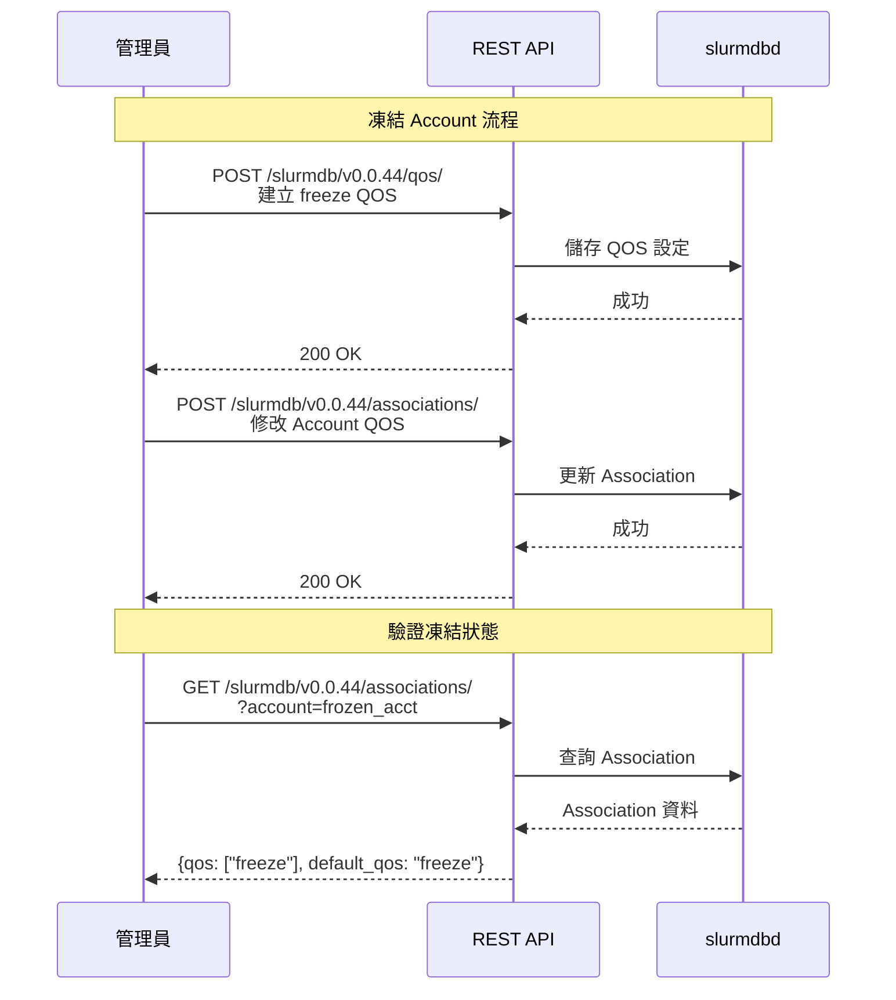

---

## 第五章：故障排除

### 5.1 常見問題

#### 問題 1：凍結後使用者仍可提交作業

**原因**：使用者的 QOS 設定了非零的 GrpJobs/MaxJobs

**解決方案**：

```bash
# 檢查使用者可用的 QOS
$ sacctmgr show assoc user=john format=user,account,qos

# 確認 Account 的 QOS 已正確設定為 freeze
$ sacctmgr show assoc account=frozen_acct format=account,qos,defaultqos
```

#### 問題 2：REST API 回傳 401 Unauthorized

**原因**：JWT Token 過期或無效

**解決方案**：

```bash
# 重新產生 Token
export SLURM_JWT=$(scontrol token)

# 確認 slurmrestd 設定正確
$ grep -i auth /etc/slurm/slurmrestd.conf
```

#### 問題 3：修改後設定未生效

**原因**：Association 快取未更新

**解決方案**：

```bash
# 強制重新載入 Association
$ scontrol reconfigure
```

### 5.2 驗證指令速查

```bash
# 查看所有 QOS 及其限制
$ sacctmgr show qos format=name,grpjobs,grpsubmitjobs,maxjobspu,maxjobspa

# 查看特定 Account 的完整 Association 資訊
$ sacctmgr show assoc account=frozen_acct -p

# 檢查作業被拒絕的原因
$ squeue -u john -o "%i %j %T %r"

# 查看 slurmdbd 日誌
$ tail -f /var/log/slurm/slurmdbd.log
```

---

## 附錄 A：相關原始碼位置

| 功能 | 檔案路徑 | 說明 |
|-----|---------|------|
| QOS 限制驗證 | `src/slurmctld/acct_policy.c` | 核心驗證邏輯 |
| Association 資料結構 | `slurm/slurmdb.h` | 定義 `slurmdb_assoc_rec_t` |
| REST API - Associations | `src/slurmrestd/plugins/openapi/slurmdbd/associations.c` | API 實作 |
| REST API - QOS | `src/slurmrestd/plugins/openapi/slurmdbd/qos.c` | API 實作 |
| Partition 結構定義 | `src/common/part_record.h` | Partition QOS 欄位定義 |
| Partition QOS 驗證 | `src/slurmctld/partition_mgr.c` | AllowQOS/DenyQOS 驗證邏輯 |
| 官方文件 | `doc/html/resource_limits.shtml` | 限制優先級說明 |

## 附錄 B：限制優先級快速參考

```
┌─────────────────────────────────────────────────────────┐
│                    限制優先級層級                         │
├─────────────────────────────────────────────────────────┤
│  1. Partition QOS    ←─ 最高優先級                       │
│  2. Job QOS          ←─ 通常在此層設定限制                 │
│  3. User Assoc       ←─ 只在 QOS 未設定時生效              │
│  4. Account Assoc    ←─ 只在 QOS 未設定時生效              │
│  5. Parent Accounts  ←─ 向上遞迴檢查                      │
│  6. Root Assoc       ←─ 叢集層級預設                      │
│  7. Partition        ←─ 最低優先級                       │
└─────────────────────────────────────────────────────────┘

關鍵規則：QOS 限制「覆蓋」Association 限制（互斥檢查）
```

---

## 變更歷史

### 版本 1.4.0（2026-02-11）

**新增內容**：
- 新增 4.4 節「API Endpoint 選擇說明」，詳細比較不同 REST API endpoint 的差異與適用場景
- 新增查詢 API 比較表（`/associations/` vs `/account/` vs `/account/?with_assocs=true`）
- 新增更新 API 比較表（`/associations/` vs `/accounts_association/`）
- 新增原始碼佐證，說明各 endpoint 的實際實作與行為差異
- 新增推薦的 API 使用流程，提供完整的凍結 Account 範例

**修正內容**：
- 釐清 `GET /account/{name}?with_assocs=true` **不會**返回 User Association
- 釐清 `POST /accounts_association/` **只能**用於建立新 Account，不能修改現有 Account
- 強調必須使用 `GET /associations/?account={name}` 才能獲取所有 User Association

**原始碼參考**：
- `src/slurmrestd/plugins/openapi/slurmdbd/accounts.c:341-384`
- `src/slurmrestd/plugins/openapi/slurmdbd/associations.c:250-319, 368-400`
- `src/plugins/accounting_storage/mysql/as_mysql_acct.c:551-690`

### 版本 1.3.1（2026-02-10）

**新增內容**：
- 新增 3.2 節「Association 層級結構說明」，解釋 Account 層級與 User 層級的差異
- 新增流程圖說明 Association 層級檢查流程
- 新增完整的凍結與解凍 Account 指令範例

**修正內容**：
- 修正 4.4 節，強調必須修改所有 User Association
- 修正 4.6 節，補充解凍時也需要恢復所有 User Association
- 新增原始碼佐證（`src/slurmctld/acct_policy.c`）

---

## 參考資料

- Slurm 官方文件：Resource Limits
- Slurm 官方文件：Quality of Service (QOS)
- Slurm REST API OpenAPI Specification v0.0.44
- 原始碼分析：
  - `src/slurmctld/acct_policy.c`（QOS 限制檢查邏輯）
  - `src/slurmrestd/plugins/openapi/slurmdbd/accounts.c`（Account API 實作）
  - `src/slurmrestd/plugins/openapi/slurmdbd/associations.c`（Association API 實作）
  - `src/plugins/accounting_storage/mysql/as_mysql_acct.c`（MySQL 儲存層實作）
