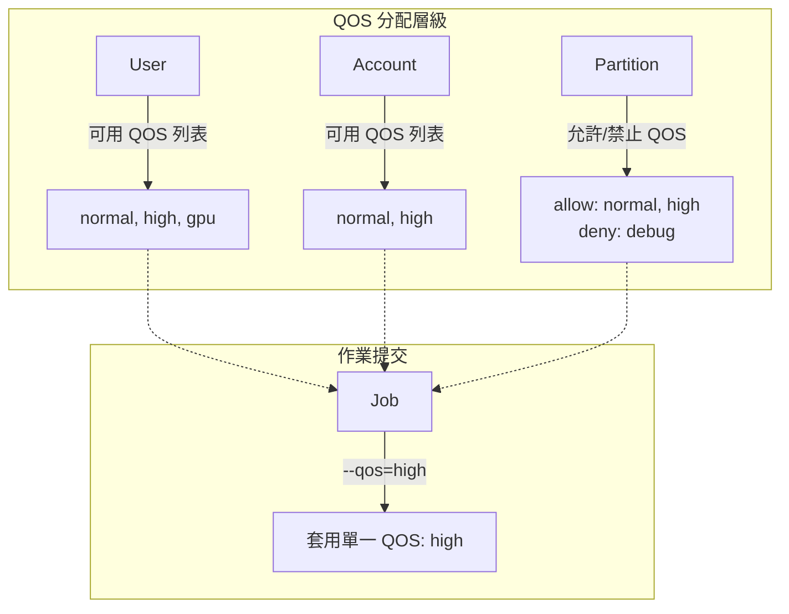
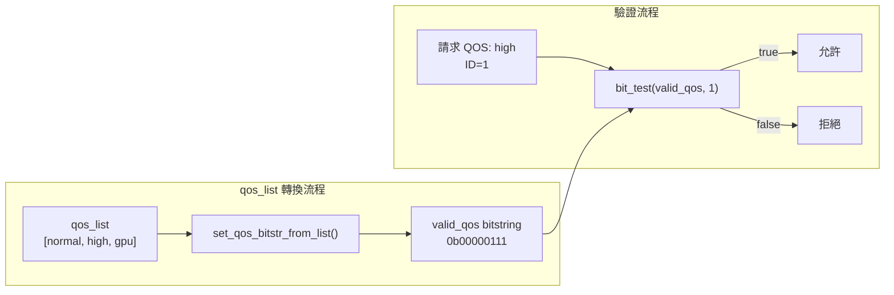
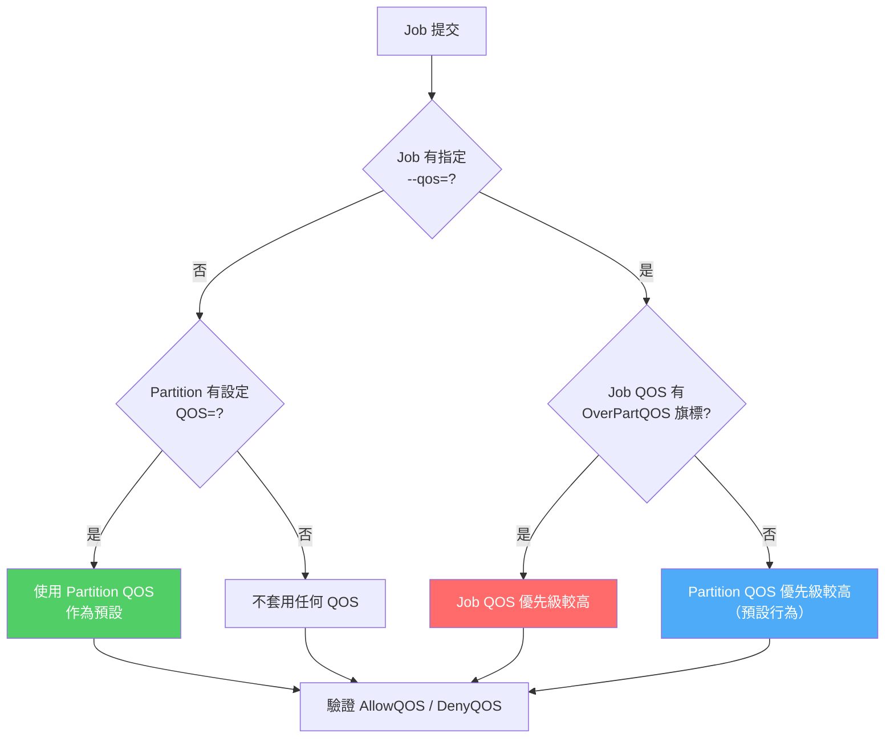
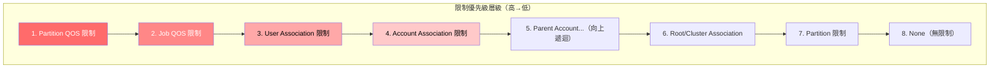
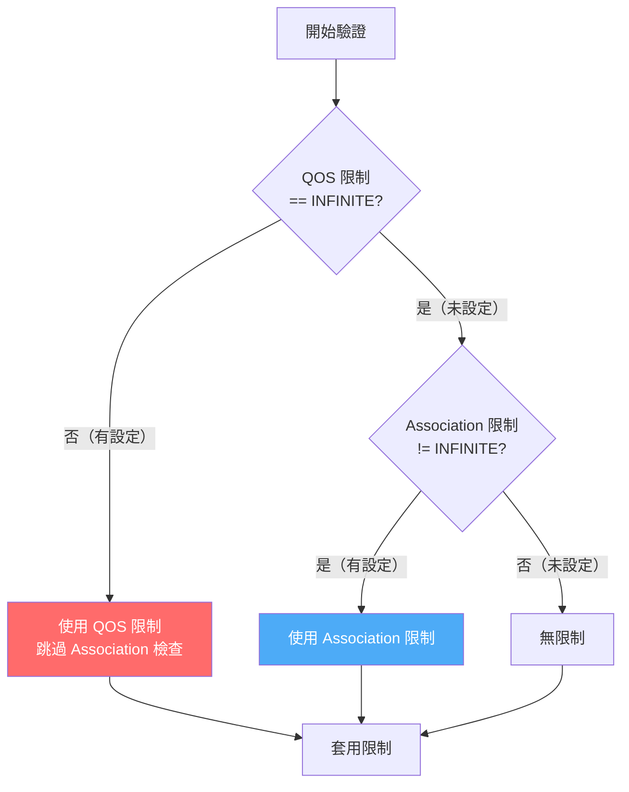
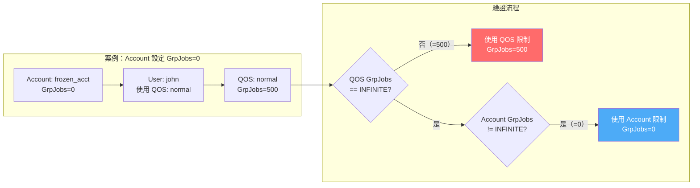
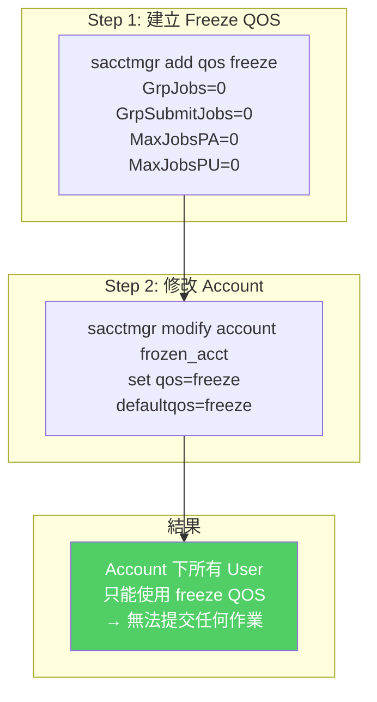
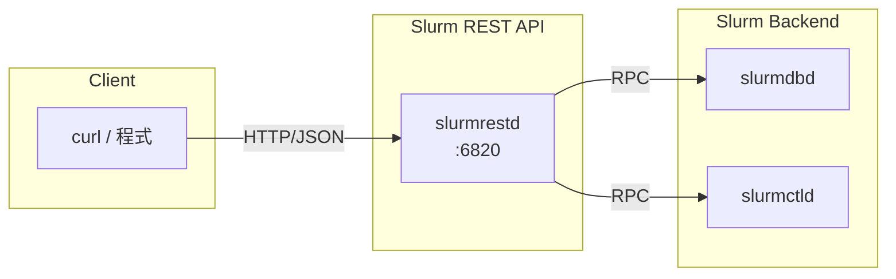
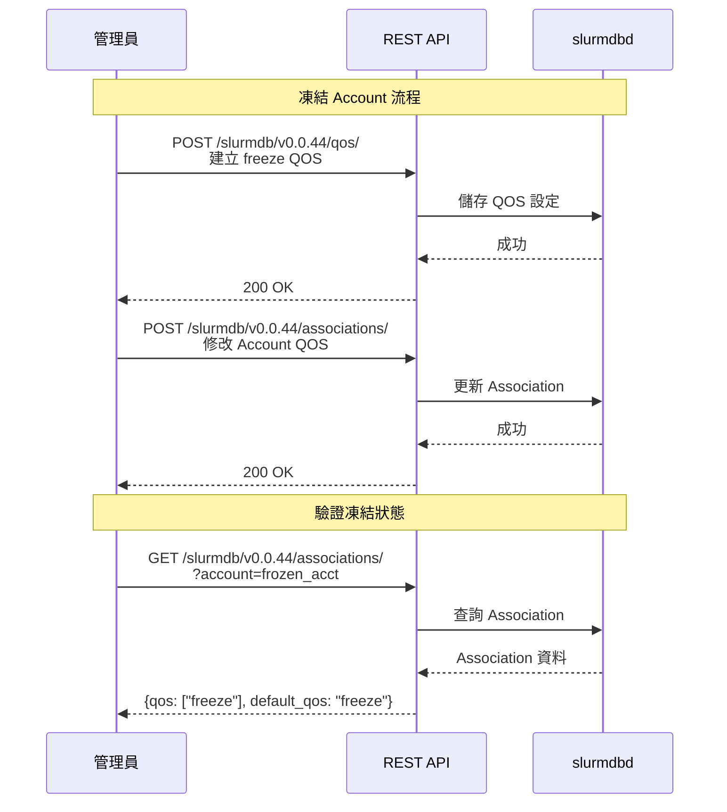

# Slurm QOS 限制優先級與凍結 Account 技術指南

## 概述

本文件深入分析 Slurm 資源管理系統中 QOS（Quality of Service）的分配機制與限制優先級規則。重點說明如何正確地「凍結」Account，使其下的所有使用者無法提交或執行作業。

**適用情境：**

- 需要暫時停用某個 Account 的所有作業權限
- 理解 QOS 與 Association 限制之間的交互關係
- 透過 REST API 自動化管理 Account 狀態

---

## 第一章：QOS 分配機制

### 1.1 核心概念

Slurm 的 QOS 系統允許管理員為不同層級（User、Account、Partition）配置服務品質參數。每個層級可以關聯**多個 QOS**，但每個作業執行時只會套用**一個 QOS**。



### 1.2 資料結構定義

#### User 層級

```c
// slurm/slurmdb.h
typedef struct slurmdb_user_rec {
    uint32_t def_qos_id;    // 使用者預設 QOS ID
    // ...
} slurmdb_user_rec_t;
```

#### Association 層級（User-Account 關聯）

```c
// slurm/slurmdb.h
typedef struct slurmdb_assoc_rec {
    uint32_t def_qos_id;    // 預設 QOS ID
    list_t *qos_list;       // 允許的 QOS 列表（多個）
    // ...
} slurmdb_assoc_rec_t;
```

#### Partition 層級

```c
// slurm/slurm.h
typedef struct partition_info {
    char *qos_char;     // Partition 本身的 QOS（單一）
    char *allow_qos;    // 允許的 QOS 列表（逗號分隔）
    char *deny_qos;     // 禁止的 QOS 列表（逗號分隔）
    // ...
} partition_info_t;
```

### 1.3 QOS 列表運作方式

系統使用**位元串（bitstring）**高效管理 QOS 訪問權限：



### 1.4 設定範例

```bash
# 為 user 設定單一 QOS
$ sacctmgr modify user john set qos=normal

# 為 user 新增多個 QOS
$ sacctmgr modify user john set qos+=high,gpu

# 查看 association 的 QOS 配置
$ sacctmgr show assoc format=cluster,user,account,qos,defaultqos
   Cluster       User    Account                  QOS DefaultQOS
---------- ---------- ---------- -------------------- ----------
  mycluster      john    physics    gpu,high,normal     normal
```

### 1.5 Partition 與 QOS 的關係

Partition **不需要**設定 QOS，QOS 對 Partition 而言是完全可選的。若未設定，預設值為 `NULL`。

#### Partition 的 QOS 相關參數

在 `slurm.conf` 中可為 Partition 設定以下三個 QOS 相關參數：

| 參數 | 說明 | 範例 |
|-----|------|------|
| `QOS=` | 指定 Partition 層級的 QOS | `QOS=gpu_runnable` |
| `AllowQOS=` | 允許使用此 Partition 的 QOS 清單（逗號分隔） | `AllowQOS=normal,high,gpu` |
| `DenyQOS=` | 禁止使用此 Partition 的 QOS 清單（逗號分隔） | `DenyQOS=debug,test` |

#### slurm.conf 設定範例

```bash
# 基本 Partition 設定（無 QOS）
PartitionName=batch Nodes=node[001-100] Default=YES

# 設定 Partition 層級 QOS
PartitionName=gpu Nodes=gpu[01-08] QOS=gpu_runnable

# 設定允許的 QOS 清單
PartitionName=priority Nodes=node[001-050] AllowQOS=high,urgent

# 設定禁止的 QOS 清單
PartitionName=production Nodes=node[051-100] DenyQOS=debug,test
```

#### QOS 優先順序邏輯

當 Job 提交時，系統依以下邏輯決定使用哪個 QOS：



#### 原始碼佐證

**QOS 優先順序決定邏輯**（`src/slurmctld/acct_policy.c:5257-5291`）：

```c
extern void acct_policy_set_qos_order(job_record_t *job_ptr,
                      slurmdb_qos_rec_t **qos_ptr_1,
                      slurmdb_qos_rec_t **qos_ptr_2) {
    if (job_ptr->qos_ptr) {
        if (job_ptr->part_ptr && job_ptr->part_ptr->qos_ptr) {
            // 檢查 Job QOS 是否有 OverPartQOS 旗標
            if (job_ptr->qos_ptr->flags & QOS_FLAG_OVER_PART_QOS) {
                // Job QOS 優先級較高
                *qos_ptr_1 = job_ptr->qos_ptr;
                *qos_ptr_2 = job_ptr->part_ptr->qos_ptr;
            } else {
                // Partition QOS 優先級較高（預設）
                *qos_ptr_1 = job_ptr->part_ptr->qos_ptr;
                *qos_ptr_2 = job_ptr->qos_ptr;
            }
        } else
            *qos_ptr_1 = job_ptr->qos_ptr;
    }
}
```

**Partition 結構定義**（`src/common/part_record.h:108-111`）：

```c
char *qos_char;              /* requested QOS from slurm.conf */
slurmdb_qos_rec_t *qos_ptr;  /* pointer to the quality of service record */
```

#### AllowQOS / DenyQOS 驗證邏輯

當 Job 指定或使用某個 QOS 時，系統會檢查該 QOS 是否被 Partition 允許：

- 若設定了 `AllowQOS`：只有清單中的 QOS 才能在該 Partition 提交 Job
- 若設定了 `DenyQOS`：清單中的 QOS 將被拒絕
- 設定的 QOS 名稱必須在 `sacctmgr` 中已存在，否則 `slurmctld` 啟動時會報錯

> **參考來源**：`src/slurmctld/partition_mgr.c:2155-2230`

#### 重點整理

| 情境 | 行為 |
|-----|------|
| Partition 未設 QOS，Job 未指定 QOS | 不套用任何 Partition/Job QOS 限制 |
| Partition 設了 QOS，Job 未指定 QOS | 使用 Partition QOS 作為 Job 的預設 QOS |
| 兩者都有，Job QOS 無 `OverPartQOS` | Partition QOS 優先級較高（先檢查） |
| 兩者都有，Job QOS 有 `OverPartQOS` | Job QOS 優先級較高（先檢查） |

---

## 第二章：限制優先級規則

### 2.1 官方優先級層級

Slurm 的限制優先級順序（從高到低）：



**核心規則**：當限制在多個層級都有定義時，**第一個定義的限制會被使用**。

> **注意事項**：
>
> - **Partition QOS 與 Job QOS 的順序可互換**：若 QOS 設定了 `OverPartQOS` 旗標，則 Job QOS 的優先級會高於 Partition QOS。
> - **`Grp*` 限制的例外規則**：`Grp*` 類型的限制（如 `GrpTRES`）不完全遵循上述優先級順序。Account 層級的更嚴格 `Grp*` 限制會優先於 User 層級的較寬鬆限制，因為群組限制的本質要求最高層級的限制不可被超越。
> - **Partition 層級的上界限制**：`Max[Time|Wall]`、`[Min|Max]Nodes` 這三類限制即使在 QOS 或 Association 有設定，仍不可超過 Partition 層級的限制（除非 QOS 設定了 `PartitionTimeLimit` 或 `Partition[Max|Min]Nodes` 旗標）。
>
> 參考來源：`doc/html/resource_limits.shtml` 第 33-46 行

### 2.2 互斥檢查機制

這是理解限制優先級的**關鍵概念**。Slurm 使用「互斥檢查」邏輯：



#### 原始碼驗證

```c
// src/slurmctld/acct_policy.c 第3870-3881行（簡化版）
if ((qos_rec.grp_jobs == INFINITE) &&      // 只有 QOS 未設定時
    (assoc_ptr->grp_jobs != INFINITE) &&   // 且 Association 有設定
    (assoc_ptr->usage->used_jobs >= assoc_ptr->grp_jobs)) {
    xfree(job_ptr->state_desc);                   // 清除舊狀態描述
    job_ptr->state_reason = WAIT_ASSOC_GRP_JOB;   // 才檢查 Association
    debug2("%pJ being held, assoc %u is at or exceeds "
           "group max jobs limit %u with %u for account %s",
           job_ptr, assoc_ptr->id, assoc_ptr->grp_jobs,
           assoc_ptr->usage->used_jobs, assoc_ptr->acct);
    rc = false;
    goto end_it;
}
```

> **Note**：實際程式碼包含 `xfree()` 釋放舊狀態描述，以及 `debug2()` 日誌輸出（可用於故障排除時追蹤限制觸發原因）。

### 2.3 各限制類型的優先級行為

| 限制類型 | QOS 欄位 | Association 欄位 | 優先級規則 |
|---------|---------|-----------------|-----------|
| **GrpJobs** | `grp_jobs` | `grp_jobs` | QOS 覆蓋 Association |
| **GrpSubmitJobs** | `grp_submit_jobs` | `grp_submit_jobs` | QOS 覆蓋 Association |
| **MaxJobs** | `max_jobs_pa`, `max_jobs_pu` | `max_jobs` | QOS 覆蓋 Association |
| **MaxSubmitJobs** | `max_submit_jobs_pa`, `max_submit_jobs_pu` | `max_submit_jobs` | QOS 覆蓋 Association |
| **GrpTRES** | `grp_tres` | `grp_tres` | 取最小值（MIN） |

#### GrpTRES 取最小值的原始碼佐證

與 GrpJobs 的互斥覆蓋不同，GrpTRES 會同時考慮 QOS 與 Association 的限制，取兩者的**最小值**：

```c
// src/slurmctld/acct_policy.c 第1356-1358行
// 函數：_validate_tres_limits_for_qos()
max_tres_limit = grp_tres_array ? MIN(grp_tres_array[i],   // QOS GrpTRES
                                      max_tres_array[i]) :  // Association MaxTRES
                                  max_tres_array[i];
```

這表示 GrpTRES 的限制是**聯合限制**：即使 QOS 允許較多的 TRES，若 Association 有更嚴格的 GrpTRES，兩者的最小值仍會生效。這與 GrpJobs 等限制的「QOS 完全覆蓋 Association」行為截然不同。

### 2.4 實際案例分析



**結果**：因為 QOS 設定了 `GrpJobs=500`，Account 的 `GrpJobs=0` 被**完全忽略**，使用者仍可提交作業。

---

## 第三章：凍結 Account 的最佳實踐

### 3.1 問題分析

直接設定 Association 限制（如 `GrpJobs=0`）**無法可靠凍結 Account**，原因：


### 3.2 可靠的凍結方案

#### 方案：建立專用 Freeze QOS 並強制 Account 使用



#### 完整指令範例

```bash
# Step 1: 建立凍結 QOS（所有限制設為 0）
$ sacctmgr add qos freeze \
    GrpJobs=0 \
    GrpSubmitJobs=0 \
    MaxJobsPA=0 \
    MaxJobsPU=0 \
    MaxSubmitJobsPA=0 \
    MaxSubmitJobsPU=0

# Step 2: 強制 Account 只能使用 freeze QOS
$ sacctmgr modify account frozen_acct set qos=freeze defaultqos=freeze

# Step 3: 驗證設定
$ sacctmgr show assoc account=frozen_acct \
    format=account,user,qos,defaultqos,grpjobs

# Step 4: 測試提交（應被拒絕）
$ sbatch --account=frozen_acct test.sh
# 預期輸出：sbatch: error: QOS job limit reached
```

### 3.3 解凍 Account

```bash
# 恢復 Account 可用的 QOS
$ sacctmgr modify account frozen_acct \
    set qos=normal,high,low defaultqos=normal

# 驗證
$ sacctmgr show assoc account=frozen_acct format=account,user,qos,defaultqos
```

### 3.4 方案比較

| 方案 | 設定方式 | 會被 QOS 覆蓋？ | 可靠度 |
|-----|---------|---------------|-------|
| Association `GrpJobs=0` | 直接設定 | 是 | 不可靠 |
| Association `MaxJobs=0` | 直接設定 | 是 | 不可靠 |
| 強制使用 Freeze QOS | 控制可用 QOS | 否 | **可靠** |

---

## 第四章：REST API 操作範例

### 4.1 API 架構概覽



### 4.2 認證設定

```bash
# 產生 JWT Token
export SLURM_JWT=$(scontrol token)

# 或使用指定使用者
export SLURM_JWT=$(scontrol token username=admin lifespan=3600)
```

### 4.3 建立 Freeze QOS

```bash
curl -X POST http://localhost:6820/slurmdb/v0.0.44/qos/ \
  -H "Content-Type: application/json" \
  -H "X-SLURM-USER-NAME: root" \
  -H "X-SLURM-USER-TOKEN: $SLURM_JWT" \
  -d '{
    "qos": [
      {
        "name": "freeze",
        "description": "Frozen QOS - no jobs allowed",
        "limits": {
          "max": {
            "jobs": {
              "per": {
                "account": 0,
                "user": 0
              }
            },
            "submit_jobs": {
              "per": {
                "account": 0,
                "user": 0
              }
            }
          },
          "group": {
            "jobs": 0,
            "submit_jobs": 0
          }
        }
      }
    ]
  }'
```

### 4.4 修改 Account 的 QOS 設定

```bash
curl -X POST http://localhost:6820/slurmdb/v0.0.44/associations/ \
  -H "Content-Type: application/json" \
  -H "X-SLURM-USER-NAME: root" \
  -H "X-SLURM-USER-TOKEN: $SLURM_JWT" \
  -d '{
    "associations": [
      {
        "account": "frozen_acct",
        "cluster": "mycluster",
        "user": "",
        "default": {
          "qos": "freeze"
        },
        "qos": ["freeze"]
      }
    ]
  }'
```

### 4.5 查詢 Account 狀態

```bash
curl -X GET "http://localhost:6820/slurmdb/v0.0.44/associations/?account=frozen_acct" \
  -H "Accept: application/json" \
  -H "X-SLURM-USER-NAME: root" \
  -H "X-SLURM-USER-TOKEN: $SLURM_JWT" | jq '.associations[] | {account, user, qos, default_qos: .default.qos}'
```

### 4.6 解凍 Account

```bash
curl -X POST http://localhost:6820/slurmdb/v0.0.44/associations/ \
  -H "Content-Type: application/json" \
  -H "X-SLURM-USER-NAME: root" \
  -H "X-SLURM-USER-TOKEN: $SLURM_JWT" \
  -d '{
    "associations": [
      {
        "account": "frozen_acct",
        "cluster": "mycluster",
        "user": "",
        "default": {
          "qos": "normal"
        },
        "qos": ["normal", "high", "low"]
      }
    ]
  }'
```

### 4.7 API 操作流程圖



---

## 第五章：故障排除

### 5.1 常見問題

#### 問題 1：凍結後使用者仍可提交作業

**原因**：使用者的 QOS 設定了非零的 GrpJobs/MaxJobs

**解決方案**：

```bash
# 檢查使用者可用的 QOS
$ sacctmgr show assoc user=john format=user,account,qos

# 確認 Account 的 QOS 已正確設定為 freeze
$ sacctmgr show assoc account=frozen_acct format=account,qos,defaultqos
```

#### 問題 2：REST API 回傳 401 Unauthorized

**原因**：JWT Token 過期或無效

**解決方案**：

```bash
# 重新產生 Token
export SLURM_JWT=$(scontrol token)

# 確認 slurmrestd 設定正確
$ grep -i auth /etc/slurm/slurmrestd.conf
```

#### 問題 3：修改後設定未生效

**原因**：Association 快取未更新

**解決方案**：

```bash
# 強制重新載入 Association
$ scontrol reconfigure
```

### 5.2 驗證指令速查

```bash
# 查看所有 QOS 及其限制
$ sacctmgr show qos format=name,grpjobs,grpsubmitjobs,maxjobspu,maxjobspa

# 查看特定 Account 的完整 Association 資訊
$ sacctmgr show assoc account=frozen_acct -p

# 檢查作業被拒絕的原因
$ squeue -u john -o "%i %j %T %r"

# 查看 slurmdbd 日誌
$ tail -f /var/log/slurm/slurmdbd.log
```

---

## 附錄 A：相關原始碼位置

| 功能 | 檔案路徑 | 說明 |
|-----|---------|------|
| QOS 限制驗證 | `src/slurmctld/acct_policy.c` | 核心驗證邏輯 |
| Association 資料結構 | `slurm/slurmdb.h` | 定義 `slurmdb_assoc_rec_t` |
| REST API - Associations | `src/slurmrestd/plugins/openapi/slurmdbd/associations.c` | API 實作 |
| REST API - QOS | `src/slurmrestd/plugins/openapi/slurmdbd/qos.c` | API 實作 |
| Partition 結構定義 | `src/common/part_record.h` | Partition QOS 欄位定義 |
| Partition QOS 驗證 | `src/slurmctld/partition_mgr.c` | AllowQOS/DenyQOS 驗證邏輯 |
| 官方文件 | `doc/html/resource_limits.shtml` | 限制優先級說明 |

## 附錄 B：限制優先級快速參考

```
┌─────────────────────────────────────────────────────────┐
│                    限制優先級層級                         │
├─────────────────────────────────────────────────────────┤
│  1. Partition QOS    ←─ 最高優先級                       │
│  2. Job QOS          ←─ 通常在此層設定限制                 │
│  3. User Assoc       ←─ 只在 QOS 未設定時生效              │
│  4. Account Assoc    ←─ 只在 QOS 未設定時生效              │
│  5. Parent Accounts  ←─ 向上遞迴檢查                      │
│  6. Root Assoc       ←─ 叢集層級預設                      │
│  7. Partition        ←─ 最低優先級                       │
└─────────────────────────────────────────────────────────┘

關鍵規則：QOS 限制「覆蓋」Association 限制（互斥檢查）
```

---

## 參考資料

- Slurm 官方文件：Resource Limits
- Slurm 官方文件：Quality of Service (QOS)
- Slurm REST API OpenAPI Specification v0.0.44
- 原始碼分析：`src/slurmctld/acct_policy.c`
