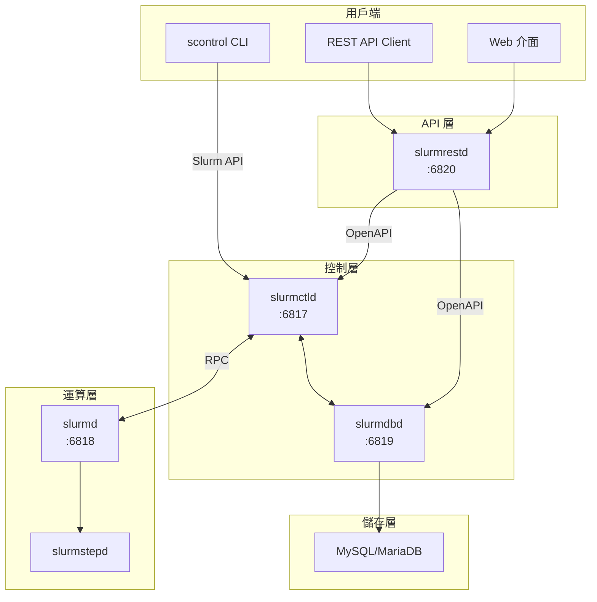
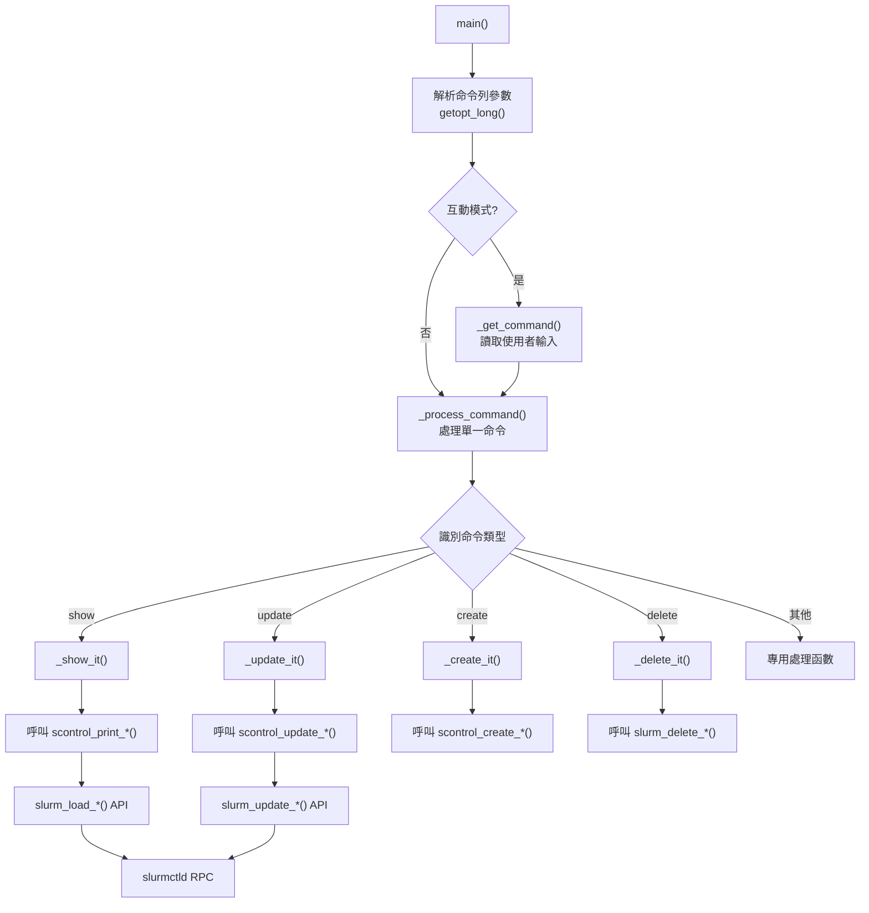
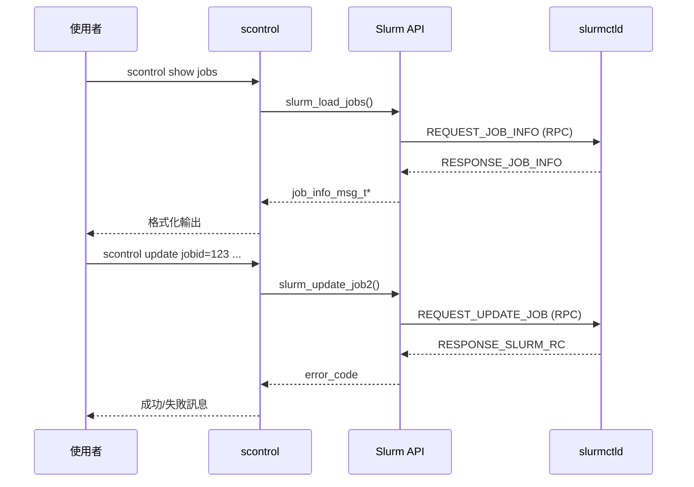
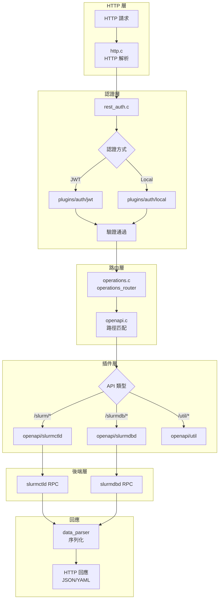
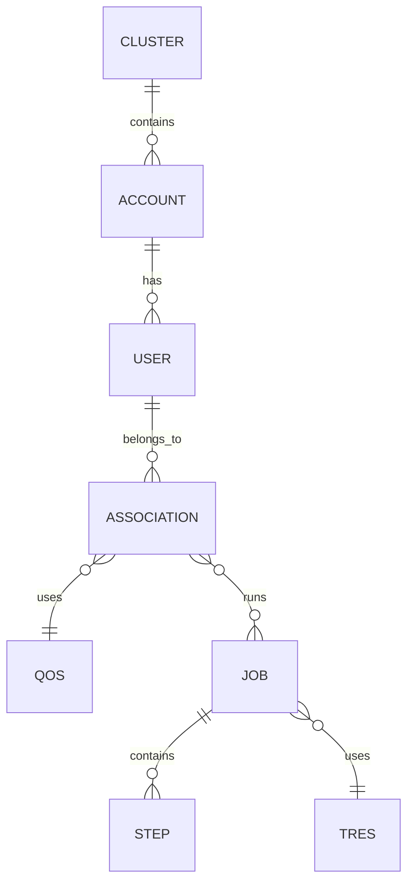
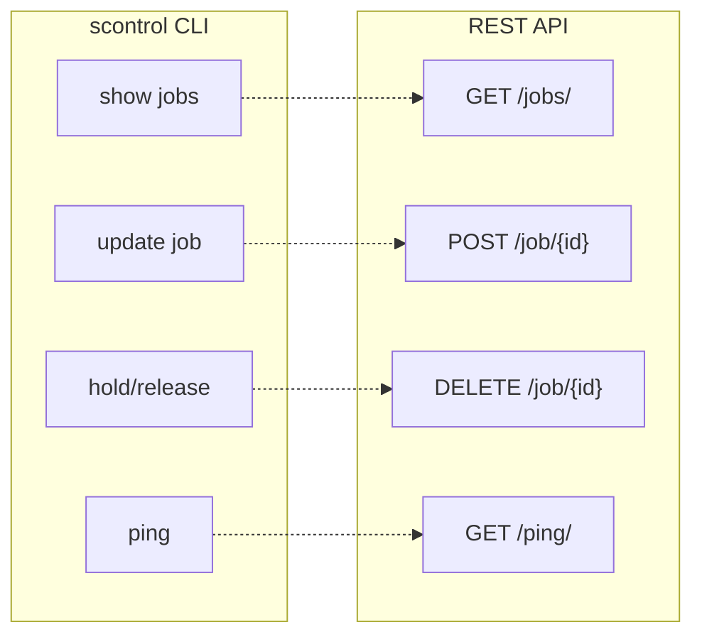

# Slurm scontrol 與 REST API 深度技術分析

本文件深入分析 Slurm 工作負載管理器中兩個關鍵元件：**scontrol** CLI 管理工具與 **slurmrestd** REST API 服務。內容涵蓋原始碼結構、命令處理流程、API 端點設計，以及兩者之間的對應關係。

---

## 目錄

1. [概覽](#概覽)
2. [scontrol CLI 工具](#scontrol-cli-工具)
3. [slurmrestd REST API](#slurmrestd-rest-api)
4. [scontrol 與 REST API 對應關係](#scontrol-與-rest-api-對應關係)
5. [開發指引](#開發指引)
6. [附錄：關鍵檔案參考](#附錄關鍵檔案參考)

---

## 概覽

### 系統架構



### 元件比較

| 特性 | scontrol | slurmrestd |
|------|----------|------------|
| **類型** | CLI 工具 | REST API 守護程式 |
| **通訊方式** | 原生 Slurm RPC | HTTP/HTTPS |
| **認證** | MUNGE/JWT | JWT/Unix Socket |
| **適用場景** | 管理員操作、腳本 | Web 應用、自動化、跨平台整合 |
| **連接埠** | 無 (直連 slurmctld) | 6820 (預設) |

---

## scontrol CLI 工具

### 原始碼結構

```
src/scontrol/
├── scontrol.c          # 主程式進入點 (1991 行)
├── scontrol.h          # 主要標頭檔 (162 行)
├── common.c            # 共用函數
├── usage.txt           # 使用說明
├── info_*.c            # 資訊查詢模組
│   ├── info_job.c      # 作業資訊 (2696 行，最大檔案)
│   ├── info_node.c     # 節點資訊
│   ├── info_part.c     # 分割區資訊
│   ├── info_res.c      # 保留資訊
│   ├── info_lics.c     # 授權資訊
│   ├── info_fed.c      # 聯邦資訊
│   ├── info_burst_buffer.c  # Burst Buffer 資訊
│   └── info_assoc_mgr.c     # 關聯管理器資訊
├── update_*.c          # 更新操作模組
│   ├── update_job.c    # 更新作業 (1521 行)
│   ├── update_node.c   # 更新節點
│   ├── update_part.c   # 更新分割區
│   └── update_step.c   # 更新步驟
├── create_res.c        # 建立保留
├── power_node.c        # 節點電源控制
└── reboot_node.c       # 節點重開機
```

### 命令處理架構



### 命令分類與實作

#### 1. 查詢命令 (show)

```bash
# 顯示作業資訊
scontrol show jobs
scontrol show job 12345

# 顯示節點資訊
scontrol show nodes
scontrol show node compute-001

# 顯示分割區資訊
scontrol show partitions

# 顯示保留資訊
scontrol show reservations

# 顯示系統設定
scontrol show config
```

**實作範例** (`info_job.c`):

```c
extern void scontrol_print_job(char *job_id_str, int argc, char **argv)
{
    int error_code;
    job_info_msg_t *job_info_ptr = NULL;

    // 透過 Slurm API 載入作業資訊
    error_code = slurm_load_jobs(
        (time_t) NULL,      // 不使用快取
        &job_info_ptr,      // 輸出指標
        SHOW_ALL            // 顯示所有作業
    );

    if (error_code == SLURM_SUCCESS) {
        // 印出作業資訊
        slurm_print_job_info_msg(stdout, job_info_ptr, one_liner);
        slurm_free_job_info_msg(job_info_ptr);
    }
}
```

#### 2. 更新命令 (update)

```bash
# 更新作業屬性
scontrol update jobid=12345 TimeLimit=2:00:00
scontrol update jobid=12345 Priority=100

# 更新節點狀態
scontrol update nodename=compute-001 State=DRAIN Reason="維護"

# 更新分割區
scontrol update partitionname=batch MaxTime=24:00:00
```

**實作範例** (`update_job.c`):

```c
extern int scontrol_update_job(int argc, char **argv)
{
    job_desc_msg_t job_msg;
    int error_code;

    // 初始化訊息結構
    slurm_init_job_desc_msg(&job_msg);

    // 解析命令列參數並填入結構
    for (int i = 0; i < argc; i++) {
        // 解析 key=value 格式
        _parse_job_update_option(argv[i], &job_msg);
    }

    // 透過 Slurm API 更新作業
    error_code = slurm_update_job2(&job_msg, &resp_msg);

    return error_code;
}
```

#### 3. 作業控制命令

```bash
# 暫停/恢復作業
scontrol hold 12345
scontrol release 12345
scontrol suspend 12345
scontrol resume 12345

# 重新排隊
scontrol requeue 12345

# 優先順序調整
scontrol top 12345
```

#### 4. 系統管理命令

```bash
# 測試控制器連線
scontrol ping

# 重新載入設定
scontrol reconfigure

# 取得 JWT 權杖
scontrol token lifespan=3600

# 設定除錯等級
scontrol setdebug debug3
```

### 與 slurmctld 的通訊

scontrol 透過 Slurm 內部 API 與 slurmctld 通訊：



---

## slurmrestd REST API

### 原始碼結構

```
src/slurmrestd/
├── slurmrestd.c         # 主程式進入點 (932 行)
├── openapi.c/h          # OpenAPI 規格處理
├── operations.c/h       # 請求路由與操作
├── rest_auth.c/h        # REST 認證
├── http.c/h             # HTTP 處理
├── usage.txt            # 使用說明
└── plugins/
    ├── auth/            # 認證插件
    │   ├── jwt/jwt.c    # JWT 認證
    │   └── local/local.c # 本機 Unix Socket 認證
    └── openapi/         # OpenAPI 端點插件
        ├── slurmctld/   # 控制器 API (552 行)
        │   ├── api.c    # 插件入口
        │   ├── jobs.c   # 作業端點
        │   ├── nodes.c  # 節點端點
        │   ├── partitions.c # 分割區端點
        │   ├── reservations.c # 保留端點
        │   ├── resources.c # 資源端點
        │   ├── diag.c   # 診斷端點
        │   └── control.c # 控制端點
        ├── slurmdbd/    # 資料庫 API (922 行)
        │   ├── api.c    # 插件入口
        │   ├── jobs.c   # 作業記帳
        │   ├── accounts.c # 帳戶管理
        │   ├── users.c  # 使用者管理
        │   ├── qos.c    # QoS 管理
        │   ├── cluster.c # 叢集管理
        │   ├── associations.c # 關聯管理
        │   ├── wckeys.c # WCKey 管理
        │   ├── tres.c   # TRES 管理
        │   └── instances.c # 實例管理
        └── util/        # 公用 API
            ├── api.c    # 公用端點
            └── convert_format.c
```

### 請求處理流程



### API 版本與資料解析器

slurmrestd 支援多個 API 版本，透過 URL 路徑中的 `{data_parser}` 參數指定：

| 版本 | Slurm 版本 | 狀態 |
|------|-----------|------|
| `v0.0.42` | 24.11 | 維護中 |
| `v0.0.43` | 25.05 | 維護中 |
| `v0.0.44` | 25.11 | 維護中 |
| `v0.0.45` | 26.05 | 目前版本 |

### slurmctld API 端點

#### 作業管理

| 方法 | 路徑 | 說明 |
|------|------|------|
| GET | `/slurm/{v}/jobs/` | 取得所有作業 |
| DELETE | `/slurm/{v}/jobs/` | 發送訊號至作業清單 |
| GET | `/slurm/{v}/jobs/state/` | 取得作業狀態 |
| GET | `/slurm/{v}/job/{job_id}` | 取得單一作業 |
| POST | `/slurm/{v}/job/{job_id}` | 更新作業 |
| DELETE | `/slurm/{v}/job/{job_id}` | 取消作業 |
| POST | `/slurm/{v}/job/submit` | 提交新作業 |
| POST | `/slurm/{v}/job/allocate` | 作業分配 |

**範例：取得作業清單**

```bash
# 使用 JWT 認證
curl -H "X-SLURM-USER-TOKEN: $JWT_TOKEN" \
     http://localhost:6820/slurm/v0.0.45/jobs/

# 使用 Unix Socket
curl --unix-socket /var/run/slurmrestd.socket \
     http://localhost/slurm/v0.0.45/jobs/
```

**範例：提交作業**

```bash
curl -X POST \
     -H "X-SLURM-USER-TOKEN: $JWT_TOKEN" \
     -H "Content-Type: application/json" \
     -d '{
       "job": {
         "name": "test-job",
         "ntasks": 4,
         "script": "#!/bin/bash\nhostname"
       }
     }' \
     http://localhost:6820/slurm/v0.0.45/job/submit
```

#### 節點管理

| 方法 | 路徑 | 說明 |
|------|------|------|
| GET | `/slurm/{v}/nodes/` | 取得所有節點 |
| POST | `/slurm/{v}/nodes/` | 批次更新節點 |
| GET | `/slurm/{v}/node/{name}` | 取得單一節點 |
| POST | `/slurm/{v}/node/{name}` | 更新節點 |
| DELETE | `/slurm/{v}/node/{name}` | 刪除節點 |
| POST | `/slurm/{v}/new/node/` | 新增節點 |

#### 分割區與保留

| 方法 | 路徑 | 說明 |
|------|------|------|
| GET | `/slurm/{v}/partitions/` | 取得所有分割區 |
| GET | `/slurm/{v}/partition/{name}` | 取得單一分割區 |
| GET | `/slurm/{v}/reservations/` | 取得所有保留 |
| POST | `/slurm/{v}/reservations/` | 建立/更新保留 |
| DELETE | `/slurm/{v}/reservation/{name}` | 刪除保留 |

#### 系統操作

| 方法 | 路徑 | 說明 |
|------|------|------|
| GET | `/slurm/{v}/ping/` | 連線測試 |
| GET | `/slurm/{v}/diag/` | 診斷資訊 |
| GET | `/slurm/{v}/reconfigure/` | 重新設定 |
| GET | `/slurm/{v}/licenses/` | 授權資訊 |
| GET | `/slurm/{v}/shares` | 公平共用資訊 |

### slurmdbd API 端點

slurmdbd API 提供資料庫記帳功能存取：



| 類別 | 端點範例 | 說明 |
|------|----------|------|
| 作業記帳 | `/slurmdb/{v}/jobs/` | 歷史作業查詢 |
| 使用者 | `/slurmdb/{v}/users/` | 使用者管理 |
| 帳戶 | `/slurmdb/{v}/accounts/` | 帳戶管理 |
| 關聯 | `/slurmdb/{v}/associations/` | 使用者-帳戶關聯 |
| QoS | `/slurmdb/{v}/qos/` | 服務品質管理 |
| 叢集 | `/slurmdb/{v}/clusters/` | 叢集管理 |
| TRES | `/slurmdb/{v}/tres/` | 可追蹤資源 |

### 認證機制

#### JWT 認證

```bash
# 1. 取得 JWT 權杖
export JWT_TOKEN=$(scontrol token lifespan=3600 | cut -d= -f2)

# 2. 使用權杖呼叫 API
curl -H "X-SLURM-USER-TOKEN: $JWT_TOKEN" \
     http://localhost:6820/slurm/v0.0.45/ping/
```

#### Unix Socket 認證

```bash
# 使用本機 Unix Socket (自動使用執行者身份)
curl --unix-socket /var/run/slurmrestd.socket \
     http://localhost/slurm/v0.0.45/ping/
```

### 回應格式

所有 API 回應遵循統一格式：

```json
{
  "meta": {
    "plugin": {
      "type": "openapi/slurmctld",
      "name": "Slurm OpenAPI slurmctld"
    },
    "slurm": {
      "version": {
        "major": 26,
        "minor": 5,
        "micro": 0
      },
      "release": "26.05.0"
    }
  },
  "errors": [],
  "warnings": [],
  "jobs": [...]
}
```

---

## scontrol 與 REST API 對應關係

下表展示 scontrol 命令與對應的 REST API 端點：

| scontrol 命令 | HTTP 方法 | REST API 端點 |
|---------------|-----------|---------------|
| `show jobs` | GET | `/slurm/{v}/jobs/` |
| `show job <id>` | GET | `/slurm/{v}/job/{id}` |
| `update jobid=<id> ...` | POST | `/slurm/{v}/job/{id}` |
| `show nodes` | GET | `/slurm/{v}/nodes/` |
| `show node <name>` | GET | `/slurm/{v}/node/{name}` |
| `update nodename=<name> ...` | POST | `/slurm/{v}/node/{name}` |
| `show partitions` | GET | `/slurm/{v}/partitions/` |
| `show reservations` | GET | `/slurm/{v}/reservations/` |
| `ping` | GET | `/slurm/{v}/ping/` |
| `reconfigure` | GET | `/slurm/{v}/reconfigure/` |

### 功能對比



---

## 開發指引

### 新增 scontrol 命令

1. **在 `_process_command()` 中新增命令識別** (`scontrol.c:1033`)

```c
} else if (!xstrncasecmp(tag, "mycommand", MAX(tag_len, 3))) {
    if (argc < 2) {
        _printf_error("too few arguments for keyword:%s", tag);
    } else {
        scontrol_my_command(argc - 1, &argv[1]);
    }
}
```

2. **實作處理函數**

```c
// 在對應的 .c 檔案中
extern void scontrol_my_command(int argc, char **argv)
{
    // 使用 slurm_*() API 函數與 slurmctld 通訊
}
```

3. **更新 `usage.txt`**

4. **在 `scontrol.h` 中宣告函數原型**

### 新增 REST API 端點

1. **在對應的 OpenAPI 插件中定義路徑** (`plugins/openapi/slurmctld/api.c`)

```c
static const openapi_path_binding_t openapi_paths[] = {
    // 新增端點
    {
        .path = "/slurm/{data_parser}/myendpoint/",
        .methods = HTTP_REQUEST_GET | HTTP_REQUEST_POST,
        .tags = "myendpoint",
        .callback = _handle_myendpoint,
    },
    // ...
};
```

2. **實作處理函數**

```c
static int _handle_myendpoint(const char *context_id,
                              http_request_method_t method,
                              data_t *parameters,
                              data_t *query,
                              int tag,
                              data_t *resp,
                              void *auth)
{
    // 處理請求並填入回應
    return SLURM_SUCCESS;
}
```

3. **更新資料解析器** (`src/plugins/data_parser/v0.0.45/`)

---

## 附錄：關鍵檔案參考

### scontrol 核心檔案

| 檔案 | 路徑 | 用途 |
|------|------|------|
| 主程式 | `src/scontrol/scontrol.c` | 命令解析與分發 |
| 標頭檔 | `src/scontrol/scontrol.h` | 全域變數與函數宣告 |
| 作業資訊 | `src/scontrol/info_job.c` | 作業查詢實作 |
| 作業更新 | `src/scontrol/update_job.c` | 作業更新實作 |
| 使用說明 | `src/scontrol/usage.txt` | CLI 說明文字 |

### slurmrestd 核心檔案

| 檔案 | 路徑 | 用途 |
|------|------|------|
| 主程式 | `src/slurmrestd/slurmrestd.c` | 服務進入點 |
| OpenAPI | `src/slurmrestd/openapi.c` | OpenAPI 規格處理 |
| 路由 | `src/slurmrestd/operations.c` | 請求路由 |
| 認證 | `src/slurmrestd/rest_auth.c` | 認證處理 |
| slurmctld 端點 | `src/slurmrestd/plugins/openapi/slurmctld/` | 控制器 API |
| slurmdbd 端點 | `src/slurmrestd/plugins/openapi/slurmdbd/` | 資料庫 API |

### 相關資源

- **官方文件**：<https://slurm.schedmd.com/>
- **REST API 參考**：<https://slurm.schedmd.com/rest_api.html>
- **scontrol 手冊**：<https://slurm.schedmd.com/scontrol.html>
- **OpenAPI 規格檔**：`testsuite/python/data/openapi_spec_v45.json`

---

*本文件由 BMAD Tech Writer 產生 | 最後更新：2025-12-31*
