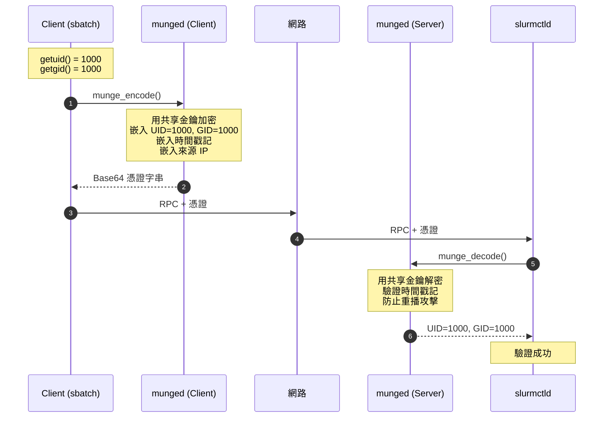
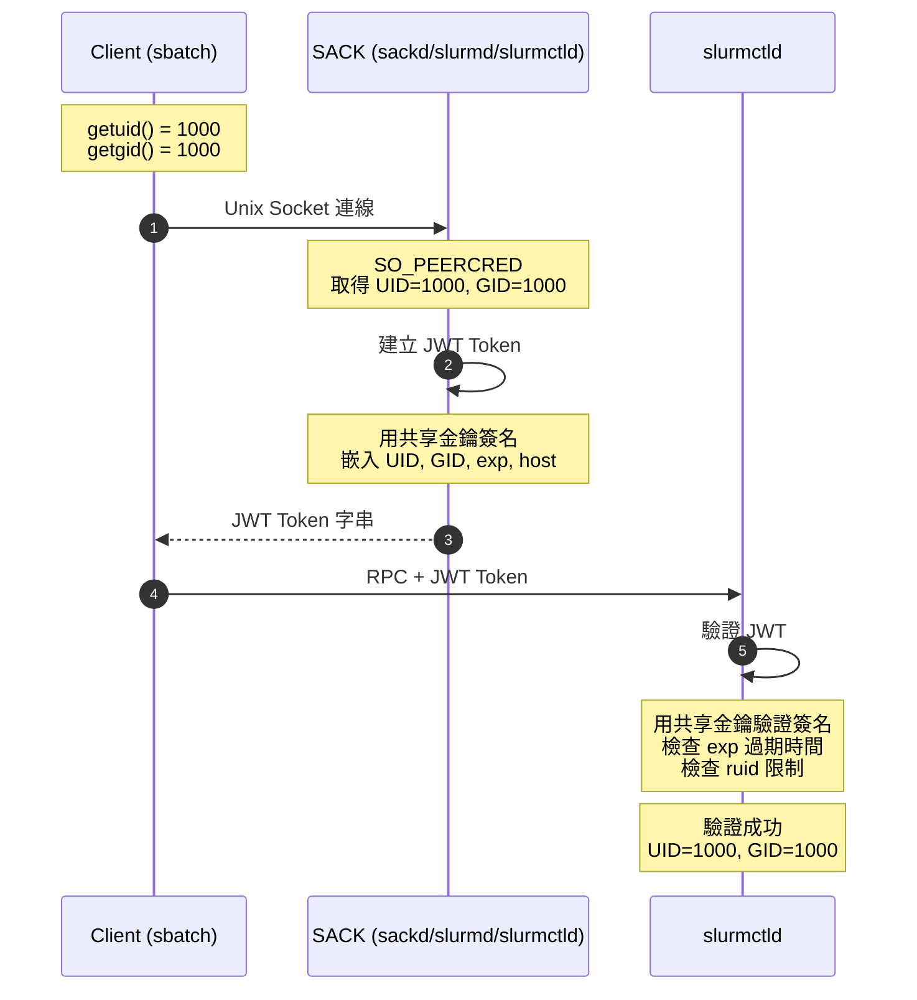
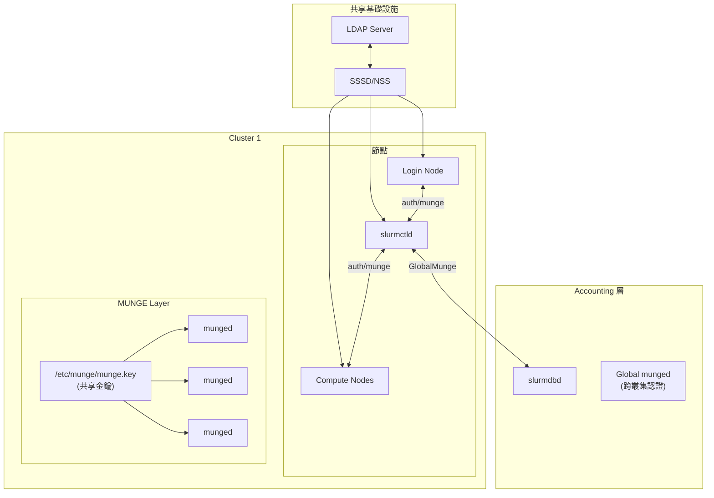
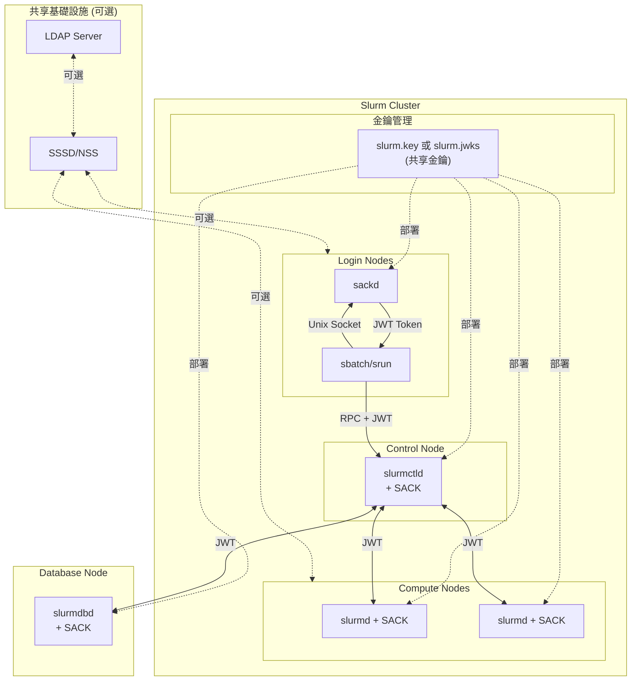

# Slurm 認證機制深入分析：auth/munge 與 auth/slurm

> 最後更新：2025-12-31
> 資料來源：Slurm 源碼分析及官方文檔
> - `src/plugins/auth/munge/auth_munge.c`
> - `src/plugins/auth/slurm/auth_slurm.c`, `internal.c`, `external.c`, `sack.c`, `util.c`
> - `src/common/sack_api.c`, `src/sackd/sackd.c`
> - `doc/html/authentication.shtml`

---

## 目錄

- [1. MUNGE 概述](#1-munge-概述)
- [2. auth/munge 核心實作](#2-authmunge-核心實作)
- [3. 認證流程](#3-認證流程)
- [4. 安全機制](#4-安全機制)
- [5. auth/munge vs auth/slurm 比較](#5-authmunge-vs-authslurm-比較)
- [6. auth/slurm 深入分析](#6-authslurm-深入分析)
- [7. SACK 子系統](#7-sack-子系統)
- [8. MUNGE 對 User/Group 的處理](#8-munge-對-usergroup-的處理)
- [9. 配置選項](#9-配置選項)
- [10. 架構總結](#10-架構總結)

---

## 1. MUNGE 概述

MUNGE (MUNGE Uid 'N' Gid Emporium) 是一個**獨立的認證服務**，由 Lawrence Livermore National Laboratory 開發。它**不是** Slurm 的一部分，而是一個外部依賴。

### 核心概念

- MUNGE 在每個節點上運行一個 daemon (`munged`)
- 所有節點共享同一個對稱金鑰 (`/etc/munge/munge.key`)
- 透過金鑰來驗證請求來源的 UID/GID 是否可信

### 官方資源

- MUNGE 專案：<https://dun.github.io/munge/>
- Slurm 認證文檔：`doc/html/authentication.shtml`

---

## 2. auth/munge 核心實作

### 2.1 Credential 結構

從 `src/plugins/auth/munge/auth_munge.c:82-93`：

```c
#define MUNGE_MAGIC 0xfeed
typedef struct {
    int index;           /* MUST ALWAYS BE FIRST. DO NOT PACK. */
    int magic;           /* magical munge validity magic */
    char   *m_str;       /* munged string (編碼後的憑證) */
    bool m_xstr;         /* set if m_str allocated by xmalloc */
    struct in_addr addr; /* IP addr where cred was encoded */
    bool    verified;    /* true if this cred has been verified */
    uid_t   uid;         /* UID. valid only if verified == true */
    gid_t   gid;         /* GID. valid only if verified == true */
    void *data;          /* payload data */
    int dlen;            /* payload data length */
} auth_credential_t;
```

### 2.2 Plugin 基本資訊

```c
// src/plugins/auth/munge/auth_munge.c:68-74
const char plugin_name[] = "Munge authentication plugin";
const char plugin_type[] = "auth/munge";
const uint32_t plugin_version = SLURM_VERSION_NUMBER;
const uint32_t plugin_id = AUTH_PLUGIN_MUNGE;
const bool hash_enable = true;
```

### 2.3 建立憑證 (Encode)

從 `src/plugins/auth/munge/auth_munge.c:155-246`：

```c
auth_credential_t *auth_p_create(char *opts, uid_t r_uid, void *data, int dlen)
{
    munge_ctx_t ctx = munge_ctx_create();

    // 設定自訂 socket 路徑（如果有指定）
    if (opts) {
        socket = slurm_auth_opts_to_socket(opts);
        rc = munge_ctx_set(ctx, MUNGE_OPT_SOCKET, socket);
    }

    // 設定 UID 限制 - 只有指定的 UID 才能解碼此憑證
    rc = munge_ctx_set(ctx, MUNGE_OPT_UID_RESTRICTION, r_uid);

    // 設定憑證存活時間 (TTL)
    auth_ttl = slurm_get_auth_ttl();
    if (auth_ttl) {
        rc = munge_ctx_set(ctx, MUNGE_OPT_TTL, auth_ttl);
    }

    // 呼叫 MUNGE library 編碼憑證
    err = munge_encode(&cred->m_str, ctx, data, dlen);
    //                  ^^^^^^^^^^
    //                  輸出：Base64 編碼的加密字串
}
```

### 2.4 驗證憑證 (Decode)

從 `src/plugins/auth/munge/auth_munge.c:483-564`：

```c
static int _decode_cred(auth_credential_t *c, char *socket, bool test)
{
    munge_ctx_t ctx = munge_ctx_create();

    // 設定自訂 socket 路徑
    if (socket) {
        munge_ctx_set(ctx, MUNGE_OPT_SOCKET, socket);
    }

    // 呼叫 MUNGE library 解碼憑證
    err = munge_decode(c->m_str, ctx, &c->data, &c->dlen, &c->uid, &c->gid);
    //                                                    ^^^^^^^  ^^^^^^^
    //                                                    解出原始發送者的 UID/GID

    // 取得來源 IP 位址
    munge_ctx_get(ctx, MUNGE_OPT_ADDR4, &c->addr);

    // 驗證 UID/GID 有效
    if (c->uid == SLURM_AUTH_NOBODY)
        err = EMUNGE_CRED_INVALID;
    else if (c->gid == SLURM_AUTH_NOBODY)
        err = EMUNGE_CRED_INVALID;
    else
        c->verified = true;  // 標記為已驗證
}
```

### 2.5 取得認證身份

從 `src/plugins/auth/munge/auth_munge.c:303-320`：

```c
extern void auth_p_get_ids(auth_credential_t *cred, uid_t *uid, gid_t *gid)
{
    if (!cred || !cred->verified) {
        *uid = SLURM_AUTH_NOBODY;
        *gid = SLURM_AUTH_NOBODY;
        return;
    }

    *uid = cred->uid;
    *gid = cred->gid;
}
```

---

## 3. 認證流程



### 流程詳解

| 步驟 | 動作 | 說明 |
|------|------|------|
| 1 | Client 取得 UID/GID | 透過 `getuid()` / `getgid()` |
| 2 | 編碼憑證 | `munge_encode()` 建立加密憑證 |
| 3 | 網路傳輸 | 憑證隨 RPC 一起傳送 |
| 4 | 解碼驗證 | `munge_decode()` 解密並驗證 |
| 5 | 取得身份 | Server 取得原始 UID/GID |

---

## 4. 安全機制

### 4.1 UID 限制 (UID Restriction)

從 `src/plugins/auth/munge/auth_munge.c:181-187`：

```c
rc = munge_ctx_set(ctx, MUNGE_OPT_UID_RESTRICTION, r_uid);
if (rc != EMUNGE_SUCCESS) {
    error("Failed to set uid restriction: %s",
          munge_ctx_strerror(ctx));
    munge_ctx_destroy(ctx);
    return NULL;
}
```

這個選項限制**只有特定 UID 才能解碼憑證**，防止憑證被非預期的接收者使用。

### 4.2 啟動時安全檢查

從 `src/plugins/auth/munge/auth_munge.c:119-140`：

```c
if (!running_in_slurmstepd() && running_in_daemon()) {
    auth_credential_t *cred = NULL;
    char *socket = slurm_auth_opts_to_socket(slurm_conf.authinfo);

    // 建立一個限制給 uid+1 的憑證
    uid_t uid = getuid() + 1;
    cred = auth_p_create(slurm_conf.authinfo, uid, NULL, 0);

    if (!cred) {
        error("Failed to create MUNGE Credential");
        rc = SLURM_ERROR;
    } else if (!_decode_cred(cred, socket, true)) {
        // 嘗試解碼 - 如果成功表示 MUNGE 配置不安全
        error("MUNGE allows root to decode any credential");
        rc = SLURM_ERROR;  // 拒絕啟動
    }
}
```

這段程式碼確保 MUNGE 沒有被編譯成「root 可以解碼任何憑證」的模式。

### 4.3 重播攻擊防護

從 `src/plugins/auth/munge/auth_munge.c:521-543`：

```c
#ifdef MULTIPLE_SLURMD
if (err == EMUNGE_CRED_REPLAYED) {
    debug2("We had a replayed cred, but this is expected in multiple slurmd mode.");
    err = 0;
} else {
#endif
    error("Munge decode failed: %s", munge_ctx_strerror(ctx));
    _print_cred(ctx);
    if (err == EMUNGE_CRED_REWOUND)
        error("Check for out of sync clocks");
    errno = ESLURM_AUTH_CRED_INVALID;
    goto done;
#ifdef MULTIPLE_SLURMD
}
#endif
```

MUNGE 會追蹤已使用過的憑證，防止憑證被重複使用（除了特殊的 multiple slurmd 模式）。

### 4.4 時間同步檢查

```c
if (err == EMUNGE_CRED_REWOUND)
    error("Check for out of sync clocks");
```

如果時間戳記有問題（時鐘不同步），MUNGE 會拒絕憑證並提示檢查時間同步。

### 4.5 重試機制

從 `src/plugins/auth/munge/auth_munge.c:64-65` 和相關程式碼：

```c
#define RETRY_COUNT     20
#define RETRY_USEC      100000

// 在 encode/decode 失敗時重試
if ((err == EMUNGE_SOCKET) && retry--) {
    debug("Munge encode failed: %s (retrying ...)",
          munge_ctx_strerror(ctx));
    usleep(RETRY_USEC);  // 100ms 後重試
    goto again;
}
if (err == EMUNGE_SOCKET)
    error("If munged is up, restart with --num-threads=10");
```

---

## 5. auth/munge vs auth/slurm 比較

### 5.1 功能對照表

| 特性 | auth/munge | auth/slurm |
|------|------------|------------|
| **外部依賴** | 需要 munged daemon | 無（內建 SACK） |
| **憑證格式** | MUNGE 自有格式 | JWT (JSON Web Token) |
| **加密演算法** | 可配置（AES 等） | HS256 (HMAC-SHA256) |
| **金鑰管理** | `/etc/munge/munge.key` | `slurm.key` 或 `slurm.jwks` |
| **金鑰輪替** | 需重新部署金鑰 | 支援多金鑰 (v24.05+) |
| **UID 來源** | munged 從 socket 取得 | SACK 從 SO_PEERCRED 取得 |
| **重播防護** | munged 維護已用憑證列表 | JWT 過期時間 (exp) |
| **導入版本** | Slurm 早期版本 | 23.11 開始 |
| **推薦用途** | 傳統部署、多叢集 | 新部署、容器化環境 |
| **Token 支援** | 不支援 | 支援 |
| **Login Node 支援** | 需要 munged | sackd daemon |
| **Identity 傳遞** | 僅 UID/GID | 可選傳遞完整 identity |

### 5.2 auth/slurm 的 UID 取得方式

從 `src/plugins/auth/slurm/auth_slurm.c:135-146`：

```c
extern auth_cred_t *auth_p_create(char *auth_info, uid_t r_uid, void *data, int dlen)
{
    if (internal) {
        // Daemon 模式：直接使用 getuid()/getgid()
        auth_cred_t *cred = new_cred();
        cred->token = create_internal("auth", getuid(), getgid(), r_uid,
                                      data, dlen, NULL);
        return cred;
    }
    // Client 模式：透過 SACK 建立憑證
    return create_external(r_uid, data, dlen);
}
```

### 5.3 auth/munge 不支援 Token

從 `src/plugins/auth/munge/auth_munge.c:625-628`：

```c
char *auth_p_token_generate(const char *username, int lifespan)
{
    return NULL;  // 不支援
}
```

---

## 6. auth/slurm 深入分析

auth/slurm 是 Slurm 23.11 版本引入的**內建認證機制**，不需要外部 daemon 依賴。

### 6.1 Credential 結構

從 `src/plugins/auth/slurm/auth_slurm.h:49-69`：

```c
#define DEFAULT_TTL 60

typedef struct {
    int index;       /* MUST ALWAYS BE FIRST. DO NOT PACK. */

    bool verified;   // 是否已驗證
    time_t ctime;    // 建立時間

    uid_t uid;       // 使用者 UID
    gid_t gid;       // 使用者 GID
    char *hostname;  // 來源主機名稱
    char *cluster;   // 叢集名稱
    char *context;   // 憑證類型 ("auth" 或 "sack")

    void *data;      // 附加資料
    int dlen;        // 附加資料長度

    identity_t *id;  // 完整身份資訊 (可選)

    /* packed data below */
    char *token;     // JWT token 字串
} auth_cred_t;
```

### 6.2 JWT Token 結構

auth/slurm 使用 **JSON Web Token (JWT)** 作為憑證格式，包含以下 claims：

| Claim | 類型 | 說明 |
|-------|------|------|
| `iat` | int | Issued At - 發行時間 (Unix timestamp) |
| `exp` | int | Expiration - 過期時間 (Unix timestamp) |
| `ver` | int | Protocol version |
| `uid` | int | 使用者 UID |
| `gid` | int | 使用者 GID |
| `ruid` | int | Restricted UID - 只有此 UID 可解碼 |
| `host` | string | 來源主機名稱 |
| `cluster` | string | 叢集名稱 |
| `context` | string | 憑證類型 ("auth" 或 "sack") |
| `payload` | string | Base64 編碼的附加資料 |
| `id` | object | 完整身份資訊 (當 use_client_ids 啟用) |

從 `src/plugins/auth/slurm/internal.c:263-334`：

```c
extern char *create_internal(char *context, uid_t uid, gid_t gid, uid_t r_uid,
                             void *data, int dlen, char *extra)
{
    jwt_alg_t opt_alg = JWT_ALG_HS256;
    time_t now = time(NULL);
    jwt_t *jwt;
    long grant_time = now + lifespan;  // 預設 60 秒

    jwt_new(&jwt);

    jwt_add_grant_int(jwt, "iat", now);
    jwt_add_grant_int(jwt, "exp", grant_time);
    jwt_add_grant_int(jwt, "ver", SLURM_PROTOCOL_VERSION);
    jwt_add_grant_int(jwt, "ruid", r_uid);
    jwt_add_grant(jwt, "context", context);
    jwt_add_grant(jwt, "cluster", slurm_conf.cluster_name);

    if (extra)
        jwt_add_grants_json(jwt, extra);  // 加入身份資訊

    jwt_add_grant_int(jwt, "uid", uid);
    jwt_add_grant_int(jwt, "gid", gid);
    jwt_add_grant(jwt, "host", this_hostname);

    if (data && dlen) {
        char *payload = xcalloc(2, dlen);
        jwt_Base64encode(payload, data, dlen);
        jwt_add_grant(jwt, "payload", payload);
    }

    // 設定金鑰 ID (如果有)
    if (default_key->kid)
        jwt_add_header(jwt, "kid", default_key->kid);

    jwt_set_alg(jwt, opt_alg, default_key->key, default_key->keylen);
    token = jwt_encode_str(jwt);
    return xstrdup(token);
}
```

### 6.3 金鑰管理

#### 單一金鑰模式 (slurm.key)

```bash
# 產生金鑰
dd if=/dev/random of=/etc/slurm/slurm.key bs=1024 count=1
chown slurm:slurm /etc/slurm/slurm.key
chmod 600 /etc/slurm/slurm.key
```

#### 多金鑰模式 (slurm.jwks) - v24.05+

從 `doc/html/authentication.shtml:148-167`：

```json
{
  "keys": [
    {
      "alg": "HS256",
      "kty": "oct",
      "kid": "key-identifier",
      "k": "VGhlIGtleSBiZWxvdyBtZSBuZXZlciBsaWVz",
      "exp": 1718200800
    },
    {
      "alg": "HS256",
      "kty": "oct",
      "kid": "key-identifier-2",
      "k": "VGhlIGtleSBhYm92ZSBtZSBhbHdheXMgbGllcw==",
      "use": "default"
    }
  ]
}
```

| 欄位 | 必填 | 說明 |
|------|------|------|
| `alg` | 是 | 演算法，必須是 `HS256` |
| `kty` | 是 | 金鑰類型，必須是 `oct` |
| `kid` | 是 | 金鑰識別符（唯一） |
| `k` | 是 | Base64 編碼的金鑰（最少 16 bytes） |
| `use` | 否 | 設為 `default` 表示預設金鑰 |
| `exp` | 否 | 金鑰過期時間 (Unix timestamp) |

從 `src/plugins/auth/slurm/internal.c:122-175` 可見金鑰載入邏輯：

```c
static data_for_each_cmd_t _build_key_list(data_t *d, void *arg)
{
    key_ptr->kid = data_get_string(data_key_get(d, "kid"));

    kty = data_get_string(data_key_get(d, "kty"));
    if (xstrcasecmp(kty, "oct"))
        fatal("%s: kty field must be oct", __func__);

    alg = data_get_string(data_key_get(d, "alg"));
    if (xstrcasecmp(alg, "HS256"))
        fatal("%s: alg field must be HS256", __func__);

    // 金鑰最少 16 bytes
    if (key_ptr->keylen < 16)
        fatal("%s: key lacks sufficient entropy", __func__);

    // 檢查是否為 default key
    if ((use = data_get_string(data_key_get(d, "use"))) &&
        !xstrcasecmp(use, "default")) {
        default_key = key_ptr;
    }
}
```

### 6.4 驗證流程

從 `src/plugins/auth/slurm/internal.c:366-422`：

```c
extern int verify_internal(auth_cred_t *cred, uid_t decoder_uid)
{
    jwt_t *jwt = NULL;

    if (cred->verified)
        return SLURM_SUCCESS;

    // 解碼並驗證 JWT
    if (!(jwt = decode_jwt(cred->token, true, decoder_uid))) {
        error("%s: decode_jwt() failed", __func__);
        goto fail;
    }

    cred->verified = true;

    // 複製 JWT claims 到 cred 結構
    if (copy_jwt_grants_to_cred(jwt, cred))
        goto fail;

    // 確認 context 類型
    if (xstrcmp(cred->context, "auth") && xstrcmp(cred->context, "sack"))
        goto fail;

    // 處理 use_client_ids
    if (use_client_ids) {
        char *json_id;
        if ((json_id = jwt_get_grants_json(jwt, "id"))) {
            cred->id = extract_identity(json_id, cred->uid, cred->gid);
            // 更新 assoc_mgr 的 UID 映射
            if (running_in_slurmctld() || running_in_slurmdbd())
                assoc_mgr_set_uid(cred->uid, cred->id->pw_name);
        }
    }

    return SLURM_SUCCESS;
}
```

### 6.5 安全檢查

從 `src/plugins/auth/slurm/internal.c:487-522`：

```c
extern jwt_t *decode_jwt(char *token, bool verify, uid_t decoder_uid)
{
    // 重要：防禦 alg="none" 攻擊
    alg = jwt_get_header(jwt, "alg");
    if (xstrcasecmp(alg, "HS256")) {
        error("%s: no support for alg=%s", __func__, alg);
        goto fail;
    }

    // 檢查過期時間
    expiration = jwt_get_grant_int(jwt, "exp");
    if (expiration < time(NULL)) {
        error("%s: token expired at %ld", __func__, expiration);
        goto fail;
    }

    // 驗證 restricted UID
    r_uid = jwt_get_grant_int(jwt, "ruid");
    if (verify &&
        (r_uid != (uid_t) SLURM_AUTH_UID_ANY) && (r_uid != decoder_uid)) {
        error("%s: asked to verify token with r_uid=%ld for uid=%u",
              __func__, r_uid, decoder_uid);
        goto fail;
    }
}
```

### 6.6 use_client_ids 選項

當叢集沒有一致的 UID/GID 映射（例如無 LDAP）時使用：

從 `src/plugins/auth/slurm/auth_slurm.c:106-107`：

```c
if (xstrstr(slurm_conf.authinfo, "use_client_ids"))
    use_client_ids = true;
```

啟用後，客戶端的完整身份資訊會嵌入 JWT：

從 `src/plugins/auth/slurm/util.c:134-151`：

```c
extern char *get_identity_string(identity_t *id, uid_t uid, gid_t gid)
{
    if (!id && !(id = id_local = fetch_identity(uid, gid, true)))
        return NULL;

    data = identity_to_data(id);
    serialize_g_data_to_string(&json, NULL, data, MIME_TYPE_JSON,
                               SER_FLAGS_COMPACT);
    return json;
}
```

Identity 資料結構（`src/common/identity.h` 和 `src/common/identity.c:43-76`）：

```c
typedef struct {
    uid_t uid;
    gid_t gid;
    char *pw_name;    // 使用者名稱
    char *pw_gecos;   // 使用者全名
    char *pw_dir;     // 家目錄
    char *pw_shell;   // 預設 shell
    gid_t *gids;      // 附屬群組列表
    int ngids;        // 群組數量
    char **gr_names;  // 群組名稱列表
    bool fake;        // 是否為假身份
} identity_t;
```

---

## 7. SACK 子系統

SACK (**S**lurm **A**uth and **C**red **K**iosk) 是 auth/slurm 的核心子系統。

### 7.1 設計理念

SACK 的設計靈感來自 MUNGE：

從 `src/plugins/auth/slurm/sack.c:72-78`：

```c
/*
 * Loosely inspired by MUNGE.
 *
 * Listen on a UNIX socket for connections. Use getsockopt(SO_PEERCRED) via
 * conmgr_get_fd_auth_creds() to establish the identity of the connecting
 * process, and generate a credential from their requested payload.
 */
```

### 7.2 Socket 路徑

從 `src/plugins/auth/slurm/sack.c:65-67` 和 `src/common/sack_api.c:48-62`：

| 服務 | Socket 路徑 |
|------|-------------|
| sackd | `/run/slurm/sack.socket` |
| slurmctld | `/run/slurmctld/sack.socket` |
| slurmdbd | `/run/slurmdbd/sack.socket` |
| 多叢集 | `/run/slurm-{cluster}/sack.socket` |

### 7.3 Client 端連線邏輯

從 `src/common/sack_api.c:142-162`：

```c
static int _sack_connect(char *cluster_name)
{
    // 1. 優先使用環境變數 SLURM_SACK_SOCKET
    if ((sack_socket = getenv("SLURM_SACK_SOCKET")))
        return _sack_connect_env(sack_socket);

    // 2. 嘗試叢集專用 socket
    if (cluster_name && ((fd = _sack_connect_cluster(cluster_name)) >= 0))
        return fd;

    // 3. 依序嘗試預設 socket 列表
    for (int i = 0; i < ARRAY_SIZE(sack_addrs); i++) {
        if ((fd = _sack_try_connection(&sack_addrs[i])) < 0)
            continue;
        return fd;
    }

    error("failed to connect to any sack sockets");
    return -1;
}
```

### 7.4 RPC 類型

從 `src/common/sack_api.h`：

```c
#define SACK_CREATE  1  // 建立憑證
#define SACK_VERIFY  2  // 驗證憑證
```

### 7.5 建立憑證流程 (Client 端)

從 `src/common/sack_api.c:164-199`：

```c
extern char *sack_create(uid_t r_uid, void *data, int dlen, char *cluster_name)
{
    fd = _sack_connect(cluster_name);

    // 建立請求封包
    pack16(SLURM_PROTOCOL_VERSION, request);
    pack32(length, request);
    pack32(SACK_CREATE, request);
    pack32(r_uid, request);
    packmem(data, dlen, request);

    // 發送請求
    safe_write(fd, get_buf_data(request), get_buf_offset(request));

    // 讀取 token
    safe_read(fd, &len, sizeof(uint32_t));
    token = xmalloc(len + 1);
    safe_read(fd, token, len);

    return token;
}
```

### 7.6 建立憑證流程 (Server 端)

從 `src/plugins/auth/slurm/sack.c:131-179`：

```c
static int _sack_create(conmgr_fd_t *con, buf_t *in)
{
    // 透過 SO_PEERCRED 取得客戶端 UID/GID
    if (conmgr_get_fd_auth_creds(con, &uid, &gid, &pid)) {
        error("%s: conmgr_get_fd_auth_creds() failed", __func__);
        goto unpack_error;
    }

    safe_unpack32(&r_uid, in);
    safe_unpackmem_xmalloc(&data, &dlen, in);

    // 如果啟用 use_client_ids，加入身份資訊
    if (use_client_ids)
        extra = get_identity_string(NULL, uid, gid);

    // 建立 JWT token
    token = create_internal("sack", uid, gid, r_uid, data, dlen, extra);

    packstr(token, out);
    conmgr_fd_xfer_out_buffer(con, out);
}
```

### 7.7 sackd Daemon

sackd 是專為 **login node** 設計的輕量級 daemon：

從 `doc/html/authentication.shtml:207-210`：

```
For login nodes not running one of these Slurm daemons, the sackd
daemon should be run to allow the Slurm client commands to authenticate to
the rest of the cluster. This daemon can also manage cached configuration files
for configless environments.
```

主要功能：
- 處理 auth/slurm 認證請求
- 管理 configless 環境的配置快取
- 支援多叢集共存（v25.05+）

### 7.8 認證流程圖



---

## 8. MUNGE 對 User/Group 的處理

### 關鍵發現

MUNGE 和 Slurm 都**依賴作業系統的 UID/GID**：

```c
// MUNGE 編碼時嵌入的是「發送端」的 UID/GID
// 這些值來自於：
//   - Client 端的 getuid() / getgid()
//   - 這些又是由 /etc/passwd 或 NSS (LDAP/SSSD) 解析的
```

從 `doc/man/man5/slurm.conf.5:886-889`：

```
When munge is used as AuthType slurmctld makes use of getnameinfo
to obtain the hostname from IP address stored in munge credential.
```

### 重要說明

- **MUNGE 只傳遞 UID/GID 數字**
- **名稱解析是分開處理的**（透過 NSS）
- 所有節點必須有一致的 UID 映射

---

## 9. 配置選項

### 9.1 auth/munge 配置

#### 基本配置

從 `doc/man/man5/slurm.conf.5`：

```conf
# slurm.conf
AuthType=auth/munge
```

#### 自訂 Socket 路徑

```conf
# 指定 MUNGE socket 路徑
AuthInfo=socket=/var/run/munge/munge.socket.2
```

#### 憑證存活時間 (TTL)

```conf
# 設定憑證存活時間（秒）
AuthInfo=ttl=300
```

從 `doc/man/man5/slurm.conf.5:541-543`：

```
For auth/munge, the default value is dependent upon the MUNGE
installation, but is typically 300 seconds.
```

#### 跨叢集認證

```conf
# 為 slurmdbd 通訊使用獨立的 MUNGE daemon
AccountingStoragePass=/var/run/munge/global.socket.2
```

從 `doc/man/man5/slurm.conf.5:183-189`：

```
In the case of SlurmDBD (Database Daemon) with MUNGE
authentication this can be configured to use a MUNGE daemon
specifically configured to provide authentication between clusters
while the default MUNGE daemon provides authentication within a
cluster.
```

### 9.2 auth/slurm 配置

#### 基本配置

```conf
# slurm.conf
AuthType=auth/slurm
CredType=cred/slurm

# slurmdbd.conf
AuthType=auth/slurm
```

#### 金鑰設定

金鑰檔案位置（依優先順序）：

1. 環境變數 `SLURM_SACK_JWKS` 或 `SLURM_SACK_KEY`
2. `{SlurmdSpoolDir}/slurm.jwks` 或 `slurm.key`
3. `/etc/slurm/slurm.jwks` 或 `slurm.key`

#### 進階選項

```conf
# 憑證存活時間
AuthInfo=ttl=60

# 禁用 SACK（僅用於特殊情況）
AuthInfo=disable_sack

# 使用客戶端身份資訊（無 LDAP 時）
AuthInfo=use_client_ids
```

#### sackd 設定

從 `doc/html/authentication.shtml:212-217`：

```
Beginning with version 25.05, it's possible for multiple sackd daemons
to co-exist on the same login node by changing the RuntimeDirectory option in
separate systemd service files. Clients can authenticate against different sackd
daemons on the same login node by managing the SLURM_CONF environment
variable to point at the different cluster configuration files.
```

---

## 10. 架構總結

### 10.1 auth/munge 架構



### 10.2 auth/slurm 架構



### 10.3 關鍵結論

#### auth/munge 特性

1. **MUNGE 不解析 username**：它只處理 UID/GID 數字
2. **名稱解析是分離的**：透過 `getpwnam_r()` / `getpwuid_r()` 使用 NSS
3. **LDAP 整合在 OS 層**：Slurm 和 MUNGE 都不直接連接 LDAP
4. **所有節點必須 UID 一致**：因為 MUNGE 只傳遞數字，名稱解析在各節點本地進行
5. **跨叢集認證需要獨立 MUNGE daemon**：使用不同的 socket 和金鑰

#### auth/slurm 特性

1. **內建認證**：不需要外部 daemon (除了 login node 的 sackd)
2. **JWT 憑證格式**：標準化、可檢視、支援多種 claims
3. **金鑰輪替**：透過 slurm.jwks 支援多金鑰和金鑰過期
4. **use_client_ids**：可選傳遞完整身份資訊（適用於無 LDAP 環境）
5. **SO_PEERCRED**：透過 kernel 取得連線者 UID/GID，安全可靠
6. **sackd**：專為 login node 設計的輕量級 daemon

#### 選擇建議

| 場景 | 建議 |
|------|------|
| 新部署 (v23.11+) | auth/slurm |
| 容器化環境 | auth/slurm（更簡單的部署） |
| 多叢集環境 | 兩者皆可，auth/munge 更成熟 |
| 既有 MUNGE 部署 | 維持 auth/munge |
| 無 LDAP 環境 | auth/slurm + use_client_ids |

---

## 相關文件

| 文件 | 說明 |
|------|------|
| [Slurm 與 LDAP 整合分析](./slurm-ldap-integration.md) | LDAP 整合的深入分析 |
| `doc/html/authentication.shtml` | Slurm 官方認證文檔 |
| `doc/man/man5/slurm.conf.5` | slurm.conf 配置說明 |

### 源碼參考

| 檔案路徑 | 說明 |
|----------|------|
| `src/plugins/auth/munge/auth_munge.c` | auth/munge 完整實作 |
| `src/plugins/auth/slurm/auth_slurm.c` | auth/slurm 主入口 |
| `src/plugins/auth/slurm/auth_slurm.h` | auth/slurm 資料結構定義 |
| `src/plugins/auth/slurm/internal.c` | JWT 建立與驗證 (daemon 模式) |
| `src/plugins/auth/slurm/external.c` | SACK 客戶端邏輯 |
| `src/plugins/auth/slurm/sack.c` | SACK 伺服器邏輯 |
| `src/plugins/auth/slurm/util.c` | 共用工具函數 |
| `src/common/sack_api.c` | SACK 客戶端 API |
| `src/common/identity.c` | Identity 資料結構處理 |
| `src/sackd/sackd.c` | sackd daemon 主程式 |
