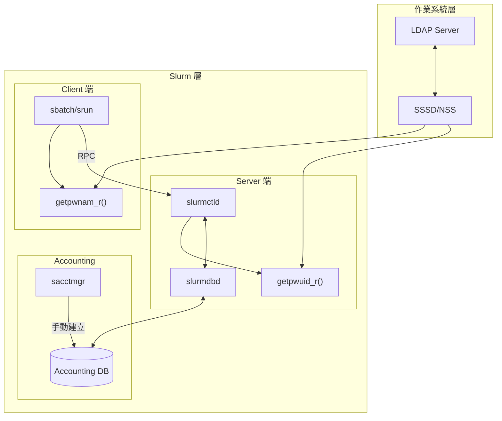
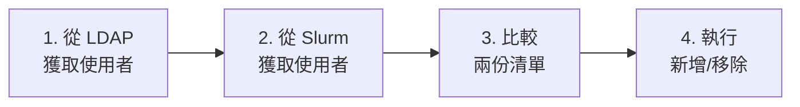

# Slurm 與 LDAP 整合分析

> 最後更新：2025-12-31
> 資料來源：Slurm 源碼分析 (`src/common/uid.c`, `src/sacctmgr/user_functions.c`) 及官方文檔 (`doc/html/accounting.shtml`, `doc/html/nss_slurm.shtml`)

---

## 目錄

- [1. 核心結論](#1-核心結論)
- [2. Slurm 的 User/Group 解析機制](#2-slurm-的-usergroup-解析機制)
- [3. 官方文檔的設計說明](#3-官方文檔的設計說明)
- [4. nss_slurm 的設計定位](#4-nss_slurm-的設計定位)
- [5. Slurm Accounting 不同步 LDAP 的原因](#5-slurm-accounting-不同步-ldap-的原因)
- [6. 只有 Account 是否還需要建立 User？](#6-只有-account-是否還需要建立-user)
- [7. 架構圖](#7-架構圖)
- [8. 實務操作建議](#8-實務操作建議)
- [9. 總結](#9-總結)

---

## 1. 核心結論

**Slurm 本身不直接整合 LDAP，也不會自動同步 user 和 group。這是刻意的架構設計，而非功能缺失。**

| 層面 | Slurm 的作法 |
|------|-------------|
| User/Group 解析 | 透過標準 POSIX API (`getpwnam_r`, `getgrnam_r`) |
| LDAP 連接 | 無，完全依賴 OS 層級的 NSS |
| Accounting User 管理 | 手動透過 `sacctmgr` 建立 |

---

## 2. Slurm 的 User/Group 解析機制

從 `src/common/uid.c` 可以看到，Slurm 完全依賴作業系統的標準 POSIX API：

```c
// src/common/uid.c:126
int rc = getpwnam_r(name, &pwd, curr_buf, bufsize, &result);

// src/common/uid.c:336
int rc = getgrnam_r(name, &grp, curr_buf, bufsize, &result);
```

### 關鍵函數

| 函數 | 位置 | 用途 |
|------|------|------|
| `uid_from_string()` | `src/common/uid.c:104` | 將 username 轉換為 UID |
| `uid_to_string_or_null()` | `src/common/uid.c:184` | 將 UID 轉換為 username |
| `gid_from_string()` | `src/common/uid.c:317` | 將 group name 轉換為 GID |

這些函數內部都呼叫 `getpwnam_r()` / `getpwuid_r()` / `getgrnam_r()` / `getgrgid_r()`，這些是透過 NSS (Name Service Switch) 運作的系統呼叫。

### 設計意義

- Slurm **不實作任何 LDAP 客戶端**
- Slurm 透過 **NSS** 間接使用 LDAP
- LDAP 整合必須在**作業系統層級**完成（如 SSSD、NSLCD）

---

## 3. 官方文檔的設計說明

從 `doc/html/accounting.shtml:188-198`：

```
Whether you use any authentication module or not you will need to have
a way for the SlurmDBD to get UIDs for users and/or admins. If using
MUNGE, it is ideal for your users to have the same id on all your
clusters. If this is the case you should have a combination of every
cluster's /etc/passwd file on the database server to allow the DBD to
resolve names for authentication. If using MUNGE and a user's name is
not in the passwd file the action will fail. ...
An LDAP server could also serve as a way to gather this information.
```

### 關鍵解讀

- SlurmDBD 需要能解析 UID/username
- 可以透過 `/etc/passwd` 或 **LDAP server** 提供這些資訊
- LDAP 是作為 **NSS 資料來源**，不是 Slurm 直接連接

從 `doc/html/accounting.shtml:145-161`：

```
Accounting is maintained by user name (not user ID), but a
given user name should refer to the same person across all
of the computers.
Authentication relies upon user ID numbers, so those must
be uniform across all computers communicating with each
SlurmDBD...
```

### 層面分離

| 層面 | 維度 | 處理者 |
|------|------|--------|
| 認證 (Authentication) | UID | auth/slurm 或 auth/munge |
| 會計 (Accounting) | username | slurmdbd 維護 |
| 名稱解析 | NSS | OS 層級的 SSSD/LDAP |

---

## 4. nss_slurm 的設計定位

從 `doc/html/nss_slurm.shtml:5-9`：

```
nss_slurm is an optional NSS plugin that can permit passwd, group...
resolution for a job on the compute node to be serviced through the local
slurmstepd process, rather than through some alternate network-based service
such as LDAP, DNS, SSSD, or NSLCD.
```

從 `doc/html/nss_slurm.shtml:165-171`：

```
nss_slurm is not meant as a full replacement for network directory services
such as LDAP, but as a way to remove load from those systems to improve the
performance of large-scale job launches. It accomplishes this by removing
the "thundering-herd" issue should all tasks of a large job make simultaneous
lookup requests...
```

### 設計假設

- LDAP/SSSD 等目錄服務是**外部基礎設施**
- Slurm 選擇在計算節點提供 `nss_slurm` 來**減輕 LDAP 負載**，而非取代它
- 這是為了解決大規模作業啟動時的「雷群效應」問題

---

## 5. Slurm Accounting 不同步 LDAP 的原因

### 5.1 技術層面

從 `src/sacctmgr/user_functions.c:725-743` 分析：

```c
static int _check_uid(void *x, void *arg)
{
    char *name = x;
    uid_t pw_uid;

    if (uid_from_string(name, &pw_uid) != SLURM_SUCCESS) {
        char *warning = xstrdup_printf(
            "There is no uid for user '%s'\n"
            "Are you sure you want to continue?",
            name);

        if (!commit_check(warning)) {
            xfree(warning);
            exit_code = 1;
            return -1;
        }
        // 注意：只是警告，仍然允許繼續
        xfree(warning);
    }
    return 0;
}
```

**程式碼說明**：

- `sacctmgr` 會**警告**使用者名稱在系統中不存在
- 但**仍然允許建立 Accounting 記錄**
- Slurm Accounting 的 user **不需要對應到系統 user**

### 5.2 設計考量

**LDAP schema 多樣性**

- 不同組織的 LDAP 結構不同（`uid`, `sAMAccountName`, `userPrincipalName`...）
- 無法用單一邏輯映射所有 LDAP 環境

**User 不等於 Association**

- LDAP 中有 user 不代表該 user 需要/能使用 HPC 資源
- Slurm Association = User + Account + Partition + QOS
- 這些資訊在 LDAP 中不存在

**授權邏輯複雜**

- 誰可以提交作業？可以用多少資源？屬於哪個計費帳戶？
- 這些是**組織政策決策**，無法從 LDAP 推導

---

## 6. 只有 Account 是否還需要建立 User？

### 核心結論

**必須建立 Slurm User。** 即使已經建立了 Slurm Account（對應 LDAP group），你仍然需要為每個要使用叢集的使用者建立 User association。

### Association 的定義

從 `doc/html/resource_limits.shtml:69-72`：

```
An association is a 4-tuple consisting of the cluster name, account,
user and (optionally) the Slurm partition.
```

**Association = Cluster + Account + User + (optional) Partition**

這意味著即使 Account 存在，沒有 User 就無法形成完整的 Association。

### 程式碼證據

#### 查找 Association 的邏輯

從 `src/common/assoc_mgr.c:2674-2742`：

```c
extern int assoc_mgr_fill_in_assoc(void *db_conn,
                                   slurmdb_assoc_rec_t *assoc,
                                   int enforce,
                                   slurmdb_assoc_rec_t **assoc_pptr,
                                   bool locked)
{
    // ...
    if (!assoc->acct) {
        slurmdb_user_rec_t user = { .uid = assoc->uid };

        // 從 assoc_mgr_user_list 查找用戶（不是從 LDAP 即時查詢）
        if (assoc_mgr_fill_in_user(db_conn, &user,
                                   enforce, NULL, locked)
            == SLURM_ERROR) {
            if (enforce & ACCOUNTING_ENFORCE_ASSOCS) {
                error("User %u not found", assoc->uid);
                return SLURM_ERROR;  // 找不到用戶則報錯
            }
        }
        // ...
    }
}
```

#### User 查找來源

從 `src/common/assoc_mgr.c:2913-2920`：

```c
// 從 assoc_mgr_user_list 查找（這是從 slurmdbd 載入的靜態列表）
if (!(found_user = list_find_first_ro(assoc_mgr_user_list,
                                      _list_find_user, user))) {
    if (!locked)
        assoc_mgr_unlock(&locks);
    if (enforce & ACCOUNTING_ENFORCE_ASSOCS)
        return SLURM_ERROR;  // 找不到則返回錯誤
}
```

**關鍵點**：`assoc_mgr_user_list` 是從 **slurmdbd 資料庫** 載入的，不是即時從 LDAP/NSS 查詢。

#### Job 提交時的檢查

從 `src/slurmctld/job_mgr.c:7319-7328`：

```c
assoc_mgr_lock(&assoc_mgr_read_lock);
if (assoc_mgr_fill_in_assoc(acct_db_conn, &assoc_rec,
                            accounting_enforce, &assoc_ptr, true)) {
    info("%s: invalid account or partition for user %u, "
         "account '%s', and partition '%s'", __func__,
         job_desc->user_id, assoc_rec.acct, assoc_rec.partition);
    error_code = ESLURM_INVALID_ACCOUNT;  // 返回錯誤，Job 被拒絕
    assoc_mgr_unlock(&assoc_mgr_read_lock);
    goto cleanup_fail;
}
```

### 不同 AccountingStorageEnforce 設定的行為

| AccountingStorageEnforce | 有 Account 但沒有 User | 結果 |
|--------------------------|------------------------|------|
| **不設定**（預設） | User 不在 Accounting 中 | 可以提交作業，但不會正確記錄到 account |
| **associations** | User 不在 Accounting 中 | **無法提交作業**，返回 `ESLURM_INVALID_ACCOUNT` |
| **limits** | User 不在 Accounting 中 | **無法提交作業**（自動啟用 associations） |
| **safe** | User 不在 Accounting 中 | **無法提交作業**（自動啟用 associations + limits） |

### 為什麼不能只靠 LDAP 查詢？

即使 LDAP 中有該使用者的資訊，Slurm 也**不會**即時查詢 LDAP 來建立 Association，原因：

1. **效能考量**：每次 job 提交都查詢 LDAP 會造成效能瓶頸
2. **快取機制**：`assoc_mgr_user_list` 是從 slurmdbd 預先載入的快取
3. **Association 需要額外資訊**：LDAP 只有 user/group，沒有 QOS、limits、partition 等

### 正確的設定流程

```bash
# 1. 建立 Account（可對應 LDAP group）
sacctmgr add account research description="Research Group"

# 2. 必須為每個使用者建立 User association
sacctmgr add user alice account=research
sacctmgr add user bob account=research

# 或批次建立
sacctmgr add user alice,bob,charlie account=research
```

### 限制使用者存取或使用量

要限制使用者的資源使用，必須在 **User association** 上設定：

```bash
# 設定使用者的資源限制
sacctmgr modify user alice set MaxJobs=10 MaxSubmitJobs=50
sacctmgr modify user alice set GrpTRES=cpu=100,mem=500G

# 或在 Account 層級設定（會影響該 Account 下所有 User）
sacctmgr modify account research set GrpTRES=cpu=1000,mem=2T
```

這些限制**無法**從 LDAP 自動推導，必須由管理員明確設定。

---

## 7. 架構圖



---

## 8. 實務操作建議

既然 Slurm 不會自動同步使用者，**自動化腳本**是業界公認的最佳實踐。您可以設定排程任務（如 CronJob）來定期執行同步。

### 8.1 同步腳本的標準工作流程

一個健壯的同步腳本應執行以下四個步驟：



| 步驟 | 動作 | 工具 |
|------|------|------|
| 1 | 查詢 LDAP 群組成員 | `ldapsearch` |
| 2 | 查詢 Slurm Account 現有使用者 | `sacctmgr show assoc` |
| 3 | 找出差異（需新增/需移除） | `comm` |
| 4 | 執行 `sacctmgr add/delete user` | `sacctmgr` |

### 8.2 完整同步腳本範例

以下腳本包含**新增**和**移除**使用者的完整邏輯：

```bash
#!/bin/bash
# LDAP 與 Slurm Accounting 雙向同步腳本
# 功能：新增 LDAP 中有但 Slurm 沒有的使用者
#       移除 LDAP 中沒有但 Slurm 有的使用者

set -euo pipefail

# --- 設定變數 ---
LDAP_GROUP="hpc_users"
LDAP_BASE_DN="cn=groups,dc=example,dc=com"
SLURM_ACCOUNT="science"
LOG_FILE="/var/log/slurm-ldap-sync.log"

log() {
    echo "[$(date '+%Y-%m-%d %H:%M:%S')] $1" | tee -a "$LOG_FILE"
}

# --- 步驟 1: 從 LDAP 獲取使用者清單 ---
log "正在從 LDAP 獲取 '${LDAP_GROUP}' 群組成員..."

# 注意: ldapsearch 語法可能因 LDAP 伺服器而異
# posixGroup 使用 memberUid，groupOfNames 使用 member
ldap_users=$(ldapsearch -x -LLL \
    -b "cn=${LDAP_GROUP},${LDAP_BASE_DN}" \
    '(objectClass=posixGroup)' memberUid 2>/dev/null | \
    grep '^memberUid:' | awk '{print $2}' | sort -u)

ldap_count=$(echo "$ldap_users" | grep -c . || echo 0)
log "LDAP 使用者數量: ${ldap_count}"

# --- 步驟 2: 從 Slurm 獲取現有使用者清單 ---
log "正在從 Slurm 獲取 '${SLURM_ACCOUNT}' 帳戶使用者..."

slurm_users=$(sacctmgr -n -P show assoc \
    account="${SLURM_ACCOUNT}" format=User 2>/dev/null | sort -u)

slurm_count=$(echo "$slurm_users" | grep -c . || echo 0)
log "Slurm 使用者數量: ${slurm_count}"

# --- 步驟 3: 比較差異 ---
# comm -23: 在 LDAP 但不在 Slurm（需新增）
# comm -13: 在 Slurm 但不在 LDAP（需移除）

users_to_add=$(comm -23 <(echo "$ldap_users") <(echo "$slurm_users") | grep . || true)
users_to_remove=$(comm -13 <(echo "$ldap_users") <(echo "$slurm_users") | grep . || true)

add_count=$(echo "$users_to_add" | grep -c . || echo 0)
remove_count=$(echo "$users_to_remove" | grep -c . || echo 0)

log "需要新增: ${add_count} 位使用者"
log "需要移除: ${remove_count} 位使用者"

# --- 步驟 4: 執行更新 ---

# 新增使用者
if [[ -n "$users_to_add" ]]; then
    log "--- 開始新增使用者 ---"
    for user in $users_to_add; do
        # 確認使用者在系統中存在（透過 NSS/SSSD）
        if id "$user" &>/dev/null; then
            log "新增: ${user} -> ${SLURM_ACCOUNT}"
            sacctmgr -i add user name="$user" account="$SLURM_ACCOUNT"
        else
            log "警告: ${user} 在系統中不存在，跳過"
        fi
    done
fi

# 移除使用者
if [[ -n "$users_to_remove" ]]; then
    log "--- 開始移除使用者 ---"
    for user in $users_to_remove; do
        log "移除: ${user} <- ${SLURM_ACCOUNT}"
        sacctmgr -i delete user name="$user" account="$SLURM_ACCOUNT"
    done
fi

log "同步完成。新增 ${add_count}，移除 ${remove_count}。"
```

### 8.3 設定排程執行

```bash
# 編輯 crontab
crontab -e

# 每日凌晨 2 點執行同步
0 2 * * * /opt/slurm/scripts/ldap-sync.sh >> /var/log/slurm-ldap-sync.log 2>&1
```

### 8.4 需要人工決定的事項

| 決策項目 | 說明 |
|----------|------|
| LDAP group → Slurm account 對應 | 例如 `hpc_users` → `science` |
| 預設 QOS 和資源限制 | 新使用者的初始配額 |
| 同步頻率 | 每日/每小時/即時（透過 webhook） |
| 移除策略 | 是否真的移除，或僅停用 |
| 錯誤通知 | 同步失敗時的告警機制 |

### 8.5 進階：使用 DefaultAccount

如果希望使用者可以自動使用預設帳戶，可設定：

```bash
# 設定叢集的預設帳戶
sacctmgr modify cluster where name=mycluster set DefaultAccount=default
```

但請注意：這只影響沒有明確關聯的使用者，且需要 `AccountingStorageEnforce` 未設定 `associations`。

---

## 9. 總結

| 問題 | 答案 |
|------|------|
| Slurm 有整合 LDAP 嗎？ | **沒有直接整合**。Slurm 透過 NSS API 間接使用 LDAP |
| 會 sync user 和 group 嗎？ | **不會**。Slurm Accounting 的 user 必須手動建立 |
| 為什麼這樣設計？ | 1) 認證與會計是不同層面<br>2) 會計策略需要人類決策<br>3) LDAP schema 無法通用化映射 |

這是 **Slurm 的刻意設計**，讓叢集管理員保有對資源分配政策的完全控制權。

---

## 相關文件

| 文件 | 說明 |
|------|------|
| [auth/munge 認證機制分析](./slurm-auth-munge.md) | MUNGE 認證的深入分析 |
| `doc/html/accounting.shtml` | Slurm 官方 Accounting 文檔 |
| `doc/html/nss_slurm.shtml` | nss_slurm NSS 插件說明 |
| `src/common/uid.c` | User/Group 解析實作 |
| `src/sacctmgr/user_functions.c` | sacctmgr user 管理實作 |
