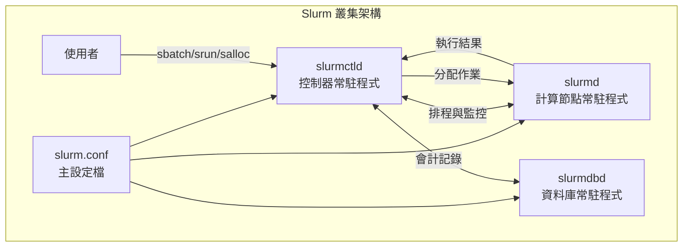
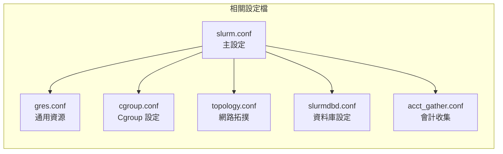
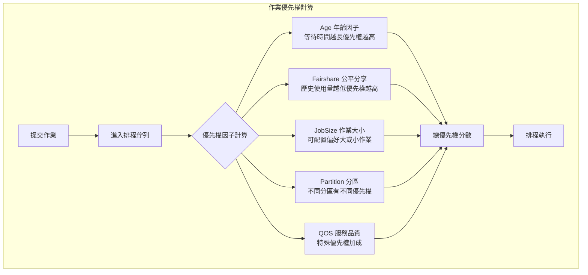
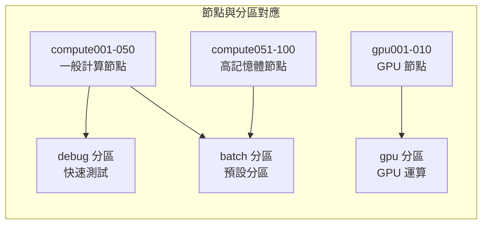

# Slurm 設定檔 (slurm.conf) 完整說明

## 概述

**slurm.conf** 是 Slurm 工作負載管理器的主要設定檔，為 ASCII 格式的文字檔案。此檔案描述了 Slurm 叢集的一般設定資訊、管理的節點、節點如何分組為分區（partitions），以及與這些分區相關的各種排程參數。

### Slurm 架構概覽



### 設定檔關係



### 重要特性

- **大小寫不敏感**：除了節點和分區名稱外，設定內容不區分大小寫
- **註解**：以 `#` 符號開頭的文字為註解
- **設定生效**：變更設定後需重啟 Slurm 常駐程式、發送 SIGHUP 信號或執行 `scontrol reconfigure`
- **檔案位置**：可透過 SLURM_CONF 環境變數設定檔案位置
- **權限要求**：必須讓所有 Slurm 使用者可讀取

### Include 功能

可使用 `Include` 指令引入其他設定檔：

```bash
Include /etc/slurm/partitions.conf
```

---

## 認證與安全設定

### AuthType
指定 Slurm 元件之間的認證方式。

| 選項 | 說明 |
|------|------|
| `auth/munge` | 使用 MUNGE 認證（預設） |
| `auth/slurm` | 使用 Slurm 內建認證 |

### AuthAltTypes
替代認證外掛程式（逗號分隔）。

| 選項 | 說明 |
|------|------|
| `auth/jwt` | JWT (JSON Web Token) 認證 |

### AuthAltParameters
替代認證外掛程式的選項：

| 參數 | 說明 |
|------|------|
| `disable_token_creation` | 禁止非 SlurmUser 帳號使用 `scontrol token` |
| `max_token_lifespan=<秒>` | Token 最大有效期限 |
| `jwks=<路徑>` | JWKS 憑證檔案路徑 |
| `jwt_key=<路徑>` | JWT HS256 金鑰檔案路徑 |

### CredType
作業步驟憑證的加密簽章工具。

| 選項 | 說明 |
|------|------|
| `cred/munge` | 使用 MUNGE（預設） |
| `cred/slurm` | 使用 Slurm 內建格式 |

---

## 會計與儲存設定

### AccountingStorageType
會計儲存機制類型。

| 選項 | 說明 |
|------|------|
| `accounting_storage/slurmdbd` | 將記錄寫入 SlurmDBD（MySQL 資料庫） |

### AccountingStorageHost
主要會計儲存資料庫的主機名稱（僅用於 SlurmDBD）。

### AccountingStorageBackupHost
備援會計儲存資料庫的主機名稱。

### AccountingStoragePort
會計儲存資料庫伺服器監聽埠號。預設值：**6819**（必須與 slurmdbd.conf 中的 DbdPort 相同）

### AccountingStoragePass
資料庫存取密碼。可指定 MUNGE 套接字路徑進行跨叢集認證（例如：`/var/run/munge/global.socket.2`）

### AccountingStorageEnforce
控制作業提交的關聯性強制執行等級。

| 選項 | 說明 |
|------|------|
| `all` | 啟用所有選項（除了 nojobs 和 nosteps） |
| `associations` | 作業必須有對應的關聯才能執行 |
| `limits` | 強制執行關聯的作業大小/執行時間限制 |
| `nojobs` | 不記錄任何作業或步驟會計 |
| `nosteps` | 不記錄步驟會計 |
| `qos` | 要求有效的 QOS 規格 |
| `safe` | 如果 TRES-minutes 限制將被超過，則阻止作業啟動 |
| `wckeys` | 要求有效的工作負載特徵化金鑰 |

### AccountingStorageTRES
逗號分隔的追蹤資源清單。預設追蹤：Billing、CPU、Energy、Memory、Node、FS/Disk、Pages、VMem。

範例：

```bash
AccountingStorageTRES=gres/gpu,gres/gpu:tesla,gres/gpu:volta,license/matlab
```

### AccountingStoreFlags
修改 slurmctld 發送到會計資料庫的欄位。

| 選項 | 說明 |
|------|------|
| `job_comment` | 包含作業註解欄位 |
| `job_env` | 包含批次作業環境變數 |
| `job_extra` | 包含作業額外欄位 |
| `job_script` | 包含批次腳本 |
| `no_stdio` | 排除 stdio 路徑 |

---

## 排程設定

### SchedulerType
作業排程演算法。

| 選項 | 說明 |
|------|------|
| `sched/backfill` | 回填排程（預設） |
| `sched/builtin` | 基本 FIFO 排程 |

### SchedulerParameters
逗號分隔的排程選項，包括：

| 參數 | 說明 |
|------|------|
| `backfill_window=<分鐘>` | 回填計算的前瞻時間 |
| `default_queue_depth=<數量>` | 每個排程週期檢查的作業數量 |
| `max_rpc_cnt=<數量>` | 限制平行排程 RPC 數量 |
| `nohold_on_prolog_fail` | prolog 失敗時不保留作業 |
| `bf_interval=<秒>` | 回填排程間隔 |
| `bf_max_job_test=<數量>` | 回填排程測試的最大作業數 |
| `bf_resolution=<秒>` | 回填排程時間解析度 |

### SelectType
資源選擇外掛程式。

| 選項 | 說明 |
|------|------|
| `select/linear` | 分配整個節點 |
| `select/cons_tres` | 分配個別 CPU/記憶體（建議用於異質系統） |

### SelectTypeParameters
選擇外掛程式行為設定。

| 選項 | 說明 |
|------|------|
| `CR_Core` | 以核心為粒度分配 |
| `CR_CPU` | 以 CPU 為粒度分配 |
| `CR_Socket` | 以插槽為粒度分配 |
| `CR_Memory` | 將記憶體視為可消耗資源 |
| `CR_Core_Memory` | 核心+記憶體為可消耗資源 |
| `CR_LLN` | 使用最低負載節點 |

---

## 優先權設定

### 優先權計算流程



### PriorityType
優先權計算方法。

| 選項 | 說明 |
|------|------|
| `priority/basic` | 簡單 FIFO 排序 |
| `priority/multifactor` | 考慮年齡、公平分享、作業大小和分區 |

### PriorityDecayHalfLife
控制過去資源使用對優先權計算的影響衰減速度。格式：`HH:MM:SS` 或 `days-HH:MM:SS`

### PriorityFavorSmall
設為 `YES` 時，較小的作業獲得較高優先權。預設：`NO`

### PriorityMaxAge
作業年齡因子達到最大值的秒數。預設：604800（7 天）

### PriorityUsageResetPeriod
公平分享使用統計重置週期。

| 選項 | 說明 |
|------|------|
| `NONE` | 不重置 |
| `NOW` | 立即重置 |
| `DAILY` | 每日重置 |
| `WEEKLY` | 每週重置 |
| `MONTHLY` | 每月重置 |

### 優先權權重參數

| 參數 | 說明 |
|------|------|
| `PriorityWeightAge` | 年齡因子權重 |
| `PriorityWeightFairshare` | 公平分享因子權重 |
| `PriorityWeightJobSize` | 作業大小因子權重 |
| `PriorityWeightPartition` | 分區因子權重 |
| `PriorityWeightQOS` | QOS 因子權重 |

---

## 搶佔設定

### PreemptType
作業搶佔機制。

| 選項 | 說明 |
|------|------|
| `preempt/none` | 停用搶佔（預設） |
| `preempt/partition_prio` | 允許較高優先權分區作業搶佔較低優先權作業 |
| `preempt/qos` | 啟用基於 QOS 的搶佔 |

### PreemptMode
搶佔或幫派排程的機制。

| 選項 | 說明 |
|------|------|
| `OFF` | 停用搶佔和幫派排程（預設） |
| `CANCEL` | 終止被搶佔的作業 |
| `GANG` | 啟用時間分片 |
| `REQUEUE` | 重新排隊被搶佔的作業 |
| `SUSPEND` | 暫停被搶佔的作業 |

### PreemptExemptTime
作業啟動後多少分鐘才能被搶佔。預設：0（立即可搶佔）。最大值：65533 分鐘

---

## 作業控制設定

### MaxJobCount
slurmctld 記憶體中的最大並行作業數。預設：10000

### MaxJobId
最大可用的本地作業 ID。預設：67,043,328。達到後會回繞到 FirstJobId

### FirstJobId
初始作業 ID 分配。預設：1

### MinJobAge
完成的作業在記憶體中保留的最短秒數。預設：300

### JobRequeue
預設的批次作業重新排隊行為。1=啟用（預設），0=停用

### KillWait
時間限制到達後，SIGTERM 和 SIGKILL 之間的間隔（秒）。預設：30

### KillOnBadExit
當任務崩潰/中止時立即終止步驟。1=啟用，0=停用（預設）

### BatchStartTimeout
批次作業啟動前終止的最大秒數。預設：10

### CompleteWait
作業 COMPLETING 時等待多少秒後再排程其他作業。預設：0

### InactiveLimit
無回應的作業分配命令（srun、salloc）終止作業前的秒數。預設：unlimited (0)

---

## 記憶體設定

### DefMemPerCPU
每個分配 CPU 的預設記憶體（MB）。預設：0（無限制）

### DefMemPerNode
每個分配節點的預設記憶體（MB）。預設：0（無限制）

### DefMemPerGPU
每個分配 GPU 的預設記憶體（MB）。預設：0（無限制）

### MaxMemPerCPU
每個 CPU 的最大記憶體（MB）。預設：0（無限制）

### MaxMemPerNode
每個節點的最大記憶體（MB）。預設：0（無限制）

> **注意**：DefMemPerCPU、DefMemPerNode 和 DefMemPerGPU 互斥；MaxMemPerCPU 和 MaxMemPerNode 也互斥

---

## 資源管理

### GresTypes
逗號分隔的通用資源清單（例如：`gpu,mps`）。必須在所有叢集節點間保持一致

### DefCpuPerGPU
每個分配 GPU 的預設 CPU 數量

### GpuFreqDef
預設 GPU 頻率。格式：`[<type>=]<value>[,<type>=<value>]`

---

## Prolog 與 Epilog

### Prolog
每個節點上作業開始時以 root 身分執行的腳本路徑。支援 glob 模式

```bash
Prolog=/etc/slurm/prolog.d/*
```

### PrologSlurmctld
作業分配啟動時由 slurmctld 執行的程式完整路徑。以 SlurmUser 身分執行

### Epilog
每個節點上作業完成時以 root 身分執行的腳本路徑

### EpilogSlurmctld
作業分配終止時由 slurmctld 執行的程式完整路徑

### PrologFlags
Prolog 行為控制：

| 選項 | 說明 |
|------|------|
| `Alloc` | 在作業分配時執行 |
| `Contain` | 啟用作業隔離/命名空間 |
| `NoHold` | prolog 失敗時不保留作業 |
| `Serial` | 依序執行 prolog（非平行） |

### PrologEpilogTimeout / EpilogTimeout
終止 Epilog/EpilogSlurmctld/SPANK epilog 前的間隔（秒）

---

## 控制器設定

### SlurmctldHost
執行 slurmctld 的主要叢集控制器主機名稱

範例（高可用性配置）：

```bash
SlurmctldHost=controller1(10.0.0.1)
SlurmctldHost=controller2(10.0.0.2)
```

### SlurmctldPort
Slurm 控制器監聽埠號。預設：6817

### SlurmdPort
slurmd 常駐程式監聽埠號。預設：6818

### SlurmUser
slurmctld 常駐程式執行的使用者名稱。預設：`slurm`。不應為 root

### SlurmdUser
slurmd 常駐程式執行的使用者名稱。通常與 SlurmUser 相同

### StateSaveLocation
slurmctld 狀態儲存目錄。必須可由 SlurmUser 寫入

---

## 記錄設定

### SlurmctldDebug / SlurmdDebug
記錄詳細程度等級。

| 等級 | 說明 |
|------|------|
| `quiet` | 僅記錄致命錯誤 |
| `fatal` | 記錄致命錯誤 |
| `error` | 記錄錯誤 |
| `info` | 記錄資訊訊息 |
| `verbose` | 記錄詳細訊息 |
| `debug` | 記錄除錯訊息 |
| `debug2` | 更詳細的除錯 |
| `debug3` | 最詳細的除錯 |

### DebugFlags
詳細事件記錄子系統（逗號分隔）。範例：

```bash
DebugFlags=Backfill,Gres,Priority,Steps
```

可用選項包括：Accrue、Agent、Backfill、Cgroup、Energy、Federation、Gres、License、Network、Priority、Reservation、Steps、TLS、TraceJobs 等

### LogTimeFormat
時間戳記格式。

| 選項 | 說明 |
|------|------|
| `iso8601` | ISO 8601 格式 |
| `iso8601_ms` | ISO 8601 格式含毫秒（預設） |
| `rfc5424` | RFC 5424 格式 |
| `rfc5424_ms` | RFC 5424 格式含毫秒 |
| `clock` | Unix 時間戳記 |
| `short` | 簡短格式 |

---

## 通訊設定

### CommunicationParameters
通訊選項（逗號分隔）：

| 參數 | 說明 |
|------|------|
| `block_null_hash` | 要求更新的認證 Token |
| `DisableIPv4` | 停用僅 IPv4 操作 |
| `EnableIPv6` | 啟用 IPv6 定址 |
| `keepaliveinterval=#` | 閒置連線探測間隔 |
| `keepaliveprobes=#` | 斷線前的未確認探測數 |
| `keepalivetime=#` | 開始 keepalive 探測前的延遲 |
| `NoCtldInAddrAny` | slurmctld 直接綁定而非綁定到任何位址 |

### MessageTimeout
往返通訊逾時（秒）。預設：10

### TreeWidth
訊息可扇出的節點數量。預設：50。對大型叢集有用

---

## 健康檢查

### HealthCheckInterval
HealthCheckProgram 執行間隔（秒）。預設：0（停用）

### HealthCheckProgram
以 root 身分執行的節點健康檢查腳本路徑

### HealthCheckNodeState
執行 HealthCheckProgram 的節點狀態。

| 選項 | 說明 |
|------|------|
| `ALLOC` | 已分配的節點 |
| `ANY` | 任何節點（預設） |
| `CYCLE` | 循環檢查 |
| `IDLE` | 閒置節點 |
| `MIXED` | 混合狀態節點 |

---

## 作業完成記錄

### JobCompType
作業完成記錄機制。

| 選項 | 說明 |
|------|------|
| `jobcomp/elasticsearch` | Elasticsearch 伺服器 |
| `jobcomp/filetxt` | 文字檔案 |
| `jobcomp/kafka` | Kafka 訊息佇列 |
| `jobcomp/lua` | Lua 腳本 |
| `jobcomp/mysql` | MySQL/MariaDB 資料庫 |
| `jobcomp/script` | 外部腳本 |

### JobCompLoc
根據 JobCompType 的資料庫/輸出位置：
- elasticsearch：`<host>:<port>/<index>/_doc`
- filetxt：絕對檔案路徑（預設：`/var/log/slurm_jobcomp.log`）
- mysql：資料庫名稱（預設：`slurm_jobcomp_db`）

---

## 作業會計收集

### JobAcctGatherType
作業會計收集機制。

| 選項 | 說明 |
|------|------|
| `jobacct_gather/cgroup` | 基於 Cgroup 的 CPU/記憶體統計（建議） |
| `jobacct_gather/linux` | 基於 procfs 的收集 |

### JobAcctGatherFrequency
取樣間隔。格式：`<datatype>=<interval>`

| 資料類型 | 預設值 | 說明 |
|----------|--------|------|
| `task` | 30 | 任務資料取樣 |
| `energy` | 0 | 能源資料取樣 |
| `network` | 0 | 網路資料取樣 |
| `filesystem` | 0 | 檔案系統資料取樣 |

### JobAcctGatherParams
作業會計外掛程式選項：

| 選項 | 說明 |
|------|------|
| `DisableGPUAcct` | 跳過 GPU 會計 |
| `UsePss` | 使用 PSS 而非 RSS |
| `NoShared` | 從 RSS 排除共享記憶體 |

---

## 能源會計

### AcctGatherEnergyType
能源消耗會計外掛程式。

| 選項 | 說明 |
|------|------|
| `acct_gather_energy/gpu` | GPU 管理函式庫資料 |
| `acct_gather_energy/ipmi` | BMC/IPMI 資料 |
| `acct_gather_energy/pm_counters` | HPE Cray BMC |
| `acct_gather_energy/rapl` | 硬體 RAPL 感測器 |
| `acct_gather_energy/xcc` | Lenovo XCC/IPMI |

### AcctGatherNodeFreq
節點會計取樣間隔（秒）。預設：0（停用）

---

## 網路互連會計

### AcctGatherInterconnectType
網路流量會計外掛程式。

| 選項 | 說明 |
|------|------|
| `acct_gather_interconnect/ofed` | Infiniband OFED 函式庫 |
| `acct_gather_interconnect/sysfs` | Linux sysfs 統計 |

---

## 檔案系統會計

### AcctGatherFilesystemType
檔案系統流量會計外掛程式。

| 選項 | 說明 |
|------|------|
| `acct_gather_filesystem/lustre` | Lustre 計數器資料 |

---

## Burst Buffer

### BurstBufferType
Burst buffer 管理外掛程式。

| 選項 | 說明 |
|------|------|
| `burst_buffer/datawarp` | Cray DataWarp API |
| `burst_buffer/lua` | 自訂 Lua 腳本掛鉤 |

---

## 任務外掛程式

### TaskPlugin
任務啟動和隔離控制。

| 選項 | 說明 |
|------|------|
| `task/cgroup` | 透過 cgroups 強制執行記憶體/CPU 限制（建議） |
| `task/none` | 基本程序生成，無隔離 |
| `task/affinity` | CPU 親和性支援 |

可堆疊多個選項：`TaskPlugin=affinity,cgroup`

---

## 電源管理

### ResumeProgram
恢復暫停作業時由 slurmctld 執行的程式完整路徑

### ResumeTimeout
等待 ResumeProgram 完成的間隔（秒）。預設：300

### SuspendTime
節點閒置多少秒後進入省電模式

### SuspendProgram
暫停節點時執行的程式

### SuspendTimeout
等待 SuspendProgram 完成的間隔（秒）

---

## MPI 設定

### MpiDefault
預設 MPI 類型。

| 選項 | 說明 |
|------|------|
| `pmi2` | PMI2 介面 |
| `pmix` | PMIx 介面 |

### MpiParams
MPI 相關選項：

| 參數 | 說明 |
|------|------|
| `ports=#-#` | Cray PMI 通訊埠範圍 |
| `disable_slurm_hydra_bootstrap` | 停用 Hydra 引導環境變數注入 |

---

## 雜項設定

### ClusterName
叢集在會計資料庫中的識別符。大寫字母轉換為小寫。最長 40 字元

### TmpFS
使用者作業暫存檔案的暫時檔案系統

### DisableRootJobs
設為 `YES` 時防止 root 使用者執行作業。預設：`NO`

### MaxTasksPerNode
每個節點步驟中的最大任務數。預設：512

### MaxStepCount
最大作業步驟數限制。預設：40000

### OverTimeLimit
作業可超過時間限制的分鐘數。預設：0

---

## 節點設定 (NODE CONFIGURATION)

節點設定定義了 Slurm 管理的計算節點。設定檔中的 `NodeName` 參數是必要的，其他節點設定資訊都是可選的。

### 節點與分區關係圖



### 設定語法

```bash
NodeName=node[001-100] CPUs=32 Sockets=2 CoresPerSocket=8 ThreadsPerCore=2 RealMemory=128000 Gres=gpu:4 State=UNKNOWN
```

### 節點範圍表示法

節點名稱支援範圍表示法：
- `node[001-100]` - 連續範圍
- `node[001,003,005-010]` - 混合範圍
- `rack[0-3]_blade[0-15]` - 多層範圍

### 節點參數

#### NodeName
Slurm 用於識別節點的名稱。通常是 `/bin/hostname -s` 回傳的結果

#### NodeHostname
節點的主機名稱。用於建立通訊路徑。預設與 NodeName 相同

#### NodeAddr
用於建立通訊路徑的名稱或 IP 位址。預設與 NodeHostname 相同

#### BcastAddr
sbcast 網路流量的替代網路路徑

#### CPUs
節點上的邏輯處理器數量。如未指定，預設為 Boards × Sockets × CoresPerSocket × ThreadsPerCore

#### Sockets
節點上的 CPU 插槽數量

#### CoresPerSocket
每個實體處理器插槽的核心數。預設：1

#### ThreadsPerCore
每個核心的執行緒數（用於超執行緒）。預設：1

#### Boards
具有基板控制器的節點中的基板數量。預設：1

#### RealMemory
節點上可用的實體記憶體（MB）

#### MemSpecLimit
為系統保留且不可用於使用者分配的 RealMemory 量（MB）

#### TmpDisk
暫存磁碟空間（MB）

#### Gres
通用資源規格。格式：`<name>[:<type>][:no_consume]:<number>[K|M|G]`

範例：

```bash
Gres=gpu:tesla:2,gpu:kepler:2,bandwidth:lustre:no_consume:4G
```

#### Features
與節點相關的任意特徵字串（逗號分隔），用於透過 `--constraint` 過濾節點

範例：

```bash
Features=intel,avx2,ib
```

#### Weight
排程優先權權重。較低的值優先被選擇。預設：1

#### State
節點初始狀態。

| 狀態 | 說明 |
|------|------|
| `UNKNOWN` | 節點狀態未知（預設） |
| `DOWN` | 節點不可用 |
| `DRAIN` | 節點正在排空，不接受新作業 |
| `IDLE` | 節點閒置 |
| `FUTURE` | 節點將來可用 |

#### Port
slurmd 在此節點上監聽的埠號。預設使用全域 SlurmdPort

#### CoreSpecCount
為系統保留的核心數。與 CpuSpecList 互斥

#### CpuSpecList
為系統保留的 Slurm 抽象 CPU ID 清單（逗號分隔）

#### CpuBind
CPU 綁定選項。

| 選項 | 說明 |
|------|------|
| `none` | 無綁定 |
| `socket` | 綁定到插槽 |
| `ldom` | 綁定到 NUMA 網域 |
| `core` | 綁定到核心 |
| `thread` | 綁定到執行緒 |

### 預設值設定

可使用 `NodeName=DEFAULT` 設定後續節點的預設值：

```bash
NodeName=DEFAULT CPUs=32 RealMemory=64000 State=UNKNOWN
NodeName=node[001-050]
NodeName=node[051-100] RealMemory=128000
```

---

## DOWN 節點設定 (DOWN NODE CONFIGURATION)

使用 `DownNodes` 記錄暫時處於 DOWN、DRAIN 或 FAILING 狀態的節點，而不改變永久設定。

```bash
DownNodes=node[001-003] State=DOWN Reason="Hardware maintenance"
```

---

## 分區設定 (PARTITION CONFIGURATION)

分區設定允許為不同的節點群組建立不同的作業限制或存取控制。節點可屬於多個分區。

### 設定語法

```bash
PartitionName=batch Nodes=node[001-100] Default=YES MaxTime=1-00:00:00 State=UP
```

### 分區參數

#### PartitionName
分區名稱。使用者提交作業時可指定此名稱

#### Default
設為 `YES` 時，未指定分區的作業將使用此分區。預設：`NO`

#### Nodes
與此分區關聯的節點清單（逗號分隔）。支援範圍表示法。`ALL` 表示所有節點

#### State
分區狀態。

| 狀態 | 說明 |
|------|------|
| `UP` | 分區可用（預設） |
| `DOWN` | 分區不可用 |
| `DRAIN` | 分區正在排空 |
| `INACTIVE` | 分區非活動 |

#### Hidden
分區是否預設隱藏。`YES` 或 `NO`。預設：`NO`

#### MaxTime
最大執行時間限制。格式：`minutes`、`minutes:seconds`、`hours:minutes:seconds`、`days-hours`、`days-hours:minutes:seconds` 或 `UNLIMITED`

#### DefaultTime
未指定時間限制的作業使用的執行時間。如未設定則使用 MaxTime

#### MaxNodes
可分配給單一作業的最大節點數。預設：`UNLIMITED`

#### MinNodes
可分配給單一作業的最小節點數。預設：0

#### AllowGroups
可在此分區執行作業的群組名稱清單（逗號分隔）。預設：所有群組

#### AllowAccounts
可在此分區執行作業的帳號清單。預設：`ALL`。具階層性（包含子帳號）

#### DenyAccounts
不可在此分區執行作業的帳號清單。與 AllowAccounts 互斥

#### AllowQos
可在此分區執行作業的 QOS 清單。預設：`ALL`

#### DenyQos
不可在此分區執行作業的 QOS 清單。與 AllowQos 互斥

#### AllocNodes
可從哪些節點提交作業到此分區。預設：`ALL`

#### OverSubscribe
控制分區是否可在每個資源上執行多個作業。

| 選項 | 說明 |
|------|------|
| `NO` | 資源分配給單一作業（預設） |
| `YES` | 允許使用者請求資源共享 |
| `FORCE` | 強制資源共享 |
| `EXCLUSIVE` | 即使使用 select/cons_tres 也分配整個節點 |

#### PriorityTier
分區優先權層級。較高值的分區可搶佔較低值分區的作業

#### PriorityJobFactor
分區作業優先權因子。預設：1

#### PreemptMode
此分區的搶佔模式。覆蓋全域 PreemptMode

#### GraceTime
被選中搶佔的作業的寬限時間（秒）。預設：0

#### DisableRootJobs
設為 `YES` 時防止 root 在此分區執行作業

#### ExclusiveUser
設為 `YES` 時，節點專屬分配給使用者

#### LLN
排程資源到最低負載節點（基於閒置 CPU 數量）

#### MaxCPUsPerNode
此分區中每個節點可用的最大 CPU 數

#### MaxMemPerCPU / MaxMemPerNode
此分區的最大記憶體限制（MB）

#### DefMemPerCPU / DefMemPerGPU / DefMemPerNode
此分區的預設記憶體設定（MB）

#### DefCpuPerGPU
每個分配 GPU 的預設 CPU 數量

#### OverTimeLimit
作業可超過時間限制的分鐘數

#### PowerDownOnIdle
設為 `YES` 時，分區節點在閒置後請求關機

#### ResumeTimeout
此分區的節點恢復逾時（秒）

#### SuspendTime
此分區的節點閒置多少秒後進入省電模式。0 表示立即，-1 表示永不

#### SuspendTimeout
此分區的節點暫停逾時（秒）

#### Alternate
當此分區狀態為 DRAIN 或 INACTIVE 時使用的替代分區名稱

#### CpuBind
分區層級的 CPU 綁定設定

### 預設值設定

可使用 `PartitionName=DEFAULT` 設定後續分區的預設值：

```bash
PartitionName=DEFAULT MaxTime=1-00:00:00 State=UP
PartitionName=batch Nodes=node[001-100] Default=YES
PartitionName=gpu Nodes=node[101-110] Gres=gpu:4
```

---

## 範例設定檔

以下是一個完整的 slurm.conf 範例：

```bash
# slurm.conf - Slurm 設定檔範例

#
# 叢集基本設定
#
ClusterName=mycluster
SlurmctldHost=controller1(10.0.0.1)
SlurmctldHost=controller2(10.0.0.2)

#
# 認證設定
#
AuthType=auth/munge
CredType=cred/munge

#
# 常駐程式設定
#
SlurmUser=slurm
SlurmdUser=root
SlurmctldPort=6817
SlurmdPort=6818
StateSaveLocation=/var/spool/slurmctld
SlurmdSpoolDir=/var/spool/slurmd

#
# 記錄設定
#
SlurmctldLogFile=/var/log/slurm/slurmctld.log
SlurmdLogFile=/var/log/slurm/slurmd.log
SlurmctldDebug=info
SlurmdDebug=info

#
# 排程設定
#
SchedulerType=sched/backfill
SelectType=select/cons_tres
SelectTypeParameters=CR_Core_Memory

#
# 優先權設定
#
PriorityType=priority/multifactor
PriorityDecayHalfLife=7-0
PriorityMaxAge=7-0
PriorityWeightAge=1000
PriorityWeightFairshare=10000
PriorityWeightJobSize=500
PriorityWeightPartition=1000

#
# 會計設定
#
AccountingStorageType=accounting_storage/slurmdbd
AccountingStorageHost=slurmdbd-host
AccountingStoragePort=6819
AccountingStorageEnforce=associations,limits,qos

#
# 作業會計
#
JobAcctGatherType=jobacct_gather/cgroup
JobAcctGatherFrequency=30

#
# 任務外掛程式
#
TaskPlugin=task/affinity,task/cgroup
ProctrackType=proctrack/cgroup

#
# Prolog 和 Epilog
#
Prolog=/etc/slurm/prolog.sh
Epilog=/etc/slurm/epilog.sh

#
# 作業控制
#
MaxJobCount=50000
MaxArraySize=1001
MaxStepCount=40000
KillWait=30
MinJobAge=300
JobRequeue=1

#
# 通用資源
#
GresTypes=gpu

#
# 節點設定
#
NodeName=DEFAULT CPUs=32 Sockets=2 CoresPerSocket=8 ThreadsPerCore=2 RealMemory=128000 State=UNKNOWN
NodeName=compute[001-100]
NodeName=gpu[001-010] Gres=gpu:nvidia:4 RealMemory=256000

#
# 分區設定
#
PartitionName=DEFAULT MaxTime=1-00:00:00 State=UP
PartitionName=batch Nodes=compute[001-100] Default=YES
PartitionName=gpu Nodes=gpu[001-010] MaxTime=7-00:00:00
PartitionName=debug Nodes=compute[001-010] MaxTime=1:00:00 Priority=100
```

---

## 相關文件

- `slurmdbd.conf(5)` - SlurmDBD 設定
- `cgroup.conf(5)` - Cgroup 設定
- `gres.conf(5)` - 通用資源設定
- `topology.conf(5)` - 網路拓撲設定
- `acct_gather.conf(5)` - 會計收集設定

---

## 參考資料

- 官方文件：[Slurm slurm.conf 參考手冊](https://slurm.schedmd.com/slurm.conf.html)
- man page：`man slurm.conf`

---

*文件版本：基於 Slurm 26.05*
*最後更新：2025 年*
