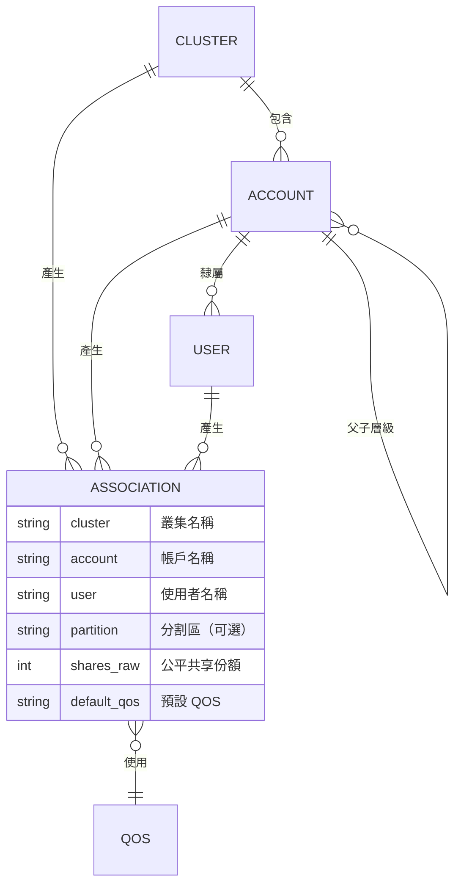
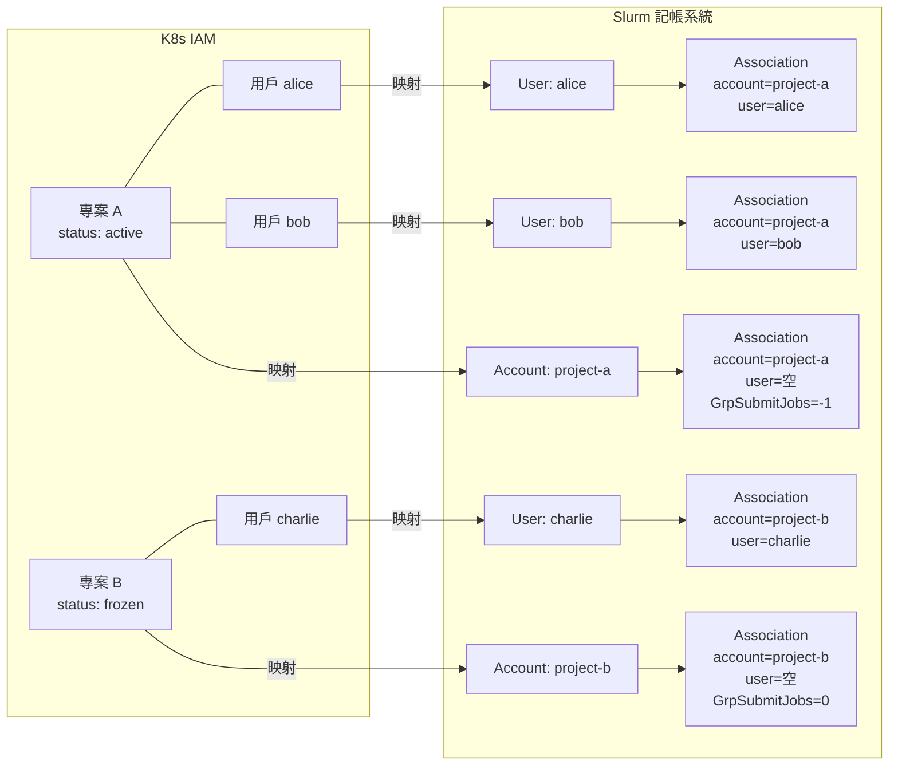
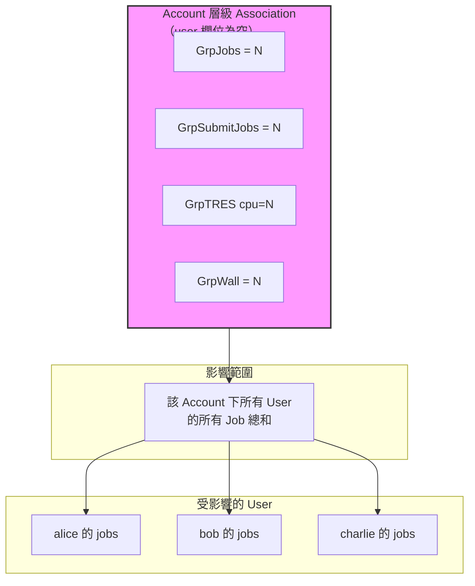
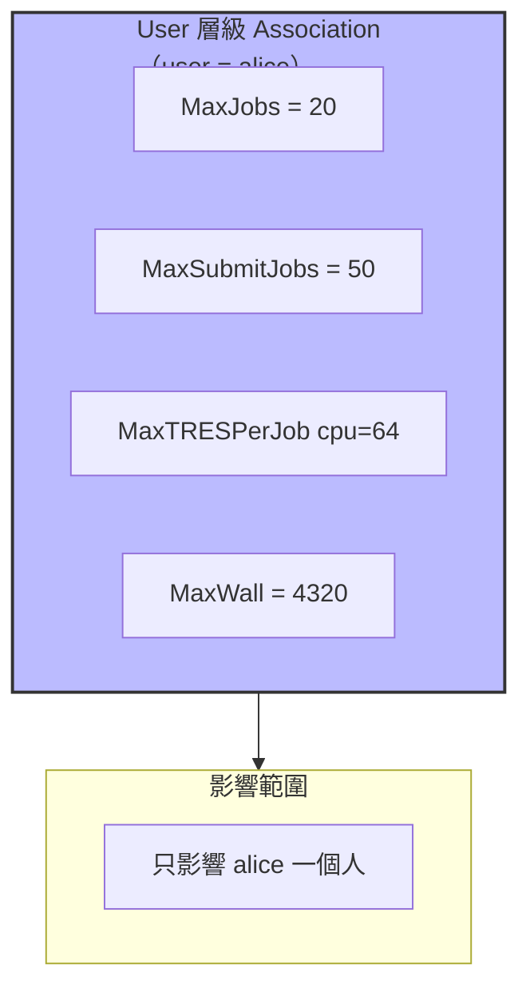
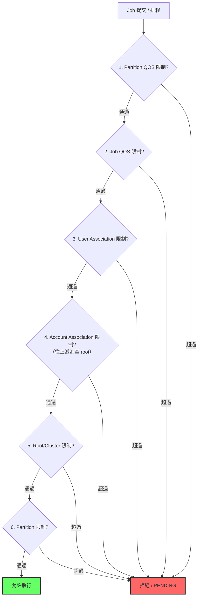
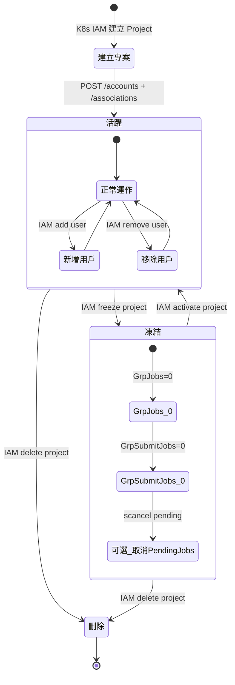
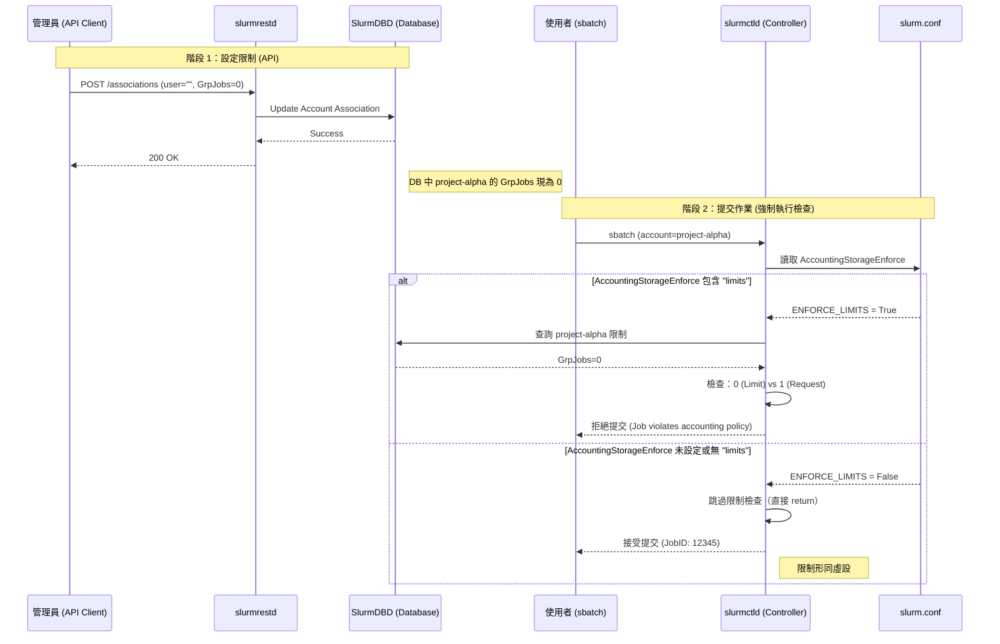
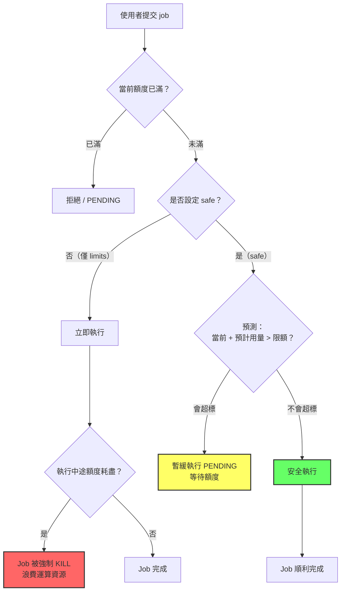

# K8s IAM 與 Slurm Account/User/Association REST API 完整對應指南

本文件深入解析 Slurm 記帳系統中三個核心實體——**Account**、**User**、**Association**——的資料模型、REST API 端點、所有可配置參數及其效果。目標場景為：將 Kubernetes IAM 中的**專案**映射到 Slurm **Account**，**帳號**映射到 Slurm **User**，並透過 **Association** 層級的資源限制實現專案凍結（freeze）與解凍（activate）。

---

## 目錄

1. [核心概念：三者的關係](#核心概念三者的關係)
2. [資料模型總覽](#資料模型總覽)
3. [Account API 完整參考](#account-api-完整參考)
4. [User API 完整參考](#user-api-完整參考)
5. [Association API 完整參考](#association-api-完整參考)
6. [Association 限制參數深入解析](#association-限制參數深入解析)
7. [限制的層級繼承機制](#限制的層級繼承機制)
8. [實戰：K8s IAM 映射與凍結控制](#實戰k8s-iam-映射與凍結控制)
9. [查詢與驗證](#查詢與驗證)
10. [強制執行機制：AccountingStorageEnforce 深入解析](#強制執行機制accountingstorageenforce-深入解析)
11. [前提配置與注意事項](#前提配置與注意事項)

---

## 核心概念：三者的關係

### 實體關係圖



### 關鍵觀念

**Association 是 Slurm 記帳系統的核心**。它不是獨立存在的實體，而是由以下四個維度的組合所唯一定義的一筆記錄：

```text
Association = Cluster + Account + User + Partition
```

每一個維度都可以為空，形成不同層級的 association：

| Cluster | Account | User | Partition | 意義 |
|---------|---------|------|-----------|------|
| mycluster | - | - | - | 叢集層級（root association） |
| mycluster | project-alpha | - | - | **Account 層級**（專案配額） |
| mycluster | project-alpha | alice | - | User 層級（個人配額） |
| mycluster | project-alpha | alice | gpu | User + Partition 層級（精細控制） |

### K8s IAM 到 Slurm 的映射



**重點**：所有的資源限制都掛在 **Association** 上，而不是直接掛在 Account 或 User 上。Account 和 User 本身只是識別實體，不帶有資源限制欄位。

---

## 資料模型總覽

### 三者的可設欄位比較

| 面向 | Account | User | Association |
|------|---------|------|-------------|
| 識別資訊 | name, description, organization | name, administrator_level | cluster, account, user, partition |
| 管理角色 | coordinators | coordinators | - |
| 資源限制 | **無** | **無** | **所有限制都在這裡** |
| QOS 設定 | **無** | default.qos | default.qos, qos (可用清單) |
| 公平共享 | **無** | **無** | shares_raw, priority |

### REST API 版本

本文件使用 API 版本 `v0.0.44`。所有端點路徑格式為：

```text
/slurmdb/v0.0.44/{resource}
```

認證方式使用 JWT Token：

```bash
# 取得 JWT
export SLURM_JWT=$(scontrol token lifespan=3600 | cut -d= -f2)

# 所有請求攜帶兩個標頭
-H "X-SLURM-USER-NAME: slurmadmin"
-H "X-SLURM-USER-TOKEN: ${SLURM_JWT}"
```

---

## Account API 完整參考

Account 對應 K8s IAM 中的**專案（Project）**。它是一個組織實體，用於將使用者分組並建立層級結構。

### 端點一覽

| 方法 | 路徑 | 用途 |
|------|------|------|
| `GET` | `/slurmdb/v0.0.44/accounts/` | 列出所有 account |
| `GET` | `/slurmdb/v0.0.44/account/{account_name}` | 取得單一 account |
| `POST` | `/slurmdb/v0.0.44/accounts/` | 新增或更新 account |
| `POST` | `/slurmdb/v0.0.44/accounts_association/` | 新增 account 並同時建立 association |
| `DELETE` | `/slurmdb/v0.0.44/account/{account_name}` | 刪除 account |

### Account Payload 結構

```json
{
  "accounts": [
    {
      "name": "project-alpha",
      "description": "K8s IAM 專案 Alpha",
      "organization": "engineering",
      "coordinators": [
        {
          "name": "admin-user",
          "direct": true
        }
      ]
    }
  ]
}
```

### 所有可設參數

| 欄位 | 型別 | 必填 | 說明 |
|------|------|------|------|
| `name` | string | 是 | Account 名稱，對應 K8s project 名稱。命名建議使用小寫加連字號 |
| `description` | string | 是 | 任意描述文字 |
| `organization` | string | 是 | 組織名稱，用於分類報表 |
| `coordinators` | array | 否 | 管理員列表。Coordinator 可管理該 account 下的 user 和子 account |
| `coordinators[].name` | string | 是 | Coordinator 的使用者名稱 |
| `coordinators[].direct` | boolean | 否 | 是否為直接指派（非繼承） |

### GET 查詢參數

| 參數 | 說明 |
|------|------|
| `description` | 以逗號分隔的描述過濾清單 |
| `with_assocs` | 查詢結果包含 association |
| `with_coords` | 查詢結果包含 coordinator |
| `with_deleted` | 包含已刪除的 account |

### 範例：批量建立 Account

```bash
curl -X POST "${SLURMRESTD}/slurmdb/v0.0.44/accounts/" \
  -H "X-SLURM-USER-NAME: slurmadmin" \
  -H "X-SLURM-USER-TOKEN: ${SLURM_JWT}" \
  -H "Content-Type: application/json" \
  -d '{
    "accounts": [
      {
        "name": "project-alpha",
        "description": "AI 研發團隊",
        "organization": "engineering"
      },
      {
        "name": "project-beta",
        "description": "資料分析團隊",
        "organization": "data-science"
      },
      {
        "name": "project-gamma",
        "description": "基礎建設團隊",
        "organization": "infrastructure"
      }
    ]
  }'
```

### 範例：建立層級 Account（子帳戶）

```bash
# 先建立父帳戶
curl -X POST "${SLURMRESTD}/slurmdb/v0.0.44/accounts/" \
  -H "X-SLURM-USER-NAME: slurmadmin" \
  -H "X-SLURM-USER-TOKEN: ${SLURM_JWT}" \
  -H "Content-Type: application/json" \
  -d '{
    "accounts": [
      {
        "name": "dept-engineering",
        "description": "工程部門",
        "organization": "company"
      }
    ]
  }'

# 再建立子帳戶（透過 association 指定 parent）
curl -X POST "${SLURMRESTD}/slurmdb/v0.0.44/associations/" \
  -H "X-SLURM-USER-NAME: slurmadmin" \
  -H "X-SLURM-USER-TOKEN: ${SLURM_JWT}" \
  -H "Content-Type: application/json" \
  -d '{
    "associations": [
      {
        "account": "project-alpha",
        "cluster": "mycluster",
        "parent_account": "dept-engineering"
      }
    ]
  }'
```

Account 層級結構：

```text
root
 └── dept-engineering          ← 部門
      ├── project-alpha        ← K8s 專案 A
      └── project-beta         ← K8s 專案 B
```

---

## User API 完整參考

User 對應 K8s IAM 中的**帳號**。User 名稱必須對應 Linux 系統上存在的使用者帳號。

### 端點一覽

| 方法 | 路徑 | 用途 |
|------|------|------|
| `GET` | `/slurmdb/v0.0.44/users/` | 列出所有 user |
| `GET` | `/slurmdb/v0.0.44/user/{name}` | 取得單一 user |
| `POST` | `/slurmdb/v0.0.44/users/` | 新增或更新 user |
| `POST` | `/slurmdb/v0.0.44/users_association/` | 新增 user 並同時建立 association |
| `DELETE` | `/slurmdb/v0.0.44/user/{name}` | 刪除 user |

### User Payload 結構

```json
{
  "users": [
    {
      "name": "alice",
      "administrator_level": ["None"],
      "default": {
        "account": "project-alpha",
        "wckey": "default"
      }
    }
  ]
}
```

### 所有可設參數

| 欄位 | 型別 | 必填 | 說明 |
|------|------|------|------|
| `name` | string | 是 | 使用者名稱，必須對應 Linux 系統帳號 |
| `old_name` | string | 否 | 改名時的舊名稱 |
| `administrator_level` | enum | 否 | 管理層級 |
| `default.account` | string | 否 | 預設 account（提交 job 時未指定 account 則使用此值） |
| `default.wckey` | string | 否 | 預設 WCKey（工作負載特性鍵） |
| `coordinators` | array | 否 | 此 user 擔任 coordinator 的 account 清單 |
| `wckeys` | array | 否 | 可用的 WCKey 清單 |

### administrator_level 說明

| 值 | 權限說明 |
|----|---------|
| `None` | 一般使用者，只能管理自己的 job |
| `Operator` | 操作員，可管理所有 job 和 user，但不能修改記帳配置 |
| `Administrator` | 管理員，擁有完整的 sacctmgr 權限 |

### GET 查詢參數

| 參數 | 說明 |
|------|------|
| `admin_level` | 依管理層級過濾 |
| `default_account` | 依預設 account 過濾 |
| `with_assocs` | 包含 association |
| `with_coords` | 包含 coordinator 資訊 |
| `with_deleted` | 包含已刪除 |
| `with_wckeys` | 包含 WCKey |

### 範例：建立 User 並同時建立 Association

`users_association` 端點是批量作業時的最佳選擇，因為它一次完成 user 建立與 association 綁定：

```bash
curl -X POST "${SLURMRESTD}/slurmdb/v0.0.44/users_association/" \
  -H "X-SLURM-USER-NAME: slurmadmin" \
  -H "X-SLURM-USER-TOKEN: ${SLURM_JWT}" \
  -H "Content-Type: application/json" \
  -d '{
    "user": {
      "name": "alice",
      "administrator_level": ["None"],
      "default": {
        "account": "project-alpha"
      }
    },
    "association_condition": {
      "accounts": ["project-alpha", "project-beta"],
      "clusters": ["mycluster"]
    }
  }'
```

這一筆呼叫同時完成：

1. 建立 user `alice`
2. 建立 association `(mycluster, project-alpha, alice)`
3. 建立 association `(mycluster, project-beta, alice)`

---

## Association API 完整參考

Association 是**所有資源限制的承載實體**。理解 Association API 是實現 K8s IAM 凍結/解凍的核心。

### 端點一覽

| 方法 | 路徑 | 用途 |
|------|------|------|
| `GET` | `/slurmdb/v0.0.44/associations/` | 列出 association（支援過濾） |
| `GET` | `/slurmdb/v0.0.44/association/` | 取得單一 association（查詢需唯一） |
| `POST` | `/slurmdb/v0.0.44/associations/` | 新增或更新 association |
| `DELETE` | `/slurmdb/v0.0.44/association/` | 刪除單一 association |
| `DELETE` | `/slurmdb/v0.0.44/associations/` | 批量刪除 association |

### GET 查詢參數

| 參數 | 說明 |
|------|------|
| `account` | 以逗號分隔的 account 名稱過濾 |
| `cluster` | 以逗號分隔的 cluster 名稱過濾 |
| `user` | 以逗號分隔的 user 名稱過濾 |
| `partition` | 以逗號分隔的 partition 名稱過濾 |
| `id` | 以逗號分隔的 association ID 過濾 |
| `parent_account` | 依父帳戶過濾 |
| `with_deleted` | 包含已刪除 |
| `with_usage` | 包含使用量統計 |
| `only_defaults` | 只顯示預設 association |
| `without_parent_limits` | 排除繼承的父層限制 |

### 完整 Payload 結構

以下是 association 的完整 JSON 結構，包含所有可設定欄位：

```json
{
  "associations": [
    {
      "account": "project-alpha",
      "user": "alice",
      "cluster": "mycluster",
      "partition": "",
      "parent_account": "root",

      "comment": "由 K8s IAM 同步建立",
      "is_default": true,
      "shares_raw": 100,
      "priority": 0,

      "default": {
        "qos": "normal"
      },
      "qos": ["normal", "high", "low"],

      "max": {
        "jobs": {
          "per": {
            "count": 100,
            "accruing": 50,
            "submitted": 200,
            "wall_clock": 4320
          },
          "active": 20,
          "accruing": 10,
          "total": 50
        },
        "tres": {
          "total": [
            { "type": "cpu", "count": 500 },
            { "type": "mem", "count": 2048000 },
            { "type": "gres", "name": "gpu", "count": 8 }
          ],
          "group": {
            "minutes": [
              { "type": "cpu", "count": 100000 }
            ],
            "active": [
              { "type": "cpu", "count": 50000 }
            ]
          },
          "minutes": {
            "per": {
              "job": [
                { "type": "cpu", "count": 10000 }
              ]
            }
          },
          "per": {
            "job": [
              { "type": "cpu", "count": 64 },
              { "type": "mem", "count": 256000 },
              { "type": "gres", "name": "gpu", "count": 4 }
            ],
            "node": [
              { "type": "cpu", "count": 32 },
              { "type": "gres", "name": "gpu", "count": 2 }
            ]
          }
        },
        "per": {
          "account": {
            "wall_clock": 100000
          }
        }
      },

      "min": {
        "priority_threshold": 0
      }
    }
  ]
}
```

---

## Association 限制參數深入解析

所有限制值設為 `-1` 代表**無限制（INFINITE）**，設為 `0` 代表**完全禁止**。

### Group 限制（Grp*）：整個 Account 共享的上限

Group 限制是實現**凍結專案**的關鍵參數。這些限制作用於整個 account 及其所有子 account、user 的聚合。



#### GrpJobs（`max.jobs.per.count`）

- **sacctmgr 對應**：`GrpJobs`
- **作用**：限制該 association 下同時**正在執行**的 job 數量上限
- **觸發行為**：超過時，新 job 進入 **PENDING** 狀態
- **Job Reason**：`AssocGrpJobsLimit`
- **凍結用法**：設為 `0` 可阻止任何 job 執行

```json
{
  "max": {
    "jobs": {
      "per": {
        "count": 0
      }
    }
  }
}
```

#### GrpSubmitJobs（`max.jobs.per.submitted`）

- **sacctmgr 對應**：`GrpSubmitJobs`
- **作用**：限制該 association 下**正在執行 + 排隊中**的 job 總數上限
- **觸發行為**：超過時，**提交（submit）直接被拒絕**，回傳錯誤
- **這是最強的凍結手段**：設為 `0` 連 submit 都不允許

```json
{
  "max": {
    "jobs": {
      "per": {
        "submitted": 0
      }
    }
  }
}
```

> **GrpJobs vs GrpSubmitJobs 的區別**：
>
> - `GrpJobs=0`：job 可以 submit 但會一直 PENDING，佔用 queue
> - `GrpSubmitJobs=0`：job 連 submit 都會被拒絕，不佔 queue
> - **建議兩個都設為 0**，達到完全凍結效果

#### GrpJobsAccrue（`max.jobs.per.accruing`）

- **sacctmgr 對應**：`GrpJobsAccrue`
- **作用**：限制可累積 age priority 的 pending job 數量
- **觸發行為**：超過的 pending job 不會累積年齡優先權，但**仍然可以排隊和執行**
- **用途**：防止大量排隊 job 累積過高優先權

#### GrpTRES（`max.tres.total[]`）

- **sacctmgr 對應**：`GrpTRES`
- **作用**：限制該 association 下所有**正在執行**的 job 佔用的 TRES（可追蹤資源）總量
- **觸發行為**：超過時，新 job 進入 **PENDING**
- **Job Reason**：`AssocGrpCpuLimit`、`AssocGrpMemLimit`、`AssocGrpGRES`

支援的 TRES 類型：

| TRES type | 說明 | 單位 |
|-----------|------|------|
| `cpu` | CPU 核心數 | 個 |
| `mem` | 記憶體 | MB |
| `node` | 節點數 | 個 |
| `gres` (需搭配 name) | 通用資源（如 GPU） | 個 |
| `billing` | 計費單位 | 自訂 |

```json
{
  "max": {
    "tres": {
      "total": [
        { "type": "cpu", "count": 0 },
        { "type": "mem", "count": 0 },
        { "type": "gres", "name": "gpu", "count": 0 }
      ]
    }
  }
}
```

#### GrpTRESMins（`max.tres.group.minutes[]`）

- **sacctmgr 對應**：`GrpTRESMins`
- **作用**：限制該 association 的歷史累計 TRES 分鐘數
- **觸發行為**：一旦超過，**正在跑的 job 會被 KILL**，新 job 排隊
- **特性**：使用量會隨時間 decay（依 `PriorityDecayHalfLife` 設定）

#### GrpTRESRunMins（`max.tres.group.active[]`）

- **sacctmgr 對應**：`GrpTRESRunMins`
- **作用**：限制目前正在執行的 job 的 TRES 分鐘上限（即「剩餘可用的 TRES-分鐘」）
- **觸發行為**：超過時新 job **PENDING**
- **用途**：控制正在燒的資源預算

#### GrpWall（`max.per.account.wall_clock`）

- **sacctmgr 對應**：`GrpWall`
- **作用**：該 association 所有 job 的聚合牆鐘時間上限（分鐘）
- **觸發行為**：超過時新 job **PENDING**
- **特性**：使用量會隨時間 decay

### 個人限制（Max*）：每個 User 個別的上限

這些限制只影響單一 user 的行為，在 user-level association 上設定。



#### MaxJobs（`max.jobs.active`）

- **sacctmgr 對應**：`MaxJobs`
- **作用**：單一使用者同時**正在執行**的 job 數量上限
- **觸發行為**：超過時 job **PENDING**
- **Job Reason**：`AssocMaxJobsLimit`

#### MaxSubmitJobs（`max.jobs.total`）

- **sacctmgr 對應**：`MaxSubmitJobs`
- **作用**：單一使用者的**正在執行 + 排隊**的 job 總數上限
- **觸發行為**：超過時**提交被拒絕**

#### MaxJobsAccrue（`max.jobs.accruing`）

- **sacctmgr 對應**：`MaxJobsAccrue`
- **作用**：單一使用者可累積 age priority 的 pending job 數量
- **觸發行為**：超過的 pending job 不累積年齡優先權

#### MaxTRESPerJob（`max.tres.per.job[]`）

- **sacctmgr 對應**：`MaxTRESPerJob`
- **作用**：單一 job 能請求的最大 TRES
- **觸發行為**：超過時 job **PENDING**（若 QOS 設了 `DenyOnLimit` 則直接拒絕）

```json
{
  "max": {
    "tres": {
      "per": {
        "job": [
          { "type": "cpu", "count": 64 },
          { "type": "mem", "count": 256000 },
          { "type": "gres", "name": "gpu", "count": 4 }
        ]
      }
    }
  }
}
```

#### MaxTRESPerNode（`max.tres.per.node[]`）

- **sacctmgr 對應**：`MaxTRESPerNode`
- **作用**：單一 job 在每個節點上能使用的最大 TRES
- **觸發行為**：超過時 job **PENDING**

#### MaxTRESMinsPerJob（`max.tres.minutes.per.job[]`）

- **sacctmgr 對應**：`MaxTRESMinsPerJob`
- **作用**：單一 job 的最大 TRES-分鐘數（TRES 用量 x 時間）
- **觸發行為**：超過時 job 被 **KILL**

#### MaxWallDurationPerJob（`max.jobs.per.wall_clock`）

- **sacctmgr 對應**：`MaxWallDurationPerJob`
- **作用**：單一 job 的最長牆鐘時間（分鐘）
- **觸發行為**：提交時若 `--time` 超過此值，**直接被拒絕**

### 排程與公平共享參數

| REST API 欄位 | sacctmgr 參數 | 型別 | 說明 |
|---------------|--------------|------|------|
| `shares_raw` | `Fairshare` | integer | 公平共享份額。數字越大，分配到的資源比例越高 |
| `priority` | `Priority` | uint32 | Association 優先權因子 |
| `default.qos` | `DefaultQOS` | string | 預設 QOS |
| `qos` | `QOS` | array | 可用的 QOS 清單 |
| `min.priority_threshold` | `MinPrioThreshold` | uint32 | 最低優先權門檻，低於此值的 job 無法預留資源 |

### 完整參數速查表

| REST API JSON Path | sacctmgr 參數 | 層級 | 設為 0 的效果 | 設為 -1 的效果 |
|---------------------|--------------|------|-------------|--------------|
| `max.jobs.per.count` | `GrpJobs` | Group | 不能跑 job | 無限制 |
| `max.jobs.per.submitted` | `GrpSubmitJobs` | Group | 不能提交 job | 無限制 |
| `max.jobs.per.accruing` | `GrpJobsAccrue` | Group | 不累積優先權 | 無限制 |
| `max.jobs.per.wall_clock` | `MaxWallDurationPerJob` | Per-job | 不能提交 | 無限制 |
| `max.jobs.active` | `MaxJobs` | Individual | 不能跑 job | 無限制 |
| `max.jobs.total` | `MaxSubmitJobs` | Individual | 不能提交 job | 無限制 |
| `max.jobs.accruing` | `MaxJobsAccrue` | Individual | 不累積優先權 | 無限制 |
| `max.tres.total[]` | `GrpTRES` | Group | 不能用任何資源 | 無限制 |
| `max.tres.group.minutes[]` | `GrpTRESMins` | Group | 超過即 kill | 無限制 |
| `max.tres.group.active[]` | `GrpTRESRunMins` | Group | 不能跑 | 無限制 |
| `max.tres.per.job[]` | `MaxTRESPerJob` | Per-job | 不能請求資源 | 無限制 |
| `max.tres.per.node[]` | `MaxTRESPerNode` | Per-job | 不能請求資源 | 無限制 |
| `max.tres.minutes.per.job[]` | `MaxTRESMinsPerJob` | Per-job | 超過即 kill | 無限制 |
| `max.per.account.wall_clock` | `GrpWall` | Group | 不能跑 | 無限制 |

---

## 限制的層級繼承機制

Slurm 以嚴格的層級順序檢查限制。當 job 提交時，排程器從最內層往外層逐一檢查，遇到**第一個超過的限制就停下**：



### Account 層級 Grp* 限制的聚合機制

Account 層級的 `Grp*` 限制是所有子 account 和 user 的 **聚合（aggregate）**。這代表：

```text
Account: dept-engineering (GrpJobs=100)
 ├── Account: project-alpha (GrpJobs=50)
 │    ├── alice 跑了 20 個 jobs
 │    └── bob 跑了 25 個 jobs  → project-alpha 聚合 = 45，未超過 50
 │
 └── Account: project-beta (GrpJobs=50)
      └── charlie 跑了 30 個 jobs → project-beta 聚合 = 30，未超過 50

 dept-engineering 聚合 = 45 + 30 = 75，未超過 100
```

如果 `project-alpha` 的 `GrpJobs` 設為 `0`：

- alice 和 bob 的**所有新 job 都會 PENDING**
- charlie 不受影響（在不同的 account 下）
- 這就是**凍結單一專案**的機制

---

## 實戰：K8s IAM 映射與凍結控制

### 完整生命週期



### Step 1：建立 Account（對應 K8s 建立專案）

```bash
# 建立 Account
curl -X POST "${SLURMRESTD}/slurmdb/v0.0.44/accounts/" \
  -H "X-SLURM-USER-NAME: slurmadmin" \
  -H "X-SLURM-USER-TOKEN: ${SLURM_JWT}" \
  -H "Content-Type: application/json" \
  -d '{
    "accounts": [{
      "name": "project-alpha",
      "description": "K8s Project Alpha",
      "organization": "engineering"
    }]
  }'

# 建立 Account 層級 Association（設定專案配額）
curl -X POST "${SLURMRESTD}/slurmdb/v0.0.44/associations/" \
  -H "X-SLURM-USER-NAME: slurmadmin" \
  -H "X-SLURM-USER-TOKEN: ${SLURM_JWT}" \
  -H "Content-Type: application/json" \
  -d '{
    "associations": [{
      "account": "project-alpha",
      "cluster": "mycluster",
      "user": "",
      "partition": "",
      "shares_raw": 100,
      "max": {
        "jobs": {
          "per": {
            "count": -1,
            "submitted": -1
          }
        },
        "tres": {
          "total": [
            { "type": "cpu", "count": 500 },
            { "type": "mem", "count": 2048000 },
            { "type": "gres", "name": "gpu", "count": 16 }
          ]
        }
      }
    }]
  }'
```

### Step 2：加入 User（對應 K8s 加入帳號到專案）

```bash
curl -X POST "${SLURMRESTD}/slurmdb/v0.0.44/users_association/" \
  -H "X-SLURM-USER-NAME: slurmadmin" \
  -H "X-SLURM-USER-TOKEN: ${SLURM_JWT}" \
  -H "Content-Type: application/json" \
  -d '{
    "user": {
      "name": "alice",
      "administrator_level": ["None"],
      "default": { "account": "project-alpha" }
    },
    "association_condition": {
      "accounts": ["project-alpha"],
      "clusters": ["mycluster"]
    }
  }'
```

### Step 3：凍結專案（K8s IAM freeze project）

```bash
curl -X POST "${SLURMRESTD}/slurmdb/v0.0.44/associations/" \
  -H "X-SLURM-USER-NAME: slurmadmin" \
  -H "X-SLURM-USER-TOKEN: ${SLURM_JWT}" \
  -H "Content-Type: application/json" \
  -d '{
    "associations": [{
      "account": "project-alpha",
      "cluster": "mycluster",
      "user": "",
      "partition": "",
      "max": {
        "jobs": {
          "per": {
            "count": 0,
            "submitted": 0
          }
        }
      }
    }]
  }'
```

**效果**：

- `GrpJobs=0`：正在跑的 job 繼續，但不能再啟動新 job
- `GrpSubmitJobs=0`：連 submit 都被拒絕
- 已經在跑的 job 不受影響（可選擇性 scancel）

#### 可選：同時取消排隊中的 Job

```bash
curl -X DELETE \
  "${SLURMRESTD}/slurm/v0.0.44/jobs/?account=project-alpha&job_state=PENDING" \
  -H "X-SLURM-USER-NAME: slurmadmin" \
  -H "X-SLURM-USER-TOKEN: ${SLURM_JWT}"
```

### Step 4：解凍專案（K8s IAM activate project）

```bash
curl -X POST "${SLURMRESTD}/slurmdb/v0.0.44/associations/" \
  -H "X-SLURM-USER-NAME: slurmadmin" \
  -H "X-SLURM-USER-TOKEN: ${SLURM_JWT}" \
  -H "Content-Type: application/json" \
  -d '{
    "associations": [{
      "account": "project-alpha",
      "cluster": "mycluster",
      "user": "",
      "partition": "",
      "max": {
        "jobs": {
          "per": {
            "count": -1,
            "submitted": -1
          }
        }
      }
    }]
  }'
```

`-1` 代表移除限制，恢復為**無限制**。

### Step 5：移除 User（K8s IAM 從專案移除帳號）

```bash
curl -X DELETE \
  "${SLURMRESTD}/slurmdb/v0.0.44/association/?account=project-alpha&user=alice&cluster=mycluster" \
  -H "X-SLURM-USER-NAME: slurmadmin" \
  -H "X-SLURM-USER-TOKEN: ${SLURM_JWT}"
```

### Step 6：刪除專案（K8s IAM 刪除專案）

```bash
# 先清空 user associations
curl -X DELETE \
  "${SLURMRESTD}/slurmdb/v0.0.44/associations/?account=project-alpha&cluster=mycluster" \
  -H "X-SLURM-USER-NAME: slurmadmin" \
  -H "X-SLURM-USER-TOKEN: ${SLURM_JWT}"

# 再刪除 account
curl -X DELETE \
  "${SLURMRESTD}/slurmdb/v0.0.44/account/project-alpha" \
  -H "X-SLURM-USER-NAME: slurmadmin" \
  -H "X-SLURM-USER-TOKEN: ${SLURM_JWT}"
```

---

## 查詢與驗證

### 查詢某個 Account 的所有 Association

```bash
curl -s "${SLURMRESTD}/slurmdb/v0.0.44/associations/?account=project-alpha" \
  -H "X-SLURM-USER-NAME: slurmadmin" \
  -H "X-SLURM-USER-TOKEN: ${SLURM_JWT}" | python3 -m json.tool
```

回傳範例：

```json
{
  "associations": [
    {
      "account": "project-alpha",
      "user": "",
      "cluster": "mycluster",
      "partition": "",
      "max": {
        "jobs": {
          "per": {
            "count": 0,
            "submitted": 0
          }
        }
      },
      "comment": "FROZEN by IAM sync at 2026-01-29T10:00:00Z"
    },
    {
      "account": "project-alpha",
      "user": "alice",
      "cluster": "mycluster",
      "shares_raw": 1,
      "max": {
        "jobs": {
          "active": -1,
          "total": -1
        }
      }
    }
  ],
  "errors": [],
  "warnings": []
}
```

**判斷專案是否被凍結**：檢查 `user=""` 的 association，看 `max.jobs.per.count` 和 `max.jobs.per.submitted` 是否為 `0`。

### 查詢所有凍結的專案

列出所有 account，再過濾 `GrpSubmitJobs=0` 的：

```bash
curl -s "${SLURMRESTD}/slurmdb/v0.0.44/associations/?cluster=mycluster" \
  -H "X-SLURM-USER-NAME: slurmadmin" \
  -H "X-SLURM-USER-TOKEN: ${SLURM_JWT}" \
  | python3 -c "
import json, sys
data = json.load(sys.stdin)
for assoc in data.get('associations', []):
    if not assoc.get('user') and assoc.get('max', {}).get('jobs', {}).get('per', {}).get('submitted') == 0:
        print(f\"FROZEN: {assoc['account']}\")
"
```

### 驗證 sacctmgr 等效指令

透過 REST API 做的操作等同於以下 sacctmgr 指令：

| 操作 | REST API | sacctmgr 等效指令 |
|------|----------|------------------|
| 建立 Account | `POST /accounts/` | `sacctmgr add account project-alpha` |
| 建立 User + Association | `POST /users_association/` | `sacctmgr add user alice Account=project-alpha` |
| 凍結 | `POST /associations/` (GrpJobs=0) | `sacctmgr modify account project-alpha set GrpJobs=0 GrpSubmitJobs=0` |
| 解凍 | `POST /associations/` (GrpJobs=-1) | `sacctmgr modify account project-alpha set GrpJobs=-1 GrpSubmitJobs=-1` |
| 刪除 Association | `DELETE /association/` | `sacctmgr remove user alice Account=project-alpha` |
| 刪除 Account | `DELETE /account/{name}` | `sacctmgr remove account project-alpha` |

---

## 強制執行機制：AccountingStorageEnforce 深入解析

透過 REST API 設定的所有 Association 限制（`GrpJobs`、`GrpSubmitJobs`、`GrpTRES` 等），**必須**搭配 `slurm.conf` 中的 `AccountingStorageEnforce` 設定才會真正生效。這是整個凍結機制能否運作的**決定性開關**。

### 為什麼限制可能不生效？

當 `slurmctld`（控制器）收到 job 提交請求時，會檢查 `AccountingStorageEnforce` 旗標。以下是原始碼中的關鍵判斷邏輯（`src/slurmctld/acct_policy.c`）：

```c
if (!(accounting_enforce & ACCOUNTING_ENFORCE_LIMITS)
    || !_valid_job_assoc(job_ptr))
    return;
```

- `accounting_enforce` 來自 `slurm.conf` 的 `AccountingStorageEnforce` 設定
- 若不包含 `limits` 旗標，函式**直接返回**，完全跳過所有限制檢查
- 結果：即使資料庫中 `GrpJobs=0`，job 仍會被接受並執行

### 從 API 呼叫到 Job 提交的完整決策流程



### AccountingStorageEnforce 選項全解析

`AccountingStorageEnforce` 是一個以逗號分隔的選項清單。各選項之間存在**隱含的依賴關係**——啟用較高層級的選項會自動開啟其依賴的較低層級選項。

| 選項 | 隱含開啟 | 功能描述 |
|------|---------|---------|
| `associations` | 無 | 強制關聯性檢查。使用者提交 job 時，必須在 DB 中有對應的 Association（User + Account + Cluster + Partition 組合），否則拒絕提交 |
| `limits` | `associations` | 強制執行 Association 和 QOS 上的所有資源限制（`GrpJobs`、`MaxTRES` 等）。**凍結功能必須啟用此選項** |
| `safe` | `associations`, `limits` | 啟用預測模式。若 job **預計**會導致額度超標，則在啟動前就阻擋，避免跑到一半被 kill |
| `qos` | `associations` | 強制執行 QOS 規則 |
| `wckeys` | `associations` | 強制 WCKey（工作負載特性鍵）檢查 |
| `nojobs` | `nosteps` | 不將 job 資訊寫入記帳 DB（僅用於測試） |
| `nosteps` | 無 | 不將 job step 資訊寫入記帳 DB |
| `all` | `associations`, `limits`, `safe`, `qos`, `wckeys` | 啟用所有強制執行選項（不含 `nojobs`、`nosteps`） |

依賴關係視覺化：

```text
all
 ├── safe
 │    └── limits
 │         └── associations
 ├── qos
 │    └── associations
 └── wckeys
      └── associations
```

### Safe 模式深入分析

`safe` 模式在 `limits` 基礎上引入了**預測機制**。理解兩者的差異對於生產環境至關重要。

#### 無 Safe 模式（僅 limits）

- 檢查邏輯：`當前已用資源 < 限額`
- 風險：job 開始時額度足夠，但執行中途另一個 job 完成後結算，導致 `當前用量 > 限額`，**正在跑的 job 被 kill**

#### 有 Safe 模式

- 檢查邏輯：`當前已用資源 + (該 job 預計時間 × 請求資源) < 限額`
- 優勢：不足時 job 保持 PENDING 等待，**不會在執行中途被 kill**



#### 對凍結功能的影響

| 場景 | 僅 `limits` | `safe` |
|------|------------|--------|
| `GrpJobs=0` 凍結效果 | 完全生效 | 完全生效 |
| `GrpTRESMins` 用完 | job 跑到一半被 kill | job 不會被啟動，保持 PENDING |
| `GrpWall` 接近上限 | job 可能跑到一半超時 | job 預測超標時就不啟動 |

**建議**：生產環境使用 `safe` 模式，避免 job 被中途 kill 浪費資源。

---

## 前提配置與注意事項

### 推薦的 slurm.conf 配置

```ini
# 啟用記帳儲存
AccountingStorageType=accounting_storage/slurmdbd

# 推薦設定：包含 limits（凍結必要）和 safe（生產環境建議）
AccountingStorageEnforce=associations,limits,safe,qos

# slurmdbd 連線
AccountingStorageHost=slurmdbd-host
AccountingStoragePort=6819
```

> **最低要求**：`AccountingStorageEnforce` 必須包含 `limits`。沒有此設定，所有 Association 限制（`GrpJobs`、`GrpSubmitJobs`、`GrpTRES` 等）**形同虛設**，即使 DB 中的值已經被 API 修改為 0。

### slurmrestd 啟動配置

```bash
# JWT 認證模式
slurmrestd -a rest_auth/jwt 0.0.0.0:6820

# 建議在 NGINX 反向代理後運行（TLS 加密）
```

### 注意事項

| 項目 | 說明 |
|------|------|
| User 名稱限制 | 必須對應 Linux 系統上存在的使用者帳號 |
| 凍結對已跑 Job 的影響 | `GrpJobs=0` 和 `GrpSubmitJobs=0` **不會終止**正在執行的 job |
| 解凍的無狀態性 | 設回 `-1` 就是無限制，不需要記住「原始值」 |
| API 版本 | 每個 Slurm 大版本對應不同的 API 版本（v0.0.42/43/44/45） |
| 批量操作 | 單一 POST 可包含多筆 association，適合大規模同步 |
| 回應格式 | 所有 API 回傳統一的 `{ meta, errors, warnings, data }` 結構 |
| Enforce 生效時機 | 修改 `slurm.conf` 後需執行 `scontrol reconfigure` 才會載入新設定 |

### API 回應結構

所有 REST API 端點回傳統一格式：

```json
{
  "meta": {
    "slurm": {
      "version": { "major": 25, "minor": 5, "micro": 0 },
      "release": "25.05.0"
    },
    "plugin": {
      "type": "openapi/slurmdbd",
      "name": "Slurm OpenAPI slurmdbd"
    }
  },
  "errors": [],
  "warnings": [],
  "accounts": []
}
```

若有錯誤，`errors` 陣列會包含錯誤訊息：

```json
{
  "errors": [
    {
      "error": "Invalid account",
      "error_number": 2055
    }
  ]
}
```

---

*本文件由 BMAD Tech Writer 產生 | 最後更新：2026-01-29*
