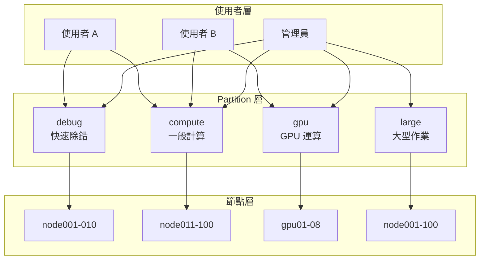
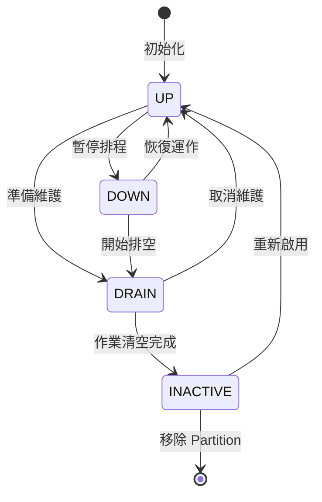
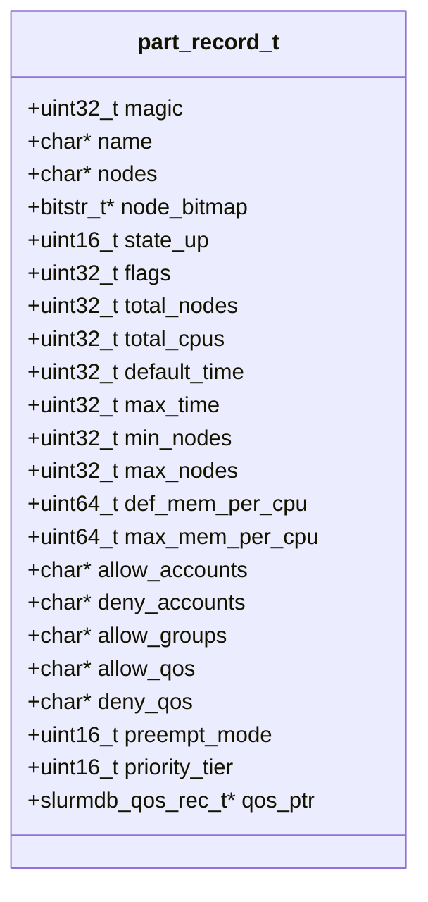
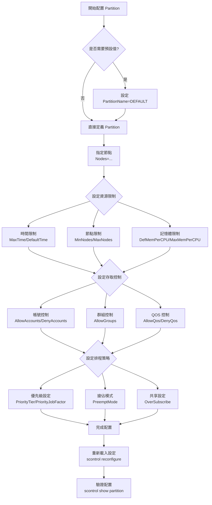

# Slurm Partition 完整技術指南

## 概述

Partition 是 Slurm 工作負載管理系統中的核心概念，用於將叢集節點邏輯分組，實現資源隔離、存取控制與排程策略管理。本文件完整說明 Partition 的內部資料結構、slurm.conf 配置參數，以及實務應用範例。

## 目錄

- [核心概念](#核心概念)
- [資料結構解析](#資料結構解析)
- [slurm.conf 配置參數](#slurmconf-配置參數)
- [實務配置範例](#實務配置範例)
- [最佳實務建議](#最佳實務建議)

---

## 核心概念

### 什麼是 Partition？

Partition（分區）類似於傳統批次系統中的「佇列」(Queue)，但功能更為強大。它定義了：

- **節點集合**：哪些計算節點屬於此分區
- **資源限制**：CPU、記憶體、時間等限制
- **存取控制**：誰可以使用此分區
- **排程策略**：優先級、搶佔模式等

### Partition 在系統中的角色



### Partition 狀態

Partition 有四種運作狀態：

| 狀態 | 常數 | 說明 |
|------|------|------|
| **UP** | `PARTITION_UP` | 正常運作，接受作業提交與排程 |
| **DOWN** | `PARTITION_DOWN` | 接受提交但不進行排程 |
| **DRAIN** | `PARTITION_DRAIN` | 不接受新作業，現有作業繼續執行 |
| **INACTIVE** | `PARTITION_INACTIVE` | 完全停用 |



---

## 資料結構解析

Slurm 使用兩個主要結構來管理 Partition：

### 內部結構：`part_record_t`

**定義位置**：`src/common/part_record.h:49-129`

此結構供 Slurm 控制器（slurmctld）內部使用，包含完整的運行時狀態。



**主要欄位分類**：

#### 識別與基本資訊

| 欄位 | 類型 | 說明 |
|------|------|------|
| `magic` | uint32_t | 資料完整性檢查碼 |
| `name` | char* | Partition 名稱 |
| `nodes` | char* | 展開後的節點列表 |
| `orig_nodes` | char* | 原始配置的節點列表 |
| `node_bitmap` | bitstr_t* | 節點位圖（內部使用） |

#### 資源統計

| 欄位 | 類型 | 說明 |
|------|------|------|
| `total_nodes` | uint32_t | 總節點數 |
| `total_cpus` | uint32_t | 總 CPU 數 |
| `max_cpu_cnt` | uint32_t | 單節點最大 CPU 數 |
| `max_core_cnt` | uint32_t | 單節點最大核心數 |

#### 存取控制

| 欄位 | 類型 | 說明 |
|------|------|------|
| `allow_accounts` | char* | 允許的帳號（逗號分隔） |
| `deny_accounts` | char* | 拒絕的帳號 |
| `allow_groups` | char* | 允許的群組 |
| `allow_qos` | char* | 允許的 QOS |
| `deny_qos` | char* | 拒絕的 QOS |
| `allow_uids` | uid_t* | 允許的使用者 ID 陣列 |

### API 結構：`partition_info_t`

**定義位置**：`slurm/slurm.h:2541-2594`

此結構用於 API 通訊和網路傳輸，供 `scontrol`、`sinfo` 等指令使用。

```c
typedef struct partition_info {
    char *name;              /* Partition 名稱 */
    char *nodes;             /* 節點列表 */
    uint32_t total_nodes;    /* 總節點數 */
    uint32_t total_cpus;     /* 總 CPU 數 */
    uint16_t state_up;       /* 狀態 */
    uint32_t flags;          /* 旗標 */
    uint32_t max_time;       /* 最大時間限制 */
    uint32_t default_time;   /* 預設時間限制 */
    /* ... 其他欄位 ... */
} partition_info_t;
```

### 兩種結構的差異

| 特性 | `part_record_t` | `partition_info_t` |
|------|-----------------|-------------------|
| 用途 | 控制器內部 | API/網路傳輸 |
| 位圖欄位 | 有（node_bitmap 等） | 無 |
| 執行時狀態 | 有（num_sched_jobs 等） | 無 |
| 指標參照 | 有（qos_ptr 等） | 無 |
| 完整性檢查 | 有（magic） | 無 |

### Partition Flags（旗標）

**定義位置**：`slurm/slurm.h:2508-2536`

```c
#define PART_FLAG_DEFAULT          0x0001  /* 預設 partition */
#define PART_FLAG_HIDDEN           0x0002  /* 隱藏 partition */
#define PART_FLAG_NO_ROOT          0x0004  /* 禁止 root 作業 */
#define PART_FLAG_ROOT_ONLY        0x0008  /* 僅 root 可用 */
#define PART_FLAG_REQ_RESV         0x0010  /* 需要預約 */
#define PART_FLAG_LLN              0x0020  /* 最低負載優先 */
#define PART_FLAG_EXCLUSIVE_USER   0x0040  /* 使用者獨佔 */
#define PART_FLAG_PDOI             0x0100  /* 閒置關機 */
#define PART_FLAG_EXCLUSIVE_TOPO   0x0200  /* 拓撲獨佔 */
```

---

## slurm.conf 配置參數

### 配置語法

```conf
PartitionName=<name> <參數>=<值> [<參數>=<值>] ...
```

### 使用 DEFAULT 設定預設值

```conf
# 為所有後續 partition 設定預設值
PartitionName=DEFAULT MaxTime=1-00:00:00 State=UP DefMemPerCPU=2048

# 繼承 DEFAULT 的設定
PartitionName=compute Nodes=node[001-100] Default=YES
PartitionName=debug Nodes=node[101-104] MaxTime=30:00
```

### 完整參數列表

#### 節點與資源配置

| 參數 | 類型 | 說明 | 預設值 |
|------|------|------|--------|
| `PartitionName` | 字串 | Partition 名稱（必填） | - |
| `Nodes` | 字串 | 節點列表，支援範圍表示法 | - |
| `AllocNodes` | 字串 | 可提交作業的節點 | ALL |
| `MinNodes` | 整數 | 單一作業最小節點數 | 0 |
| `MaxNodes` | 整數 | 單一作業最大節點數 | INFINITE |

#### CPU 配置

| 參數 | 類型 | 說明 | 預設值 |
|------|------|------|--------|
| `MaxCPUsPerNode` | 整數 | 每節點最大 CPU 數 | 無限制 |
| `MaxCPUsPerSocket` | 整數 | 每 Socket 最大 CPU 數 | 無限制 |
| `DefCPUPerGPU` | 整數 | 每 GPU 預設 CPU 數 | - |
| `CpuBind` | 字串 | CPU 綁定：none/socket/ldom/core/thread | none |

#### 記憶體配置

| 參數 | 類型 | 說明 | 互斥 |
|------|------|------|------|
| `DefMemPerCPU` | 整數 (MB) | 每 CPU 預設記憶體 | 與其他 DefMem 互斥 |
| `DefMemPerNode` | 整數 (MB) | 每節點預設記憶體 | 與其他 DefMem 互斥 |
| `DefMemPerGPU` | 整數 (MB) | 每 GPU 預設記憶體 | 與其他 DefMem 互斥 |
| `MaxMemPerCPU` | 整數 (MB) | 每 CPU 最大記憶體 | 與 MaxMemPerNode 互斥 |
| `MaxMemPerNode` | 整數 (MB) | 每節點最大記憶體 | 與 MaxMemPerCPU 互斥 |

#### 時間限制

| 參數 | 類型 | 說明 | 格式 |
|------|------|------|------|
| `MaxTime` | 時間 | 最大執行時間 | 分鐘/HH:MM:SS/days-HH:MM:SS/UNLIMITED |
| `DefaultTime` | 時間 | 預設執行時間 | 同 MaxTime |
| `OverTimeLimit` | 整數/UNLIMITED | 超時容許分鐘數 | - |
| `GraceTime` | 整數（秒） | 搶佔寬限時間 | 0 |

#### 存取控制

| 參數 | 類型 | 說明 | 預設值 |
|------|------|------|--------|
| `AllowAccounts` | 字串 | 允許的帳號列表 | ALL |
| `DenyAccounts` | 字串 | 拒絕的帳號列表 | 無 |
| `AllowGroups` | 字串 | 允許的群組列表 | ALL |
| `AllowQos` | 字串 | 允許的 QOS 列表 | ALL |
| `DenyQos` | 字串 | 拒絕的 QOS 列表 | 無 |
| `RootOnly` | YES/NO | 僅 root 可用 | NO |
| `DisableRootJobs` | YES/NO | 禁止 root 作業 | NO |
| `ReqResv` | YES/NO | 必須指定預約 | NO |
| `ExclusiveUser` | YES/NO | 使用者獨佔節點 | NO |

#### 優先級與排程

| 參數 | 類型 | 說明 | 預設值 |
|------|------|------|--------|
| `Priority` | 整數 | 同時設定 Factor 和 Tier | - |
| `PriorityJobFactor` | 整數 (0-65533) | 作業優先權因子 | 1 |
| `PriorityTier` | 整數 (0-65533) | 排程層級 | 1 |
| `LLN` | YES/NO | 最低負載節點優先 | NO |
| `PreemptMode` | 字串 | 搶佔模式 | OFF |

**PreemptMode 選項**：

| 值 | 說明 |
|-----|------|
| `OFF` | 不搶佔 |
| `CANCEL` | 取消被搶佔作業 |
| `REQUEUE` | 重新排隊 |
| `SUSPEND` | 暫停被搶佔作業 |
| `GANG` | Gang scheduling |

#### 資源共享

| 參數 | 類型 | 說明 |
|------|------|------|
| `OverSubscribe` | 字串 | NO/YES/FORCE/EXCLUSIVE，可加數量如 YES:4 |

#### 電源管理

| 參數 | 類型 | 說明 |
|------|------|------|
| `PowerDownOnIdle` | YES/NO | 閒置時關機 |
| `SuspendTime` | 整數/INFINITE | 進入省電模式的閒置秒數 |
| `SuspendTimeout` | 整數 | 暫停超時（秒） |
| `ResumeTimeout` | 整數 | 恢復超時（秒） |

#### 其他設定

| 參數 | 類型 | 說明 | 預設值 |
|------|------|------|--------|
| `Default` | YES/NO | 是否為預設 partition | NO |
| `Hidden` | YES/NO | 是否隱藏 | NO |
| `State` | 字串 | UP/DOWN/DRAIN/INACTIVE | UP |
| `Alternate` | 字串 | 備用 partition 名稱 | - |
| `QOS` | 字串 | 關聯的 QOS | - |
| `SelectTypeParameters` | 字串 | 資源選擇類型覆寫 | - |
| `Topology` | 字串 | 拓撲名稱 | - |
| `TRESBillingWeights` | 字串 | TRES 計費權重 | CPU=1 |

---

## 實務配置範例

### 範例 1：基本叢集配置

```conf
# 預設設定
PartitionName=DEFAULT MaxTime=7-00:00:00 State=UP DefMemPerCPU=2048

# 預設計算 partition
PartitionName=compute Nodes=node[001-100] Default=YES \
    MaxNodes=50 PriorityTier=10

# 快速除錯 partition
PartitionName=debug Nodes=node[101-104] \
    MaxTime=30:00 MaxNodes=2 PriorityTier=100

# 大型作業 partition
PartitionName=large Nodes=node[001-100] \
    MinNodes=10 MaxNodes=100 \
    MaxTime=14-00:00:00 PriorityTier=5
```

### 範例 2：GPU 叢集配置

```conf
# GPU partition 配置
PartitionName=gpu Nodes=gpu[01-16] \
    MaxTime=2-00:00:00 \
    DefCPUPerGPU=8 \
    DefMemPerGPU=32768 \
    TRESBillingWeights="CPU=1.0,Mem=0.25G,GRES/gpu=20.0"

# 機器學習訓練 partition
PartitionName=ml-training Nodes=gpu[01-08] \
    MaxTime=7-00:00:00 \
    OverSubscribe=EXCLUSIVE \
    AllowAccounts=ml_team,research

# 推論服務 partition
PartitionName=inference Nodes=gpu[09-16] \
    MaxTime=1:00:00 \
    MaxNodes=1 \
    PriorityTier=50
```

### 範例 3：多層級優先權配置

```conf
# 緊急作業 - 最高優先級，可搶佔其他作業
PartitionName=urgent Nodes=node[001-100] \
    MaxTime=4:00:00 \
    PriorityTier=1000 \
    PreemptMode=REQUEUE \
    RootOnly=YES

# 互動式作業 - 高優先級
PartitionName=interactive Nodes=node[001-020] \
    MaxTime=4:00:00 \
    PriorityTier=500 \
    MaxNodes=4

# 批次作業 - 標準優先級
PartitionName=batch Nodes=node[001-100] Default=YES \
    MaxTime=7-00:00:00 \
    PriorityTier=100

# 低優先級背景作業 - 可被搶佔
PartitionName=background Nodes=node[001-100] \
    MaxTime=30-00:00:00 \
    PriorityTier=10 \
    PreemptMode=SUSPEND,GANG
```

### 範例 4：存取控制配置

```conf
# 研究團隊專用 partition
PartitionName=research Nodes=node[201-250] \
    AllowAccounts=physics,chemistry,biology \
    MaxTime=14-00:00:00 Hidden=YES

# 教學用 partition（限制資源）
PartitionName=teaching Nodes=node[251-260] \
    AllowGroups=students \
    MaxNodes=2 MaxCPUsPerNode=4 \
    MaxMemPerNode=8192 \
    MaxTime=2:00:00 \
    DisableRootJobs=YES

# 付費使用者 partition
PartitionName=premium Nodes=node[001-100] \
    AllowQos=premium,enterprise \
    PriorityTier=200 \
    OverSubscribe=EXCLUSIVE
```

### 範例 5：電源管理配置

```conf
# 節能 partition - 閒置時自動關機
PartitionName=eco Nodes=node[301-400] \
    PowerDownOnIdle=YES \
    SuspendTime=600 \
    SuspendTimeout=120 \
    ResumeTimeout=300 \
    MaxTime=24:00:00
```

### Partition 配置流程



---

## 最佳實務建議

### 命名規範

- 使用有意義的名稱：`gpu-training`、`interactive`、`batch-long`
- 避免特殊字元，使用小寫字母和連字號
- 保持一致的命名風格

### 資源規劃

- 避免 Partition 間節點過度重疊，減少資源競爭
- 為不同工作負載類型設計專屬 Partition
- 預留一些節點給緊急或互動式作業

### 安全性

- 使用 `AllowAccounts` 或 `AllowGroups` 限制存取
- 敏感資源設定 `Hidden=YES`
- 考慮使用 `DisableRootJobs=YES` 防止權限濫用

### 效能優化

- 高優先級 Partition 使用較高的 `PriorityTier`
- 合理設定 `PreemptMode` 以提高資源利用率
- 使用 `LLN=YES` 均衡節點負載

### 維護建議

- 定期檢視 Partition 使用狀況
- 使用 `DRAIN` 狀態進行節點維護
- 設定 `Alternate` 提供備援

---

## 相關檔案參考

| 檔案路徑 | 說明 |
|----------|------|
| `src/common/part_record.h` | `part_record_t` 結構定義 |
| `slurm/slurm.h` | `partition_info_t` 結構與常數 |
| `src/common/read_config.c:1117-1555` | Partition 配置解析程式碼 |
| `doc/man/man5/slurm.conf.5:7467-8210` | 官方 man page 文件 |

---

## 常用指令

```bash
# 查看所有 partition
sinfo

# 查看特定 partition 詳細資訊
scontrol show partition <name>

# 更新 partition 設定
scontrol update PartitionName=<name> <參數>=<值>

# 重新載入 slurm.conf
scontrol reconfigure
```

---

## 延伸閱讀

以下繁體中文文件提供 Partition 相關參數的深入說明：

### 排程與優先級

| 文件 | 說明 | 相關參數 |
|------|------|----------|
| [多因子優先權](../../../doc/html/zh-tw/administrators/priority_multifactor.md) | 作業優先權計算機制 | `PriorityTier`, `PriorityJobFactor` |
| [作業搶占](../../../doc/html/zh-tw/administrators/preempt.md) | 搶占模式與配置 | `PreemptMode`, `GraceTime`, `PriorityTier` |
| [Gang 排程](../../../doc/html/zh-tw/administrators/gang_scheduling.md) | 時間分片排程 | `OverSubscribe`, `PreemptMode=GANG` |
| [排程配置](../../../doc/html/zh-tw/administrators/sched_config.md) | 排程器參數說明 | 排程相關設定 |

### 存取控制

| 文件 | 說明 | 相關參數 |
|------|------|----------|
| [服務品質 (QOS)](../../../doc/html/zh-tw/administrators/qos.md) | QOS 定義與管理 | `AllowQos`, `DenyQos`, `QOS` |
| [資源預約](../../../doc/html/zh-tw/administrators/reservations.md) | 預約機制說明 | `ReqResv` |
| [資源限制](../../../doc/html/zh-tw/administrators/resource_limits.md) | 帳號與使用者限制 | 資源限制參數 |

### 資源管理

| 文件 | 說明 | 相關參數 |
|------|------|----------|
| [可消耗資源](../../../doc/html/zh-tw/administrators/cons_tres.md) | CPU/記憶體追蹤 | `SelectTypeParameters` |
| [資源共享](../../../doc/html/zh-tw/administrators/cons_tres_share.md) | 資源過度配置 | `OverSubscribe` |
| [GRES 配置](../../../doc/html/zh-tw/administrators/gres.md) | GPU 等通用資源 | `DefCPUPerGPU`, `DefMemPerGPU` |
| [TRES 說明](../../../doc/html/zh-tw/administrators/tres.md) | 可追蹤資源 | `TRESBillingWeights` |

### 電源管理

| 文件 | 說明 | 相關參數 |
|------|------|----------|
| [節能指南](../../../doc/html/zh-tw/administrators/power_save.md) | 節點掛起與恢復 | `PowerDownOnIdle`, `SuspendTime`, `SuspendTimeout`, `ResumeTimeout` |

### 進階主題

| 文件 | 說明 | 相關參數 |
|------|------|----------|
| [拓撲配置](../../../doc/html/zh-tw/administrators/topology.md) | 網路拓撲 | `Topology` |
| [動態節點](../../../doc/html/zh-tw/administrators/dynamic_nodes.md) | 動態新增節點 | `Nodes` |
| [大型系統](../../../doc/html/zh-tw/administrators/big_sys.md) | 大規模叢集最佳化 | 效能調校 |
| [高吞吐量](../../../doc/html/zh-tw/administrators/high_throughput.md) | 大量作業處理 | 排程最佳化 |

### 使用者指南

| 文件 | 說明 |
|------|------|
| [快速入門](../../../doc/html/zh-tw/users/quickstart.md) | 使用者基本操作 |
| [CPU 管理](../../../doc/html/zh-tw/users/cpu_management.md) | CPU 綁定與分配 |
| [資源綁定](../../../doc/html/zh-tw/users/resource_binding.md) | 資源綁定選項 |
| [作業原因碼](../../../doc/html/zh-tw/users/job_reason_codes.md) | 作業等待原因說明 |
