# scontrol create partition 內部實現解析

## 概述

本文件深入剖析 Slurm 中透過 `scontrol create partition` 命令動態建立 Partition 的完整內部實現流程。這是一份面向 **Slurm 開發者與貢獻者** 的技術參考文件，著重於程式碼層級的運作機制。

> **讀者對象**：Slurm 核心開發者、插件開發者、系統整合工程師
>
> **先備知識**：建議先閱讀 [Slurm Partition 完整技術指南](../configuration/slurm-partition-guide.md) 了解 Partition 的配置概念與參數。

### 本文涵蓋內容

- 從命令輸入到 slurmctld 處理的完整資料流
- 關鍵技術概念（RPC 機制、鎖定策略、位圖操作）
- 核心函數的詳細解析與程式碼範例
- 元件互動與觸發機制
- 除錯與故障排除參考

---

## 目錄

- [一、整體架構](#一整體架構)
- [二、核心技術概念](#二核心技術概念)
- [三、客戶端流程詳解](#三客戶端流程詳解)
- [四、RPC 通訊機制](#四rpc-通訊機制)
- [五、伺服器端處理流程](#五伺服器端處理流程)
- [六、觸發的元件一覽](#六觸發的元件一覽)
- [七、完整函數調用鏈](#七完整函數調用鏈)
- [八、錯誤碼參考](#八錯誤碼參考)
- [九、關鍵檔案清單](#九關鍵檔案清單)
- [延伸閱讀](#延伸閱讀)

---

## 一、整體架構

### 1.1 系統層級視圖

當管理員執行 `scontrol create partition` 命令時，請求會經過三個主要層級：

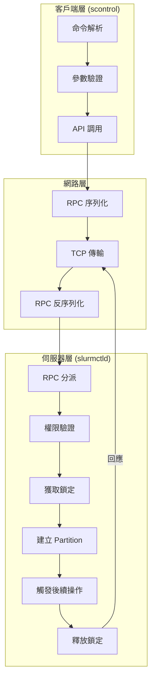

### 1.2 詳細元件互動圖

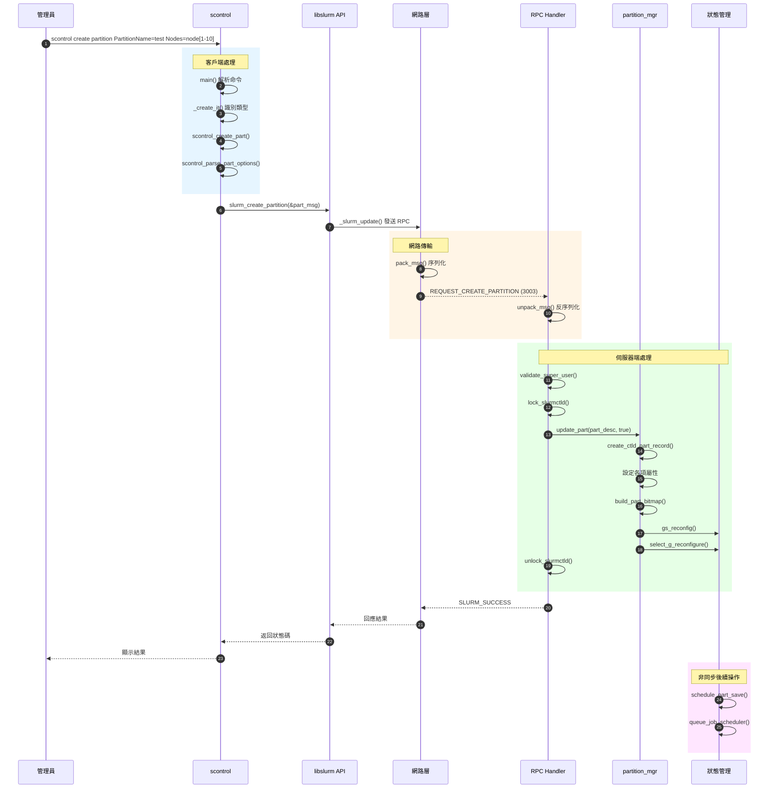

---

## 二、核心技術概念

在深入程式碼之前，需要先理解以下核心技術概念：

### 2.1 RPC（遠端程序呼叫）機制

Slurm 使用自訂的 RPC 機制在各個 daemon 之間通訊。每個 RPC 請求包含：

| 元素 | 說明 | 範例 |
|------|------|------|
| **msg_type** | 訊息類型編號 | `REQUEST_CREATE_PARTITION` (3003) |
| **data** | 序列化的資料結構 | `update_part_msg_t` 結構 |
| **auth** | 認證資訊 | 發送者的 UID/GID |

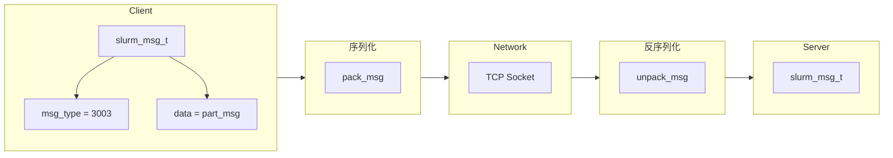

**程式碼範例 - RPC 訊息初始化**：

```c
/* src/api/update_config.c:352-370 */
static int _slurm_update(void *data, slurm_msg_type_t msg_type)
{
    int rc;
    slurm_msg_t req_msg;

    /* 初始化訊息結構 */
    slurm_msg_t_init(&req_msg);

    /* 設定訊息類型和資料 */
    req_msg.msg_type = msg_type;  /* REQUEST_CREATE_PARTITION = 3003 */
    req_msg.data = data;          /* update_part_msg_t 結構指標 */

    /* 發送請求並等待回應 */
    if (slurm_send_recv_controller_rc_msg(&req_msg, &rc,
                                          working_cluster_rec) < 0)
        return SLURM_ERROR;

    if (rc != SLURM_SUCCESS)
        slurm_seterrno_ret(rc);

    return SLURM_SUCCESS;
}
```

### 2.2 slurmctld 鎖定機制

slurmctld 使用多層級讀寫鎖來保護共享資料結構，防止並發存取導致的資料不一致。

#### 鎖定層級

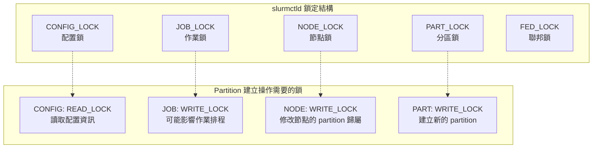

**程式碼範例 - 鎖定取得**：

```c
/* src/slurmctld/proc_req.c:4245-4246 */
/* 建立 Partition 需要的鎖定組合 */
slurmctld_lock_t part_write_lock = {
    READ_LOCK,   /* 配置鎖：讀取 */
    WRITE_LOCK,  /* 作業鎖：寫入（Gang Scheduler 支援需要） */
    WRITE_LOCK,  /* 節點鎖：寫入 */
    WRITE_LOCK,  /* 分區鎖：寫入 */
    NO_LOCK      /* 聯邦鎖：不需要 */
};

/* 取得鎖定 */
lock_slurmctld(part_write_lock);

/* ... 執行操作 ... */

/* 釋放鎖定 */
unlock_slurmctld(part_write_lock);
```

#### 為什麼需要作業寫鎖？

建立 Partition 時需要作業寫鎖的原因是 **Gang Scheduler** 支援。當啟用 Gang Scheduling 時，Partition 的變更可能影響正在執行的作業排程，因此需要寫鎖來確保一致性。

### 2.3 節點位圖（Node Bitmap）

Slurm 使用位圖（bitmap）高效地表示節點集合。每個位元代表一個節點的成員資格。

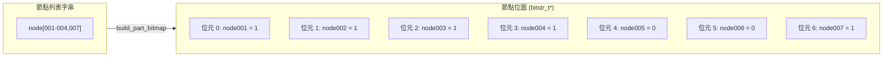

**位圖操作的優勢**：

| 操作 | 字串方式複雜度 | 位圖方式複雜度 |
|------|---------------|---------------|
| 檢查節點是否屬於 Partition | O(n) | O(1) |
| 計算 Partition 節點數 | O(n) | O(n/64) 使用 popcount |
| 兩個 Partition 的節點交集 | O(n×m) | O(n/64) 使用 AND 運算 |

**程式碼範例 - 位圖建立**：

```c
/* 將節點字串轉換為位圖 */
int build_part_bitmap(part_record_t *part_ptr)
{
    /* 釋放舊的位圖 */
    FREE_NULL_BITMAP(part_ptr->node_bitmap);

    /* 從節點名稱字串建立位圖 */
    if (node_name2bitmap(part_ptr->nodes,
                         false,  /* 不報告錯誤節點 */
                         &part_ptr->node_bitmap) != SLURM_SUCCESS) {
        return ESLURM_INVALID_NODE_NAME;
    }

    /* 計算 partition 的 TRES */
    _calc_part_tres(part_ptr, NULL);

    return SLURM_SUCCESS;
}
```

### 2.4 TRES（可追蹤資源）計算

建立 Partition 後，系統會自動計算該 Partition 的總 TRES（Trackable Resources）：

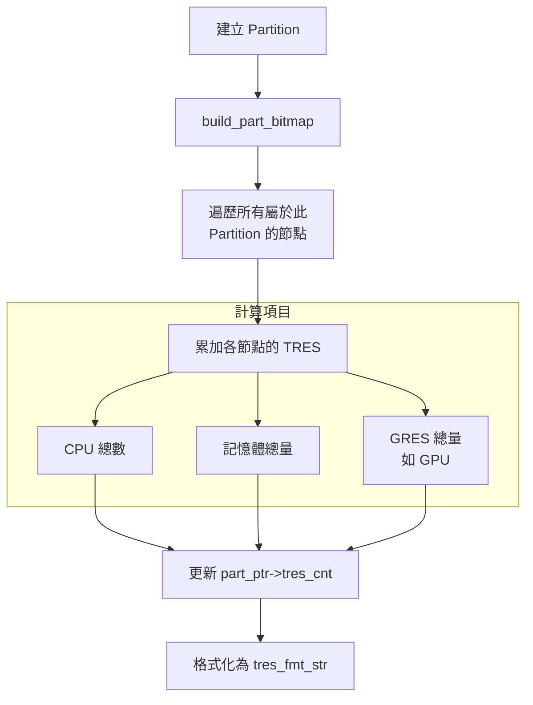

---

## 三、客戶端流程詳解

### 3.1 命令入口 - main()

**檔案位置**：`src/scontrol/scontrol.c:124`

當使用者執行 `scontrol` 命令時，程式從 `main()` 函數開始：

```c
int main(int argc, char **argv)
{
    /* 1. 初始化 Slurm 環境 */
    slurm_init(NULL);

    /* 2. 解析命令行參數 */
    _process_command(argc, argv);

    /* 3. 清理並退出 */
    slurm_fini();
    return exit_code;
}
```

### 3.2 命令分派 - _create_it()

**檔案位置**：`src/scontrol/scontrol.c:1627`

`_create_it()` 函數負責識別要建立的資源類型：

```c
static int _create_it(int argc, char **argv)
{
    /* 掃描參數尋找資源類型標識 */
    for (int i = 0; i < argc; i++) {
        char *tag = argv[i];
        char *val = strchr(argv[i], '=');

        if (val) {
            val[0] = '\0';  /* 分割 tag 和 value */
            val++;
        }

        /* 根據標籤決定資源類型 */
        if (xstrncasecmp(tag, "PartitionName", 13) == 0) {
            /* 建立 Partition */
            return scontrol_create_part(argc, argv);
        }
        else if (xstrncasecmp(tag, "ReservationName", 15) == 0) {
            /* 建立 Reservation */
            return scontrol_create_res(argc, argv);
        }
        /* ... 其他資源類型 ... */
    }

    error("Invalid creation request");
    return SLURM_ERROR;
}
```

### 3.3 Partition 建立入口 - scontrol_create_part()

**檔案位置**：`src/scontrol/update_part.c:539-572`

```c
extern int scontrol_create_part(int argc, char **argv)
{
    int update_cnt = 0;
    update_part_msg_t part_msg;
    int err;

    /* 步驟 1：初始化訊息結構（設定所有欄位為預設值） */
    slurm_init_part_desc_msg(&part_msg);

    /* 步驟 2：解析所有命令行參數 */
    err = scontrol_parse_part_options(argc, argv, &update_cnt, &part_msg);
    if (err)
        return err;

    /* 步驟 3：驗證必要參數 */
    if (part_msg.name == NULL) {
        exit_code = 1;
        error("PartitionName must be given.");
        return SLURM_SUCCESS;  /* 返回成功但設定 exit_code */
    }

    /* 檢查保留名稱 */
    if (xstrcasecmp(part_msg.name, "default") == 0) {
        exit_code = 1;
        error("PartitionName cannot be \"DEFAULT\".");
        return SLURM_SUCCESS;
    }

    /* 步驟 4：呼叫 API 發送建立請求 */
    if (slurm_create_partition(&part_msg)) {
        exit_code = 1;
        slurm_perror("Error creating the partition");
        return errno;
    }

    return SLURM_SUCCESS;
}
```

### 3.4 參數解析 - scontrol_parse_part_options()

**檔案位置**：`src/scontrol/update_part.c:47-486`

此函數解析所有支援的 Partition 參數。以下是參數解析的流程圖與範例：

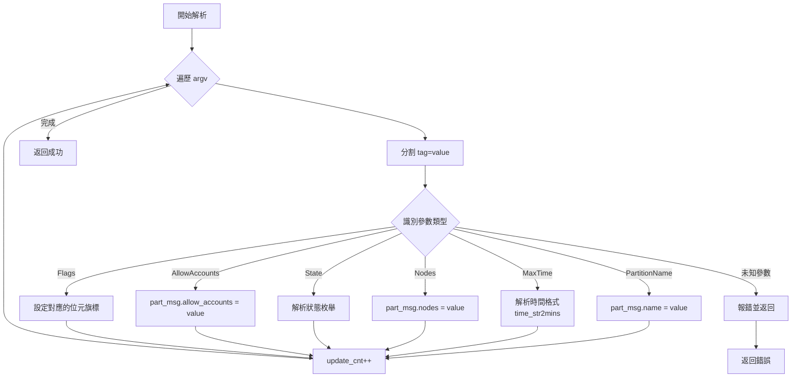

**程式碼範例 - 時間參數解析**：

```c
/* 解析 MaxTime 參數 */
if (xstrncasecmp(tag, "MaxTime", MAX(taglen, 4)) == 0) {
    /* time_str2mins 支援多種格式：
     * - 純分鐘：60
     * - HH:MM:SS：01:30:00
     * - days-HH:MM:SS：7-00:00:00
     * - UNLIMITED 或 INFINITE
     */
    int max_time = time_str2mins(val);

    if ((max_time < 0) && (max_time != INFINITE)) {
        exit_code = 1;
        error("Invalid MaxTime value: %s", val);
        return SLURM_ERROR;
    }

    part_msg_ptr->max_time = max_time;
    (*update_cnt_ptr)++;
}

/* 解析 Nodes 參數 */
else if (xstrncasecmp(tag, "Nodes", MAX(taglen, 1)) == 0) {
    /* 節點列表支援：
     * - 單一節點：node001
     * - 範圍：node[001-100]
     * - 混合：node[001-010,015,020-030]
     * - 增量：+node[005-010]（新增節點）
     * - 減量：-node[001-005]（移除節點）
     */
    part_msg_ptr->nodes = xstrdup(val);
    (*update_cnt_ptr)++;
}
```

**支援的完整參數列表**：

| 類別 | 參數 | 說明 |
|------|------|------|
| **識別** | `PartitionName` | Partition 名稱（必填） |
| **節點** | `Nodes`, `AllocNodes` | 節點列表、可提交節點 |
| **時間** | `MaxTime`, `DefaultTime`, `GraceTime`, `OverTimeLimit` | 時間限制相關 |
| **資源** | `MaxNodes`, `MinNodes`, `MaxCPUsPerNode`, `MaxCPUsPerSocket` | 資源限制 |
| **記憶體** | `DefMemPerCPU`, `DefMemPerNode`, `MaxMemPerCPU`, `MaxMemPerNode` | 記憶體配置 |
| **存取** | `AllowGroups`, `AllowAccounts`, `AllowQos`, `DenyAccounts`, `DenyQos` | 存取控制 |
| **排程** | `Priority`, `PriorityTier`, `PriorityJobFactor`, `PreemptMode` | 排程策略 |
| **狀態** | `State`, `Default`, `Hidden` | 狀態控制 |
| **其他** | `QoS`, `Alternate`, `OverSubscribe`, `CpuBind`, `TresBillingWeights` | 其他設定 |

> **完整參數說明**：請參閱 [Slurm Partition 完整技術指南 - slurm.conf 配置參數](../configuration/slurm-partition-guide.md#slurmconf-配置參數)

---

## 四、RPC 通訊機制

### 4.1 API 層 - slurm_create_partition()

**檔案位置**：`src/api/update_config.c:167-170`

這是應用程式呼叫的公開 API 函數：

```c
int slurm_create_partition(update_part_msg_t *part_msg)
{
    /* 使用 REQUEST_CREATE_PARTITION 類型發送 RPC */
    return _slurm_update((void *)part_msg, REQUEST_CREATE_PARTITION);
}
```

### 4.2 RPC 訊息類型定義

**檔案位置**：`src/common/msg_type.h`

```c
/* Partition 相關的 RPC 訊息類型 */
#define REQUEST_CREATE_PARTITION    3003  /* 建立 Partition */
#define REQUEST_DELETE_PARTITION    3004  /* 刪除 Partition */
#define REQUEST_UPDATE_PARTITION    3005  /* 更新 Partition */
```

### 4.3 訊息序列化與傳輸

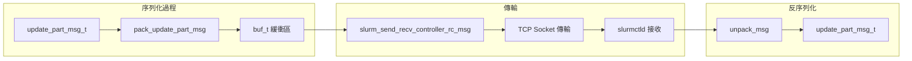

**訊息結構**（用於 API 和 RPC 傳輸）：

```c
/* slurm/slurm.h:2541-2594 */
typedef struct partition_info {
    char *name;                  /* Partition 名稱 */
    char *nodes;                 /* 節點列表 */
    char *allow_accounts;        /* 允許的帳號 */
    char *allow_groups;          /* 允許的群組 */
    char *allow_qos;             /* 允許的 QoS */
    char *deny_accounts;         /* 拒絕的帳號 */
    char *deny_qos;              /* 拒絕的 QoS */
    uint32_t flags;              /* 狀態旗標 */
    uint32_t max_time;           /* 最大時間 */
    uint32_t default_time;       /* 預設時間 */
    uint32_t max_nodes;          /* 最大節點數 */
    uint32_t min_nodes;          /* 最小節點數 */
    uint16_t state_up;           /* Partition 狀態 */
    uint16_t preempt_mode;       /* 搶佔模式 */
    uint16_t priority_tier;      /* 優先級層級 */
    uint16_t priority_job_factor;/* 作業優先權因子 */
    /* ... 其他欄位 ... */
} partition_info_t;

/* update_part_msg_t 是 partition_info_t 的別名 */
typedef struct partition_info update_part_msg_t;
```

---

## 五、伺服器端處理流程

### 5.1 RPC 分派表

**檔案位置**：`src/slurmctld/proc_req.c:6750-6757`

slurmctld 使用分派表將 RPC 訊息類型對應到處理函數：

```c
/* RPC 處理函數分派表（部分） */
static slurm_rpc_handler_t rpc_handlers[] = {
    /* ... 其他處理器 ... */
    {
        .msg_type = REQUEST_CREATE_PARTITION,
        .func = _slurm_rpc_update_partition,  /* 建立和更新共用處理函數 */
    },{
        .msg_type = REQUEST_UPDATE_PARTITION,
        .func = _slurm_rpc_update_partition,
    },{
        .msg_type = REQUEST_DELETE_PARTITION,
        .func = _slurm_rpc_delete_partition,
    },
    /* ... 其他處理器 ... */
};
```

### 5.2 RPC 處理函數 - _slurm_rpc_update_partition()

**檔案位置**：`src/slurmctld/proc_req.c:4238-4282`

```c
static void _slurm_rpc_update_partition(slurm_msg_t *msg)
{
    int error_code = SLURM_SUCCESS;
    DEF_TIMERS;  /* 效能計時巨集 */
    update_part_msg_t *part_desc_ptr = msg->data;

    /* 定義需要的鎖定組合 */
    slurmctld_lock_t part_write_lock = {
        READ_LOCK,   /* 配置：讀取 */
        WRITE_LOCK,  /* 作業：寫入（Gang Scheduler） */
        WRITE_LOCK,  /* 節點：寫入 */
        WRITE_LOCK,  /* 分區：寫入 */
        NO_LOCK      /* 聯邦：不需要 */
    };

    START_TIMER;

    /* ========== 步驟 1：權限驗證 ========== */
    if (!validate_super_user(msg->auth_uid)) {
        error_code = ESLURM_USER_ID_MISSING;
        error("Security violation, UPDATE_PARTITION RPC from uid=%u",
              msg->auth_uid);
    }

    /* ========== 步驟 2：執行操作 ========== */
    if (error_code == SLURM_SUCCESS) {
        /* 取得必要的鎖定 */
        lock_slurmctld(part_write_lock);

        /* 根據訊息類型決定是建立還是更新 */
        if (msg->msg_type == REQUEST_CREATE_PARTITION) {
            error_code = update_part(part_desc_ptr, true);   /* 建立模式 */
        } else {
            error_code = update_part(part_desc_ptr, false);  /* 更新模式 */
        }

        /* 釋放鎖定 */
        unlock_slurmctld(part_write_lock);
        END_TIMER2(__func__);
    }

    /* ========== 步驟 3：回應與後續處理 ========== */
    if (error_code) {
        info("%s partition=%s: %s",
             __func__, part_desc_ptr->name, slurm_strerror(error_code));
        slurm_send_rc_msg(msg, error_code);
    } else {
        debug2("%s complete for %s %s",
               __func__, part_desc_ptr->name, TIMER_STR());
        slurm_send_rc_msg(msg, SLURM_SUCCESS);

        /* 非同步觸發後續操作 */
        schedule_part_save();    /* 排程儲存 Partition 狀態 */
        queue_job_scheduler();   /* 觸發作業排程器 */
    }
}
```

### 5.3 核心建立邏輯 - update_part()

**檔案位置**：`src/slurmctld/partition_mgr.c:1134-1847`

這是最核心的函數，處理 Partition 建立和更新的所有邏輯：

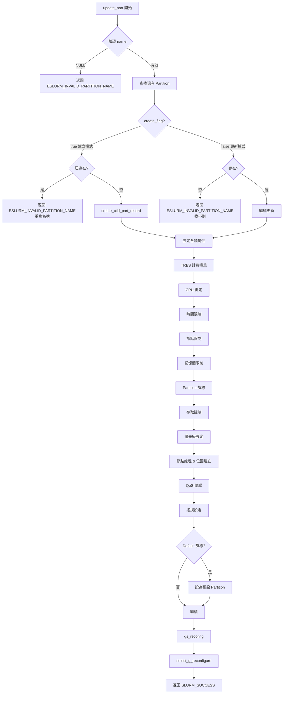

**程式碼範例 - 建立模式處理**：

```c
extern int update_part(update_part_msg_t *part_desc, bool create_flag)
{
    int error_code;
    part_record_t *part_ptr;

    /* 驗證 Partition 名稱 */
    if (part_desc->name == NULL) {
        info("%s: invalid partition name, NULL", __func__);
        return ESLURM_INVALID_PARTITION_NAME;
    }

    error_code = SLURM_SUCCESS;

    /* 在全域 partition 列表中查找 */
    part_ptr = list_find_first(part_list, &list_find_part, part_desc->name);

    if (create_flag) {
        /* ===== 建立模式 ===== */
        if (part_ptr) {
            /* Partition 已存在，不能重複建立 */
            verbose("%s: Duplicate partition name for create (%s)",
                    __func__, part_desc->name);
            return ESLURM_INVALID_PARTITION_NAME;
        }

        info("%s: partition %s being created", __func__, part_desc->name);

        /* 建立新的 Partition 記錄 */
        part_ptr = create_ctld_part_record(part_desc->name);
    } else {
        /* ===== 更新模式 ===== */
        if (!part_ptr) {
            verbose("%s: Update for partition not found (%s)",
                    __func__, part_desc->name);
            return ESLURM_INVALID_PARTITION_NAME;
        }
    }

    /* 更新全域時間戳 */
    last_part_update = time(NULL);

    /* ... 繼續設定各項屬性 ... */
}
```

### 5.4 建立 Partition 記錄 - create_ctld_part_record()

**檔案位置**：`src/slurmctld/partition_mgr.c:346-357`

```c
part_record_t *create_ctld_part_record(const char *name)
{
    /* 步驟 1：建立並初始化 part_record 結構 */
    part_record_t *part_ptr = part_record_create();

    /* 步驟 2：更新全域 partition 更新時間 */
    last_part_update = time(NULL);

    /* 步驟 3：設定 Partition 名稱 */
    part_ptr->name = xstrdup(name);

    /* 步驟 4：添加到全域 partition 列表 */
    list_append(part_list, part_ptr);

    return part_ptr;
}
```

### 5.5 節點處理與位圖建立

節點處理是建立 Partition 最複雜的部分之一：

```c
/* src/slurmctld/partition_mgr.c:1705-1788（簡化版） */
if (part_desc->nodes != NULL) {
    /* 處理空節點列表 */
    if (part_desc->nodes[0] == '\0') {
        part_ptr->nodes = NULL;
    }
    /* 處理完整節點列表（覆蓋） */
    else if ((part_desc->nodes[0] != '+') &&
             (part_desc->nodes[0] != '-')) {
        xfree(part_ptr->nodes);
        part_ptr->nodes = xstrdup(part_desc->nodes);
    }
    /* 處理增量修改 */
    else {
        hostset_t *hs = hostset_create(part_ptr->nodes);

        /* 解析 +/- 節點操作 */
        char *tok, *save_ptr = NULL;
        char *p = xstrdup(part_desc->nodes);

        while ((tok = node_conf_nodestr_tokenize(p, &save_ptr))) {
            if (tok[0] == '+') {
                /* 新增節點 */
                hostset_insert(hs, tok + 1);
            } else if (tok[0] == '-') {
                /* 移除節點 */
                hostset_delete(hs, tok + 1);
            }
        }

        /* 轉回節點字串 */
        part_ptr->nodes = hostset_ranged_string_xmalloc(hs);
        hostset_destroy(hs);
    }

    /* 建立節點位圖 */
    if ((rc = build_part_bitmap(part_ptr))) {
        error_code = rc;
        /* 錯誤處理... */
    } else {
        info("%s: setting nodes to %s for partition %s",
             __func__, part_ptr->nodes, part_desc->name);

        /* 更新相關元件 */
        update_part_nodes_in_resv(part_ptr);  /* 更新預約中的節點 */
        power_save_set_timeouts(NULL);        /* 更新電源管理 */

        /* 計算 TRES */
        _calc_part_tres(part_ptr, NULL);
    }
}
```

---

## 六、觸發的元件一覽

建立 Partition 會觸發多個子系統的更新：

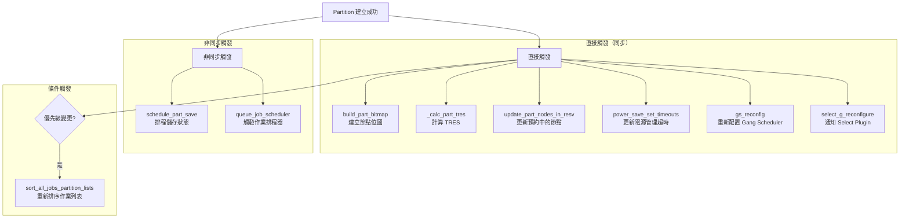

### 元件功能說明表

| 元件 | 函數 | 觸發時機 | 功能說明 |
|------|------|----------|----------|
| **位圖管理** | `build_part_bitmap()` | 節點列表設定時 | 將節點字串轉換為位圖，便於快速查詢 |
| **TRES 計算** | `_calc_part_tres()` | 位圖建立後 | 累計 Partition 的總 CPU、記憶體、GRES |
| **預約更新** | `update_part_nodes_in_resv()` | 節點變更時 | 同步更新包含這些節點的預約 |
| **電源管理** | `power_save_set_timeouts()` | 節點變更時 | 更新節點的電源管理超時設定 |
| **Gang Scheduler** | `gs_reconfig()` | 成功建立後 | 重新配置時間分片排程 |
| **Select Plugin** | `select_g_reconfigure()` | 成功建立後 | 通知資源選擇插件配置變更 |
| **狀態儲存** | `schedule_part_save()` | 成功建立後 | 非同步儲存 Partition 狀態到 state 檔案 |
| **作業排程** | `queue_job_scheduler()` | 成功建立後 | 觸發排程器重新評估待處理作業 |
| **作業排序** | `sort_all_jobs_partition_lists()` | 優先級變更時 | 根據新優先級重新排序所有作業 |

---

## 七、完整函數調用鏈

以下是從使用者命令到處理完成的完整函數調用鏈：

```
使用者執行: scontrol create partition PartitionName=test Nodes=node[1-10]
│
├─► main() [scontrol.c:124]
│   └─► _process_command() [scontrol.c:1033]
│       └─► _create_it() [scontrol.c:1627]
│           └─► scontrol_create_part() [update_part.c:539]
│               │
│               ├─► slurm_init_part_desc_msg() [api/init_msg.c]
│               │   └── 初始化 update_part_msg_t 結構
│               │
│               ├─► scontrol_parse_part_options() [update_part.c:47]
│               │   ├── time_str2mins() - 解析時間格式
│               │   ├── xlate_cpu_bind_str() - 解析 CPU 綁定
│               │   ├── get_resource_arg_range() - 解析資源範圍
│               │   ├── verify_node_count() - 驗證節點數
│               │   └── preempt_mode_num() - 解析搶佔模式
│               │
│               └─► slurm_create_partition() [api/update_config.c:167]
│                   └─► _slurm_update() [api/update_config.c:352]
│                       └─► slurm_send_recv_controller_rc_msg()
│                           │
│ ========================= 網路傳輸 (RPC) =========================
│                           │
│                           ▼ REQUEST_CREATE_PARTITION (3003)
│
├─► slurmctld RPC 分派表 [proc_req.c:6750]
│   └─► _slurm_rpc_update_partition() [proc_req.c:4238]
│       │
│       ├─► validate_super_user() [proc_req.c]
│       │   └── 檢查 msg->auth_uid 是否為 root 或 SlurmUser
│       │
│       ├─► lock_slurmctld(part_write_lock)
│       │   └── 取得 CONFIG_READ, JOB_WRITE, NODE_WRITE, PART_WRITE
│       │
│       └─► update_part(part_desc, true) [partition_mgr.c:1134]
│           │
│           ├─► list_find_first(part_list, ...) - 檢查重複
│           │
│           ├─► create_ctld_part_record() [partition_mgr.c:346]
│           │   ├── part_record_create() - 配置記憶體並初始化
│           │   └── list_append(part_list, part_ptr) - 加入全域列表
│           │
│           ├─► 設定各項屬性
│           │   ├── set_partition_billing_weights() - TRES 計費權重
│           │   ├── accounts_list_build() - 建立帳戶列表
│           │   ├── get_groups_members() - 解析群組成員
│           │   ├── qos_list_build() - 建立 QoS 列表
│           │   ├── assoc_mgr_fill_in_qos() - 填充 QoS 資訊
│           │   └── job_defaults_list() - 作業預設值
│           │
│           ├─► 節點處理
│           │   ├── hostset_create/insert/delete() - 節點集合操作
│           │   └── build_part_bitmap() - 建立節點位圖 ★
│           │       ├── node_name2bitmap() - 名稱轉位圖
│           │       └── _set_partition_tres() - 設定 TRES
│           │
│           ├─► 後續更新
│           │   ├── update_part_nodes_in_resv() - 更新預約
│           │   ├── power_save_set_timeouts() - 電源管理
│           │   ├── _calc_part_tres() - 計算 TRES
│           │   └── set_part_topology_idx() - 設定拓撲
│           │
│           ├─► gs_reconfig() - Gang Scheduler 重配置
│           │
│           └─► select_g_reconfigure() - Select Plugin 通知
│
│       ├─► unlock_slurmctld(part_write_lock) - 釋放鎖定
│       │
│       └─► 後續操作
│           ├─► slurm_send_rc_msg() - 回傳結果給客戶端
│           ├─► schedule_part_save() - 排程儲存狀態
│           │   └── dump_all_part_state() [partition_mgr.c]
│           └─► queue_job_scheduler() - 觸發作業排程器
│
└─► 客戶端接收成功回應
```

---

## 八、錯誤碼參考

### 常見錯誤碼

| 錯誤碼 | 常數名稱 | 原因 | 解決方案 |
|--------|----------|------|----------|
| 2001 | `ESLURM_INVALID_PARTITION_NAME` | Partition 名稱為空、重複或不存在 | 檢查名稱是否正確且不重複 |
| 2002 | `ESLURM_USER_ID_MISSING` | 執行者非 root 或 SlurmUser | 使用正確的管理員帳號執行 |
| 2003 | `ESLURM_INVALID_NODE_NAME` | 指定的節點不存在 | 確認節點名稱正確且已在 slurm.conf 定義 |
| 2020 | `ESLURM_INVALID_TRES_BILLING_WEIGHTS` | TRES 計費權重格式錯誤 | 檢查 TRESBillingWeights 格式 |
| 2021 | `ESLURM_INVALID_QOS` | 指定的 QoS 不存在 | 確認 QoS 已在 SlurmDBD 中定義 |
| 2043 | `ESLURM_INVALID_RELATIVE_QOS` | 相對 QoS 已被其他 Partition 使用 | 使用不同的 QoS 或移除衝突的設定 |
| 2044 | `ESLURM_INVALID_JOB_DEFAULTS` | JobDefaults 格式錯誤 | 檢查 JobDefaults 語法 |
| 2067 | `ESLURM_REQUESTED_TOPO_CONFIG_UNAVAILABLE` | 請求的拓撲配置不可用 | 確認 Topology 名稱正確 |

### 錯誤處理流程

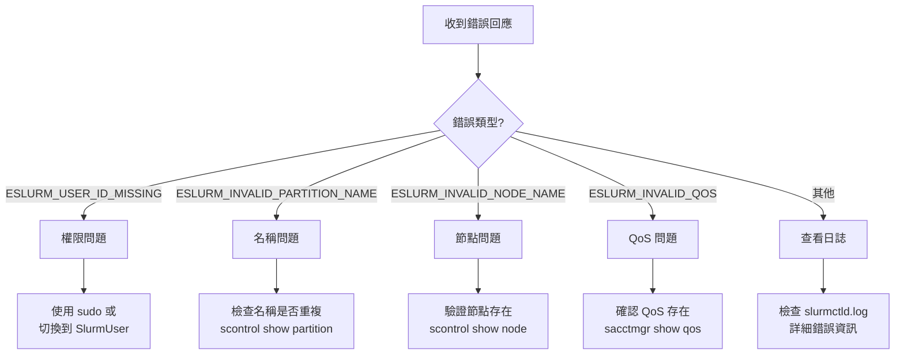

---

## 九、關鍵檔案清單

### 客戶端檔案

| 檔案路徑 | 功能說明 | 關鍵函數 |
|----------|----------|----------|
| `src/scontrol/scontrol.c` | scontrol 命令入口 | `main()`, `_create_it()` |
| `src/scontrol/update_part.c` | Partition 參數解析 | `scontrol_create_part()`, `scontrol_parse_part_options()` |
| `src/api/update_config.c` | 客戶端 RPC API | `slurm_create_partition()`, `_slurm_update()` |
| `src/api/init_msg.c` | 訊息結構初始化 | `slurm_init_part_desc_msg()` |

### 伺服器端檔案

| 檔案路徑 | 功能說明 | 關鍵函數 |
|----------|----------|----------|
| `src/slurmctld/proc_req.c` | RPC 處理與分派 | `_slurm_rpc_update_partition()` |
| `src/slurmctld/partition_mgr.c` | Partition 管理核心 | `update_part()`, `create_ctld_part_record()`, `build_part_bitmap()` |
| `src/slurmctld/slurmctld.h` | slurmctld 頭檔案 | 資料結構與函數宣告 |

### 共用檔案

| 檔案路徑 | 功能說明 | 關鍵內容 |
|----------|----------|----------|
| `src/common/msg_type.h` | RPC 訊息類型定義 | `REQUEST_CREATE_PARTITION` 等常數 |
| `src/common/part_record.h` | Partition 記錄結構 | `part_record_t` 結構定義 |
| `src/common/slurm_protocol_pack.c` | RPC 序列化 | `pack_update_part_msg()`, `unpack_update_part_msg()` |
| `slurm/slurm.h` | 公開 API 結構 | `partition_info_t`, `update_part_msg_t` |

---

## 延伸閱讀

### 相關技術文件

| 文件 | 說明 |
|------|------|
| [Slurm Partition 完整技術指南](../configuration/slurm-partition-guide.md) | Partition 配置參數與實務範例 |

### 官方參考資源

| 資源 | 說明 |
|------|------|
| [SchedMD scontrol 文件](https://slurm.schedmd.com/scontrol.html) | scontrol 命令官方文件 |
| [Slurm 原始碼](https://github.com/SchedMD/slurm) | Slurm 官方 GitHub 儲存庫 |

---

*本文件基於 Slurm 原始碼分析撰寫，如有版本差異請以實際原始碼為準。*
