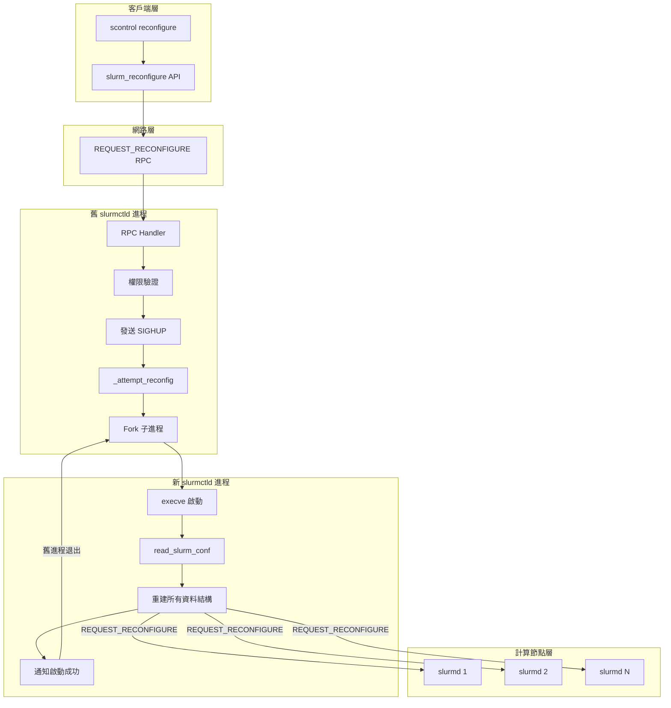
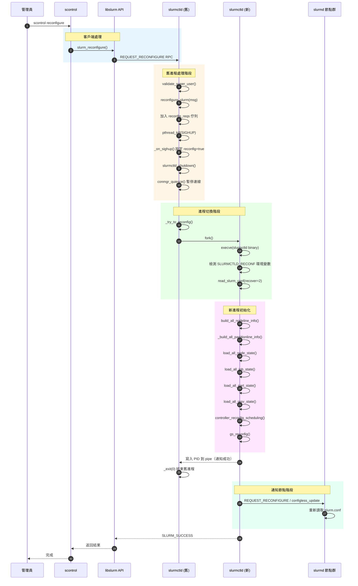
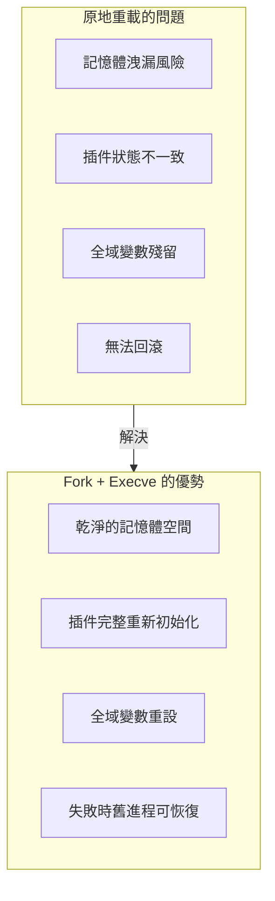
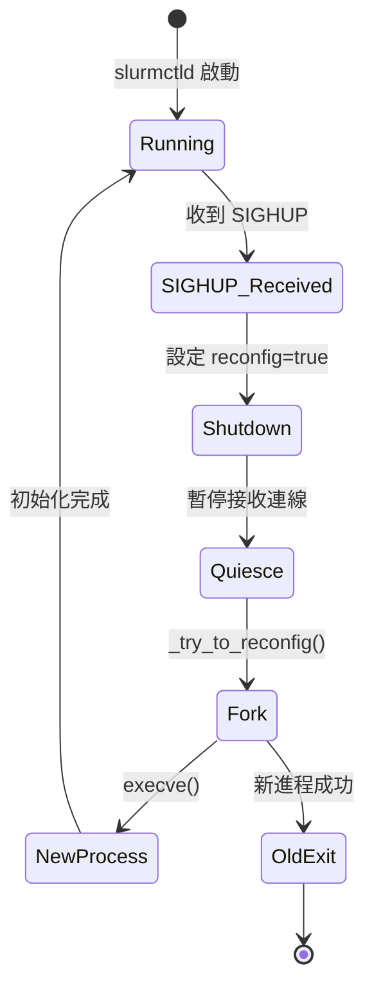
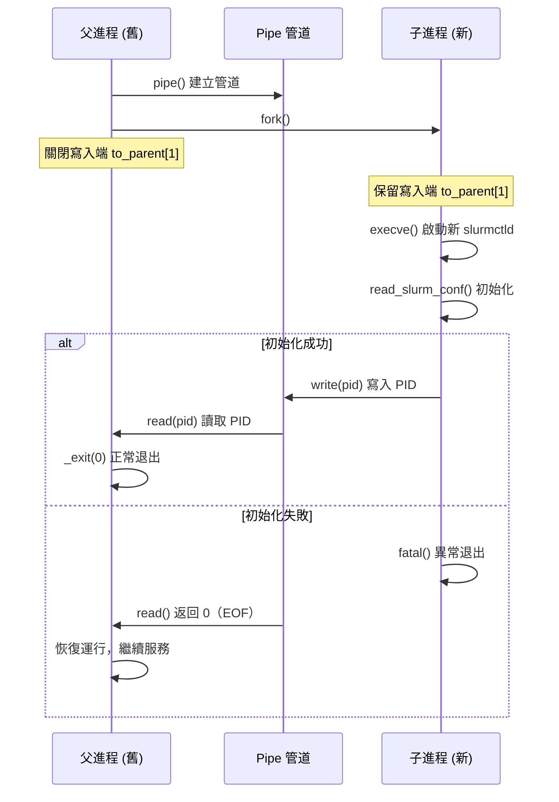
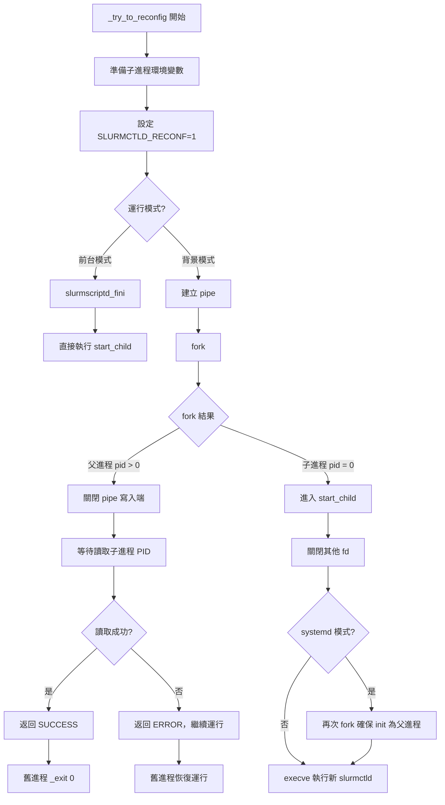
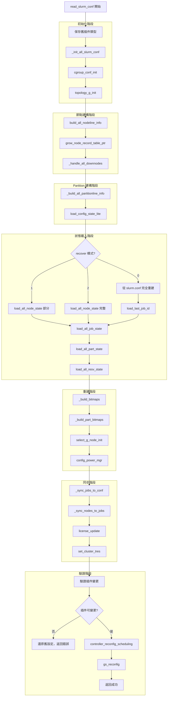
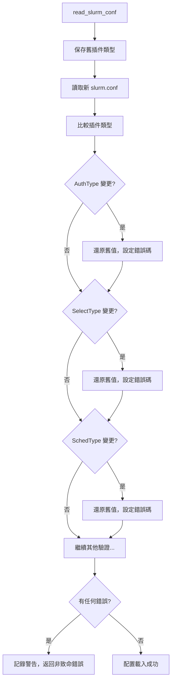
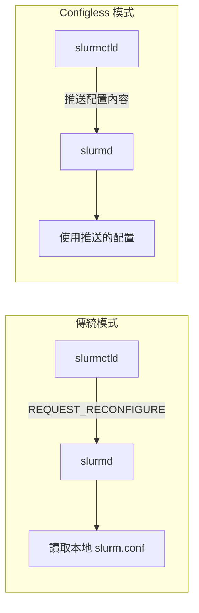
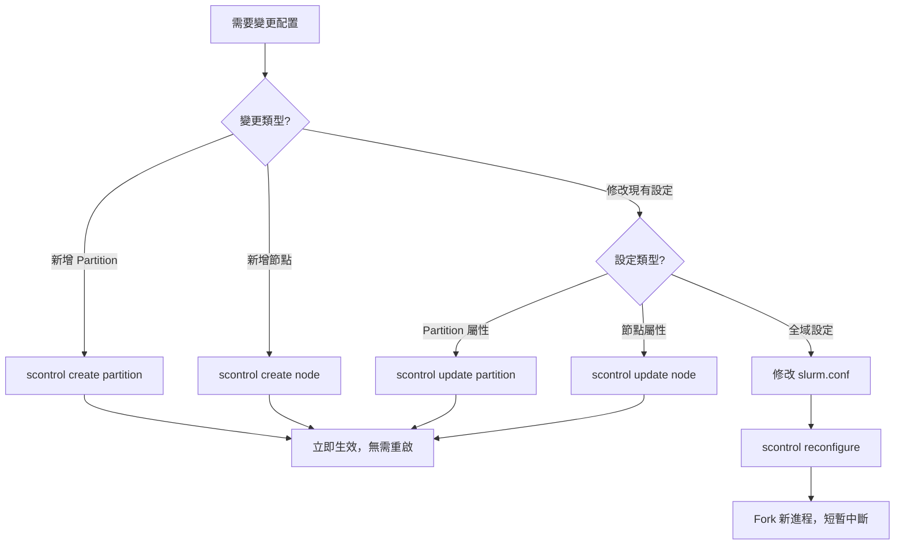

# scontrol reconfigure 內部實現解析

## 概述

本文件深入剖析 Slurm 中 `scontrol reconfigure` 命令的完整內部實現流程。這是一個 **重量級操作**，會透過 Fork + execve 機制啟動新的 slurmctld 進程來取代舊進程，確保配置變更的完整性和一致性。

> **讀者對象**：Slurm 核心開發者、系統管理員、DevOps 工程師
>
> **先備知識**：建議先了解 [Slurm Partition 配置指南](../configuration/slurm-partition-guide.md) 與 Unix 進程管理概念。

### 本文涵蓋內容

- 完整的 RPC 到進程切換流程
- Fork + execve 機制詳解
- `read_slurm_conf()` 配置重載核心邏輯
- 不可動態變更的配置項目
- 與動態操作（如 `scontrol create partition`）的比較

---

## 目錄

- [一、整體架構](#一整體架構)
- [二、核心技術概念](#二核心技術概念)
- [三、客戶端流程](#三客戶端流程)
- [四、slurmctld 處理流程](#四slurmctld-處理流程)
- [五、Fork + Execve 機制](#五fork--execve-機制)
- [六、配置重載核心 - read_slurm_conf()](#六配置重載核心---read_slurm_conf)
- [七、不可變更的配置項目](#七不可變更的配置項目)
- [八、通知 slurmd 節點](#八通知-slurmd-節點)
- [九、與動態操作的比較](#九與動態操作的比較)
- [十、完整函數調用鏈](#十完整函數調用鏈)
- [十一、錯誤處理與故障排除](#十一錯誤處理與故障排除)
- [延伸閱讀](#延伸閱讀)

---

## 一、整體架構

### 1.1 系統層級視圖

`scontrol reconfigure` 的處理流程跨越多個系統層級：



### 1.2 完整序列圖



---

## 二、核心技術概念

### 2.1 為什麼使用 Fork + Execve？

Slurm 選擇使用 **Fork + Execve** 機制而非原地重載配置，主要原因：



**程式碼說明**（`controller.c:1456-1510`）：

```c
static int _try_to_reconfig(void)
{
    pid_t pid;

    /* Fork 子進程 */
    if ((pid = fork()) < 0) {
        fatal("%s: fork() failed: %m", __func__);
    } else if (pid > 0) {
        /* 父進程（舊 slurmctld）*/
        /* 等待子進程通知啟動成功 */
        safe_read(to_parent[0], &grandchild_pid, sizeof(pid_t));
        info("Relinquishing control to new slurmctld process");
        return SLURM_SUCCESS;  /* 之後會 _exit(0) */
    }

    /* 子進程執行新的 slurmctld */
    execve(binary, main_argv, child_env);
    fatal("execv() failed: %m");
}
```

### 2.2 SIGHUP 信號機制

在 Unix 系統中，SIGHUP 傳統上用於通知進程「掛起」（Hang Up）。Slurm 將其重新定義為「重新配置」信號：



**程式碼說明**（`controller.c:396-416`）：

```c
static void _on_sighup(conmgr_callback_args_t conmgr_args, void *arg)
{
    info("Reconfigure signal (SIGHUP) received");

    /* 檢查是否在備援模式 */
    if (standby_mode) {
        backup_on_sighup();
        return;
    }

    /* 設定重新配置標誌 */
    reconfig = true;

    /* 觸發控制器關閉流程 */
    slurmctld_shutdown();
}
```

### 2.3 進程間通訊（IPC）

父子進程透過 **pipe** 進行通訊，確保新進程成功啟動後舊進程才退出：



---

## 三、客戶端流程

### 3.1 命令入口

當管理員執行 `scontrol reconfigure` 時：

**檔案**：`src/scontrol/scontrol.c`

```c
/* 識別 reconfigure 命令 */
if (xstrncasecmp(cmd, "reconfigure", MAX(cmdlen, 6)) == 0) {
    if (slurm_reconfigure()) {
        exit_code = 1;
        slurm_perror("slurm_reconfigure error");
    }
}
```

### 3.2 API 層

**檔案**：`src/api/reconfigure.c:65-82`

```c
int slurm_reconfigure(void)
{
    int rc = SLURM_SUCCESS;
    slurm_msg_t req;

    slurm_msg_t_init(&req);
    req.msg_type = REQUEST_RECONFIGURE;

    /* 發送 RPC 到 slurmctld */
    if (slurm_send_recv_controller_rc_msg(&req, &rc,
                                          working_cluster_rec) < 0)
        return SLURM_ERROR;

    if (rc)
        slurm_seterrno(rc);

    return rc ? SLURM_ERROR : SLURM_SUCCESS;
}
```

---

## 四、slurmctld 處理流程

### 4.1 RPC 分派表

**檔案**：`src/slurmctld/proc_req.c:6711`

```c
{
    .msg_type = REQUEST_RECONFIGURE,
    .func = _slurm_rpc_reconfigure_controller,
}
```

### 4.2 RPC 處理函數

**檔案**：`src/slurmctld/proc_req.c:3184-3198`

```c
static void _slurm_rpc_reconfigure_controller(slurm_msg_t *msg)
{
    /* 步驟 1：權限驗證 - 必須是超級用戶 */
    if (!validate_super_user(msg->auth_uid)) {
        error("Security violation, RECONFIGURE RPC from uid=%u",
              msg->auth_uid);
        slurm_send_rc_msg(msg, ESLURM_USER_ID_MISSING);

        /* 清理連線資源 */
        conn_g_destroy(msg->conn, true);
        msg->conn = NULL;
        FREE_NULL_MSG(msg);
        return;
    }

    info("Processing Reconfiguration Request");

    /* 步驟 2：開始重新配置流程 */
    reconfigure_slurm(msg);
}
```

### 4.3 觸發重新配置

**檔案**：`src/slurmctld/controller.c:1552-1559`

```c
extern void reconfigure_slurm(slurm_msg_t *msg)
{
    xassert(msg);

    /* 將請求加入佇列，稍後回覆 */
    list_append(reconfig_reqs, msg);

    /* 發送 SIGHUP 給自己，觸發重新配置流程 */
    pthread_kill(pthread_self(), SIGHUP);
}
```

---

## 五、Fork + Execve 機制

### 5.1 嘗試重新配置

**檔案**：`src/slurmctld/controller.c:324-359`

```c
static void _attempt_reconfig(void)
{
    info("Attempting to reconfigure");

    /* 步驟 1：暫停所有連線處理 */
    conmgr_quiesce(__func__);

    /* 步驟 2：在前台模式下先回覆請求者 */
    if (!daemonize && !under_systemd)
        _send_reconfig_replies();

    /* 步驟 3：嘗試 Fork 新進程 */
    reconfig_rc = _try_to_reconfig();

    /* 步驟 4：回覆所有等待的請求 */
    _send_reconfig_replies();

    /* 步驟 5：根據結果決定後續動作 */
    if (!reconfig_rc) {
        info("Relinquishing control to new child");
        _exit(0);  /* 新進程成功，舊進程退出 */
    }

    /* 重新配置失敗，恢復連線處理 */
    recover = 2;
    conmgr_unquiesce(__func__);
}
```

### 5.2 Fork 新進程的詳細流程

**檔案**：`src/slurmctld/controller.c:1390-1512`



### 5.3 環境變數傳遞

新進程透過環境變數識別自己是重新配置產生的：

| 環境變數 | 說明 |
|----------|------|
| `SLURMCTLD_RECONF=1` | 標識這是重新配置啟動 |
| `SLURMCTLD_RECONF_PIDFD` | 傳遞 PID 檔案描述符 |
| `SLURMCTLD_RECONF_PARENT_FD` | 父進程通訊管道 |
| `SLURMCTLD_RECONF_LISTEN_FDS` | 監聽 socket 列表 |
| `SLURMCTLD_RECONF_LISTEN_COUNT` | 監聽 socket 數量 |

---

## 六、配置重載核心 - read_slurm_conf()

### 6.1 函數概述

**檔案**：`src/slurmctld/read_config.c:1556-1900+`

`read_slurm_conf()` 是配置重載的核心函數，負責重建 slurmctld 的所有資料結構。

```c
/*
 * read_slurm_conf - load the slurm configuration from the configured file.
 * IN recover - 恢復模式：
 *              0 = 從 slurm.conf 完全重建
 *              1 = 恢復作業和觸發器狀態，節點 DOWN/DRAIN 狀態
 *              2 = 恢復所有狀態（reconfigure 使用此模式）
 */
extern int read_slurm_conf(int recover)
```

### 6.2 執行流程



### 6.3 關鍵子步驟解析

#### 6.3.1 節點資訊重建

```c
/* 從 slurm.conf 建構節點資訊 */
if ((error_code = build_all_nodeline_info(false, slurmctld_tres_cnt)))
    goto end_it;

/* 擴展節點表以支援動態節點 */
if ((slurm_conf.max_node_cnt != NO_VAL) &&
    node_record_count < slurm_conf.max_node_cnt) {
    node_record_count = slurm_conf.max_node_cnt;
    grow_node_record_table_ptr();
}
```

#### 6.3.2 狀態載入（recover=2 模式）

```c
if (recover > 1) {
    /* 完整恢復所有狀態 */
    (void) load_all_node_state(false);   /* 節點狀態 */
    _set_features(NULL, 0, recover);      /* 特性設定 */
}

/* 載入作業狀態 */
reconfig_flags |= RECONFIG_KEEP_PART_INFO;
load_all_job_state();

/* 載入 Partition 和預約狀態 */
(void) load_all_part_state(reconfig_flags);
load_all_resv_state(recover);
```

#### 6.3.3 排程器重新配置

```c
if (recover >= 1) {
    trigger_state_restore();
    controller_reconfig_scheduling();  /* 重新配置排程器 */
}

/* Gang Scheduler 重新配置 */
gs_reconfig();
```

---

## 七、不可變更的配置項目

某些核心配置在 `scontrol reconfigure` 時 **不能變更**，必須完全重啟 slurmctld：

### 7.1 不可變更配置列表

| 配置項目 | 錯誤碼 | 原因 |
|----------|--------|------|
| `AuthType` | `ESLURM_INVALID_AUTHTYPE_CHANGE` | 認證機制改變會導致現有連線失效 |
| `BurstBufferType` | `ESLURM_INVALID_BURST_BUFFER_CHANGE` | Burst Buffer 狀態無法遷移 |
| `CredType` | `ESLURM_INVALID_CRED_TYPE_CHANGE` | 憑證類型改變會導致作業無法驗證 |
| `NamespacePlugin` | `ESLURM_INVALID_NAMESPACE_CHANGE` | 命名空間隔離機制無法動態切換 |
| `SchedType` | `ESLURM_INVALID_SCHEDTYPE_CHANGE` | 排程器狀態無法遷移 |
| `SelectType` | `ESLURM_INVALID_SELECTTYPE_CHANGE` | 資源選擇邏輯改變會影響現有分配 |
| `SwitchType` | `ESLURM_INVALID_SWITCHTYPE_CHANGE` | 網路交換器插件無法動態切換 |

### 7.2 驗證邏輯

**檔案**：`src/slurmctld/read_config.c:1796-1843`

```c
/* 驗證 AuthType 是否變更 */
if (xstrcmp(old_auth_type, slurm_conf.authtype)) {
    xfree(slurm_conf.authtype);
    slurm_conf.authtype = old_auth_type;  /* 還原舊設定 */
    old_auth_type = NULL;
    rc = ESLURM_INVALID_AUTHTYPE_CHANGE;
}

/* 驗證 SelectType 是否變更 */
if (xstrcmp(old_select_type, slurm_conf.select_type)) {
    xfree(slurm_conf.select_type);
    slurm_conf.select_type = old_select_type;
    old_select_type = NULL;
    rc = ESLURM_INVALID_SELECTTYPE_CHANGE;
}

/* ... 其他驗證 ... */
```

### 7.3 處理流程



---

## 八、通知 slurmd 節點

### 8.1 通知機制

配置重載成功後，slurmctld 會通知所有 slurmd 節點：

**檔案**：`src/slurmctld/controller.c:1561-1570`

```c
static void _post_reconfig(void)
{
    if (running_configless) {
        /* Configless 模式：主動推送配置到節點 */
        configless_update();
        push_reconfig_to_slurmd();
        sackd_mgr_push_reconfig();
    } else {
        /* 傳統模式：通知節點重新讀取本地 slurm.conf */
        msg_to_slurmd(REQUEST_RECONFIGURE);
    }
}
```

### 8.2 兩種模式比較



| 特性 | 傳統模式 | Configless 模式 |
|------|----------|----------------|
| 配置來源 | 各節點本地 slurm.conf | slurmctld 推送 |
| 一致性 | 依賴檔案同步工具 | 自動保證一致 |
| 網路開銷 | 低（僅發送通知） | 較高（傳輸配置內容） |
| 適用場景 | 傳統叢集 | 雲端/容器化環境 |

### 8.3 slurmd 處理

**檔案**：`src/slurmd/slurmd/req.c:5032-5043`

```c
{
    .msg_type = REQUEST_RECONFIGURE,
    .func = _rpc_reconfigure,
},
{
    .msg_type = REQUEST_RECONFIGURE_WITH_CONFIG,
    .func = _rpc_reconfigure,
}
```

---

## 九、與動態操作的比較

### 9.1 比較表

| 特性 | `scontrol reconfigure` | `scontrol create partition/node` |
|------|------------------------|----------------------------------|
| **機制** | Fork + execve 新進程 | 直接修改記憶體 |
| **是否重啟** | 是（新進程取代舊進程） | 否 |
| **讀取 slurm.conf** | 是（完整重讀） | 否 |
| **影響範圍** | 整個叢集 | 僅該資源 |
| **中斷服務** | 短暫（fork 期間） | 無 |
| **通知 slurmd** | 是 | 否 |
| **可變更插件** | 否（部分插件） | 不適用 |
| **適用場景** | 修改 slurm.conf 後 | 動態增減資源 |

### 9.2 選擇指南



### 9.3 `trigger_reconfig()` 的澄清

**重要**：`scontrol create node` 中呼叫的 `trigger_reconfig()` **不是** `scontrol reconfigure`！

```c
/* src/slurmctld/trigger_mgr.c:575-584 */
extern void trigger_reconfig(void)
{
    /* 這只是設定一個標誌，用於 Slurm 觸發器系統 */
    slurm_mutex_lock(&trigger_mutex);
    trigger_node_reconfig = true;  /* 通知已註冊的觸發器腳本 */
    slurm_mutex_unlock(&trigger_mutex);
}
```

這個函數只是通知 Slurm 的 [Trigger 系統](https://slurm.schedmd.com/strigger.html)，讓用戶註冊的觸發器腳本可以執行，與 `scontrol reconfigure` 完全無關。

---

## 十、完整函數調用鏈

```
管理員執行: scontrol reconfigure
│
├─► scontrol [src/scontrol/scontrol.c]
│   └─► slurm_reconfigure() [src/api/reconfigure.c:65]
│       └─► slurm_send_recv_controller_rc_msg()
│           │
│ ========================= 網路傳輸 RPC =========================
│           │
│           ▼ REQUEST_RECONFIGURE
│
├─► slurmctld RPC 分派表 [proc_req.c:6711]
│   └─► _slurm_rpc_reconfigure_controller() [proc_req.c:3184]
│       ├─► validate_super_user() - 權限驗證
│       └─► reconfigure_slurm() [controller.c:1552]
│           ├─► list_append(reconfig_reqs, msg)
│           └─► pthread_kill(pthread_self(), SIGHUP)
│
├─► _on_sighup() [controller.c:396]
│   ├─► reconfig = true
│   └─► slurmctld_shutdown()
│
├─► 主迴圈檢測 reconfig [controller.c:1132]
│   └─► _attempt_reconfig() [controller.c:324]
│       ├─► conmgr_quiesce() - 暫停連線
│       ├─► _send_reconfig_replies() - 回覆請求者（前台模式）
│       └─► _try_to_reconfig() [controller.c:1390]
│           │
│           ├─► 準備環境變數
│           │   ├─► SLURMCTLD_RECONF=1
│           │   ├─► SLURMCTLD_RECONF_PIDFD
│           │   └─► SLURMCTLD_RECONF_PARENT_FD
│           │
│           ├─► pipe(to_parent) - 建立 IPC 管道
│           │
│           └─► fork()
│               │
│               ├─► [父進程] pid > 0
│               │   ├─► close(to_parent[1])
│               │   ├─► safe_read(to_parent[0], &grandchild_pid)
│               │   ├─► waitpid(pid) - 等待子進程
│               │   └─► 返回 SUCCESS
│               │
│               └─► [子進程] pid = 0
│                   ├─► closeall_except() - 關閉其他 fd
│                   ├─► [systemd] 再次 fork() 確保父進程是 init
│                   └─► execve(binary, main_argv, child_env)
│
│ ========================= 新進程啟動 =========================
│
├─► main() [controller.c] - 新 slurmctld
│   ├─► 檢測 SLURMCTLD_RECONF 環境變數
│   ├─► reconfiguring = true
│   │
│   └─► read_slurm_conf(recover=2) [read_config.c:1556]
│       │
│       ├─► 保存舊插件類型
│       │
│       ├─► _init_all_slurm_conf()
│       ├─► cgroup_conf_init()
│       ├─► topology_g_init()
│       │
│       ├─► build_all_nodeline_info() - 建構節點
│       ├─► _build_all_partitionline_info() - 建構 Partition
│       │
│       ├─► load_all_node_state() - 載入節點狀態
│       ├─► load_all_job_state() - 載入作業狀態
│       ├─► load_all_part_state() - 載入 Partition 狀態
│       ├─► load_all_resv_state() - 載入預約狀態
│       │
│       ├─► _build_bitmaps() - 建立位圖
│       ├─► _build_part_bitmaps() - 建立 Partition 位圖
│       ├─► select_g_node_init() - 選擇插件初始化
│       ├─► config_power_mgr() - 電源管理配置
│       │
│       ├─► _sync_jobs_to_conf() - 同步作業
│       ├─► _sync_nodes_to_jobs() - 同步節點
│       │
│       ├─► 驗證插件變更（不可變更的會還原）
│       │
│       ├─► controller_reconfig_scheduling() - 排程器重配置
│       └─► gs_reconfig() - Gang Scheduler 重配置
│
├─► notify_parent_of_success() [controller.c:1514]
│   └─► safe_write(fd, &pid) - 通知父進程
│
├─► [舊進程] 收到通知後 _exit(0)
│
└─► _post_reconfig() [controller.c:1561]
    ├─► [Configless] configless_update() + push_reconfig_to_slurmd()
    └─► [傳統] msg_to_slurmd(REQUEST_RECONFIGURE)
        └─► 所有 slurmd 重新讀取配置
```

---

## 十一、錯誤處理與故障排除

### 11.1 常見錯誤

| 錯誤 | 原因 | 解決方案 |
|------|------|----------|
| `ESLURM_USER_ID_MISSING` | 非 root 或 SlurmUser 執行 | 使用正確的管理員帳號 |
| `ESLURM_INVALID_AUTHTYPE_CHANGE` | 嘗試變更 AuthType | 完全重啟 slurmctld |
| `ESLURM_INVALID_SELECTTYPE_CHANGE` | 嘗試變更 SelectType | 完全重啟 slurmctld |
| Fork 失敗 | 系統資源不足 | 檢查 ulimit 和記憶體 |
| Execve 失敗 | slurmctld binary 問題 | 驗證 binary 路徑和權限 |

### 11.2 日誌訊息解讀

```bash
# 正常流程
info("Processing Reconfiguration Request")
info("Reconfigure signal (SIGHUP) received")
info("Attempting to reconfigure")
info("Relinquishing control to new slurmctld process")
info("child started successfully")

# 失敗情況
info("Resuming operation, reconfigure failed.")
error("failed to notify parent, may have two processes running now")
```

### 11.3 除錯技巧

```bash
# 1. 檢查 slurmctld 日誌
tail -f /var/log/slurm/slurmctld.log | grep -i reconfig

# 2. 確認進程狀態
ps aux | grep slurmctld

# 3. 驗證配置語法（不重載）
slurmctld -t

# 4. 查看當前配置
scontrol show config

# 5. 比較新舊配置
diff /etc/slurm/slurm.conf /etc/slurm/slurm.conf.bak
```

---

## 延伸閱讀

### 相關技術文件

| 文件 | 說明 |
|------|------|
| [Slurm Partition 完整技術指南](../configuration/slurm-partition-guide.md) | Partition 配置參數與實務範例 |
| [scontrol create partition 內部實現](./scontrol-create-partition-flow.md) | 動態建立 Partition 的程式碼流程 |

### 官方參考資源

| 資源 | 說明 |
|------|------|
| [SchedMD scontrol 文件](https://slurm.schedmd.com/scontrol.html) | scontrol 命令官方文件 |
| [Slurm 配置指南](https://slurm.schedmd.com/slurm.conf.html) | slurm.conf 完整參數說明 |
| [Slurm Trigger 文件](https://slurm.schedmd.com/strigger.html) | 觸發器系統說明 |

---

*本文件基於 Slurm 原始碼分析撰寫，如有版本差異請以實際原始碼為準。*
