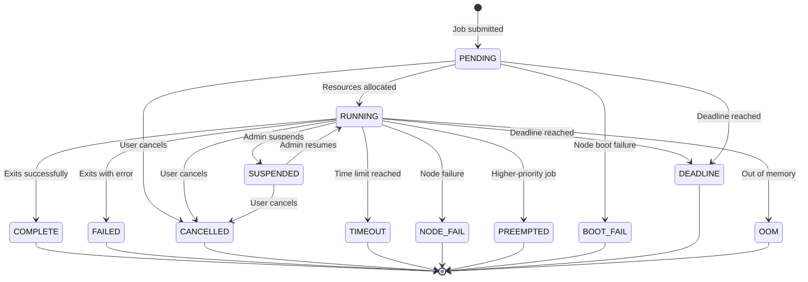
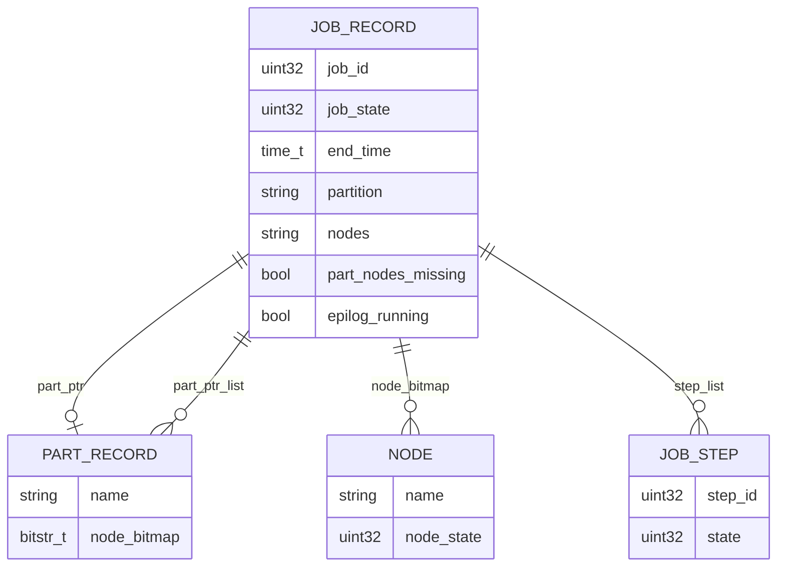
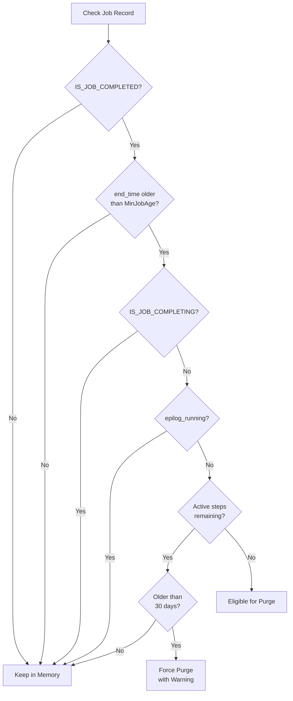
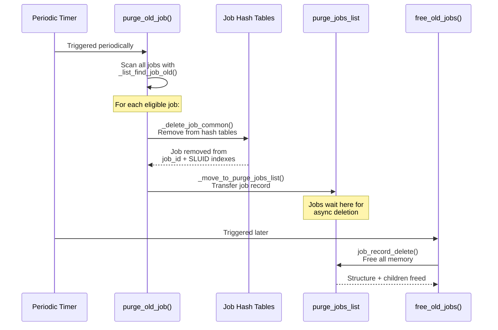
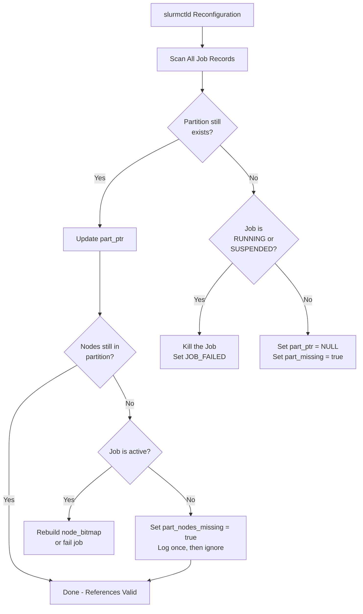
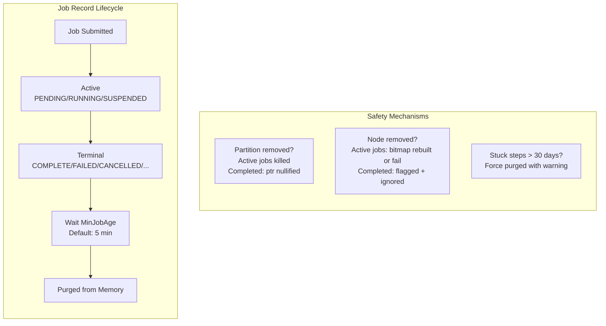

# Slurm Job State and MinJobAge Lifecycle: A Deep Dive

## Overview

This document provides an in-depth technical analysis of how Slurm manages job states, job record persistence, and the lifecycle of completed job records. You will learn how `MinJobAge` controls record purging, how partition and node references are maintained (or safely cleaned up) after job completion, and what safety mechanisms protect the system when infrastructure changes occur beneath running or completed jobs.

**Target Audience:** Slurm administrators, contributors, and anyone debugging job record behavior.

**Key Source Files Referenced:**

- `slurm/slurm.h` — Job state definitions
- `src/common/job_record.h` — Job record structure
- `src/slurmctld/job_mgr.c` — Job lifecycle management and purge logic
- `src/slurmctld/read_config.c` — Reconfiguration and reference handling

---

## 1. Job States

### 1.1 Base Job States

Slurm defines job states as an enumeration in `slurm/slurm.h`. Each job carries a `uint32_t job_state` field, where the **lower 8 bits** represent the base state and the **upper 24 bits** carry additional flags.

```c
enum job_states {
    JOB_PENDING    = 0,   /* queued waiting for initiation */
    JOB_RUNNING    = 1,   /* allocated resources and executing */
    JOB_SUSPENDED  = 2,   /* allocated resources, execution suspended */
    JOB_COMPLETE   = 3,   /* completed execution successfully */
    JOB_CANCELLED  = 4,   /* cancelled by user */
    JOB_FAILED     = 5,   /* completed execution unsuccessfully */
    JOB_TIMEOUT    = 6,   /* terminated on reaching time limit */
    JOB_NODE_FAIL  = 7,   /* terminated on node failure */
    JOB_PREEMPTED  = 8,   /* terminated due to preemption */
    JOB_BOOT_FAIL  = 9,   /* terminated due to node boot failure */
    JOB_DEADLINE   = 10,  /* terminated on deadline */
    JOB_OOM        = 11,  /* experienced out of memory error */
};
```

To extract the base state from the composite `job_state` field:

```c
#define JOB_STATE_BASE  0x000000ff
#define JOB_STATE_FLAGS 0xffffff00

uint32_t base_state = job_ptr->job_state & JOB_STATE_BASE;
```

### 1.2 State Flags

The upper bits carry additional context flags that can be combined with any base state:

| Flag | Meaning |
|------|---------|
| `JOB_COMPLETING` | Job is in the process of completing (epilog running) |
| `JOB_CONFIGURING` | Nodes are being configured (e.g., booting) |
| `JOB_POWER_UP_NODE` | Waiting for nodes to power up |
| `JOB_REQUEUE` | Job is being requeued |
| `JOB_REQUEUE_HOLD` | Held job being requeued |
| `JOB_SPECIAL_EXIT` | Job terminated with special exit code |
| `JOB_RESIZING` | Job is being resized |
| `JOB_REVOKED` | Sibling job was revoked |
| `JOB_SIGNALING` | Outgoing signal in progress |

A job can be in state `JOB_COMPLETE | JOB_COMPLETING`, meaning the base state is "complete" but the epilog is still running on some nodes.

### 1.3 State Diagram

The following diagram illustrates the possible job state transitions:



### 1.4 Terminal vs Active States

Understanding which states are "terminal" (completed) is critical for purge logic:

- **Active States:** `JOB_PENDING`, `JOB_RUNNING`, `JOB_SUSPENDED`
- **Terminal States:** `JOB_COMPLETE`, `JOB_CANCELLED`, `JOB_FAILED`, `JOB_TIMEOUT`, `JOB_NODE_FAIL`, `JOB_PREEMPTED`, `JOB_BOOT_FAIL`, `JOB_DEADLINE`, `JOB_OOM`

The macro `IS_JOB_COMPLETED(job_ptr)` checks whether a job is in any terminal state. Only jobs in terminal states are candidates for purging.

---

## 2. The Job Record Structure

### 2.1 Key Fields

The `job_record_t` structure in `src/common/job_record.h` holds all metadata for a job. Here are the fields most relevant to lifecycle management:

```c
struct job_record {
    /* Identity */
    uint32_t job_id;
    sluid_t  sluid;

    /* State */
    uint32_t job_state;         /* composite: base state + flags */
    time_t   start_time;        /* when execution began */
    time_t   end_time;          /* when execution ended (actual or expected) */

    /* Partition references */
    char         *partition;        /* name of partition(s) */
    part_record_t *part_ptr;        /* pointer to partition record */
    list_t       *part_ptr_list;    /* list of partition record pointers */
    bool          part_nodes_missing; /* nodes removed from partition */

    /* Node references */
    char      *nodes;              /* list of allocated node names */
    bitstr_t  *node_bitmap;        /* bitmap of allocated nodes */
    bitstr_t  *node_bitmap_cg;     /* bitmap of nodes completing */
    bitstr_t  *node_bitmap_pr;     /* bitmap of nodes running prolog */
    uint32_t   node_cnt;           /* count of allocated nodes */

    /* Steps */
    list_t   *step_list;           /* list of job steps */

    /* Epilog */
    bool      epilog_running;      /* EpilogSlurmctld in progress */
};
```

### 2.2 Reference Relationship Diagram



---

## 3. MinJobAge and the Purge Mechanism

### 3.1 What is MinJobAge?

`MinJobAge` is a `slurm.conf` configuration parameter that controls how long completed job records remain in the controller's memory before becoming eligible for purging.

```
# slurm.conf
MinJobAge=300    # Default: 300 seconds (5 minutes)
```

- **Default Value:** 300 seconds (5 minutes)
- **Defined in:** `src/common/read_config.h` as `DEFAULT_MIN_JOB_AGE = 300`
- **Setting to 0:** Disables purging entirely; completed job records persist indefinitely (until `slurmctld` restarts)

### 3.2 Purge Eligibility Criteria

A completed job record becomes eligible for purging when **all** of the following conditions are met:

1. **Job is in a terminal state:** `IS_JOB_COMPLETED(job_ptr)` returns true
2. **Age exceeds MinJobAge:** `now - job_ptr->end_time >= slurm_conf.min_job_age`
3. **Not in completing state:** `!IS_JOB_COMPLETING(job_ptr)` (epilog finished on all nodes)
4. **Epilog not running:** `!job_ptr->epilog_running`
5. **No active steps:** `!job_ptr->step_list || list_count(job_ptr->step_list) == 0`

### 3.3 Purge Decision Flowchart



### 3.4 The Emergency Force Purge

If a completed job has been lingering for more than **30 days** (`PURGE_OLD_JOB_IN_SEC = 2,592,000` seconds) but still appears to have active steps, Slurm force-purges it. This is a safety valve for stuck jobs:

```c
#define PURGE_OLD_JOB_IN_SEC 2592000  /* 30 days */
```

When this happens, Slurm logs a warning advising the administrator to investigate the associated nodes, as the stuck steps may indicate a deeper issue.

---

## 4. The Complete Purge Lifecycle

### 4.1 Three-Phase Cleanup

Job record deletion is not instantaneous. Slurm uses a three-phase asynchronous process to avoid holding locks during memory deallocation:



**Phase 1 — `_delete_job_common()`:**
Remove the job from all hash tables (job ID index, SLUID index, job array index). After this phase, the job is no longer discoverable by any lookup.

**Phase 2 — `_move_to_purge_jobs_list()`:**
Transfer the job record to the `purge_jobs_list`. Decrement the global job count. The record still exists in memory but is queued for deletion.

**Phase 3 — `free_old_jobs()` / `job_record_delete()`:**
Asynchronously free the `job_record_t` structure and all its child structures (node bitmaps, step lists, strings, etc.).

### 4.2 Why Three Phases?

This design serves two purposes:

1. **Lock contention reduction:** Hash table removal happens under the main lock, but the expensive memory deallocation (freeing strings, bitmaps, step structures) happens asynchronously, reducing time spent holding the write lock.

2. **Safety:** By separating "unreachable" from "freed," the system avoids use-after-free scenarios where another thread might still hold a pointer to the job record during deletion.

---

## 5. Partition and Node Reference Handling

### 5.1 The Problem

When a job completes, its `part_ptr` and `node_bitmap` still point to live partition and node records. If an administrator removes a partition or node from the configuration, these pointers become **dangling references** — a potential source of crashes or data corruption.

### 5.2 Slurm's Safety Mechanisms

Slurm handles this in `src/slurmctld/read_config.c` during reconfiguration:



### 5.3 Behavior by Job State

| Scenario | Active Jobs (RUNNING/SUSPENDED) | Completed Jobs |
|----------|-------------------------------|----------------|
| **Partition removed** | Job is **killed** (set to JOB_FAILED) | `part_ptr` set to NULL; no requeue allowed |
| **Partition still exists** | References updated normally | References updated normally |
| **Node removed from partition** | `node_bitmap` rebuilt if possible; otherwise job fails | `part_nodes_missing` flag set; logged once |
| **Node completely removed** | Job fails with NODE_FAIL | No action (record will be purged) |

### 5.4 The `part_nodes_missing` Flag

This flag in `job_record_t` serves a specific purpose: **preventing log spam**. When a completed job's nodes are no longer in its partition:

1. The first time Slurm detects this, it logs an informational message:
   ```
   info("%pJ and its partition %s no longer contain node %s", ...)
   ```
2. It sets `job_ptr->part_nodes_missing = true`
3. On subsequent checks, the flag prevents repeated log messages

This is safe because the completed job record is destined for purging — the stale references are benign and will be freed when the record is deleted.

### 5.5 Why This Matters for Administrators

Removing nodes or partitions while completed job records still reference them is **safe**. Slurm's reconfiguration logic ensures:

- Active jobs are properly terminated if their infrastructure disappears
- Completed jobs have dangling pointers safely nullified or flagged
- No use-after-free or segfault conditions arise
- The `MinJobAge` window is short enough (default 5 minutes) that stale references are temporary

---

## 6. Practical Configuration Guide

### 6.1 Choosing the Right MinJobAge

| Use Case | Recommended Value | Rationale |
|----------|------------------|-----------|
| Production cluster | 300 (default) | Balance between memory and query ability |
| High-throughput cluster | 60-120 | Reduce memory pressure from rapid job churn |
| Debugging/development | 3600+ | Keep records longer for inspection |
| Accounting-heavy setup | 0 (disabled) | Rely on accounting DB; keep all records in memory |

### 6.2 Monitoring Considerations

- Use `scontrol show job <jobid>` to inspect job records before they are purged
- After `MinJobAge` expires, rely on `sacct` (Slurm accounting database) for historical data
- The 30-day force purge generates log warnings — monitor `slurmctld.log` for these

### 6.3 Reconfiguration Safety Checklist

Before removing partitions or nodes from `slurm.conf`:

1. Check for running jobs on affected resources: `squeue -w <nodelist>` or `squeue -p <partition>`
2. Drain nodes first: `scontrol update NodeName=<node> State=DRAIN Reason="Decommission"`
3. Wait for running jobs to complete or cancel them explicitly
4. Apply the reconfiguration: `scontrol reconfigure`
5. Completed job records with stale references will be purged automatically by `MinJobAge`

---

## 7. Summary



**Key Takeaways:**

- Slurm defines 12 base job states; 9 of them are terminal (completed) states
- `MinJobAge` (default 300s) controls how long completed records stay in memory
- Purge requires: terminal state + age exceeded + no completing flag + no running epilog + no active steps
- Partition/node removal during the `MinJobAge` window is safe — Slurm nullifies dangling pointers
- The three-phase async purge process (hash removal, queue, free) prevents lock contention and use-after-free
- Emergency force purge at 30 days handles permanently stuck jobs

---

*This document reflects analysis of the Slurm source code in the current repository. Specific line numbers and implementation details may shift as the codebase evolves.*
