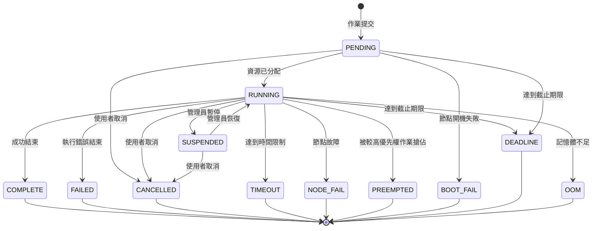
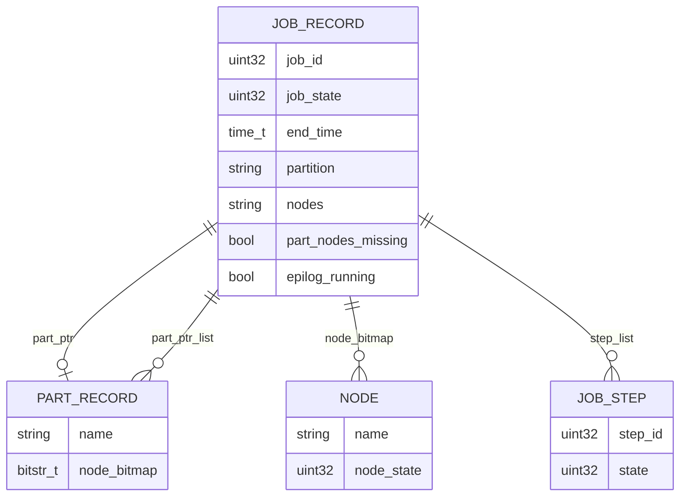
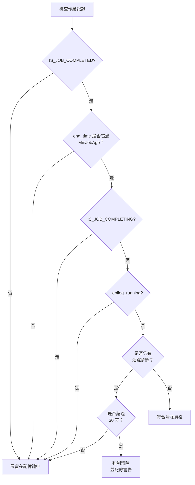
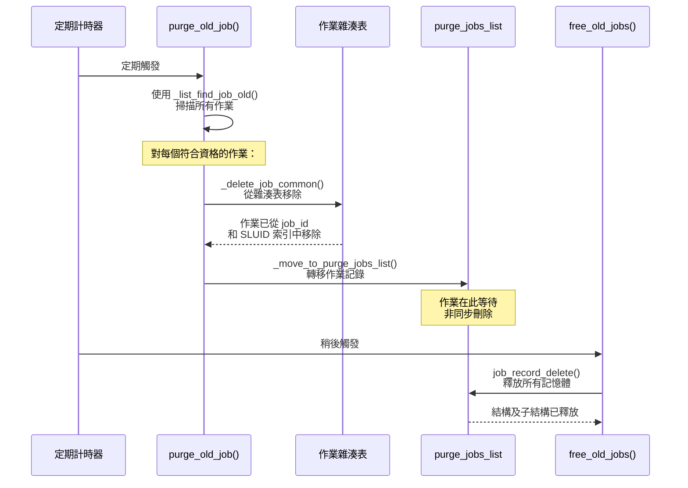
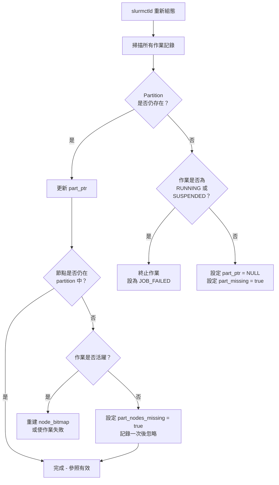
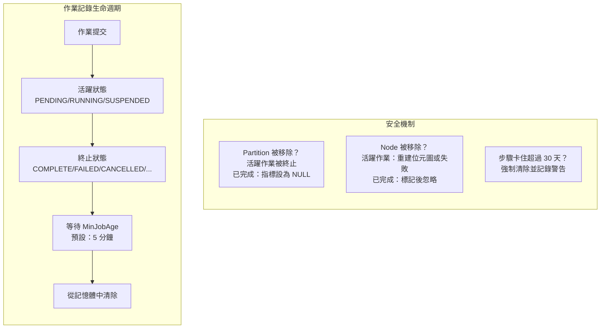

# Slurm 作業狀態與 MinJobAge 生命週期深入分析

## 概述

本文件深入分析 Slurm 如何管理作業狀態、作業記錄的持久性，以及已完成作業記錄的生命週期。您將了解 `MinJobAge` 如何控制記錄的清除、partition 與 node 的參照如何被維護（或安全地清理），以及當基礎設施在執行中或已完成的作業之下發生變更時，系統有哪些安全機制加以保護。

**目標讀者：** Slurm 系統管理員、開發貢獻者，以及任何需要除錯作業記錄行為的人員。

**主要參照原始碼檔案：**

- `slurm/slurm.h` — 作業狀態定義
- `src/common/job_record.h` — 作業記錄結構
- `src/slurmctld/job_mgr.c` — 作業生命週期管理與清除邏輯
- `src/slurmctld/read_config.c` — 重新組態與參照處理

---

## 1. 作業狀態

### 1.1 基本作業狀態

Slurm 在 `slurm/slurm.h` 中以列舉型別定義作業狀態。每個作業攜帶一個 `uint32_t job_state` 欄位，其中**低 8 位元**代表基本狀態，**高 24 位元**則帶有附加旗標。

```c
enum job_states {
    JOB_PENDING    = 0,   /* 在佇列中等待啟動 */
    JOB_RUNNING    = 1,   /* 已分配資源並正在執行 */
    JOB_SUSPENDED  = 2,   /* 已分配資源，但執行被暫停 */
    JOB_COMPLETE   = 3,   /* 成功完成執行 */
    JOB_CANCELLED  = 4,   /* 被使用者取消 */
    JOB_FAILED     = 5,   /* 執行失敗 */
    JOB_TIMEOUT    = 6,   /* 因達到時間限制而終止 */
    JOB_NODE_FAIL  = 7,   /* 因節點故障而終止 */
    JOB_PREEMPTED  = 8,   /* 因被搶佔而終止 */
    JOB_BOOT_FAIL  = 9,   /* 因節點開機失敗而終止 */
    JOB_DEADLINE   = 10,  /* 因截止期限到達而終止 */
    JOB_OOM        = 11,  /* 發生記憶體不足錯誤 */
};
```

從複合 `job_state` 欄位中提取基本狀態的方式：

```c
#define JOB_STATE_BASE  0x000000ff
#define JOB_STATE_FLAGS 0xffffff00

uint32_t base_state = job_ptr->job_state & JOB_STATE_BASE;
```

### 1.2 狀態旗標

高位元帶有附加的上下文旗標，可與任何基本狀態組合使用：

| 旗標 | 意義 |
|------|------|
| `JOB_COMPLETING` | 作業正在完成過程中（epilog 正在執行） |
| `JOB_CONFIGURING` | 節點正在進行組態設定（例如開機中） |
| `JOB_POWER_UP_NODE` | 等待節點啟動電源 |
| `JOB_REQUEUE` | 作業正在重新排入佇列 |
| `JOB_REQUEUE_HOLD` | 被保留的作業正在重新排入佇列 |
| `JOB_SPECIAL_EXIT` | 作業以特殊結束碼終止 |
| `JOB_RESIZING` | 作業正在調整大小 |
| `JOB_REVOKED` | 兄弟作業已被撤銷 |
| `JOB_SIGNALING` | 正在發送訊號 |

一個作業可以處於 `JOB_COMPLETE | JOB_COMPLETING` 狀態，表示基本狀態為「已完成」但 epilog 仍在某些節點上執行。

### 1.3 狀態轉換圖

以下圖表說明可能的作業狀態轉換：



### 1.4 終止狀態與活躍狀態

了解哪些狀態是「終止」（已完成）狀態，對清除邏輯至關重要：

- **活躍狀態：** `JOB_PENDING`、`JOB_RUNNING`、`JOB_SUSPENDED`
- **終止狀態：** `JOB_COMPLETE`、`JOB_CANCELLED`、`JOB_FAILED`、`JOB_TIMEOUT`、`JOB_NODE_FAIL`、`JOB_PREEMPTED`、`JOB_BOOT_FAIL`、`JOB_DEADLINE`、`JOB_OOM`

巨集 `IS_JOB_COMPLETED(job_ptr)` 用於檢查作業是否處於任何終止狀態。只有處於終止狀態的作業才有資格被清除。

---

## 2. 作業記錄結構

### 2.1 關鍵欄位

`src/common/job_record.h` 中的 `job_record_t` 結構包含了一個作業的所有中繼資料。以下是與生命週期管理最相關的欄位：

```c
struct job_record {
    /* 身分識別 */
    uint32_t job_id;
    sluid_t  sluid;

    /* 狀態 */
    uint32_t job_state;         /* 複合值：基本狀態 + 旗標 */
    time_t   start_time;        /* 執行開始時間 */
    time_t   end_time;          /* 執行結束時間（實際或預期） */

    /* Partition 參照 */
    char         *partition;        /* partition 名稱 */
    part_record_t *part_ptr;        /* 指向 partition 記錄的指標 */
    list_t       *part_ptr_list;    /* partition 記錄指標串列 */
    bool          part_nodes_missing; /* 節點已從 partition 中移除 */

    /* Node 參照 */
    char      *nodes;              /* 已分配的節點名稱列表 */
    bitstr_t  *node_bitmap;        /* 已分配節點的位元圖 */
    bitstr_t  *node_bitmap_cg;     /* 正在完成作業的節點位元圖 */
    bitstr_t  *node_bitmap_pr;     /* 正在執行 prolog 的節點位元圖 */
    uint32_t   node_cnt;           /* 已分配節點數量 */

    /* 步驟 */
    list_t   *step_list;           /* 作業步驟串列 */

    /* Epilog */
    bool      epilog_running;      /* EpilogSlurmctld 正在執行中 */
};
```

### 2.2 參照關聯圖



---

## 3. MinJobAge 與清除機制

### 3.1 什麼是 MinJobAge？

`MinJobAge` 是 `slurm.conf` 中的組態參數，控制已完成的作業記錄在控制器記憶體中保留多久，才會成為可被清除的對象。

```
# slurm.conf
MinJobAge=300    # 預設值：300 秒（5 分鐘）
```

- **預設值：** 300 秒（5 分鐘）
- **定義位置：** `src/common/read_config.h` 中的 `DEFAULT_MIN_JOB_AGE = 300`
- **設為 0：** 完全停用清除功能；已完成的作業記錄將無限期保留（直到 `slurmctld` 重新啟動）

### 3.2 清除資格條件

已完成的作業記錄在以下**所有**條件皆滿足時，才有資格被清除：

1. **作業處於終止狀態：** `IS_JOB_COMPLETED(job_ptr)` 回傳 true
2. **存活時間超過 MinJobAge：** `now - job_ptr->end_time >= slurm_conf.min_job_age`
3. **不在完成中狀態：** `!IS_JOB_COMPLETING(job_ptr)`（所有節點上的 epilog 已完成）
4. **Epilog 未在執行：** `!job_ptr->epilog_running`
5. **沒有活躍的步驟：** `!job_ptr->step_list || list_count(job_ptr->step_list) == 0`

### 3.3 清除決策流程圖



### 3.4 緊急強制清除

如果一個已完成的作業已存在超過 **30 天**（`PURGE_OLD_JOB_IN_SEC = 2,592,000` 秒）但仍然顯示有活躍步驟，Slurm 會強制清除它。這是針對卡住作業的安全閥門：

```c
#define PURGE_OLD_JOB_IN_SEC 2592000  /* 30 天 */
```

當此情況發生時，Slurm 會記錄警告訊息，建議管理員調查相關節點，因為卡住的步驟可能代表更深層的問題。

---

## 4. 完整清除生命週期

### 4.1 三階段清理

作業記錄的刪除並非即時完成。Slurm 使用三階段非同步流程，以避免在記憶體釋放期間持有鎖定：



**第一階段 — `_delete_job_common()`：**
從所有雜湊表中移除作業（job ID 索引、SLUID 索引、作業陣列索引）。此階段完成後，作業將無法再透過任何查詢方式找到。

**第二階段 — `_move_to_purge_jobs_list()`：**
將作業記錄轉移至 `purge_jobs_list`，並遞減全域作業計數。記錄仍存在於記憶體中，但已排入待刪除佇列。

**第三階段 — `free_old_jobs()` / `job_record_delete()`：**
非同步釋放 `job_record_t` 結構及其所有子結構（節點位元圖、步驟串列、字串等）。

### 4.2 為什麼要三個階段？

此設計有兩個目的：

1. **降低鎖定競爭：** 雜湊表移除在主鎖定下進行，但耗時的記憶體釋放（釋放字串、位元圖、步驟結構）則非同步進行，減少持有寫入鎖定的時間。

2. **安全性：** 透過將「不可達」與「已釋放」分離，系統可避免 use-after-free 的情況——即另一個執行緒在刪除過程中仍持有指向作業記錄的指標。

---

## 5. Partition 與 Node 參照處理

### 5.1 問題描述

當作業完成後，其 `part_ptr` 和 `node_bitmap` 仍然指向存活的 partition 和 node 記錄。如果管理員從組態中移除 partition 或 node，這些指標會變成**懸空參照（dangling references）**——可能導致程式崩潰或資料損壞。

### 5.2 Slurm 的安全機制

Slurm 在重新組態時於 `src/slurmctld/read_config.c` 中處理此問題：



### 5.3 依作業狀態的行為

| 情境 | 活躍作業（RUNNING/SUSPENDED） | 已完成作業 |
|------|-------------------------------|-----------|
| **Partition 被移除** | 作業被**終止**（設為 JOB_FAILED） | `part_ptr` 設為 NULL；不允許重新排隊 |
| **Partition 仍存在** | 正常更新參照 | 正常更新參照 |
| **Node 從 partition 中移除** | 盡可能重建 `node_bitmap`；否則作業失敗 | 設定 `part_nodes_missing` 旗標；記錄一次 |
| **Node 完全移除** | 作業以 NODE_FAIL 失敗 | 無動作（記錄將被清除） |

### 5.4 `part_nodes_missing` 旗標

此旗標在 `job_record_t` 中有特定用途：**防止記錄檔重複輸出**。當已完成作業的節點不再屬於其 partition 時：

1. Slurm 首次偵測到時，會記錄一則資訊訊息：
   ```
   info("%pJ and its partition %s no longer contain node %s", ...)
   ```
2. 設定 `job_ptr->part_nodes_missing = true`
3. 後續檢查時，此旗標會防止重複記錄訊息

這是安全的，因為已完成的作業記錄注定會被清除——過時的參照是無害的，會在記錄刪除時一併釋放。

### 5.5 對管理員的意義

在已完成的作業記錄仍然參照節點或 partition 時移除它們是**安全的**。Slurm 的重新組態邏輯確保：

- 活躍作業在其基礎設施消失時會被正確終止
- 已完成作業的懸空指標會被安全地設為 NULL 或標記
- 不會產生 use-after-free 或 segfault 的情況
- `MinJobAge` 的時間窗口足夠短（預設 5 分鐘），過時的參照只是暫時性的

---

## 6. 實務組態指南

### 6.1 選擇合適的 MinJobAge

| 使用情境 | 建議值 | 理由 |
|----------|--------|------|
| 正式環境叢集 | 300（預設） | 在記憶體使用與查詢能力之間取得平衡 |
| 高吞吐量叢集 | 60-120 | 降低快速作業輪替造成的記憶體壓力 |
| 除錯/開發環境 | 3600+ | 保留記錄更長時間以供檢查 |
| 重度使用 accounting 的環境 | 0（停用） | 依賴 accounting 資料庫；將所有記錄保留在記憶體中 |

### 6.2 監控注意事項

- 使用 `scontrol show job <jobid>` 在作業記錄被清除前進行檢查
- 在 `MinJobAge` 到期後，使用 `sacct`（Slurm accounting 資料庫）查詢歷史資料
- 30 天的強制清除會產生記錄警告——請監控 `slurmctld.log` 中的這些訊息

### 6.3 重新組態安全檢查清單

在從 `slurm.conf` 移除 partition 或 node 之前：

1. 檢查受影響資源上的執行中作業：`squeue -w <nodelist>` 或 `squeue -p <partition>`
2. 先將節點設為 drain 狀態：`scontrol update NodeName=<node> State=DRAIN Reason="Decommission"`
3. 等待執行中的作業完成，或明確取消它們
4. 套用重新組態：`scontrol reconfigure`
5. 具有過時參照的已完成作業記錄將由 `MinJobAge` 自動清除

---

## 7. 總結



**重點摘要：**

- Slurm 定義了 12 種基本作業狀態；其中 9 種為終止（已完成）狀態
- `MinJobAge`（預設 300 秒）控制已完成的記錄在記憶體中保留多久
- 清除條件：終止狀態 + 超過存活時間 + 無 completing 旗標 + epilog 未執行 + 無活躍步驟
- 在 `MinJobAge` 時間窗口內移除 partition/node 是安全的——Slurm 會將懸空指標設為 NULL
- 三階段非同步清除流程（雜湊表移除、排入佇列、釋放記憶體）可防止鎖定競爭與 use-after-free
- 30 天的緊急強制清除可處理永久卡住的作業

---

*本文件為基於目前程式碼庫的 Slurm 原始碼分析結果。特定行號與實作細節可能隨程式碼演進而變動。*
