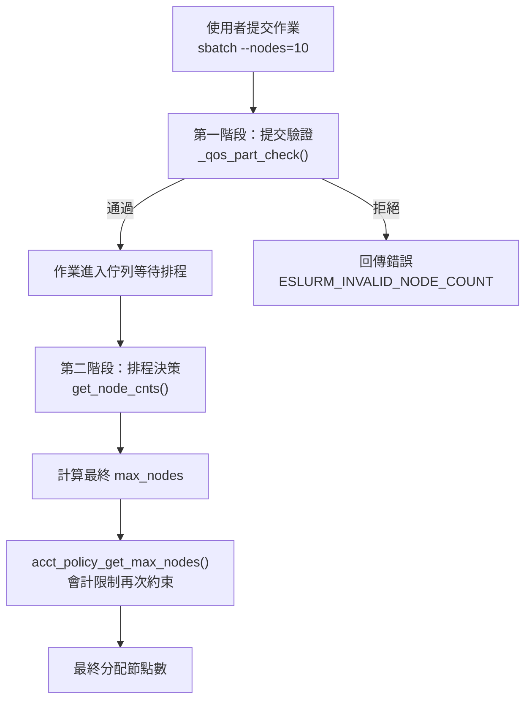
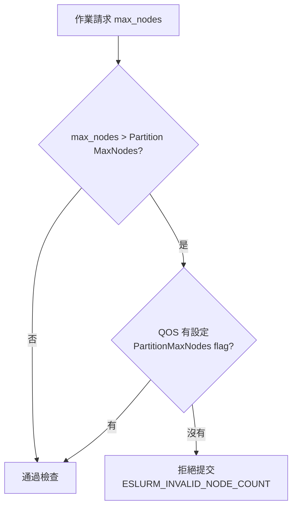
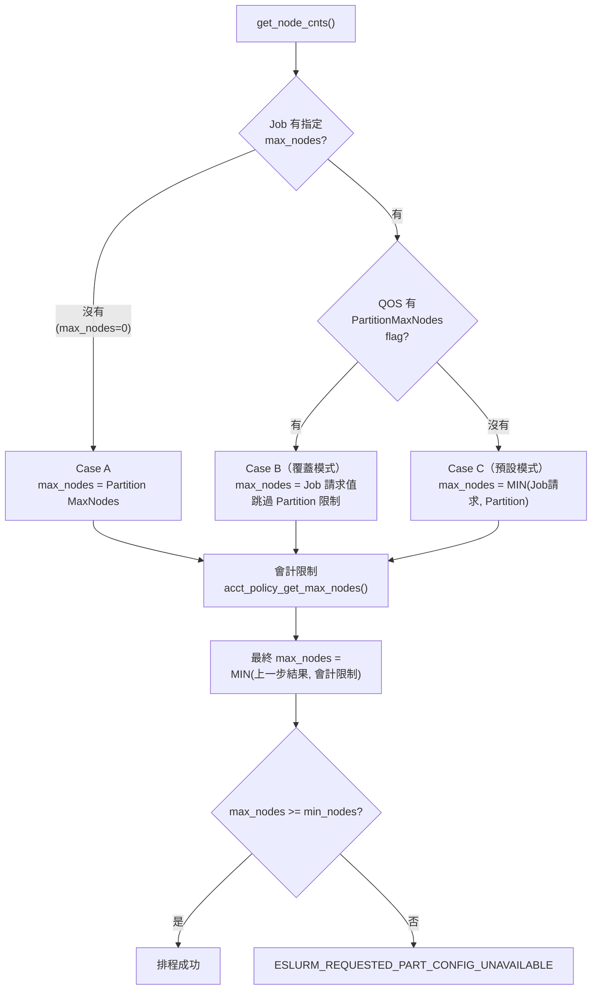
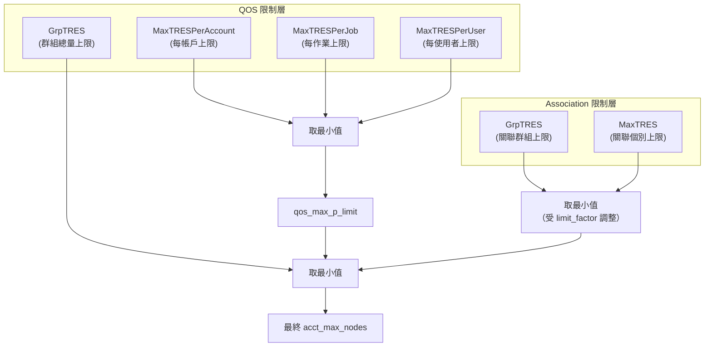
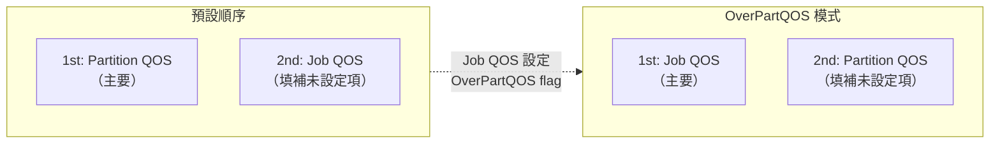
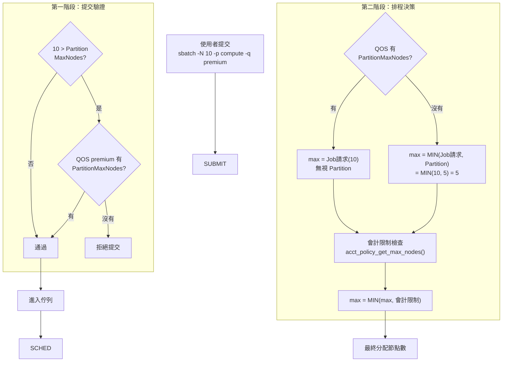
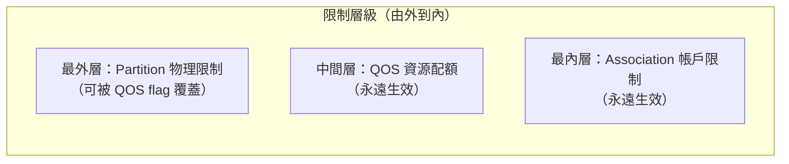

# Slurm QOS 與 Partition 節點限制交互機制深度解析

## 概述

在 Slurm 工作負載管理系統中，**QOS（Quality of Service）** 和 **Partition** 是兩個獨立的資源限制維度。當一個作業提交時，系統必須決定：這兩個維度的限制如何交互？誰說了算？

本文深入分析 Slurm 原始碼中這個看似矛盾、實則設計精巧的雙重限制機制。

**核心問題**

> 如果 Partition 限制 MaxNodes=5，QOS 允許 MaxNodesPerJob=8，作業請求 10 個節點 — 最終能拿到幾個？

答案取決於 **QOS 是否設定了覆蓋旗標**。這正是本文要拆解的關鍵設計。

---

## 架構總覽：雙重檢查機制

Slurm 對節點數量限制採用**兩階段檢查**：



**為什麼需要兩階段？**

- **提交階段**：快速拒絕明顯不合法的請求，避免浪費佇列資源
- **排程階段**：精確計算實際可用節點數，考慮即時的會計政策狀態

---

## 第一階段：提交驗證 (`_qos_part_check`)

**原始碼位置**：`src/slurmctld/job_mgr.c:6395-6443`

### 運作邏輯

當作業提交時，`_qos_part_check()` 對 Partition 限制進行閘門式檢查：

```c
// 檢查最大節點數
if ((part_ptr->state_up & PARTITION_SCHED) &&
    (qos_part_check->max_nodes != NO_VAL) &&
    (qos_part_check->max_nodes > part_ptr->max_nodes) &&
    (!qos_ptr || !(qos_ptr->flags & QOS_FLAG_PART_MAX_NODE))) {
    // 拒絕！作業請求超過 Partition 上限
    qos_part_check->error_code = ESLURM_INVALID_NODE_COUNT;
    return -1;
}
```

### 判斷流程



### 關鍵觀察

這個階段**只檢查 Partition 限制**，還不涉及 QOS 自身的資源配額（MaxNodesPerJob 等）。它是一個純粹的「門禁」：

- 沒有 flag → Partition 限制是硬性上限，超過直接拒絕
- 有 flag → 放行，讓排程階段做更精確的判斷

對 `min_nodes` 也有相同的對稱檢查（使用 `QOS_FLAG_PART_MIN_NODE`）。

---

## 第二階段：排程決策 (`get_node_cnts`)

**原始碼位置**：`src/slurmctld/node_scheduler.c:3144-3203`

這是決定作業**實際能獲得多少節點**的核心函式。

### 完整程式碼邏輯分析

```c
// === 步驟 1：決定 min_nodes ===
if (qos_flags & QOS_FLAG_PART_MIN_NODE)
    *min_nodes = job_ptr->details->min_nodes;       // 覆蓋：用 Job 請求值
else
    *min_nodes = MAX(job_min, part_min);             // 預設：取較大值

// === 步驟 2：決定 max_nodes（三條路徑）===
if (!job_ptr->details->max_nodes)
    *max_nodes = part_ptr->max_nodes;                // Case A: Job 沒指定
else if (qos_flags & QOS_FLAG_PART_MAX_NODE)
    *max_nodes = job_ptr->details->max_nodes;        // Case B: QOS 覆蓋
else
    *max_nodes = MIN(job_max, part_max);             // Case C: 預設取嚴格

// === 步驟 3：會計限制永遠生效 ===
acct_max_nodes = acct_policy_get_max_nodes(job_ptr, &wait_reason);
*max_nodes = MIN(*max_nodes, acct_max_nodes);        // 再取 MIN
```

### 三條路徑圖解



### 為什麼不矛盾？

表面上看，「取較嚴格」和「QOS 覆蓋 Partition」似乎矛盾。但實際上是**兩套獨立的行為模式**，由 flag 切換：

| 模式 | 觸發條件 | max_nodes 計算 | 設計目的 |
|---|---|---|---|
| **預設模式** | QOS 未設 `PartitionMaxNodes` | `MIN(Job, Partition)` | 安全優先，防止超配 |
| **覆蓋模式** | QOS 已設 `PartitionMaxNodes` | Job 請求值（無視 Partition） | 允許特權 QOS 突破 Partition 物理分區限制 |

關鍵設計：**無論哪種模式，會計限制（步驟 3）永遠生效**。覆蓋的是 Partition 限制，不是 QOS 自身的資源配額。

---

## 會計限制層：永恆的守門員 (`acct_policy_get_max_nodes`)

**原始碼位置**：`src/slurmctld/acct_policy.c:4402-4518`

這個函式是最終的安全網 — 不管前面怎麼算，都要過這一關。

### 限制層級架構



### 雙 QOS 優先順序機制

Slurm 支援「Job QOS」與「Partition QOS」同時存在。`acct_policy_set_qos_order()` 決定誰是主要 QOS（`qos_ptr_1`）：

```c
if (job_ptr->qos_ptr->flags & QOS_FLAG_OVER_PART_QOS) {
    *qos_ptr_1 = job_ptr->qos_ptr;        // Job QOS 為主
    *qos_ptr_2 = job_ptr->part_ptr->qos_ptr; // Partition QOS 為輔
} else {
    *qos_ptr_1 = job_ptr->part_ptr->qos_ptr; // Partition QOS 為主
    *qos_ptr_2 = job_ptr->qos_ptr;           // Job QOS 為輔
}
```

**主要 QOS 的限制優先採用；輔助 QOS 只在主要 QOS 未設定某項限制時才填補。**



---

## 完整決策流程圖

以下是一個作業從提交到最終節點分配的完整流程：



---

## 情境對照表

假設環境配置：

- **Partition** `compute`：MinNodes=1, MaxNodes=5
- **Job QOS** `premium`：MaxTRESPerJob/Node 可變
- Job 請求：`-N 10`

### 最大節點數情境

| 情境 | Partition Max | QOS MaxNodes/Job | QOS Flag | 提交結果 | 排程 max_nodes |
|---|---|---|---|---|---|
| 1. 預設，QOS 較寬 | 5 | 8 | 無 | 拒絕（10 > 5） | N/A |
| 2. 預設，Job 請求合法 (`-N 4`) | 5 | 8 | 無 | 通過 | MIN(4, 5) = 4，再 MIN(4, 8) = **4** |
| 3. 預設，QOS 較嚴 (`-N 4`) | 5 | 3 | 無 | 通過 | MIN(4, 5) = 4，再 MIN(4, 3) = **3** |
| 4. 覆蓋，QOS 較寬 | 5 | 8 | `PartitionMaxNodes` | 通過 | Job=10，再 MIN(10, 8) = **8** |
| 5. 覆蓋，QOS 較嚴 | 5 | 3 | `PartitionMaxNodes` | 通過 | Job=10，再 MIN(10, 3) = **3** |
| 6. 覆蓋，QOS 無限制 | 5 | 無限制 | `PartitionMaxNodes` | 通過 | Job=10，再 MIN(10, INF) = **10** |

### 最小節點數情境

| 情境 | Partition Min | Job 請求 min | QOS Flag | 排程 min_nodes |
|---|---|---|---|---|
| 預設 | 3 | 1 | 無 | MAX(1, 3) = **3** |
| 覆蓋 | 3 | 1 | `PartitionMinNodes` | **1**（允許低於 Partition 下限） |

---

## sacctmgr 設定範例

### 範例 1：建立預設 QOS（不覆蓋 Partition）

```bash
# 建立 QOS，限制每作業最多 8 節點
sacctmgr add qos standard \
    MaxTRESPerJob=node=8

# 將 QOS 關聯到帳戶
sacctmgr modify account research \
    set qos=standard

# 結果：作業節點數 = MIN(Job請求, Partition限制, 8)
```

### 範例 2：建立特權 QOS（覆蓋 Partition 限制）

```bash
# 建立 QOS 並設定 PartitionMaxNodes flag
sacctmgr add qos premium \
    MaxTRESPerJob=node=20 \
    flags=PartitionMaxNodes

# 結果：作業可突破 Partition MaxNodes，但仍受限於 20
```

### 範例 3：同時覆蓋最大與最小節點限制

```bash
sacctmgr add qos flexible \
    MaxTRESPerJob=node=50 \
    flags=PartitionMaxNodes,PartitionMinNodes

# 結果：作業完全不受 Partition 節點數範圍約束
#       但仍受 QOS 自身的 MaxTRESPerJob=node=50 限制
```

### 範例 4：設定 OverPartQOS 改變優先順序

```bash
# Partition 層級 QOS（寬鬆）
sacctmgr add qos part_default \
    MaxTRESPerJob=node=100

# Job 層級 QOS（嚴格但有覆蓋權）
sacctmgr add qos team_limited \
    MaxTRESPerJob=node=10 \
    flags=OverPartQOS

# 結果：team_limited 的限制優先於 part_default
#       最終 MaxNodes/Job = 10（不是 100）
```

### 範例 5：查看 QOS 設定

```bash
sacctmgr show qos format=name,flags,MaxTRESPerJob
```

輸出範例：

```text
      Name                Flags    MaxTRES
---------- -------------------- ----------
  standard                             node=8
   premium PartitionMaxNodes       node=20
  flexible Partition+          node=50
```

---

## 使用案例

### 案例 1：GPU 叢集的分層存取

**場景**：一個 GPU partition 只有 4 個節點，但研究團隊偶爾需要跨 partition 大規模運算。

```bash
# Partition 設定
# PartitionName=gpu Nodes=gpu[01-04] MaxNodes=4

# 一般使用者 QOS
sacctmgr add qos gpu_normal MaxTRESPerJob=node=2

# 特權研究 QOS — 允許突破 Partition 限制
sacctmgr add qos gpu_research \
    MaxTRESPerJob=node=8 \
    flags=PartitionMaxNodes
```

結果分析：

- `gpu_normal` 使用者：最多 MIN(請求, 4, 2) = **2 節點**
- `gpu_research` 使用者：最多 MIN(請求, 8) = **最多 8 節點**（可超過 Partition 的 4）

### 案例 2：教學環境的最小資源保證

**場景**：教學 partition 最小要求 4 節點（為了平行運算教學），但學生練習只需要 1 節點。

```bash
# Partition 設定
# PartitionName=teaching MinNodes=4

# 學生練習 QOS — 允許低於 Partition 最小值
sacctmgr add qos student_practice \
    flags=PartitionMinNodes

# 學生作業 QOS — 遵循 Partition 最小值
sacctmgr add qos student_homework
```

結果分析：

- `student_practice`：`sbatch -N 1` 可以提交，min_nodes = 1
- `student_homework`：`sbatch -N 1` 實際 min_nodes = MAX(1, 4) = 4

---

## 設計哲學總結



| 設計原則 | 說明 |
|---|---|
| **預設安全** | 沒有任何 flag 時，所有限制取交集（最嚴格），確保不超配 |
| **顯式授權** | 覆蓋需要管理員主動設定 flag，不會意外發生 |
| **會計不可繞過** | 即使覆蓋了 Partition，QOS 和 Association 的會計限制仍然生效 |
| **分層防禦** | Partition 是第一道門，QOS 會計是第二道門，任何一道都能擋住 |

這個設計的核心智慧在於：**Partition 限制代表「物理分區的建議邊界」，而 QOS 會計限制代表「組織的資源策略」**。前者可以在需要時彈性調整，後者則是不可動搖的底線。

---

## 相關原始碼索引

| 函式 | 檔案位置 | 職責 |
|---|---|---|
| `_qos_part_check()` | `src/slurmctld/job_mgr.c:6395` | 提交階段 Partition 限制驗證 |
| `get_node_cnts()` | `src/slurmctld/node_scheduler.c:3144` | 排程階段節點數計算 |
| `acct_policy_get_max_nodes()` | `src/slurmctld/acct_policy.c:4402` | 會計政策最大節點數查詢 |
| `acct_policy_set_qos_order()` | `src/slurmctld/acct_policy.c:5254` | 雙 QOS 優先順序決策 |
| `QOS_FLAG_*` 定義 | `slurm/slurmdb.h:126-133` | QOS 旗標位元定義 |

---

## QOS Flag 快速參考

| Flag 名稱 | sacctmgr 設定值 | 效果 |
|---|---|---|
| `QOS_FLAG_PART_MIN_NODE` | `PartitionMinNodes` | 允許作業的 min_nodes 低於 Partition MinNodes |
| `QOS_FLAG_PART_MAX_NODE` | `PartitionMaxNodes` | 允許作業的 max_nodes 超過 Partition MaxNodes |
| `QOS_FLAG_PART_TIME_LIMIT` | `PartitionTimeLimit` | 允許作業的時間限制超過 Partition MaxTime |
| `QOS_FLAG_OVER_PART_QOS` | `OverPartQOS` | Job QOS 優先於 Partition QOS（改變會計限制的優先順序） |
