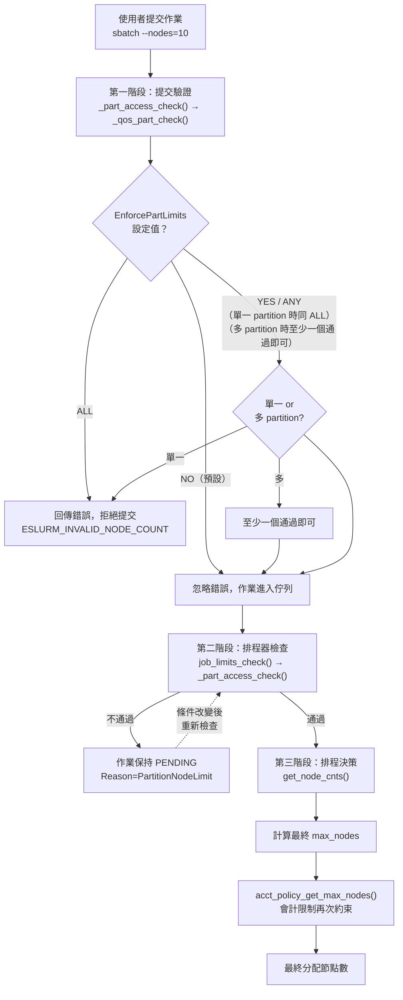
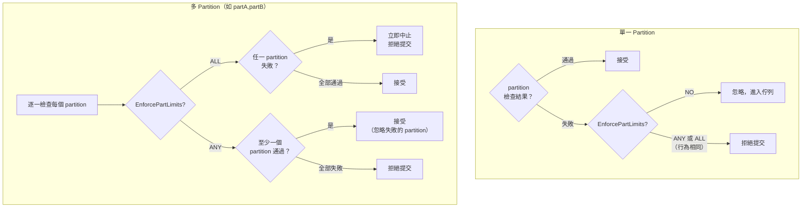
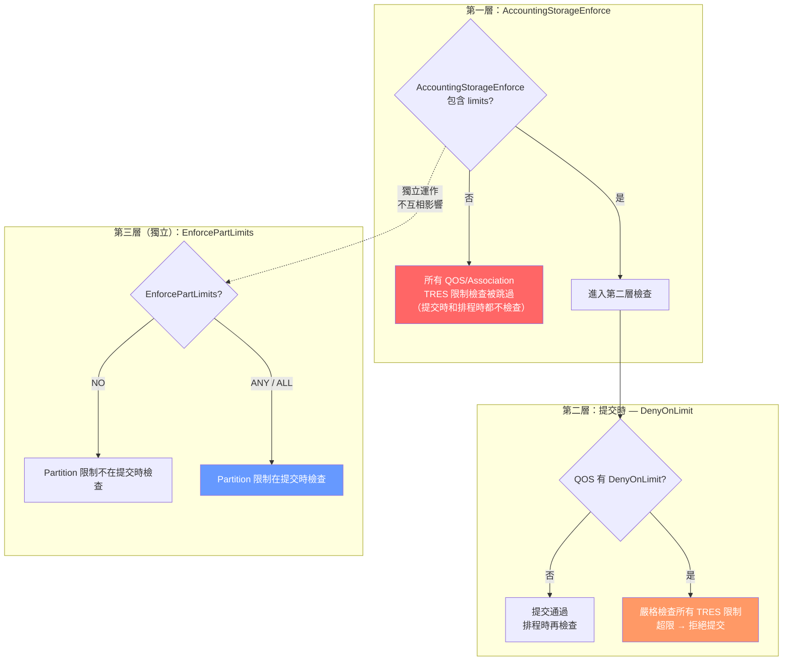
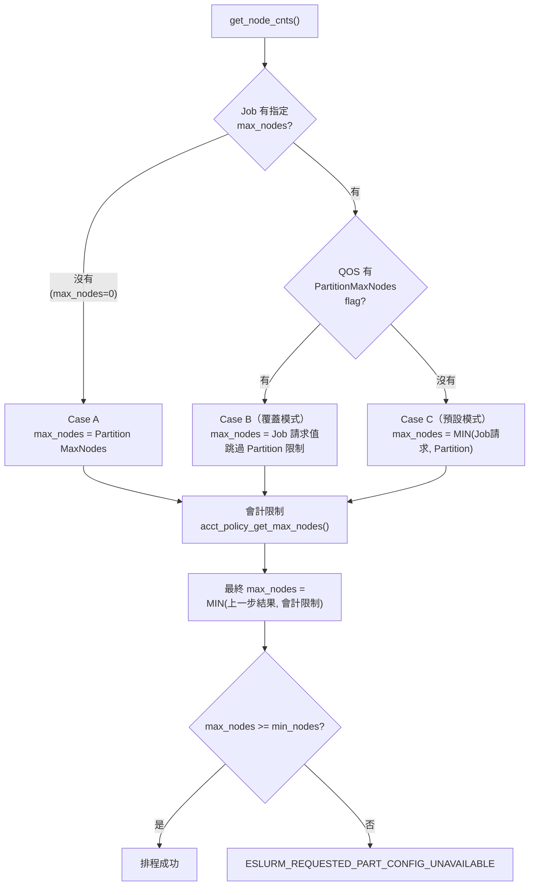
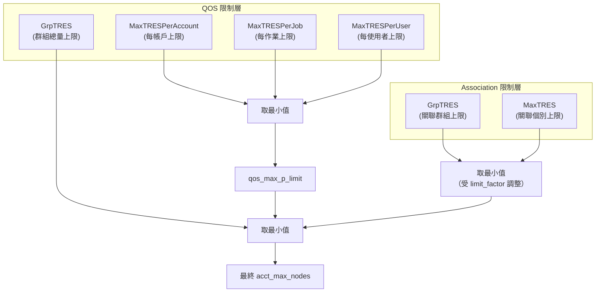
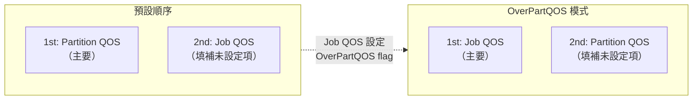
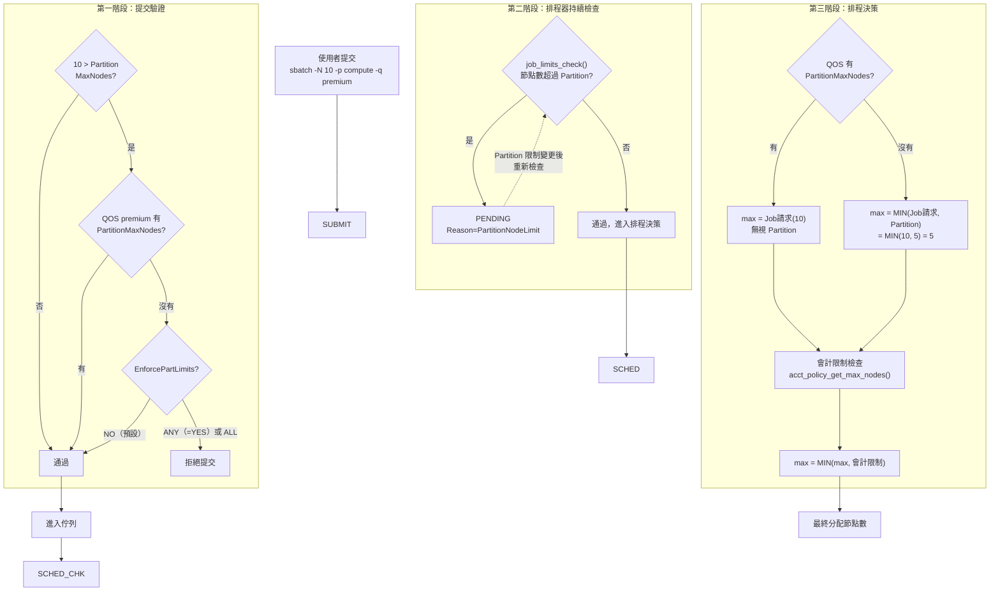
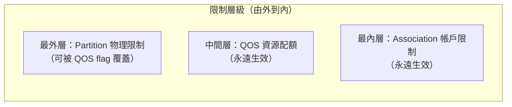

# Slurm QOS 與 Partition 節點限制交互機制深度解析

## 概述

在 Slurm 工作負載管理系統中，**QOS（Quality of Service）** 和 **Partition** 是兩個獨立的資源限制維度。當一個作業提交時，系統必須決定：這兩個維度的限制如何交互？誰說了算？

本文深入分析 Slurm 原始碼中這個看似矛盾、實則設計精巧的雙重限制機制。

**核心問題**

> 如果 Partition 限制 MaxNodes=5，QOS 允許 MaxNodesPerJob=8，作業請求 10 個節點 — 最終能拿到幾個？

答案取決於 **QOS 是否設定了覆蓋旗標** 以及 **`EnforcePartLimits` 的設定**。這正是本文要拆解的關鍵設計。

---

## 架構總覽：三階段檢查機制

Slurm 對節點數量限制採用**三階段檢查**：



**為什麼需要三階段？**

- **提交階段**：根據 `EnforcePartLimits` 決定是否立即拒絕不合法的請求
- **排程器檢查階段**：對已入佇列的作業持續驗證，設定 pending reason
- **排程決策階段**：精確計算實際可用節點數，考慮即時的會計政策狀態

---

## 第一階段：提交驗證

### `_qos_part_check()` — 節點限制檢查

**原始碼位置**：`src/slurmctld/job_mgr.c:6395-6443`

`_qos_part_check()` 負責比較作業請求與 Partition 的節點限制：

```c
// 檢查最大節點數
if ((part_ptr->state_up & PARTITION_SCHED) &&
    (qos_part_check->max_nodes != NO_VAL) &&
    (qos_part_check->max_nodes > part_ptr->max_nodes) &&
    (!qos_ptr || !(qos_ptr->flags & QOS_FLAG_PART_MAX_NODE))) {
    qos_part_check->error_code = ESLURM_INVALID_NODE_COUNT;
    return -1;
}
```

### `_valid_job_part()` — 決定是否真正拒絕

**原始碼位置**：`src/slurmctld/job_mgr.c:6748-6813`

`_qos_part_check()` 設定的錯誤碼**並不一定導致作業被拒絕**。外層的 `_valid_job_part()` 根據 `EnforcePartLimits` 決定最終行為：

```c
rc = _part_access_check(part_ptr, job_desc, req_bitmap,
                         submit_uid, qos_ptr, qos_ptr_list,
                         assoc_ptr ? assoc_ptr->acct : NULL);
if ((rc != SLURM_SUCCESS) &&
    ((rc == ESLURM_ACCESS_DENIED) ||
     (rc == ESLURM_USER_ID_MISSING) ||
     slurm_conf.enforce_part_limits))   // ← 關鍵條件！
    goto fini;
/* Enforce Part Limit = no */
rc = SLURM_SUCCESS;                     // ← 預設：忽略錯誤，讓作業進入佇列
```

### `EnforcePartLimits` 設定值解析

**原始碼位置**：`src/common/slurm_protocol_defs.c:5661-5686`

`EnforcePartLimits` 的設定值在解析時會被映射為三種內部狀態：

```c
if (!xstrcasecmp(value, "yes")
    || !xstrcasecmp(value, "up")
    || !xstrcasecmp(value, "true")
    || !xstrcasecmp(value, "1") || !xstrcasecmp(value, "any")) {
    *param = PARTITION_ENFORCE_ANY;      // YES = ANY
} else if (!xstrcasecmp(value, "no")
           || !xstrcasecmp(value, "down")
           || !xstrcasecmp(value, "false")
           || !xstrcasecmp(value, "0")) {
    *param = PARTITION_ENFORCE_NONE;     // NO
} else if (!xstrcasecmp(value, "all")) {
    *param = PARTITION_ENFORCE_ALL;      // ALL
}
```

| slurm.conf 設定值 | 內部常數 | 含義 |
|---|---|---|
| `NO` / `false` / `0` / `down` | `PARTITION_ENFORCE_NONE` (0) | 不強制（預設） |
| **`YES`** / `true` / `1` / `up` / `any` | **`PARTITION_ENFORCE_ANY`** | 至少一個 partition 通過即可 |
| `ALL` | `PARTITION_ENFORCE_ALL` | 所有 partition 都必須通過 |

> **注意**：`YES` 等同 `ANY`，**不是** `ALL`。這是 Slurm 的設計行為。

### `ANY` vs `ALL`：單一 vs 多 Partition 行為差異

**原始碼位置**：`src/slurmctld/job_mgr.c:6699-6813`

#### 單一 Partition 時：ANY 和 ALL 行為相同

當作業只提交到一個 partition 時，走 `_valid_job_part()` 的 `else` 分支（第 6799-6813 行）：

```c
rc = _part_access_check(part_ptr, ...);
if ((rc != SLURM_SUCCESS) &&
    ((rc == ESLURM_ACCESS_DENIED) ||
     (rc == ESLURM_USER_ID_MISSING) ||
     slurm_conf.enforce_part_limits))   // ← 非零即為 true
    goto fini;
```

`PARTITION_ENFORCE_ANY` 和 `PARTITION_ENFORCE_ALL` 都是非零值，所以在單一 partition 時**行為完全一致** — 只要檢查失敗就拒絕。

#### 多 Partition 時：核心差異

當作業提交到多個 partition（如 `sbatch -p partA,partB`）時，走 `_foreach_valid_part()` 迴圈（第 6699-6745 行）逐一檢查每個 partition：

```c
// _foreach_valid_part() — 對每個 partition 執行
rc = _part_access_check(part_ptr, ...);

if ((rc != SLURM_SUCCESS) &&
    ((rc == ESLURM_ACCESS_DENIED) ||
     (rc == ESLURM_USER_ID_MISSING) ||
     (slurm_conf.enforce_part_limits == PARTITION_ENFORCE_ALL))) {
    // ALL 模式：任何一個 partition 失敗 → 立即中止迴圈，拒絕提交
    foreach_valid_part->rc = rc;
    return -1;
} else if (rc != SLURM_SUCCESS) {
    // ANY 模式：記錄錯誤但繼續檢查下一個 partition
    foreach_valid_part->rc = rc;
} else {
    // 此 partition 通過
    foreach_valid_part->any_check = true;
}

// ANY 模式：只要找到一個通過的 partition，整體就成功
if (foreach_valid_part->any_check &&
    (slurm_conf.enforce_part_limits == PARTITION_ENFORCE_ANY))
    foreach_valid_part->rc = SLURM_SUCCESS;
```

迴圈結束後，`_valid_job_part()` 最終裁定（第 6780-6798 行）：

```c
if (list_is_empty(part_ptr_list) ||
    (slurm_conf.enforce_part_limits &&
     (foreach_valid_part.rc != SLURM_SUCCESS))) {
    if (slurm_conf.enforce_part_limits == PARTITION_ENFORCE_ALL)
        rc = foreach_valid_part.rc;           // ALL：回傳失敗的具體錯誤
    else if (slurm_conf.enforce_part_limits ==
             PARTITION_ENFORCE_ANY && !any_check)
        rc = foreach_valid_part.rc;           // ANY：全部都失敗才拒絕
    else
        rc = ESLURM_PARTITION_NOT_AVAIL;
    goto fini;
}
rc = SLURM_SUCCESS;  /* At least some partition usable */
```

#### 多 Partition 時的 min/max nodes 聚合邏輯

不論 ANY 或 ALL，多 partition 情境下會聚合所有 partition 的限制（第 6736-6743 行）：

```c
// 取所有 partition 中最小的 min_nodes
foreach_valid_part->min_nodes_orig =
    MIN(foreach_valid_part->min_nodes_orig, part_ptr->min_nodes_orig);
// 取所有 partition 中最大的 max_nodes
foreach_valid_part->max_nodes_orig =
    MAX(foreach_valid_part->max_nodes_orig, part_ptr->max_nodes_orig);
// 取所有 partition 中最大的 max_time
foreach_valid_part->max_time =
    MAX(foreach_valid_part->max_time, part_ptr->max_time);
```

這意味著後續的節點數/時間驗證（第 6818-6876 行）使用的是**所有 partition 中最寬鬆的限制**。

### 完整行為對照表

| 場景 | `NO` | `ANY`（= `YES`） | `ALL` |
|---|---|---|---|
| **單一 partition，檢查失敗** | 忽略，進入佇列 | 拒絕提交 | 拒絕提交 |
| **多 partition，全部失敗** | 忽略，進入佇列 | 拒絕提交 | 拒絕提交 |
| **多 partition，部分失敗** | 忽略，進入佇列 | 接受（至少一個通過） | 拒絕提交（第一個失敗即中止） |
| **多 partition，全部通過** | 接受 | 接受 | 接受 |
| **排程階段 max_nodes 聚合** | 不適用（不強制） | 取最寬鬆 | 取最寬鬆 |



### 排程階段的 ANY vs ALL 差異

**原始碼位置**：`src/slurmctld/job_mgr.c:3843-3898`

`_select_nodes_base()` 在排程階段也會根據模式做不同處理：

```c
// ANY 模式：limit check 失敗 → 直接跳過，不嘗試排程
if ((rc_part_limits != WAIT_NO_REASON) &&
    (enforce_part_limits == PARTITION_ENFORCE_ANY))
    return SLURM_ERROR;

// ALL 模式：limit check 失敗 → 記錄但可能仍嘗試其他 partition
if ((rc_part_limits != WAIT_NO_REASON) &&
    (enforce_part_limits == PARTITION_ENFORCE_ALL)) {
    if (rc_part_limits != WAIT_PART_DOWN)
        rc_best = ESLURM_REQUESTED_PART_CONFIG_UNAVAILABLE;
    else
        rc_best = ESLURM_PARTITION_DOWN;
}
```

### 關鍵觀察

- `_qos_part_check()` 本身只負責**檢測**違規，不負責決定是否拒絕
- 最終的拒絕/接受由 `_valid_job_part()` 根據 `EnforcePartLimits` 決定
- 預設配置下（`EnforcePartLimits=NO`），只有 `ESLURM_ACCESS_DENIED` 和 `ESLURM_USER_ID_MISSING` 會導致提交被拒絕，節點數超限**不會**
- **`YES` = `ANY`** — 這是有意設計，不是 bug。要嚴格限制所有 partition 需明確設定 `ALL`
- 對 `min_nodes` 也有相同的對稱檢查（使用 `QOS_FLAG_PART_MIN_NODE`）

---

## 第二階段：排程器持續檢查 (`job_limits_check`)

**原始碼位置**：`src/slurmctld/job_mgr.c:6953-7030`

當作業已在佇列中，排程器在每個排程週期透過 `_job_runnable_test2()` 呼叫 `job_limits_check()` 來持續驗證作業是否仍然滿足 partition 限制。

```c
// job_scheduler.c:409 — 排程器呼叫入口
reason = job_limits_check(&job_ptr, check_min_time);
```

`job_limits_check()` 會重新呼叫 `_part_access_check()`（與提交階段相同的函式），但這次**不受 `EnforcePartLimits` 影響**，直接將結果轉為 pending reason：

```c
if ((rc = _part_access_check(part_ptr, &job_desc, NULL,
                              job_ptr->user_id, qos_ptr,
                              NULL, job_ptr->account))) {
    switch (rc) {
    case ESLURM_INVALID_NODE_COUNT:
        fail_reason = WAIT_PART_NODE_LIMIT;   // → PartitionNodeLimit
        break;
    case ESLURM_INVALID_TIME_LIMIT:
        if (job_ptr->limit_set.time != ADMIN_SET_LIMIT)
            fail_reason = WAIT_PART_TIME_LIMIT;
        break;
    default:
        fail_reason = WAIT_PART_CONFIG;
        break;
    }
}
```

排程器根據回傳的 reason 決定作業狀態：

```c
// job_scheduler.c:409-418 — _job_runnable_test2()
reason = job_limits_check(&job_ptr, check_min_time);
if ((reason != job_ptr->state_reason) && ...) {
    job_ptr->state_reason = reason;    // 設定 pending reason
}
if (reason != WAIT_NO_REASON)
    return false;                      // 作業不可排程
```

**這就是為什麼你在 25.11.3 上觀察到的行為是：作業被接受進入佇列，以 PENDING 狀態等待，Reason 標記為 `PartitionNodeLimit`。**

### 排程器檢查的特殊之處

| 特性 | 提交階段 | 排程器檢查階段 |
|---|---|---|
| 呼叫函式 | `_part_access_check()` | `_part_access_check()`（相同） |
| 受 `EnforcePartLimits` 影響 | **是** | **否** |
| 失敗結果 | 拒絕提交或忽略 | 設定 pending reason |
| 執行時機 | 一次（提交時） | 每個排程週期持續檢查 |
| 條件改善後 | N/A | 自動清除 reason，允許排程 |

---

## 提交時的 QOS TRES 限制與 `DenyOnLimit`

**重要**：上述三階段主要討論 **Partition 節點數限制**（由 `EnforcePartLimits` 控制）。QOS 自身的 TRES 資源限制（如 `MaxTRESPerUser`、`MaxTRESPerJob`、`MaxTRESPerAccount`）有獨立的檢查機制，由 **`DenyOnLimit` flag** 控制。

### 提交時的 TRES 檢查 (`_qos_policy_validate`)

**原始碼位置**：`src/slurmctld/acct_policy.c:1685-1760`

提交時 `acct_policy_validate()` → `_qos_policy_validate()` → `_validate_tres_limits_for_qos()` 會檢查所有 TRES 限制，但有一個關鍵前置條件：

```c
// acct_policy.c:1351-1352 — _validate_tres_limits_for_qos()
if (!strict_checking)
    return true;    // ← 直接跳過所有 TRES 限制檢查！
```

`strict_checking` 的值取決於 QOS 是否設定了 `DenyOnLimit`：

```c
// acct_policy.c:3290-3293 — _acct_policy_validate()
strict_checking = (qos_ptr_1->flags & QOS_FLAG_DENY_LIMIT);
if (qos_ptr_2 && !strict_checking)
    strict_checking = qos_ptr_2->flags & QOS_FLAG_DENY_LIMIT;
```

### 排程時的 TRES 檢查 (`_qos_job_runnable_post_select`)

**原始碼位置**：`src/slurmctld/acct_policy.c:2326-2730`

排程階段的 `_qos_job_runnable_post_select()` 使用 `_validate_tres_usage_limits_for_qos()` 檢查 TRES 使用量。此函式中 `safe_limits` 參數被硬編碼為 `true`（第 2690 行），**不受 `DenyOnLimit` 影響**，永遠執行檢查。

```c
// acct_policy.c:2686-2690 — 排程時的 MaxTRESPerUser 檢查
tres_usage = _validate_tres_usage_limits_for_qos(
    &tres_pos,
    qos_ptr->max_tres_pu_ctld, qos_out_ptr->max_tres_pu_ctld,
    tres_req_cnt, used_limits->tres,
    NULL, job_ptr->limit_set.tres, true);   // ← 硬編碼 safe_limits=true
```

### `DenyOnLimit` 行為對照表

| 階段 | 沒有 `DenyOnLimit` | 有 `DenyOnLimit` |
|---|---|---|
| **提交時** | 跳過 TRES 檢查，作業進入佇列 | 嚴格檢查，超限則拒絕（`ESLURM_ACCOUNTING_POLICY`） |
| **排程時** | 檢查 TRES 使用量，超限則 PENDING hold | N/A（已在提交時被拒絕） |

### 配置範例

```bash
# 建立 QOS，設定 MaxTRESPerUser 但不在提交時拒絕（預設行為）
sacctmgr add qos normal MaxTRESPerUser=cpu=2
# 結果：提交 -n 8 的作業會被接受，排程時 PENDING hold

# 建立 QOS，設定 MaxTRESPerUser 且在提交時拒絕
sacctmgr add qos strict MaxTRESPerUser=cpu=2 flags=DenyOnLimit
# 結果：提交 -n 8 的作業會被立即拒絕
```

### `EnforcePartLimits` vs `AccountingStorageEnforce` vs `DenyOnLimit` — 三個獨立的維度

Slurm 的限制檢查機制由三個獨立的設定控制，各自影響不同層面：

#### `AccountingStorageEnforce` — 會計系統的總開關

**原始碼位置**：`src/common/read_config.c:3420-3479`、`src/common/read_config.h:66-73`

這是一個 bitmask 設定，支援以逗號分隔的多個值：

```c
#define ACCOUNTING_ENFORCE_ASSOCS  SLURM_BIT(0)  // associations
#define ACCOUNTING_ENFORCE_LIMITS  SLURM_BIT(1)  // limits
#define ACCOUNTING_ENFORCE_WCKEYS  SLURM_BIT(2)  // wckeys
#define ACCOUNTING_ENFORCE_QOS     SLURM_BIT(3)  // qos
#define ACCOUNTING_ENFORCE_SAFE    SLURM_BIT(4)  // safe
#define ACCOUNTING_ENFORCE_NO_JOBS SLURM_BIT(5)  // nojobs
#define ACCOUNTING_ENFORCE_NO_STEPS SLURM_BIT(6) // nosteps
#define ACCOUNTING_ENFORCE_TRES    SLURM_BIT(7)  // tres
```

解析邏輯中，高級值會自動包含低級值：

| slurm.conf 設定值 | 自動啟用的 flags |
|---|---|
| `associations` | `ASSOCS` |
| `limits` | `ASSOCS` + `LIMITS` |
| `safe` | `ASSOCS` + `LIMITS` + `SAFE` |
| `qos` | `ASSOCS` + `QOS` |
| `wckeys` | `ASSOCS` + `WCKEYS` |
| `all` | 所有 flags（但不含 `nojobs`/`nosteps`） |

#### `ACCOUNTING_ENFORCE_LIMITS` — 限制檢查的前置閘門

**`ACCOUNTING_ENFORCE_LIMITS` 是所有 QOS/Association TRES 限制檢查的硬性前提。** 如果沒有設定，整條檢查鏈被完全跳過：

**提交時**（`src/slurmctld/job_mgr.c:7470-7484`）：

```c
if ((accounting_enforce & ACCOUNTING_ENFORCE_LIMITS) &&    // ← 前置閘門
    (!acct_policy_validate(job_desc, ...))) {
    error_code = ESLURM_ACCOUNTING_POLICY;
    goto cleanup_fail;
}
// 沒有 LIMITS flag → 整個 if 被跳過，不呼叫 acct_policy_validate()
```

**排程時 pre-select**（`src/slurmctld/acct_policy.c:3815-3816`）：

```c
if (!(accounting_enforce & ACCOUNTING_ENFORCE_LIMITS))
    return true;    // ← 直接放行，不做任何 QOS 限制檢查
```

**排程時 post-select**（`src/slurmctld/acct_policy.c:4059-4060`）：

```c
if (!(accounting_enforce & ACCOUNTING_ENFORCE_LIMITS))
    return true;    // ← 直接放行
```

**acct_policy_get_max_nodes**（`src/slurmctld/acct_policy.c:4417-4418`）：

```c
if (!(accounting_enforce & ACCOUNTING_ENFORCE_LIMITS))
    return max_nodes_limit;  // ← 回傳無限制值
```

#### `ACCOUNTING_ENFORCE_SAFE` — 安全限制模式

`safe` 影響排程時的使用量檢查。在 `_validate_tres_usage_limits()` 中（第 1593 行），`safe_limits` 控制是否檢查「請求量 + 已使用量」是否超過限制。

但注意：`MaxTRESPerUser` 的檢查在 `_qos_job_runnable_post_select()` 中被**硬編碼**為 `safe_limits=true`（第 2690 行），不受 `ACCOUNTING_ENFORCE_SAFE` 影響。`ACCOUNTING_ENFORCE_SAFE` 主要影響 `GrpTRES` 和 `GrpTRESRunMins` 等群組使用量的檢查。

#### 三個維度的關係圖



#### 完整設定矩陣

| 設定組合 | 提交時 Partition 限制 | 提交時 TRES 限制 | 排程時 TRES 限制 |
|---|---|---|---|
| `Enforce=none`, `EPL=NO`, 無 `DenyOnLimit` | 不檢查 | 不檢查 | **不檢查** |
| `Enforce=limits`, `EPL=NO`, 無 `DenyOnLimit` | 不檢查 | 不檢查 | **檢查** |
| `Enforce=limits`, `EPL=NO`, 有 `DenyOnLimit` | 不檢查 | **拒絕** | N/A |
| `Enforce=limits`, `EPL=ALL`, 無 `DenyOnLimit` | **拒絕** | 不檢查 | **檢查** |
| `Enforce=limits`, `EPL=ALL`, 有 `DenyOnLimit` | **拒絕** | **拒絕** | N/A |
| `Enforce=none`, `EPL=ALL`, 有 `DenyOnLimit` | **拒絕** | **不檢查** | **不檢查** |

> **關鍵**：最後一行說明 `AccountingStorageEnforce` 不包含 `limits` 時，即使設了 `DenyOnLimit`，TRES 限制也不會被檢查。`DenyOnLimit` 只控制 `_validate_tres_limits_for_qos()` 內部的 `strict_checking`，但**外層的 `ACCOUNTING_ENFORCE_LIMITS` 閘門更早就把整個呼叫擋掉了**。

---

## 第三階段：排程決策 (`get_node_cnts`)

**原始碼位置**：`src/slurmctld/node_scheduler.c:3144-3203`

這是決定作業**實際能獲得多少節點**的核心函式。

### 完整程式碼邏輯分析

```c
// === 步驟 1：決定 min_nodes ===
if (qos_flags & QOS_FLAG_PART_MIN_NODE)
    *min_nodes = job_ptr->details->min_nodes;       // 覆蓋：用 Job 請求值
else
    *min_nodes = MAX(job_min, part_min);             // 預設：取較大值

// === 步驟 2：決定 max_nodes（三條路徑）===
if (!job_ptr->details->max_nodes)
    *max_nodes = part_ptr->max_nodes;                // Case A: Job 沒指定
else if (qos_flags & QOS_FLAG_PART_MAX_NODE)
    *max_nodes = job_ptr->details->max_nodes;        // Case B: QOS 覆蓋
else
    *max_nodes = MIN(job_max, part_max);             // Case C: 預設取嚴格

// === 步驟 3：會計限制永遠生效 ===
acct_max_nodes = acct_policy_get_max_nodes(job_ptr, &wait_reason);
*max_nodes = MIN(*max_nodes, acct_max_nodes);        // 再取 MIN
```

### 三條路徑圖解



### 為什麼不矛盾？

表面上看，「取較嚴格」和「QOS 覆蓋 Partition」似乎矛盾。但實際上是**兩套獨立的行為模式**，由 flag 切換：

| 模式 | 觸發條件 | max_nodes 計算 | 設計目的 |
|---|---|---|---|
| **預設模式** | QOS 未設 `PartitionMaxNodes` | `MIN(Job, Partition)` | 安全優先，防止超配 |
| **覆蓋模式** | QOS 已設 `PartitionMaxNodes` | Job 請求值（無視 Partition） | 允許特權 QOS 突破 Partition 物理分區限制 |

關鍵設計：**無論哪種模式，會計限制（步驟 3）永遠生效**。覆蓋的是 Partition 限制，不是 QOS 自身的資源配額。

---

## 會計限制層：永恆的守門員 (`acct_policy_get_max_nodes`)

**原始碼位置**：`src/slurmctld/acct_policy.c:4402-4518`

這個函式是最終的安全網 — 不管前面怎麼算，都要過這一關。

### 限制層級架構



### 雙 QOS 優先順序機制

Slurm 支援「Job QOS」與「Partition QOS」同時存在。`acct_policy_set_qos_order()` 決定誰是主要 QOS（`qos_ptr_1`）：

```c
if (job_ptr->qos_ptr->flags & QOS_FLAG_OVER_PART_QOS) {
    *qos_ptr_1 = job_ptr->qos_ptr;        // Job QOS 為主
    *qos_ptr_2 = job_ptr->part_ptr->qos_ptr; // Partition QOS 為輔
} else {
    *qos_ptr_1 = job_ptr->part_ptr->qos_ptr; // Partition QOS 為主
    *qos_ptr_2 = job_ptr->qos_ptr;           // Job QOS 為輔
}
```

**主要 QOS 的限制優先採用；輔助 QOS 只在主要 QOS 未設定某項限制時才填補。**



---

## 完整決策流程圖

以下是一個作業從提交到最終節點分配的完整流程（假設預設配置 `EnforcePartLimits=NO`）：



---

## 情境對照表

假設環境配置：

- **Partition** `compute`：MinNodes=1, MaxNodes=5
- **Job QOS** `premium`：MaxTRESPerJob/Node 可變
- Job 請求：`-N 10`

### 最大節點數情境

> 以下假設 `EnforcePartLimits=NO`（預設值）且為單一 Partition。若設為 `YES`（=`ANY`）或 `ALL`，情境 1 會在提交時被直接拒絕。

| 情境 | Partition Max | QOS MaxNodes/Job | QOS Flag | 提交結果 | 排程器狀態 | 排程 max_nodes |
|---|---|---|---|---|---|---|
| 1. 預設，QOS 較寬 | 5 | 8 | 無 | 接受 | PENDING (PartitionNodeLimit) | 無法排程 |
| 2. 預設，Job 請求合法 (`-N 4`) | 5 | 8 | 無 | 接受 | 可排程 | MIN(4, 5) = 4，再 MIN(4, 8) = **4** |
| 3. 預設，QOS 較嚴 (`-N 4`) | 5 | 3 | 無 | 接受 | 可排程 | MIN(4, 5) = 4，再 MIN(4, 3) = **3** |
| 4. 覆蓋，QOS 較寬 | 5 | 8 | `PartitionMaxNodes` | 接受 | 可排程 | Job=10，再 MIN(10, 8) = **8** |
| 5. 覆蓋，QOS 較嚴 | 5 | 3 | `PartitionMaxNodes` | 接受 | 可排程 | Job=10，再 MIN(10, 3) = **3** |
| 6. 覆蓋，QOS 無限制 | 5 | 無限制 | `PartitionMaxNodes` | 接受 | 可排程 | Job=10，再 MIN(10, INF) = **10** |

### 最小節點數情境

| 情境 | Partition Min | Job 請求 min | QOS Flag | 排程 min_nodes |
|---|---|---|---|---|
| 預設 | 3 | 1 | 無 | MAX(1, 3) = **3** |
| 覆蓋 | 3 | 1 | `PartitionMinNodes` | **1**（允許低於 Partition 下限） |

---

## sacctmgr 設定範例

### 範例 1：建立預設 QOS（不覆蓋 Partition）

```bash
# 建立 QOS，限制每作業最多 8 節點
sacctmgr add qos standard \
    MaxTRESPerJob=node=8

# 將 QOS 關聯到帳戶
sacctmgr modify account research \
    set qos=standard

# 結果：作業節點數 = MIN(Job請求, Partition限制, 8)
```

### 範例 2：建立特權 QOS（覆蓋 Partition 限制）

```bash
# 建立 QOS 並設定 PartitionMaxNodes flag
sacctmgr add qos premium \
    MaxTRESPerJob=node=20 \
    flags=PartitionMaxNodes

# 結果：作業可突破 Partition MaxNodes，但仍受限於 20
```

### 範例 3：同時覆蓋最大與最小節點限制

```bash
sacctmgr add qos flexible \
    MaxTRESPerJob=node=50 \
    flags=PartitionMaxNodes,PartitionMinNodes

# 結果：作業完全不受 Partition 節點數範圍約束
#       但仍受 QOS 自身的 MaxTRESPerJob=node=50 限制
```

### 範例 4：設定 OverPartQOS 改變優先順序

```bash
# Partition 層級 QOS（寬鬆）
sacctmgr add qos part_default \
    MaxTRESPerJob=node=100

# Job 層級 QOS（嚴格但有覆蓋權）
sacctmgr add qos team_limited \
    MaxTRESPerJob=node=10 \
    flags=OverPartQOS

# 結果：team_limited 的限制優先於 part_default
#       最終 MaxNodes/Job = 10（不是 100）
```

### 範例 5：查看 QOS 設定

```bash
sacctmgr show qos format=name,flags,MaxTRESPerJob
```

輸出範例：

```text
      Name                Flags    MaxTRES
---------- -------------------- ----------
  standard                             node=8
   premium PartitionMaxNodes       node=20
  flexible Partition+          node=50
```

---

## 使用案例

### 案例 1：GPU 叢集的分層存取

**場景**：一個 GPU partition 只有 4 個節點，但研究團隊偶爾需要跨 partition 大規模運算。

```bash
# Partition 設定
# PartitionName=gpu Nodes=gpu[01-04] MaxNodes=4

# 一般使用者 QOS
sacctmgr add qos gpu_normal MaxTRESPerJob=node=2

# 特權研究 QOS — 允許突破 Partition 限制
sacctmgr add qos gpu_research \
    MaxTRESPerJob=node=8 \
    flags=PartitionMaxNodes
```

結果分析：

- `gpu_normal` 使用者：最多 MIN(請求, 4, 2) = **2 節點**
- `gpu_research` 使用者：最多 MIN(請求, 8) = **最多 8 節點**（可超過 Partition 的 4）

### 案例 2：教學環境的最小資源保證

**場景**：教學 partition 最小要求 4 節點（為了平行運算教學），但學生練習只需要 1 節點。

```bash
# Partition 設定
# PartitionName=teaching MinNodes=4

# 學生練習 QOS — 允許低於 Partition 最小值
sacctmgr add qos student_practice \
    flags=PartitionMinNodes

# 學生作業 QOS — 遵循 Partition 最小值
sacctmgr add qos student_homework
```

結果分析：

- `student_practice`：`sbatch -N 1` 可以提交，min_nodes = 1
- `student_homework`：`sbatch -N 1` 實際 min_nodes = MAX(1, 4) = 4

---

## 設計哲學總結



| 設計原則 | 說明 |
|---|---|
| **預設安全** | 沒有任何 flag 時，所有限制取交集（最嚴格），確保不超配 |
| **顯式授權** | 覆蓋需要管理員主動設定 flag，不會意外發生 |
| **會計不可繞過** | 即使覆蓋了 Partition，QOS 和 Association 的會計限制仍然生效 |
| **分層防禦** | Partition 是第一道門，QOS 會計是第二道門，任何一道都能擋住 |

這個設計的核心智慧在於：**Partition 限制代表「物理分區的建議邊界」，而 QOS 會計限制代表「組織的資源策略」**。前者可以在需要時彈性調整，後者則是不可動搖的底線。

---

## 相關原始碼索引

| 函式 | 檔案位置 | 職責 |
|---|---|---|
| `_qos_part_check()` | `src/slurmctld/job_mgr.c:6395` | 檢查作業請求是否超過 Partition 節點限制 |
| `_part_access_check()` | `src/slurmctld/job_mgr.c:6452` | 整合 Partition 存取權限與限制檢查 |
| `_valid_job_part()` | `src/slurmctld/job_mgr.c:6748` | 根據 `EnforcePartLimits` 決定是否拒絕提交 |
| `job_limits_check()` | `src/slurmctld/job_mgr.c:6953` | 排程器持續檢查，設定 pending reason（如 `PartitionNodeLimit`） |
| `_job_runnable_test2()` | `src/slurmctld/job_scheduler.c:404` | 排程器呼叫 `job_limits_check()` 的入口 |
| `get_node_cnts()` | `src/slurmctld/node_scheduler.c:3144` | 排程決策階段節點數計算 |
| `acct_policy_get_max_nodes()` | `src/slurmctld/acct_policy.c:4402` | 會計政策最大節點數查詢 |
| `acct_policy_validate()` | `src/slurmctld/acct_policy.c:3635` | 提交時 QOS/Association TRES 限制驗證入口 |
| `_qos_policy_validate()` | `src/slurmctld/acct_policy.c:1685` | 提交時 QOS TRES 限制檢查（受 `DenyOnLimit` 控制） |
| `_validate_tres_limits_for_qos()` | `src/slurmctld/acct_policy.c:1336` | TRES 靜態限制驗證（`strict_checking` 閘門） |
| `_qos_job_runnable_post_select()` | `src/slurmctld/acct_policy.c:2326` | 排程時 QOS TRES 使用量檢查（含 `MaxTRESPerUser`） |
| `_foreach_valid_part()` | `src/slurmctld/job_mgr.c:6699` | 多 partition 逐一檢查（`ANY` vs `ALL` 差異實現） |
| `parse_part_enforce_type()` | `src/common/slurm_protocol_defs.c:5661` | `EnforcePartLimits` 設定值解析（`YES`→`ANY`） |
| `_validate_accounting_storage_enforce()` | `src/common/read_config.c:3420` | `AccountingStorageEnforce` 設定值解析 |
| `acct_policy_set_qos_order()` | `src/slurmctld/acct_policy.c:5254` | 雙 QOS 優先順序決策 |
| `ACCOUNTING_ENFORCE_*` 定義 | `src/common/read_config.h:66-73` | 會計強制旗標位元定義 |
| `QOS_FLAG_*` 定義 | `slurm/slurmdb.h:126-133` | QOS 旗標位元定義 |

---

## QOS Flag 快速參考

| Flag 名稱 | sacctmgr 設定值 | 效果 |
|---|---|---|
| `QOS_FLAG_PART_MIN_NODE` | `PartitionMinNodes` | 允許作業的 min_nodes 低於 Partition MinNodes |
| `QOS_FLAG_PART_MAX_NODE` | `PartitionMaxNodes` | 允許作業的 max_nodes 超過 Partition MaxNodes |
| `QOS_FLAG_PART_TIME_LIMIT` | `PartitionTimeLimit` | 允許作業的時間限制超過 Partition MaxTime |
| `QOS_FLAG_OVER_PART_QOS` | `OverPartQOS` | Job QOS 優先於 Partition QOS（改變會計限制的優先順序） |
| `QOS_FLAG_DENY_LIMIT` | `DenyOnLimit` | 提交時嚴格檢查 TRES 限制（MaxTRESPerUser/Job/Account 等），超過則拒絕提交。未設定此 flag 時，這些限制只在排程階段生效（作業進佇列後 PENDING hold） |
