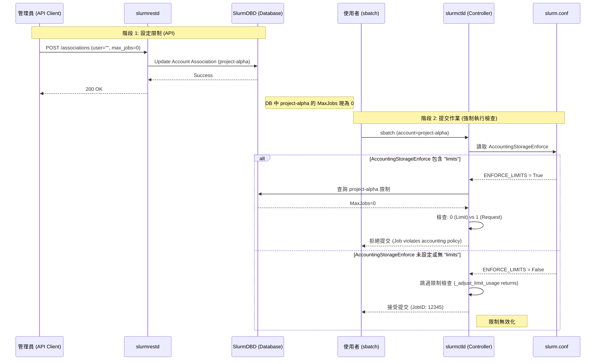

# Slurm REST API Account 限制與強制執行機制分析

本文檔深入探討透過 Slurm REST API 修改 Association 限制時的行為，特別是針對 Account 層級的設定，以及這些設定如何依賴 `slurm.conf` 中的 `AccountingStorageEnforce` 參數才能真正生效。

## 1. 發現概述

在分析 Slurm 程式碼與 API 行為後，我們確認了兩個關鍵機制：

1.  **API 對 Account 限制的修改**：Payload 中指定 `user: ""` (空字串) 會直接修改 Account 本身的 Association，而非特定使用者。若將 `max_jobs` 設為 `0`，會導致該 Account 下**所有**使用者因階層限制而被阻擋。
2.  **強制執行依賴性**：即便資料庫中的限制值已被更新，Slurm Controller (`slurmctld`) **只有**在設定了 `AccountingStorageEnforce=limits` (或包含 `limits`) 時，才會執行這些檢查。否則，這些限制形同虛設。

---

## 2. 技術細節分析

### 2.1 API 行為：Account Association 的鎖定機制

當透過 `POST /slurmdb/v0.0.44/associations/` 發送如下 Payload 時：

```json
{
  "associations": [{
    "account": "project-alpha",
    "cluster": "mycluster",
    "user": "",
    "max": {
      "jobs": {
        "per": { "count": 0, "submitted": 0 }
      }
    }
  }]
}
```

**程式碼路徑分析** (`src/slurmrestd/plugins/openapi/slurmdbd/associations.c`)：

- 處理函式 `_foreach_update_assoc` 會接收到 `user` 為空字串。
- 在 Slurm Database (SlurmDBD) 的定義中，`user=""` 且 `account="project-alpha"` 代表這是 **Account Association**。
- `0` 在 Slurm 中明確代表數值 **零** (Zero)，而無限制通常由 `-1` (`INFINITE`) 表示。

**影響結果**：
Slurm 採用階層式限制 (Hierarchical Limits)。Account 是其下所有 User 的父節點。
- 當 Account 的 `MaxJobs` 被設為 0，該 Account 擁有的總作業額度即為 0。
- 該 Account 下的**所有使用者** (User A, User B...) 都共享此額度。
- 結果：所有使用者都無法提交或執行作業，該 Account 形同被「凍結」。

### 2.2 強制執行開關：AccountingStorageEnforce

這是最關鍵的發現。僅修改資料庫並不足以阻止作業執行。

**程式碼邏輯** (`src/slurmctld/acct_policy.c`):

在函式 `_adjust_limit_usage` 中，有如下檢查：

```c
if (!(accounting_enforce & ACCOUNTING_ENFORCE_LIMITS)
    || !_valid_job_assoc(job_ptr))
    return;
```

- **變數來源**：`accounting_enforce` 來自 `slurm.conf` 的 `AccountingStorageEnforce` 設定。
- **邏輯判斷**：如果設定中不包含 `limits` 旗標 (`ACCOUNTING_ENFORCE_LIMITS`)，函式直接返回 (`return`)。
- **後果**：`slurmctld` 完全跳過對資料庫中限制值的檢查與計算。作業將被允許提交和執行，無視 DB 中的 `MaxJobs=0` 設定。

---

## 3. 系統流程圖

以下 Mermaid 序列圖展示了從 API 呼叫到作業提交的完整決策流程：



---

## 4. 設定建議

為了確保 API 設定的限制能夠生效，必須在 `slurm.conf` 中正確配置。

### 推薦設定

```bash
# slurm.conf
AccountingStorageType=accounting_storage/slurmdbd
# 關鍵設定：必須包含 limits
AccountingStorageEnforce=associations,limits,qos
```

### 設定選項說明

| 選項 | 說明 | 對 API 限制的影響 |
| :--- | :--- | :--- |
| **(未設定)** | 預設行為 (none) | **限制無效**。Controller 忽略 DB 中的限制值。 |
| **limits** | 強制執行資源與作業計數限制 | **限制生效**。MaxJobs=0 會阻止作業。 |
| **associations** | 強制執行關聯性 (User 必須在 DB 中) | 僅檢查身分，不檢查數值限制。 |
| **safe** | 若作業會超過限制則不予啟動 | 增強限制執行的安全性。 |

## 5. 結論

要透過 REST API 成功凍結一個 Account，必須同時滿足兩個條件：
1.  **資料層面**：API 呼叫正確將 Account Association 的 `MaxJobs` 設為 `0`。
2.  **執行層面**：`slurm.conf` 中必須啟用 `AccountingStorageEnforce=limits`。

若缺其一，限制將不會產生預期的阻擋效果。
